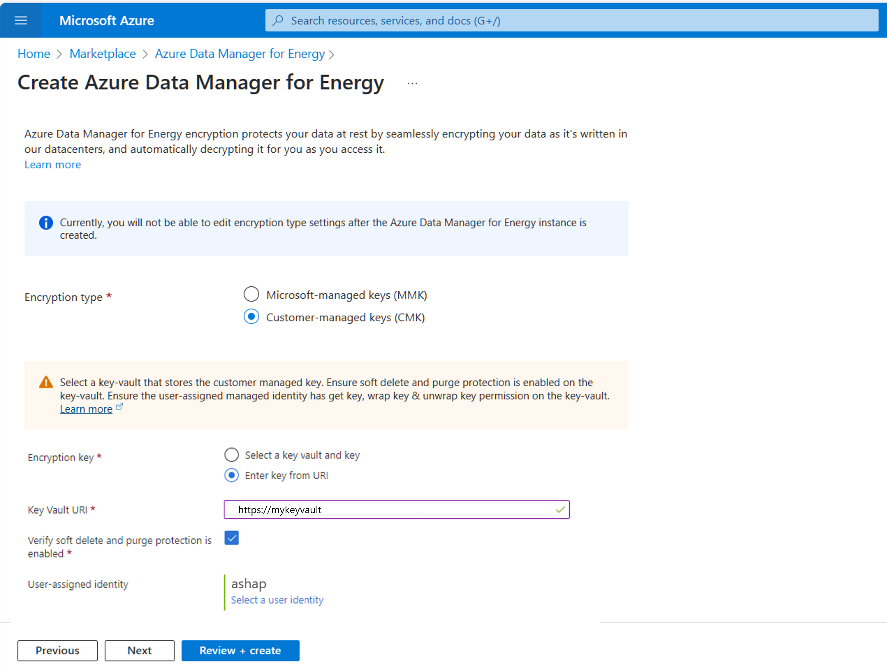

# Data security and encryption in Azure Data Manager for Energy

This article provides an overview of security features in Azure Data Manager for Energy. It covers the major areas of [encryption at rest](../security/fundamentals/encryption-atrest.md), encryption in transit, TLS, https, microsoft-managed keys, and customer managed key.

## Encrypt data at rest

Azure Data Manager for Energy uses several storage resources for storing metadata, user data, in-memory data etc. The platform uses service-side encryption to automatically encrypt all the data when it is persisted to the cloud. Data encryption at rest protects your data to help you to meet your organizational security and compliance commitments. All data in Azure Data Manager for Energy is encrypted with Microsoft-managed keys by default.
In addition to Microsoft-managed key, you can use your own encryption key to protect the data in Azure Data Manager for Energy. When you specify a customer-managed key, that key is used to protect and control access to the Microsoft-managed key that encrypts your data.

## Encrypt data in transit

Azure Data Manager for Energy supports Transport Layer Security (TLS 1.2) protocol to protect data when it’s traveling between the cloud services and customers. TLS provides strong authentication, message privacy, and integrity (enabling detection of message tampering, interception, and forgery), interoperability, and algorithm flexibility.

In addition to TLS, when you interact with Azure Data Manager for Energy, all transactions take place over HTTPS. 

## Set up Customer Managed Keys (CMK) for Azure Data Manager for Energy instance
> [!IMPORTANT]
> You cannot edit CMK settings once the Azure Data Manager for Energy instance is created.

### Prerequisites

**Step 1: Configure the key vault**

1. You can use a new or existing key vault to store customer-managed keys. To learn more about Azure Key Vault, see [Azure Key Vault Overview](../key-vault/general/overview.md) and [What is Azure Key Vault](../key-vault/general/basic-concepts.md)?
2. Using customer-managed keys with Azure Data Manager for Energy requires that both soft delete and purge protection be enabled for the key vault. Soft delete is enabled by default when you create a new key vault and cannot be disabled. You can enable purge protection either when you create the key vault or after it is created.
3. To learn how to create a key vault with the Azure portal, see [Quickstart: Create a key vault using the Azure portal](../key-vault/general/quick-create-portal.md). When you create the key vault, select Enable purge protection.

   
 
4.	To enable purge protection on an existing key vault, follow these steps:
      1. Navigate to your key vault in the Azure portal.
      2. Under **Settings**, choose **Properties**.
      3. In the **purge protection** section, choose **Enable purge protection**.

**Step 2: Add a key**
1.	Next, add a key to the key vault.
2.	To learn how to add a key with the Azure portal, see [Quickstart: Set and retrieve a key from Azure Key Vault using the Azure portal](../key-vault/keys/quick-create-portal.md).
3.	It is recommended that the RSA key size is 3072, see [Configure customer-managed keys for your Azure Cosmos DB account | Microsoft Learn](../cosmos-db/how-to-setup-customer-managed-keys.md#generate-a-key-in-azure-key-vault).

**Step 3: Choose a managed identity to authorize access to the key vault**
1.	When you enable customer-managed keys for an existing Azure Data Manager for Energy instance you must specify a managed identity that will be used to authorize access to the key vault that contains the key. The managed identity must have permissions to access the key in the key vault.
2.	You can create a [user-assigned managed identity](../active-directory/managed-identities-azure-resources/how-manage-user-assigned-managed-identities.md#create-a-user-assigned-managed-identity).

### Configure customer-managed keys for an existing account
1.	Create a **Azure Data Manager for Energy** instance.
2.	Select the **Encryption** tab.

   
 
3.	In the encryption tab, select **Customer-managed keys (CMK)**. 
4.	For using CMK, you need to select the key vault where the key is stored. 
5.	Select Encryption key as “**Select a key vault and key**.” 
6.	Then, select “**Select a key vault and key**.”
7.	Next, select the **key vault** and **key**.

    

8.	Next, select the user-assigned managed identity that will be used to authorize access to the key vault that contains the key. 
9.	Select “**Select a user identity**.” Select the user-assigned managed identity that you created in the pre-requisites. 
 
   

10.	This user assigned identity must have _get key_, _list key_, _wrap key_, and _unwrap key_ permissions on the key vault. For more information on assigning Azure Key Vault access policies, see [Assign a Key Vault Access Policy](../key-vault/general/assign-access-policy.md). 
 
    

11.	You can also select Encryption Key as “**Enter key from Uri**.” It is mandatory for the Key to have soft delete and purge protection to be enabled. You will have to confirm that by checking the box shown below.

    

12.	Next, select “**Review+Create**” after completing other tabs. 
13.	Select the "**Create**" button. 
14.	An Azure Data Manager for Energy instance is created with customer-managed keys.
15.	Once CMK is enabled you will see its status on the **Overview** screen.

    

16.	You can navigate to **Encryption** and see that CMK enabled with user managed identity.
 
    

## Next steps
To learn more about Private Links.
> [!div class="nextstepaction"]
> [How to set up private links](how-to-set-up-private-links.md)
