# Publish Microsoft Azure Data Manager for Energy APIs to a secured API gateway

[Azure API Management](../api-management/api-management-key-concepts.md) serves as a crucial intermediary between client applications and backend APIs. It makes it easier for clients to access services by hiding the technical details and giving organizations control over API security.

By publishing Azure Data Manager for Energy APIs through Azure API Management, you can use Azure Data Manager for Energy [Private Link](../private-link/private-endpoint-overview.md) capability for private traffic and completely remove direct public access to your instance.

This article describes how to set up Azure API Management for securing Azure Data Manager for Energy APIs.

## Prerequisites

You need the following components, tools, and information available to complete this walkthrough:

- [A virtual network](../virtual-network/quick-create-portal.md) with two subnets available, one for the Azure Data Manager for Energy private endpoint and the other for Azure API Management virtual network injection.
- Azure Data Manager for Energy configured with [private link](how-to-set-up-private-links.md) deployed into the subnet.
- Azure API Management provisioned and deployed into the virtual network using [virtual network injection](../api-management/virtual-network-concepts.md). Select [External](../api-management/api-management-using-with-vnet.md) mode, or see the Other options section for [Internal](../api-management/virtual-network-injection-resources.md) mode.
- A code editor such as [Visual Studio Code](https://code.visualstudio.com/) for modifying the Azure Data Manager for Energy OpenAPI specifications for each of the APIs being published.
- Download the Azure Data Manager for Energy OpenAPI specifications from the [adme-samples](https://github.com/microsoft/adme-samples) GitHub repository. Navigate to the **rest-apis** directory and select the appropriate version for your application.
- From the app registration for the Azure Data Manager for Energy app that was used at provisioning time, note the **Tenant ID** and **Client ID**:

    [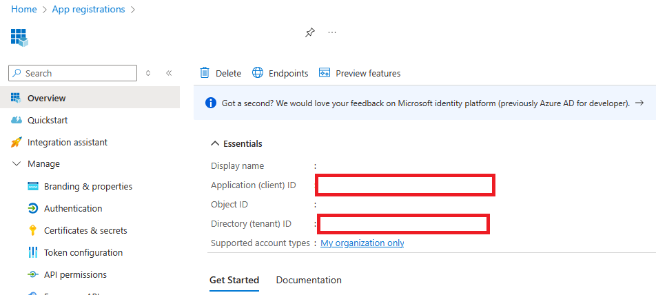](media/how-to-secure-apis/how-to-secure-apis-0-app-details.png#lightbox)

## Prepare the API Management instance

Use the following steps to make configuration changes to your Azure API Management instance:

1. From the **All resources** pane, choose the **Azure API Management** instance that is used for this walkthrough.
1. Navigate to the Products settings page by choosing it from the API settings grouping:

    [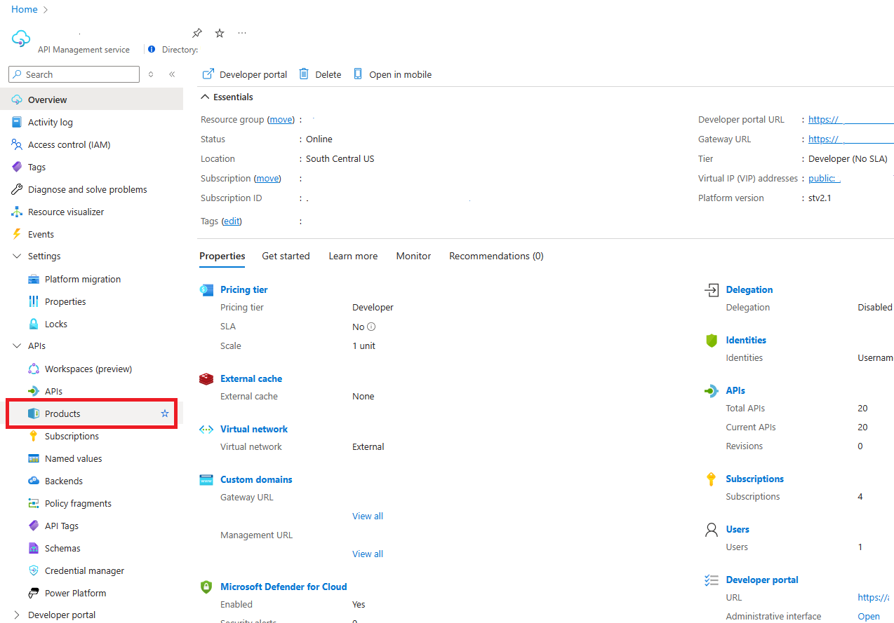](media/how-to-secure-apis/how-to-secure-apis-1-products-tab.png#lightbox)

1. On the Products page, select **the Add button** to create a new Product. [Azure API Management Products](../api-management/api-management-howto-add-products.md) allow you to create a loosely coupled grouping of APIs that can be governed and managed together. We create a Product for our Azure Data Manager for Energy APIs.  

1. On **the Add product page**, enter values described in the following table to create the product.

    [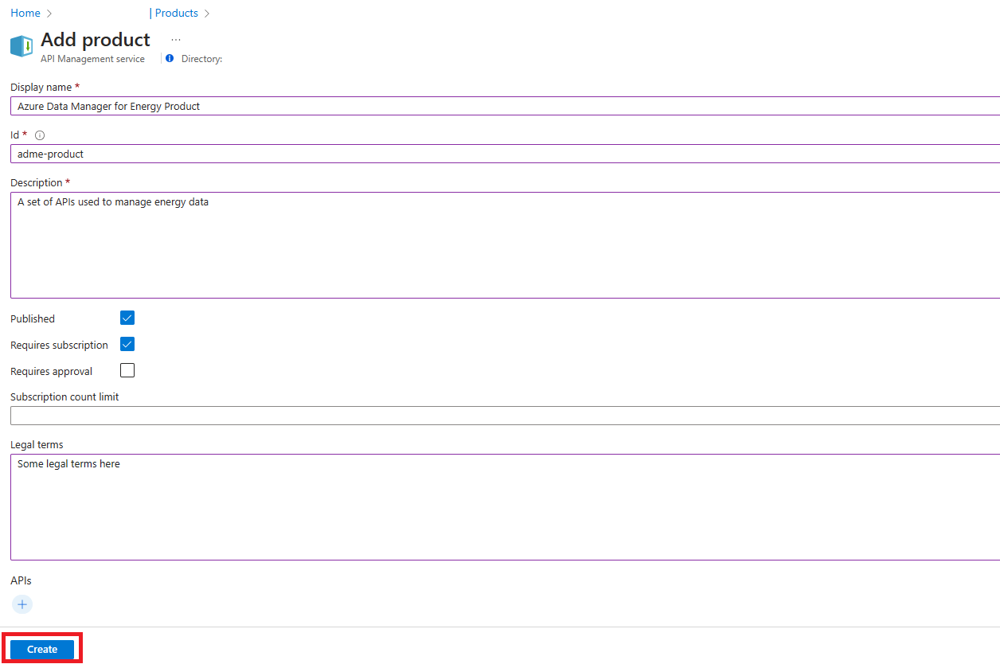](media/how-to-secure-apis/how-to-secure-apis-2-new-product.png#lightbox)

    |Setting| Value|
    |--------|-----|
    |Display Name| "Azure Data Manager for Energy Product"|
    |ID| "adme-product"|
    |Description| Enter a description that indicates to developers which APIs we're grouping|
    |Published| Check this box to publish the Product we create|
    |Requires subscription| Check this box to provide basic authorization for our APIs|
    |Requires approval| Optionally select if you want an administrator to review and accept or reject subscription attempts to this product. If not selected, subscription attempts are automatically approved.|
    |Subscription count limit| Optionally limit the count of multiple simultaneous subscriptions.|
    |Legal terms| Optionally define terms of use for the product which subscribers must accept in order to use the product.|
    |APIs| We can ignore this feature. We associate APIs later in this article|

1. Select **Create** to create the new product.

1. Once the product creation is finished, the portal returns you to the Products page. Select our newly created product **Azure Data Manager for Energy Product** to go to the Product resource page. Select the **Policies** setting menu item from the settings menu.

    [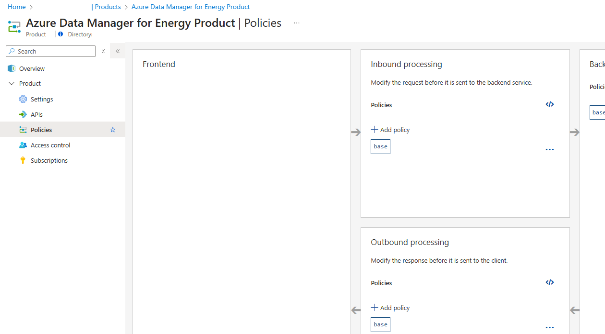](media/how-to-secure-apis/how-to-secure-apis-3-product-policies.png#lightbox)

1. On the Inbound processing pane, select the **</>** icon, which allows you to modify policies for the product. You add three sets of policies to enhance the security of the solution:
    - **Validate Entra ID Token** to ensure unauthenticated requests are caught at the API gateway
    - **Quota** and **Rate Limit** to control rate of requests and total requests/data transferred
    - **Set Header** to remove headers returned by backend APIs, which might reveal sensitive details to potential bad actors

1. Add the following **validate-azure-ad-token policy** to our configuration within the **inbound** tags and below the **base** tag. Be sure to update the template with the Microsoft Entra ID app details noted in the prerequisites.

    ```xml
    <validate-azure-ad-token tenant-id="INSERT_TENANT_ID">
        <client-application-ids>
            <application-id>INSERT_APP_ID</application-id>
        </client-application-ids>
    </validate-azure-ad-token>
    ```

1. Below the **validate-azure-ad-token** policy, add the following **quota** and **rate-limit** policies. Update the policy configuration values as appropriate for your consumers.

    ```xml
    <rate-limit calls="20" renewal-period="90" remaining-calls-variable-name="remainingCallsPerSubscription"/>
    <quota calls="10000" bandwidth="40000" renewal-period="3600" />
    ```

1. To the **outbound** section of the policy editor and under the **base** tag, add the following **set-header** policies.

    ```xml
    <set-header name="x-envoy-upstream-service-time" exists-action="delete" />
    <set-header name="x-internal-uri-pattern" exists-action="delete" />
    ```

1. Select **Save** to commit your changes.

    [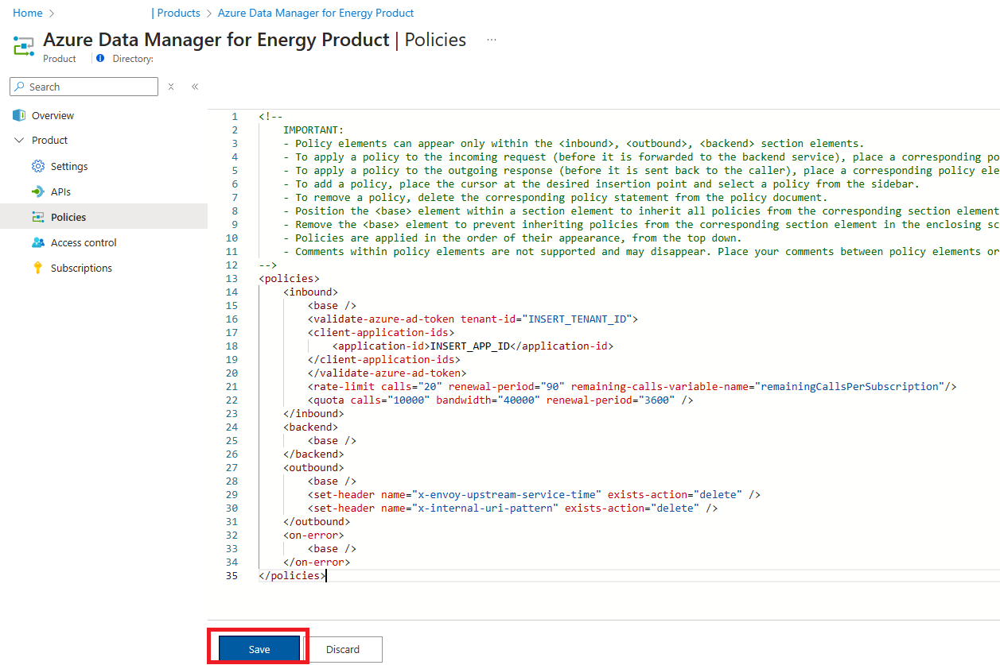](media/how-to-secure-apis/how-to-secure-apis-4-policy-document.png#lightbox)

1. Navigate back to the API Management resource in the Azure portal. Select the **Backends** menu item and select the **+ Add** button.

    [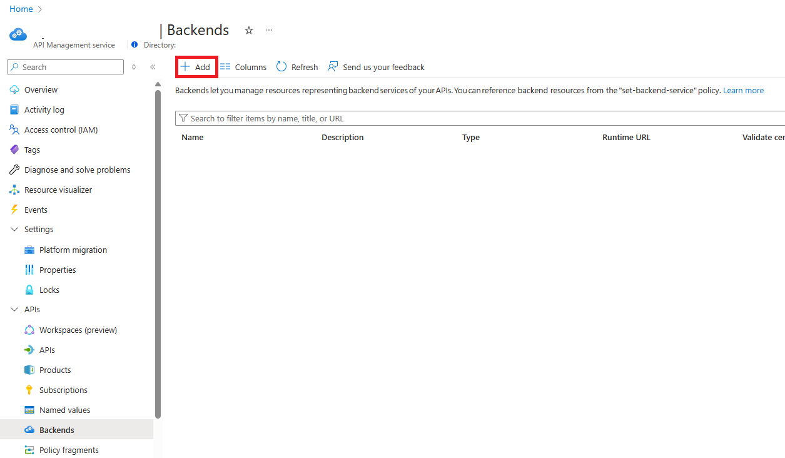](media/how-to-secure-apis/how-to-secure-apis-5-add-backend.png#lightbox)

1. On the **Backend** modal, enter values described in the following table to create the backend.

    |Setting| Value|
    |--------|-----|
    |Name| "adme-backend"|
    |Description| Enter a description that indicates to developers that this backend is related to Azure Data Manager for Energy APIs|
    |Type| Custom URL|
    |Runtime URL| Enter your Azure Data Manager for Energy URI _ex. `https://INSERT_ADME_NAME.energy.azure.com/` |
    |Validate certificate chain| Checked|
    |Validate certificate name| Checked|

    [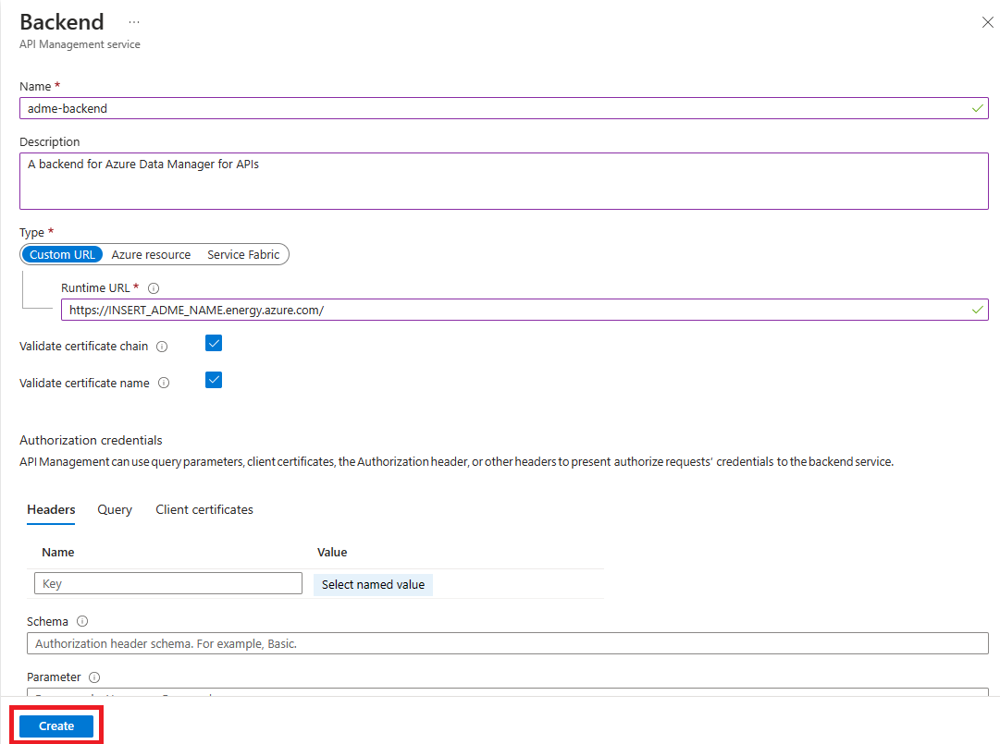](media/how-to-secure-apis/how-to-secure-apis-6-backend.png#lightbox)

1. Select **Create** to create the backend. This newly created backend will be used in the next section when we publish APIs.

## Import Azure Data Manager for Energy APIs

Use the following steps to import, configure, and publish Azure Data Manager for Energy APIs into the Azure API Management gateway:

1. Navigate back to the **Azure API Management** instance used in the last section.
1. Select **APIs** menu item from the menu, and then select the **+ Add API** button.
1. Select **OpenAPI** under the **Create from definition** heading.

    [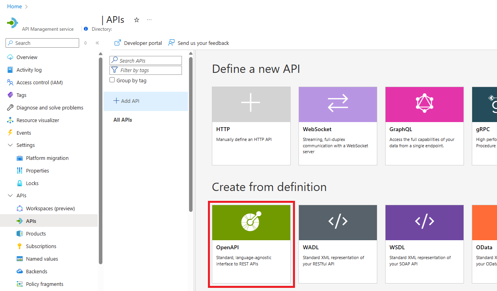](media/how-to-secure-apis/how-to-secure-apis-7-import-openapi.png#lightbox)

1. In the **Create from OpenAPI specification** modal window, select the **Full** toggle.
1. Locate the OpenAPI specifications that you downloaded as part of the prerequisites and open the **Schema** specification using the code editor of your choice. Search for the word **"server"** and note down the server URL in the file _ex. /api/schema-service/v1/_.
1. Select **Select a file** and select the **Schema** API specification. When the upload is complete, the modal window loads some values from the specification.
1. For the other fields, enter values described in the following table:

    |Setting| Value|
    |--------|-----|
    |Include required query parameters in operation templates| Checked|
    |Display name| Enter a display name that makes sense for app developers _ex. Azure Data Manager for Energy Schema Service_|
    |Name| API Management suggests a kebab-cased name. Optionally, the name can be changed but it must be unique for the instance|
    |Description| The OpenAPI specification might define a description, if so the description automatically populates. Optionally, update the description per your use case.|
    |URL scheme| Select "Both"|
    |API URL suffix| Enter a suffix for all Azure Data Manager for Energy APIs (_ex. adme_). Then enter the server URL from step 5. The final value should look like _/adme/api/schema-service/v1/_. A suffix allows us to be compliant with existing clients and software development kits that normally connect to Azure Data Manager for Energy APIs directly|
    |Tags| Optionally enter tags|
    |Products| Select the "Azure Data Manager for Energy" product created in the previous section|

    > [!IMPORTANT]
    > Validate the API URL suffix, this is a common cause for errors in publishing the Azure Data Manager for Energy APIs

1. Select **Create** to create the API facade.

    [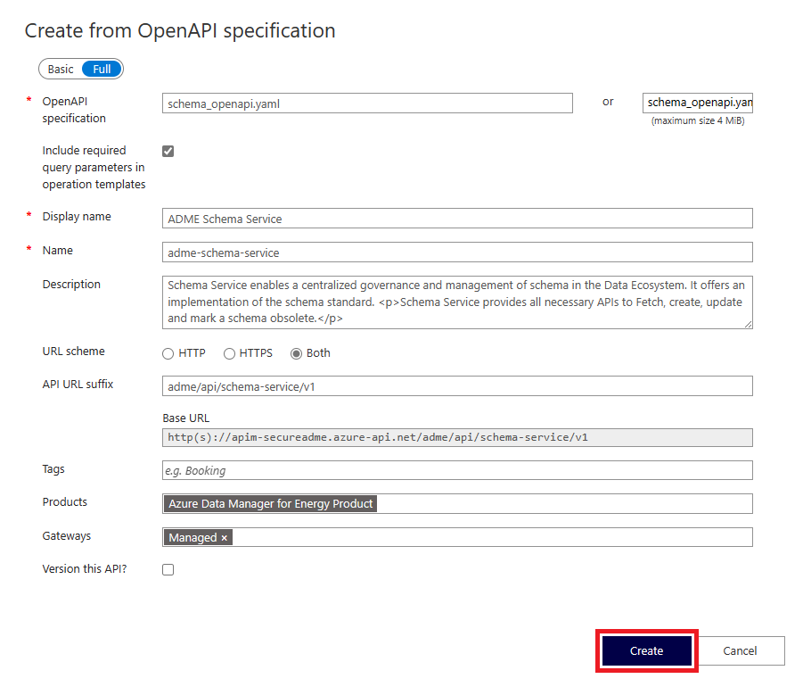](media/how-to-secure-apis/how-to-secure-apis-8-openapi.png#lightbox)

1. Select the newly created **Schema** API facade from the list of APIs and select on **All operations** on the operations list. On the **Inbound processing** pane, select the **</>** icon to edit the policy document.

    [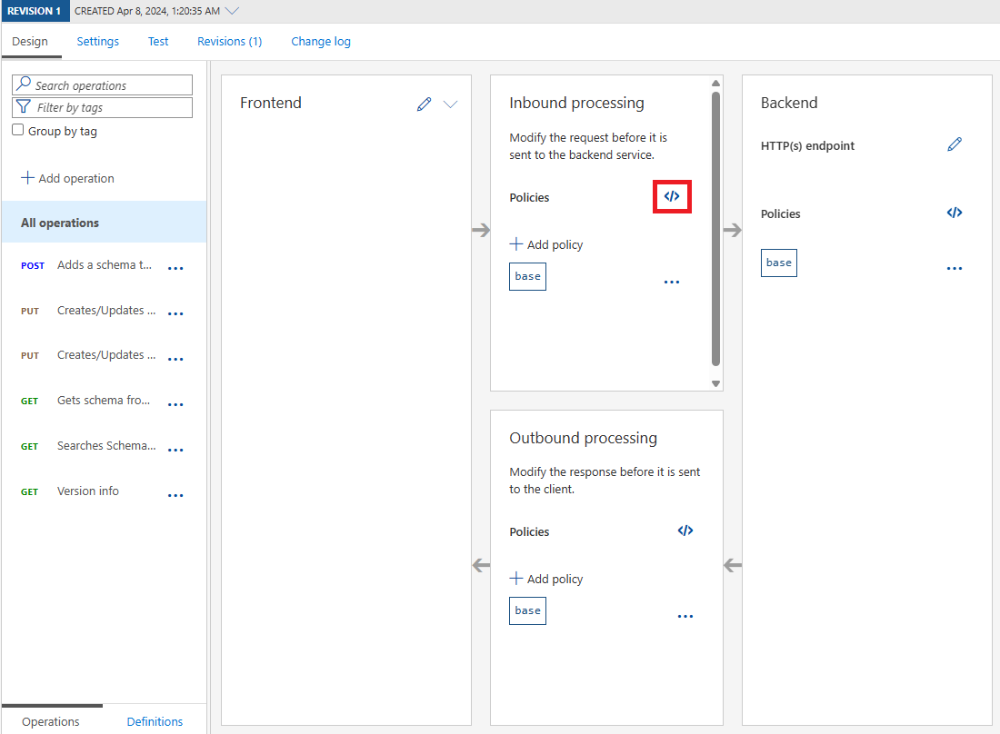](media/how-to-secure-apis/how-to-secure-apis-9-api-config.png#lightbox)

1. To configure the API, add two sets of policies:
    - **Set Backend Service** to route requests to the Azure Data Manager for Energy instance
    - **Rewrite URI** to remove the **adme** prefix and build the request to the backend API. This policy statement uses [policy expressions](../api-management/api-management-policy-expressions.md) to dynamically add the value of the current Operation's Url template to our server URL.

1. Note down the server URL from step 5. Underneath the **base** tag, in the **inbound** section, insert the following two policy statements.  

    ```xml
    <set-backend-service backend-id="adme-backend" />
    ```

    ```xml
    <!-- replace the '/api/schema-service/v1' with the server URL for this API specification you noted in step 5 -->
    <rewrite-uri template="@{return "/api/schema-service/v1"+context.Operation.UrlTemplate;}" />
    ```

1. Select **Save** to commit your changes.

1. Test the API by selecting the **GET Version info** operation from the operation list. Then select the **Test** tab to navigate to the **Azure API Management Test Console**.  

1. Enter values described in the following table. Generate an [authentication token](how-to-generate-auth-token.md) for your Azure Data Manager for Energy. Select **Send** to test the API.

    |Setting| Value|
    |--------|-----|
    |data-partition-id| The data partition ID for your Azure Data Manager for Energy instance|
    |Product| Select the Azure Data Manager for Energy product created earlier|
    |Authorization| "Bearer " and the authentication token you generated|

    [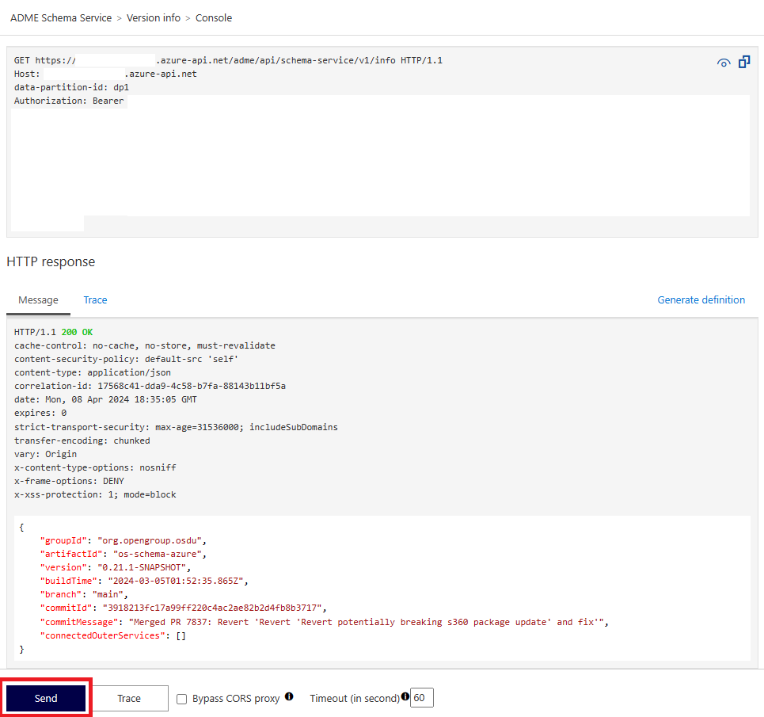](media/how-to-secure-apis/how-to-secure-apis-10-api-test.png#lightbox)

1. If the API is correctly configured, you should see a **HTTP 200 - OK** response that looks similar to the screenshot. If not, check the Troubleshooting section.

1. Repeat the above steps for each Azure Data Manager for Energy API and the associated specification.

## Troubleshooting

During your testing of APIs through Azure API Management, if you encounter errors they usually point to configuration issues. Based on the error, review the potential resolution steps.

| Code | Error message | Details |
| --- | --- | --- |
| `HTTP 401 Unauthorized` | `Invalid Azure AD JWT` | Check to make sure you have a valid authentication header for the Microsoft Entra ID Tenant and Client App for your Azure Data Manager for Energy instance. |
| `HTTP 401 Unauthorized` | `Azure AD JWT not present` | Check to make sure the authentication header is added to your test request. |
| `HTTP 404 Not Found` |  | This error typically means that the request to the backend API is being made to the wrong URL. **Trace** your API request in API Management to understand what URL is generated for the backend request and ensure it's valid. If not, double-check the **url-rewrite** policy or **backend**. |
| `HTTP 500 Internal Server Error` | `Internal server error` | This error typically reflects an issue making requests to the backend API. Usually, in this scenario, the issue is domain name services (DNS) related. Check to make sure there's a private DNS zone configured in your virtual networking or that your custom DNS resolution has the appropriate forwarders. **Trace** your API request in API Management to understand what backend request was made and what errors API Management is reporting when attempting to make the request. |

## Other considerations

### API Management internal virtual networking mode

[Internal mode](../api-management/api-management-using-with-internal-vnet.md) completely isolates the **Azure API Management** instead of exposing the endpoints via public IP address. In this configuration, organizations can ensure that all Azure Data Manager for Energy is internal. Since Azure Data Manager for Energy is a collaboration solution for working with partners and customers, this scenario might not be beneficial as-is.

### App Gateway with web application firewall

Instead of using internal virtual network mode alone, many organizations choose to [apply a secured reverse proxy](../api-management/api-management-howto-integrate-internal-vnet-appgateway.md) mechanism to expose the internal mode **Azure API Management** instance to external partners and customers. The internal mode instance stays fully isolated with a tightly controlled ingress that _must_ go through the proxy.

**Azure App Gateway** is a common service to use as a reverse proxy. Azure App Gateway also has a **web application firewall** (WAF) capability, which actively detects potential attacks against vulnerabilities in your applications and APIs.

### Configuring Azure API Management with a custom domain

Another common feature of this architecture is to apply a custom domain to the APIs. Although Azure Data Manager for Energy doesn't support this feature, you can configure a [custom domain](../api-management/configure-custom-domain.md) on Azure API Management instead.

A certificate for the domain is a prerequisite. However, Azure API Management supports creating free [managed certificates](../api-management/configure-custom-domain.md?tabs=managed#domain-certificate-options) for your custom domain.

## Related content

- [Azure security baseline for API Management](/security/benchmark/azure/baselines/api-management-security-baseline)

- [Azure security baseline for Azure Data Manager for Energy](/security/benchmark/azure/baselines/azure-data-manager-for-energy-security-baseline)

- [Tutorial: Create an application gateway with a Web Application Firewall using the Azure portal](../web-application-firewall/ag/application-gateway-web-application-firewall-portal.md)
