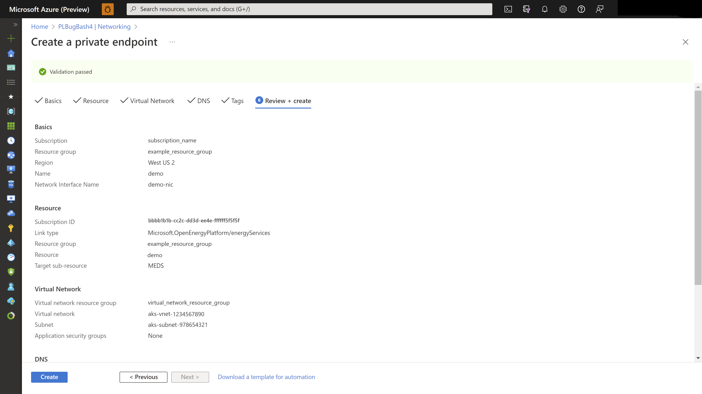

# Create a private endpoint for Azure Data Manager for Energy
[Azure Private Link](../private-link/private-link-overview.md) provides private connectivity from a virtual network to Azure platform as a service (PaaS). It simplifies the network architecture and secures the connection between endpoints in Azure by eliminating data exposure to the public internet.

By using Azure Private Link, you can connect to an Azure Data Manager for Energy instance from your virtual network via a private endpoint, which is a set of private IP addresses in a subnet within the virtual network. You can then limit access to your Azure Data Manager for Energy instance over these private IP addresses. 

You can connect to an Azure Data Manager for Energy instance that's configured with Private Link by using an automatic or manual approval method. To learn more, see the [Private Link documentation](../private-link/private-endpoint-overview.md#access-to-a-private-link-resource-using-approval-workflow).

This article describes how to set up a private endpoint for Azure Data Manager for Energy. 

> [!NOTE]
> Terraform currently does not support private endpoint creation for Azure Data Manager for Energy.

## Prerequisites

[Create a virtual network](../virtual-network/quick-create-portal.md) in the same subscription as the Azure Data Manager for Energy instance. This virtual network allows automatic approval of the Private Link endpoint.

## Create a private endpoint during instance provisioning by using the Azure portal 

Use the following steps to create a private endpoint while provisioning Azure Data Manager for Energy resource:

1. During the creation of Azure Data Manager for Energy instance, select the **Networking** tab.

    

1. In the Networking tab, select **Disable public access and use private access** and then choose **Add** under Private endpoint.

    

1. In **Create private endpoint**, enter or select the following information and select **OK**:

    |Setting| Value|
    |--------|-----|
    |Subscription| Select your subscription|
    |Resource group| Select a resource group|
    |Location| Select the region where you want to deploy the private endpoint|
    |Name| Enter a name for your private endpoint. The name must be unique|
    |Target sub-resource| **Azure Data Manager for Energy** by default|

    **Networking:**

    |Setting| Value|
    |--------|-----|
    |Virtual network| Select the virtual network in which you want to deploy your private endpoint|
    |Subnet| Select the subnet|

    **Private DNS integration:**

    |Setting| Value|
    |--------|-----|
    |Integrate with private DNS zone| Leave the default value - **Yes**|
    |Private DNS zone| Leave the default value|

    

    

1. Verify the private endpoint details in the Networking tab and next, select **Review+Create** after completing other tabs.

    

1. On the Review + create page, Azure validates your configurations.
When you see Validation passed, select the **Create** button.
1. An Azure Data Manager for Energy instance is created with private link.
1. You can navigate to Networking post instance provisioning and see the private endpoint created under **Private access** tab.

    

## Create a private endpoint post instance provisioning by using the Azure portal 

Use the following steps to create a private endpoint for an existing Azure Data Manager for Energy instance by using the Azure portal:

1. From the **All resources** pane, choose an Azure Data Manager for Energy instance.
1. Select **Networking** from the list of settings.       
1. On the **Public Access** tab, select **Enabled from all networks** to allow traffic from all networks.

    
	
    If you want to block traffic from all networks, select **Disabled**.

1. Select the **Private Access** tab, and then select **Create a private endpoint**.
 
    
 
1. In the **Create a private endpoint** wizard, on the **Basics** page, enter or select the following details:

    |Setting| Value|
    |--------|-----|
    |**Subscription**| Select your subscription for the project.|
    |**Resource group**| Select a resource group for the project.|
    |**Name**| Enter a name for your private endpoint. The name must be unique.|
    |**Region**| Select the region where you want to deploy Private Link. |

    
	
    > [!NOTE]
    > Automatic approval happens only when the Azure Data Manager for Energy instance and the virtual network for the private endpoint are in the same subscription.

1. Select **Next: Resource**. On the **Resource** page, confirm the following information:

    |Setting| Value|
    |--------|--------|
    |**Subscription**| Your subscription|
    |**Resource type**|	**Microsoft.OpenEnergyPlatform/energyServices**|
    |**Resource**| Your Azure Data Manager for Energy instance|
    |**Target sub-resource**| **Azure Data Manager for Energy** (for Azure Data Manager for Energy) by default|
	
    
 
1. Select **Next: Virtual Network**. On the **Virtual Network** page, you can:

    * Configure network and private IP settings. [Learn more](../private-link/create-private-endpoint-portal.md#create-a-private-endpoint).

    * Configure a private endpoint with an application security group. [Learn more](../private-link/configure-asg-private-endpoint.md#create-private-endpoint-with-an-asg).

    

1. Select **Next: DNS**. On the **DNS** page, you can leave the default settings or configure private DNS integration. [Learn more](../private-link/private-endpoint-overview.md#dns-configuration).

    

1. Select **Next: Tags**. On the **Tags** page, you can add tags to categorize resources.
1. Select **Review + create**. On the **Review + create** page, Azure validates your configuration.

    When you see **Validation passed**, select **Create**.

    
 
1. After the deployment is complete, select **Go to resource**. 

    
  
1. Confirm that the private endpoint that you created was automatically approved.

    
 
1. Select the **Azure Data Manager for Energy** instance, select **Networking**, and then select the **Private Access** tab. Confirm that your newly created private endpoint connection appears in the list.

    

> [!NOTE]
> When the Azure Data Manager for Energy instance and the virtual network are in different tenants or subscriptions, you have to manually approve the request to create a private endpoint. The **Approve** and **Reject** buttons appear on the **Private Access** tab. 
>
> 

## Next steps
<!-- Add a context sentence for the following links -->
To learn more about using Customer Lockbox as an interface to review and approve or reject access requests.
> [!div class="nextstepaction"]
> [Use Lockbox for Azure Data Manager for Energy](how-to-create-lockbox.md)
