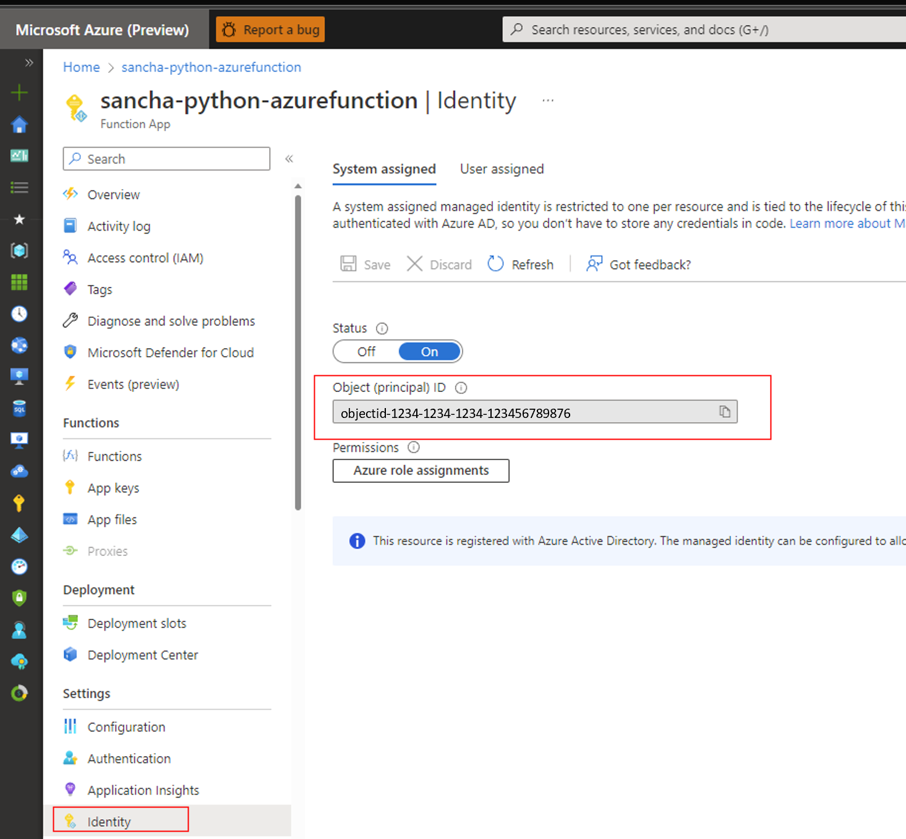

# Use managed identity to access Microsoft Energy Data Services from other Azure services

This article provides an overview on how to access data plane or control plane of Microsoft Energy Data Services from other Microsoft Azure Services using *managed identity*.

There's a need for services such as Azure Functions etc. to be able to consume Microsoft Energy Data Services APIs. This interoperability will allow you to use the best of multiple Azure services, for example, you can write a script in Azure Function to ingest data in Microsoft Energy Data Services. Here, we should assume that Azure Functions is the source service while Microsoft Energy Data Services is the target service. To understand how this scenario works, it's important to understand the concept of managed identity.

## Managed Identity 

A managed identity from Azure Active Directory (Azure AD) allows your application to easily access other Azure AD-protected resources. The identity is managed by the Azure platform and doesn't require you to create or rotate any secrets. Any Azure service that wants to access Microsoft Energy Data Services control plane or data plane for any operation can use managed identity to do so. 

Managed identity is of two types. It could be a system assigned managed identity or user assigned managed identity. System-assigned managed identities have their lifecycle tied to the resource that created them. User-assigned managed identities can be used on multiple resources. To learn more about managed identities, see [What are managed identities for Azure resources?](../active-directory/managed-identities-azure-resources/overview.md)

Currently, other services can connect to Microsoft Energy Data Services using system or user assigned managed identity. However, Microsoft Energy Data Services doesn't support system assigned managed identity.

For this scenario, we'll use a user assigned managed identity in Azure Function to call a data plane API in Microsoft Energy Data Services.

## Pre-requisites

Before you begin, make sure:

* You've created a [Microsoft Energy Data Services instance](quickstart-create-microsoft-energy-data-services-instance.md).

* You've created a [Azure Function App](../azure-functions/functions-create-function-app-portal.md).

* You've created a [Python Azure Function using portal](../azure-functions/create-first-function-vs-code-python.md) or using [command line.](../azure-functions/create-first-function-cli-python.md)

* You've created [user assigned managed identity](../active-directory/managed-identities-azure-resources/how-manage-user-assigned-managed-identities.md). You can create a system assigned identity as well however, this document will explain the flow using user assigned managed identity.


## Steps for Azure Functions to access Microsoft Energy Data Services using Managed Identity

There are five important steps to configure Azure Functions to access Microsoft Energy Data Services.


### Step 1: Retrieve the Object ID of system or user-assigned identity that wants to access the Microsoft Energy Data Services APIs.

1.	You can get the *Object ID* of system assigned identity associated with Azure Functions by navigating to *Identity* screen of the Azure Function. 

[](media/how-to-use-managed-identity/1-object-id-system-assigned-identity.png#lightbox) 
 
2.	Similarly, navigate to the *Overview* tab of the user assigned identity to find its *Object ID*.
  
[](media/how-to-use-managed-identity/2-object-id-user-assigned-identity.png#lightbox)

### Step 2. Retrieve the *Application ID* of system or user-assigned identity using the Object ID.

1.	Navigate to *Azure Active Directory (Azure AD)* in Azure
2.	Navigate to *Enterprise Application* tab.
3.	Search for the *Object ID* of the user assigned identity or system assigned identity in the *Search by application name or Object ID* search box.
4.	Copy the *Application ID* from Enterprise Application section of Azure Active Directory.
 
[](media/how-to-use-managed-identity/3-object-id-application-id-user-assigned-identity.png#lightbox)

### Step 3: Add the user assigned managed identity to Azure Functions

1.	Sign in to the Azure portal.
2.	In the Azure portal, navigate to your Azure Function.
3.	Under Account Settings, select Identity.
4.	Select the User assigned tab, and then select Add.
5.	Select your existing user-assigned managed identity and then select Add. You'll then be returned to the User assigned tab.
 
[](media/how-to-use-managed-identity/4-user-assigned-identity-azure-function.png#lightbox)

### Step 4: Add the application ID to entitlement groups to access Microsoft Energy Data Services APIs
Next, you need to add this Application ID to appropriate groups using the entitlement service to access Microsoft Energy Data Services APIs. You need to perform the following actions: 

1.	Find the tenant-id, client-id, client-secret, Microsoft Energy Data Services url, and data partition-id and generate the [access token](how-to-manage-users.md#prerequisites). You should have the following information handy with you:

* tenant-id
* client-id
* client-secret
* microsoft energy data services uri
* data-partition-id
* access token
* Application ID of the managed identity


2.	Next, use the [add-member-api](https://microsoft.github.io/meds-samples/rest-apis/index.html?page=/meds-samples/rest-apis/entitlements_openapi.yaml#/add-member-api/addMemberUsingPOST) to add the Application ID of the user managed identity to appropriate entitlement groups. For example, in this case, we'll add the Application ID to two groups:

* users@[partition ID].dataservices.energy
* users.datalake.editors@[partition ID].dataservices.energy

> [!NOTE]
> In the below commands use the Application ID of the managed identity and not the Object Id of the managed identity in the below command. 

* Adding Application ID of the managed identity to users@[partition ID].dataservices.energy

3. Run the following CURL command on Azure bash:

```bash
 curl --location --request POST 'https://<microsoft energy data services uri>/api/entitlements/v2/groups/users@ <data-partition-id>.dataservices.energy/members' \
    --header 'data-partition-id: <data-partition-id>' \
    --header 'Authorization: Bearer \
    --header 'Content-Type: application/json' \
    --data-raw '{
                    "email": "<Application ID of the managed identity>",
                    "role": "MEMBER"
                }'
```

Sample response:
```JSON 
{
    "email": "<Application ID of the managed identity>",
    "role": "MEMBER"
    }
```
* Adding Application ID of the managed identity to users.datalake.editors@[partition ID].dataservices.energy

4. Run the following CURL command on Azure bash:

```bash
 curl --location --request POST 'https://<microsoft energy data services uri>/api/entitlements/v2/groups/ users.datalake.editors@ <data-partition-id>.dataservices.energy/members' \
    --header 'data-partition-id: <data-partition-id>' \
    --header 'Authorization: Bearer \
    --header 'Content-Type: application/json' \
    --data-raw '{
                    "email": "<Application ID of the managed identity>",
                    "role": "MEMBER"
                }'
```

Sample response:
```JSON
{
    "email": "<Application ID of the managed identity>",
    "role": "MEMBER"
    }
```

### Step 5: Generate token for accessing Microsoft Energy Data Services from Azure Function

Now Azure Functions is ready to access Microsoft Energy Data Services APIs.  

In this case, Azure function generates a token using User Assigned identity. The Azure function uses the Application ID present in the Microsoft Energy Data Services instance, while generating the token.
Sample Azure function code.

```python
import logging
import requests
import azure.functions as func
from msrestazure.azure_active_directory import MSIAuthentication

def main(req: func.HttpRequest) -> str:
    logging.info('Python HTTP trigger function processed a request.')
    print('Python HTTP trigger function processed a request')

    creds = MSIAuthentication(resource="<clientId>")
    url = "https://<meds-uri>/api/entitlements/v2/groups"
    payload = {}
    print('creds is', creds)
    headers = {
        'data-partition-id': '<data partition id>',
        'Authorization': 'Bearer ' + creds.token["access_token"]
    }
    response = requests.request("GET", url, headers=headers, data=payload, verify=False)
    logging.info("Got a response")
    return response.text
```
You should get the following successful response from Azure Function:

[](media/how-to-use-managed-identity/5-azure-function-success.png#lightbox)
 
With the following steps completed, you're now able to use Azure Functions to access Microsoft Energy Data Services APIs with appropriate use of managed identities.

## Next steps
<!-- Add a context sentence for the following links -->
To learn more about Lockbox in Microsoft Energy Data Services
> [!div class="nextstepaction"]
> [Lockbox in Microsoft Energy Data Services](how-to-use-managed-identity.md)
