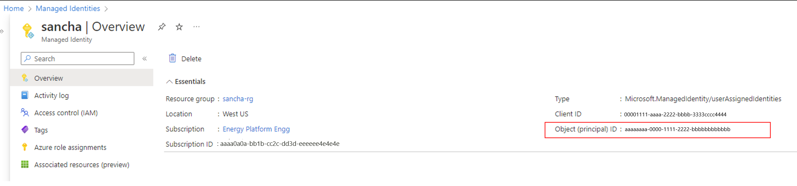

# Use a managed identity to access Azure Data Manager for Energy from other Azure services

This article describes how to access the data plane or control plane of Azure Data Manager for Energy from other Microsoft Azure services by using a *managed identity*.

There's a need for services such as Azure Functions to be able to consume Azure Data Manager for Energy APIs. This interoperability allows you to use the best capabilities of multiple Azure services. 

For example, you can write a script in Azure Functions to ingest data in Azure Data Manager for Energy. In that scenario, you should assume that Azure Functions is the source service and Azure Data Manager for Energy is the target service. 

This article walks you through the five main steps for configuring Azure Functions to access Azure Data Manager for Energy.

## Overview of managed identities 

A managed identity from Microsoft Entra ID allows your application to easily access other Microsoft Entra protected resources. The identity is managed by the Azure platform and doesn't require you to create or rotate any secrets. Any Azure service that wants to access Azure Data Manager for Energy control plane or data plane for any operation can use a managed identity to do so. 

There are two types of managed identities:

- *System-assigned* managed identities have their lifecycle tied to the resource that created them. 
- *User-assigned* managed identities can be used on multiple resources. 

To learn more about managed identities, see [What are managed identities for Azure resources?](../active-directory/managed-identities-azure-resources/overview.md).

Currently, other services can connect to Azure Data Manager for Energy by using a system-assigned or user-assigned managed identity. However, Azure Data Manager for Energy doesn't support system-assigned managed identities.

For the scenario in this article, you'll use a user-assigned managed identity in Azure Functions to call a data plane API in Azure Data Manager for Energy.

## Prerequisites

Before you begin, create the following resources:

* [Azure Data Manager for Energy instance](quickstart-create-microsoft-energy-data-services-instance.md)

* [Azure function app](../azure-functions/functions-create-function-app-portal.md)

* Python-based Azure function, by using the [Azure portal](../azure-functions/create-first-function-vs-code-python.md) or the [command line](../azure-functions/create-first-function-cli-python.md)

* [User-assigned managed identity](../active-directory/managed-identities-azure-resources/how-manage-user-assigned-managed-identities.md)


## Step 1: Retrieve the object ID 

To retrieve the object ID for the user-assigned identity that will access the Azure Data Manager for Energy APIs:

1. Sign in to the [Azure portal](https://portal.azure.com/).
2. Go to the managed identity, and then select **Overview**.
3. Under **Essentials**, note the **Object (principal) ID** value. 
  
[](media/how-to-use-managed-identity/2-object-id-user-assigned-identity.png#lightbox)

## Step 2: Retrieve the application ID

Retrieve the application ID of the user-assigned identity by using the object ID:

1. In the Azure portal, go to **Microsoft Entra ID**.
2. On the left menu, select **Enterprise applications**.
3. In the **Search by application name or object ID** box, enter the object ID.
4. For the application that appears in the results, note the **Application ID** value.
 
[](media/how-to-use-managed-identity/3-object-id-application-id-user-assigned-identity.png#lightbox)

## Step 3: Add the user-assigned managed identity to Azure Functions

1. In the Azure portal, go to your Azure function.
2. Under **Account Settings**, select **Identity**.
3. Select the **User assigned** tab, and then select **Add**.
4. Select your existing user-assigned managed identity, and then select **Add**. You're then returned to the **User assigned** tab.
 
[](media/how-to-use-managed-identity/4-user-assigned-identity-azure-function.png#lightbox)

## Step 4: Add the application ID to entitlement groups 

Next, add the application ID to the appropriate groups that will use the entitlement service to access Azure Data Manager for Energy APIs. The following example adds the application ID to two groups:

* users@[partition ID].dataservices.energy
* users.datalake.editors@[partition ID].dataservices.energy

To add the application ID:

1. Gather the following information: 

   * Tenant ID
   * Client ID
   * Client secret
   * Azure Data Manager for Energy URI
   * Data partition ID
   * [Access token](how-to-manage-users.md#prerequisites)
   * Application ID of the managed identity

2. Use the [Add Member API](https://microsoft.github.io/adme-samples/rest-apis/index.html?page=/adme-samples/rest-apis/M12/entitlements_openapi.yaml#/add-member-api) to add the application ID of the user-assigned managed identity to the appropriate entitlement groups. 

   > [!NOTE]
   > In the following commands, be sure to use the application ID of the managed identity and not the object ID. 

   1. To add the application ID to the users@[partition ID].dataservices.energy group, run the following cURL command via Bash in Azure:

      ```bash
       curl --location --request POST 'https://<Azure Data Manager for Energy URI>/api/entitlements/v2/groups/users@ <data-partition-id>.dataservices.energy/members' \
          --header 'data-partition-id: <data-partition-id>' \
          --header 'Authorization: Bearer \
          --header 'Content-Type: application/json' \
          --data-raw '{
                          "email": "<application ID of the managed identity>",
                          "role": "MEMBER"
                      }'
      ```

      Here's a sample response:

      ```json 
      {
          "email": "<application ID of the managed identity>",
          "role": "MEMBER"
          }
      ```
   
   1. To add the application ID to the users.datalake.editors@[partition ID].dataservices.energy group, run the following cURL command via Bash in Azure:

      ```bash
       curl --location --request POST 'https://<Azure Data Manager for Energy URI>/api/entitlements/v2/groups/ users.datalake.editors@ <data-partition-id>.dataservices.energy/members' \
          --header 'data-partition-id: <data-partition-id>' \
          --header 'Authorization: Bearer \
          --header 'Content-Type: application/json' \
          --data-raw '{
                          "email": "<application ID of the managed identity>",
                          "role": "MEMBER"
                      }'
      ```

      Here's a sample response:

      ```json
      {
          "email": "<application ID of the managed identity>",
          "role": "MEMBER"
          }
      ```

## Step 5: Generate a token

Now Azure Functions is ready to access Azure Data Manager for Energy APIs.  

The Azure function generates a token by using the user-assigned identity. The function uses the application ID that's present in the Azure Data Manager for Energy instance while generating the token.

Here's an example of the Azure function code:

```python
import logging
import requests
import azure.functions as func
from msrestazure.azure_active_directory import MSIAuthentication

def main(req: func.HttpRequest) -> str:
    logging.info('Python HTTP trigger function processed a request.')

    //To authenticate by using a managed identity, you need to pass the Azure Data Manager for Energy application ID as the resource.     
    //To use a user-assigned identity, you should include the   
    //client ID as an additional parameter.
    //Managed identity using user-assigned identity: MSIAuthentication(client_id, resource)

    creds = MSIAuthentication(client_id="<client_id_of_managed_identity>”, resource="<meds_app_id>")
    url = "https://<meds-uri>/api/entitlements/v2/groups"
    payload = {}
    // Passing the data partition ID of Azure Data Manager for Energy in headers along with the token received using the managed instance.
    headers = {
        'data-partition-id': '<data partition id>',
        'Authorization': 'Bearer ' + creds.token["access_token"]
    }
    response = requests.request("GET", url, headers=headers, data=payload, verify=False)
    return response.text

```

You should get the following successful response from Azure Functions:

[](media/how-to-use-managed-identity/5-azure-function-success.png#lightbox)
 
With the preceding steps completed, you can now use Azure Functions to access Azure Data Manager for Energy APIs with appropriate use of managed identities.

## Next steps

Learn about Lockbox:
> [!div class="nextstepaction"]
> [Lockbox in Azure Data Manager for Energy](how-to-create-lockbox.md)
