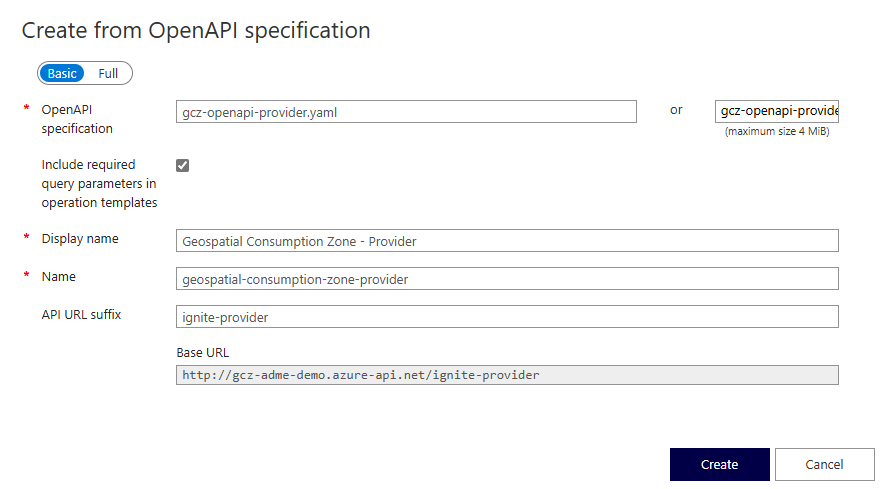

### Add the GCZ APIs to Azure API Management

1. Navigate to your Azure API Management service in the [Azure portal](https://portal.azure.com/).
1. In the left-hand navigation pane, select **APIs**.
1. Select **+ Add API**.
1. Select **OpenAPI**.
1. Select **Select a file** and upload the `gcz-openapi-provider.yaml` file.
1. In the **API URL suffix** field, enter `ignite-provider`.
1. Select **Create**.
1. Repeat the steps for the `gcz-openapi-transformer.yaml` file, but use `gcz/transformer/admin` as the **API URL suffix**.

    [](../../../media/how-to-deploy-gcz/deploy-gcz-apim.png)

### Configure policies

Next we need to configure the policies to validate the JSON Web Tokens (JWT).

You need the following information:
- Your Microsoft Entra ID tenant ID.
- The Azure Data Manager for Energy client ID (or token-issuing client ID if separate).

> [!NOTE]
> If you have multiple App Registrations issuing tokens, you can add multiple `<application-id>` elements to the `<client-application-ids>` element.


1. In the newly created `Geospatial Consumption Zone - Provider` API, make sure **All operations** is selected.
1. Under **Inbound processing**, select **...** and then **Code editor**.
1. Paste the following policy definition in the editor:

    ```xml
    <policies>
        <!-- Throttle, authorize, validate, cache, or transform the requests -->
        <inbound>
            <base />
            <validate-azure-ad-token tenant-id="%tenant-id%" failed-validation-httpcode="401">
            <client-application-ids>
                <application-id>%client-id%</application-id>
            </client-application-ids>
        </inbound>
        <!-- Control if and how the requests are forwarded to services  -->
        <backend>
            <base />
        </backend>
        <!-- Customize the responses -->
        <outbound>
            <base />
        </outbound>
        <!-- Handle exceptions and customize error responses  -->
        <on-error>
            <base />
        </on-error>
    </policies>
    ```

1. Replace `%tenant-id%` with your Microsoft Entra ID tenant ID, and `%client-id%` with the Azure Data Manager for Energy client ID.
1. Select **Save**.
1. Repeat the steps for the `Geospatial Consumption Zone - Transformer` API.