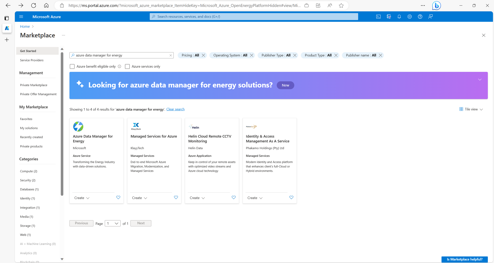
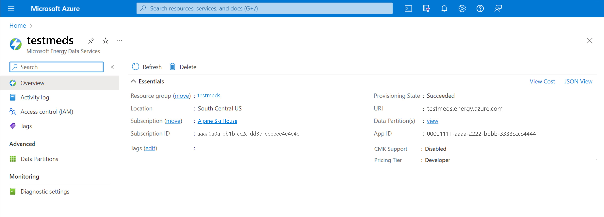

# Quickstart: Create an Azure Data Manager for Energy instance

Get started by creating an Azure Data Manager for Energy instance on Azure portal on a web browser. You first register an Azure application on Active Directory and then use the application ID to create an Azure Data Manager for Energy instance in your chosen Azure Subscription and region. 

The setup of Azure Data Manager fgigior Energy instance can be triggered using a simple interface on Azure portal and takes about 50 minutes to complete.

Azure Data Manager for Energy is a managed "Platform as a service (PaaS)" offering from Microsoft that builds on top of the [OSDU&trade;](https://osduforum.org/) Data Platform. Azure Data Manager for Energy lets you ingest, transform, and export subsurface data by letting you connect your consuming in-house or third-party applications. 

## Prerequisites

| Prerequisite | Details |
| ------------ | ------- |
Active Azure Subscription | You need the Azure subscription ID in which you want to install Azure Data Manager for Energy. You need to have appropriate permissions to create Azure resources in this subscription. 
Application ID | You need an [application ID](../active-directory/develop/application-model.md) (often referred to as "App ID" or a "client ID"). This application ID is used for authentication to Microsoft Entra ID and will be associated with your Azure Data Manager for Energy instance. You can [create an application ID](../active-directory/develop/quickstart-register-app.md) by navigating to Active directory and selecting *App registrations* > *New registration*.
Client Secret | Sometimes called an application password, a client secret is a string value that your app can use in place of a certificate to identity itself. You can [create a client secret](../active-directory/develop/quickstart-register-app.md#add-a-client-secret) by selecting *Certificates & secrets* > *Client secrets* > *New client secret*. Record the secret's value for use in your client application code. This secret value is never displayed again after you leave this page.

## Create an Azure Data Manager for Energy instance

1. Save your **Application (client) ID** and **client secret** from Microsoft Entra ID to refer to them later in this quickstart.  

1. Sign in to [Microsoft Azure Marketplace](https://portal.azure.com/#view/Microsoft_Azure_Marketplace/MarketplaceOffersBlade/selectedMenuItemId/home)

1. If you have access to multiple tenants, use the *Directories + subscriptions* filter in the top menu to switch to the tenant in which you want to install Azure Data Manager for Energy.

1. Use the search bar in the Azure Marketplace (not the global Azure search bar on top of the screen) to search for *Azure Data Manager for Energy*.

    

1. In the search page, select *Create* on the card titled "Azure Data Manager for Energy". 

1. A new window appears. Complete the *Basics* tab by choosing the *subscription*, *resource group*, *tier*, and the *region* in which you want to create your instance of Azure Data Manager for Energy. Enter the *App ID* that you created during the prerequisite steps. The default tier is currently the *Standard* tier. You can use the drop down to change your tier selection. Learn more about tiers [Azure Data Manager for Energy Tier Details](../energy-data-services/concepts-tier-details.md)

    

    Some naming conventions to guide you at this step:

    | Field | Name Validation | 
    | ----- | --------------- |
    Instance name | Only alphanumeric characters are allowed, and the value must be 1-15 characters long. The name is **not** case-sensitive. One resource group can't have two instances with the same name. 
    Application ID | Enter the valid Application ID that you generated and saved in the last section.
    Data Partition name | Name should be 1-10 char long consisting of lowercase alphanumeric characters and hyphens. It should start with an alphanumeric character and not contain consecutive hyphens. The data partition names that you chose are automatically prefixed with your Azure Data Manager for Energy instance name. This compound name will be used to refer to your data partition in application and API calls. 

    > [!NOTE]
    > Azure Data Manager for Energy instance and data partition names, once created, cannot be changed later.  

1. Move to the next tab, *Networking*, and configure as needed. Learn more about [setting up a Private Endpoint in Azure Data Manager for Energy](../energy-data-services/how-to-set-up-private-links.md)
 
    

1. Move to the next tab, *Encryption*, and configure as needed. Learn how to encrypt your data with [customer managed encryption keys](../energy-data-services/how-to-manage-data-security-and-encryption.md), and manage data security using [managed identities in Azure Data Manager for Energy](../energy-data-services/how-to-use-managed-identity.md).

    

1. Navigate to the *Tags* tab and enter any tags that you would want to specify. If nothing, this field can be left blank.

    

1. Navigate to the *Resource Sharing (CORS)* tab and configure as needed. Learn more about [Use CORS for resource sharing in Azure Data Manager for Energy](../energy-data-services/how-to-enable-cors.md).

     
    

1. Select Next: **Review + Create**.

1. Once the basic validation tests pass (validation takes a few seconds), review the Terms and Basic Details. 

    

1. Optional step: You can download an Azure Resource Manager (ARM) template and use it for automated deployments of Azure Data Manager for Energy in future. Select *View automation template* located in the *Review + create* tab. 
 

1. Select **Create** to start the deployment.

1. Wait while the deployment happens in the background. Review the details of the instance created.

    

You will find the newly created Azure Data Manager for Energy resource in your resource group. Select it to open the resource UI on portal.
    

    
   
## Delete an Azure Data Manager for Energy instance

Deleting a Microsoft Energy Data instance also deletes any data that you've ingested. This action is permanent and the ingested data can't be recovered. To delete an Azure Data Manager for Energy instance, complete the following steps:

1. Sign in to the Azure portal and delete the *resource group* in which these components are installed.

2. This step is optional. Go to Microsoft Entra ID and delete the *app registration* that you linked to your Azure Data Manager for Energy instance.

Any set locks at the resource group (RG) level must be removed before deleting any resource in the RG. Resources not deleted due to locks are considered active until the resource is successfully deleted.

OSDU&trade; is a trademark of The Open Group.

## Next steps
After provisioning an Azure Data Manager for Energy instance, you can learn about user management on this instance.
> [!div class="nextstepaction"]
> [How to manage users](how-to-manage-users.md)
