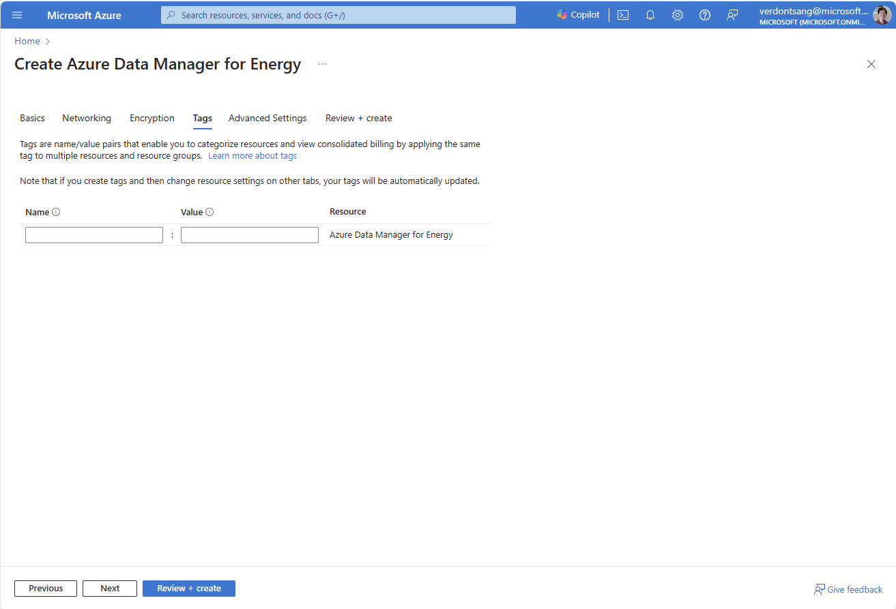

# Quickstart: Create a Microsoft Energy Data Services Preview instance

[!INCLUDE [preview features callout](./includes/preview/preview-callout.md)]

Get started by creating a Microsoft Energy Data Services Preview instance on Azure portal on a web browser. You first register an Azure application on Active Directory and then use the application ID to create a Microsoft Energy Data Services instance in your chosen Azure Subscription and region. 

The setup of Microsoft Energy Data Services Preview instance can be triggered using a simple interface on Azure portal and takes about 50 minutes to complete.

Microsoft Energy Data Services Preview is a managed "Platform as a service (PaaS)" offering from Microsoft that builds on top of the [OSDU&trade;](https://osduforum.org/) Data Platform. Microsoft Energy Data Services Preview lets you ingest, transform, and export subsurface data by letting you connect your consuming in-house or third-party applications.

## Prerequisites

| Prerequisite | Details |
| ------------ | ------- |
Active Azure Subscription | You'll need the Azure subscription ID in which you want to install Microsoft Energy Data Services. You need to have appropriate permissions to create Azure resources in this subscription. 
Application ID | You'll need an [application ID](../active-directory/develop/application-model.md) (often referred to as "App ID" or a "client ID"). This application ID will be used for authentication to Azure Active Directory and will be associated with your Microsoft Energy Data Services instance. You can [create an application ID](../active-directory/develop/quickstart-register-app.md) by navigating to Active directory and selecting *App registrations* > *New registration*.
Client Secret | Sometimes called an application password, a client secret is a string value that your app can use in place of a certificate to identity itself. You can [create a client secret](../active-directory/develop/quickstart-register-app.md#add-a-client-secret) by selecting *Certificates & secrets* > *Client secrets* > *New client secret*. Record the secret's value for use in your client application code. This secret value is never displayed again after you leave this page.

## Create a Microsoft Energy Data Services Preview instance

1. Save your **Application (client) ID** and **client secret** from Azure Active Directory to refer to them later in this quickstart.  

1. Sign in to [Microsoft Azure Marketplace](https://portal.azure.com/?microsoft_azure_marketplace_ItemHideKey=Microsoft_Azure_OpenEnergyPlatformHidden)

    > [!IMPORTANT]
    > *Microsoft Energy Data Services* is accessible on the Azure Marketplace only if you use the above Azure portal link.

1. If you have access to multiple tenants, use the *Directories + subscriptions* filter in the top menu to switch to the tenant in which you want to install Microsoft Energy Data Services.

1. Use the search bar in the Azure Marketplace (not the global Azure search bar on top of the screen) to search for *Microsoft Energy Data Services*.

    

1. In the search page, select *Create* on the card titled "Microsoft Energy Data Services (Preview)". 

1. A new window appears. Complete the *Basics* tab by choosing the *subscription*, *resource group*, and the *region* in which you want to create your instance of Microsoft Energy Data Services. Enter the *App ID* that you created during the prerequisite steps.

    
 

    Some naming conventions to guide you at this step:

    | Field | Name Validation | 
    | ----- | --------------- |
    Instance name | Only alphanumeric characters are allowed, and the value must be 1-15 characters long. The name is **not** case-sensitive. One resource group can't have two instances with the same name. 
    Application ID | Enter the valid Application ID that you generated and saved in the last section.
    Data Partition name | Name should be 1-10 char long consisting of lowercase alphanumeric characters and hyphens. It should start with an alphanumeric character and not contain consecutive hyphens. The data partition names that you chose are automatically prefixed with your Microsoft Energy Data Services instance name. This compound name will be used to refer to your data partition in application and API calls. 

    > [!NOTE]
    > Microsoft Energy Data Services instance and data partition names, once created, cannot be changed later.  

1. Select **Next: Tags** and enter any tags that you would want to specify. If nothing, this field can be left blank.

    > [!TIP]
    > Tags are metadata elements attached to resources. They're key-value pairs that help you identify resources based on settings that are relevant to your organization. If you want to track the deployment environment for your resources, add a key named `Environment`. To identify the resources deployed to production, give them a value of `Production`. [Learn more](../azure-resource-manager/management/tag-resources.md?tabs=json). 

    

1. Select Next: **Review + Create**.

1. Once the basic validation tests pass (validation takes a few seconds), review the Terms and Basic Details. 

    

1. This step is optional. You can download an Azure Resource Manager (ARM) template and use it for automated deployments of Microsoft Energy Data Services in future. Select *Download a template for automation* located on the bottom-right of the screen.

    

    

1. Select **Create** to start the deployment.

1. Wait while the deployment happens in the background. Review the details of the instance created.

    

    

 
## Delete a Microsoft Energy Data Services Preview instance

Deleting a Microsoft Energy Data instance also deletes any data that you've ingested. This action is permanent and the ingested data can't be recovered. To delete a Microsoft Energy Data Services instance, complete the following steps:

1. Sign in to the Azure portal and delete the *resource group* in which these components are installed.

2. This step is optional. Go to Azure Active Directory and delete the *app registration* that you linked to your Microsoft Energy Data Services instance.

OSDU&trade; is a trademark of The Open Group.

## Next steps
After provisioning a Microsoft Energy Data Services instance, you can learn about user management on this instance.
> [!div class="nextstepaction"]
> [How to manage users](how-to-manage-users.md)
