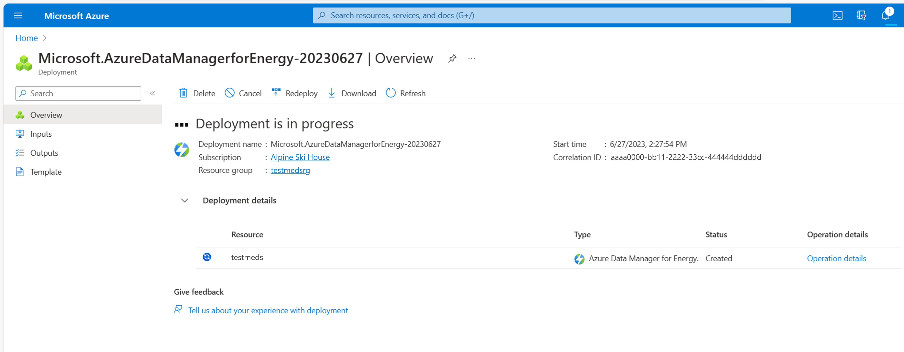

# Quickstart: Create an Azure Data Manager for Energy instance

In this quickstart, you create an Azure Data Manager for Energy instance by using the Azure portal on a web browser. You first register an Azure application in Active Directory. Then you use the application ID to create an Azure Data Manager for Energy instance in your chosen Azure subscription and region.

You use a simple interface in the Azure portal to set up your Azure Data Manager for Energy instance. The process takes about 50 minutes to complete.

Azure Data Manager for Energy is a managed platform as a service (PaaS) offering from Microsoft that builds on top of the [OSDU&reg;](https://osduforum.org/) Data Platform. When you connect your consuming in-house or third-party applications to Azure Data Manager for Energy, you can use the service to ingest, transform, and export subsurface data.

OSDU&reg; is a trademark of The Open Group.

## Prerequisites

| Prerequisite | Details |
| ------------ | ------- |
Active Azure subscription | You need the Azure subscription ID in which you want to install Azure Data Manager for Energy. You need appropriate permissions to create Azure resources in this subscription.
Application ID | You need an [application ID](../active-directory/develop/application-model.md) (often called an app ID or a client ID). This application ID is used for authentication to Microsoft Entra ID and is associated with your Azure Data Manager for Energy instance. You can [create an application ID](../active-directory/develop/quickstart-register-app.md) by going to Active Directory and selecting **App registrations** > **New registration**.
Client secret | Sometimes called an application password, a client secret is a string value that your app can use in place of a certificate to identity itself. You can [create a client secret](../active-directory/develop/quickstart-register-app.md#add-a-client-secret) by selecting **Certificates & secrets** > **Client secrets** > **New client secret**. Record the secret's value for use in your client application code. This value is never displayed again after you leave this page.

## Create an Azure Data Manager for Energy instance

1. Save your application (client) ID and client secret from Microsoft Entra ID to refer to them later in this quickstart.  

1. Sign in to [Microsoft Azure Marketplace](https://portal.azure.com/#view/Microsoft_Azure_Marketplace/MarketplaceOffersBlade/selectedMenuItemId/home).

1. If you have access to multiple tenants, use the **Directories + subscriptions** filter on the top menu to switch to the tenant in which you want to install Azure Data Manager for Energy.

1. On the search bar in Azure Marketplace (not the global Azure search bar on the top of the screen), enter **Azure Data Manager for Energy**.

    

1. In the search results, on the **Azure Data Manager for Energy** card, select **Create**.

1. A new window appears. Complete the **Basics** tab by choosing the subscription, resource group, and tier, along with the region in which you want to create your Azure Data Manager for Energy instance.

   The default tier is currently **Standard**. You can use the dropdown list to change your tier selection. [Learn more about Azure Data Manager for Energy tiers](../energy-data-services/concepts-tier-details.md).

   You can also use this tab to configure up to five data partitions.

   

   Here are some naming conventions to guide you at this step:

   | Field | Requirements |
   | ----- | --------------- |
   **Instance details** > **Name** | Only alphanumeric characters are allowed, and the value must be 1 to 15 characters. The name is not case-sensitive. One resource group can't have two instances with the same name.
   **Instance details** > **App ID** | Enter the valid application ID that you generated and saved in the last section.
   **Data Partitions** > **Name** | Each name must be 1 to 10 characters and consist of lowercase alphanumeric characters and hyphens. It must start with an alphanumeric character and not contain consecutive hyphens. Data partition names that you choose are automatically prefixed with your Azure Data Manager for Energy instance name. Application and API calls will use these compound names to refer to your data partitions.

   > [!NOTE]
   > After you create names for your Azure Data Manager for Energy instance and data partitions, you can't change them later.  

1. Move to the **Networking** tab and configure as needed. On this tab, you can choose to disable private access to your Azure Data Manager for Energy instance. [Learn more about setting up a private endpoint in Azure Data Manager for Energy](../energy-data-services/how-to-set-up-private-links.md).

   

1. Move to the **Encryption** tab and configure as needed. You have two options for data encryption: Microsoft-managed keys or customer-managed keys. [Learn how to encrypt your data with customer-managed encryption keys](../energy-data-services/how-to-manage-data-security-and-encryption.md). [Learn how to manage data security by using managed identities in Azure Data Manager for Energy](../energy-data-services/how-to-use-managed-identity.md).

   

1. Move to the **Tags** tab and enter any tags that you want to specify. If you don't want to specify tags, leave the boxes blank.

   

1. Move to the **Resource Sharing (CORS)** tab and configure cross-origin resource sharing as needed. [Learn more about cross-origin resource sharing in Azure Data Manager for Energy](../energy-data-services/how-to-enable-cors.md).

   

1. Move to the **Review + Create** tab.

   Validation takes a few seconds. After your configuration passes the basic validation tests, review the terms and configuration details.

   

1. Optional step: On the **Review + create** tab, you can download an Azure Resource Manager template and use it for automated deployments of Azure Data Manager for Energy in the future. Select **View automation template**.

1. Select **Create** to start the deployment.

1. Wait while the deployment happens in the background. Options are available to view details of the created instance.

   

You can find the newly created Azure Data Manager for Energy resource in your resource group. Select it to open the resource UI in the portal. Details as such data partitions, instance URI, and app ID are available.

## Delete an Azure Data Manager for Energy instance

Deleting an Azure Data Manager for Energy instance also deletes any data that the instance ingested. This action is permanent. You can't recover ingested data after deletion.

To delete an Azure Data Manager for Energy instance:

1. Remove any locks that you set at the resource group level. Locked resources remain active until you remove the locks and successfully delete the resources.

1. Sign in to the Azure portal and delete the resource group in which the Azure Data Manager for Energy components are installed.

1. This step is optional. Go to Microsoft Entra ID and delete the app registration that you linked to your Azure Data Manager for Energy instance.

## Next steps

After you provision an Azure Data Manager for Energy instance, you can learn about user management on this instance:

> [!div class="nextstepaction"]
> [How to manage users](how-to-manage-users.md)
