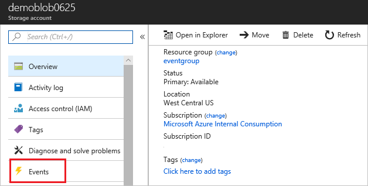

# Quickstart: Route Blob storage events to web endpoint with the Azure portal

Azure Event Grid is an eventing service for the cloud. In this article, you use the Azure portal to create a Blob storage account, subscribe to events for that blob storage, and trigger an event to view the result. Typically, you send events to an endpoint that processes the event data and takes actions. However, to simplify this article, you send the events to a web app that collects and displays the messages.

[!INCLUDE [quickstarts-free-trial-note.md](../../includes/quickstarts-free-trial-note.md)]

When you're finished, you see that the event data has been sent to the web app.


## Create a storage account

1. Sign in to [Azure portal](https://portal.azure.com/).

1. To create a Blob storage, select **Create a resource**. 

   

1. Select for **Storage** to filter the available options, and select **Storage account - blob, file, table, queue**.

   

1. To subscribe to events, create either a general-purpose v2 storage account or a Blob storage account. For more information, see [Create a storage account](../storage/common/storage-account-create.md).

   

## Create a message endpoint

Before subscribing to the events for the Blob storage, let's create the endpoint for the event message. Typically, the endpoint takes actions based on the event data. To simplify this quickstart, you deploy a [pre-built web app](https://github.com/Azure-Samples/azure-event-grid-viewer) that displays the event messages. The deployed solution includes an App Service plan, an App Service web app, and source code from GitHub.

1. Select **Deploy to Azure** to deploy the solution to your subscription. In the Azure portal, provide values for the parameters.

   <a href="https://portal.azure.com/#create/Microsoft.Template/uri/https%3A%2F%2Fraw.githubusercontent.com%2FAzure-Samples%2Fazure-event-grid-viewer%2Fmaster%2Fazuredeploy.json" target="_blank"></a>

1. The deployment may take a few minutes to complete. After the deployment has succeeded, view your web app to make sure it's running. In a web browser, navigate to: 
`https://<your-site-name>.azurewebsites.net`

1. You see the site but no events have been posted to it yet.

   

[!INCLUDE [event-grid-register-provider-portal.md](../../includes/event-grid-register-provider-portal.md)]

## Subscribe to the Blob storage

You subscribe to a topic to tell Event Grid which events you want to track, and where to send the events.

1. In the portal, select your blob storage and select **Events**.

   

1. To send events to your viewer app, use a web hook for the endpoint. Select **More Options**, and **Web Hook**.

   

1. The event subscription is prefilled with values for your Blob storage. For the web hook endpoint, provide the URL of your web app and add `api/updates` to the home page URL. Give your subscription a name. When done, select **Create**.

   

1. View your web app again, and notice that a subscription validation event has been sent to it. Select the eye icon to expand the event data. Event Grid sends the validation event so the endpoint can verify that it wants to receive event data. The web app includes code to validate the subscription.

   

Now, let's trigger an event to see how Event Grid distributes the message to your endpoint.

## Send an event to your endpoint

You trigger an event for the Blob storage by uploading a file. The file doesn't need any specific content. The articles assumes you have a file named testfile.txt, but you can use any file.

1. For your Blob storage, select **Blobs**.

   

1. Select **+ Container**. Give you container a name, and use any access level.

   

1. Select your new container.

   

1. To upload a file, select **Upload**.

   

1. Browse to your test file and upload it.

1. You've triggered the event, and Event Grid sent the message to the endpoint you configured when subscribing. The message is in the JSON format and it contains an array with one or more events. In the following example, the JSON message contains an array with one event. View your web app and notice that a blob created event was received. 

   ```json
   [{
    "topic": "/subscriptions/{subscription-id}/resourceGroups/eventgroup/providers/Microsoft.Storage/storageAccounts/demoblob0625",
    "subject": "/blobServices/default/containers/eventcontainer/blobs/testfile.txt",
    "eventType": "Microsoft.Storage.BlobCreated",
    "eventTime": "2018-06-25T22:50:41.1823131Z",
    "id": "89a2f9da-c01e-00bb-13d6-0c599506e4e3",
    "data": {
      "api": "PutBlockList",
      "clientRequestId": "41341a9b-e977-4a91-9000-c64125039047",
      "requestId": "89a2f9da-c01e-00bb-13d6-0c5995000000",
      "eTag": "0x8D5DAEE13C8F9ED",
      "contentType": "text/plain",
      "contentLength": 4,
      "blobType": "BlockBlob",
      "url": "https://demoblob0625.blob.core.windows.net/eventcontainer/testfile.txt",
      "sequencer": "00000000000000000000000000001C24000000000004712b",
      "storageDiagnostics": {
        "batchId": "ef633252-32fd-464b-8f5a-0d10d68885e6"
      }
    },
    "dataVersion": "",
    "metadataVersion": "1"
   }]
   ```

## Clean up resources

If you plan to continue working with this event, don't clean up the resources created in this article. Otherwise, delete the resources you created in this article.

Select the resource group, and select **Delete resource group**.

## Next steps

Now that you know how to create custom topics and event subscriptions, learn more about what Event Grid can help you do:

- [About Event Grid](overview.md)
- [Route Blob storage events to a custom web endpoint](../storage/blobs/storage-blob-event-quickstart.md?toc=%2fazure%2fevent-grid%2ftoc.json)
- [Monitor virtual machine changes with Azure Event Grid and Logic Apps](monitor-virtual-machine-changes-event-grid-logic-app.md)
- [Stream big data into a data warehouse](event-grid-event-hubs-integration.md)
