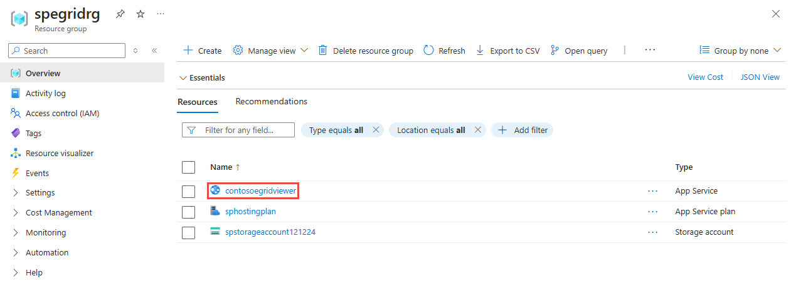
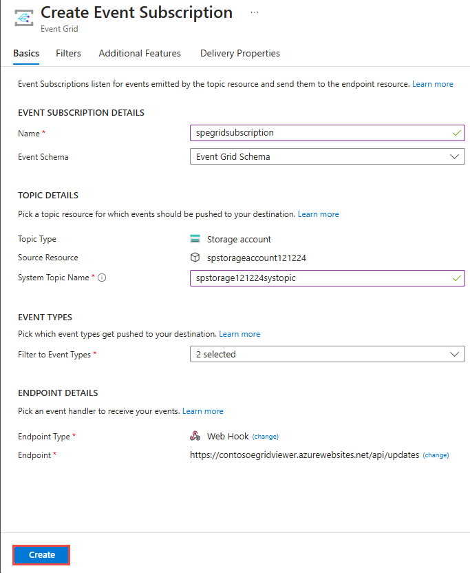
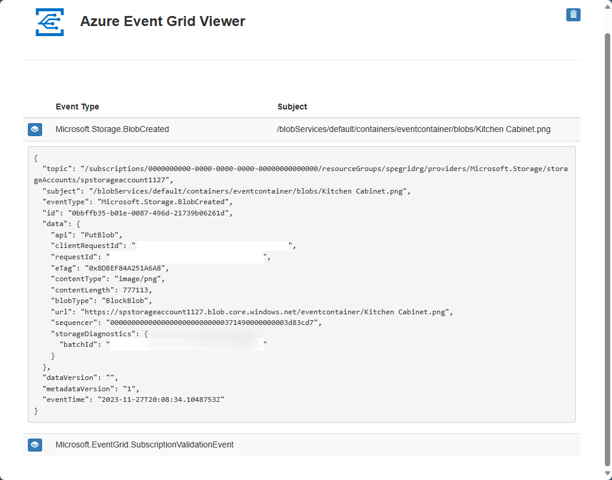

# Quickstart: Route Blob storage events to web endpoint with the Azure portal

Azure Event Grid is an eventing service for the cloud. In this article, you use the Azure portal to create a Blob storage account, subscribe to events for that blob storage, and trigger an event to view the result. Typically, you send events to an endpoint that processes the event data and takes actions. However, to simplify this article, you send the events to a web app that collects and displays the messages.

[!INCLUDE [quickstarts-free-trial-note.md](../../includes/quickstarts-free-trial-note.md)]

When you're finished, you see that the event data has been sent to the web app.

## Create a storage account

1. Sign in to [Azure portal](https://portal.azure.com/).

1. To create a Blob storage, select **Create a resource**. 

1. Select for **Storage** to filter the available options, and select **Storage account - blob, file, table, queue**.

   

   To subscribe to events, create either a general-purpose v2 storage account or a Blob storage account.
   
1. On the **Create storage account** page, do the following steps:
    1. Select your Azure subscription. 
    2. For **Resource group**, create a new resource group or select an existing one. 
    3. Enter the name for your storage account. 
    4. Select **Review + create**. 

           
    5. On the **Review + create** page, review the settings, and select **Create**. 

        >[!NOTE]
        > Only storage accounts of kind **StorageV2 (general purpose v2)** and **BlobStorage** support event integration. **Storage (genral purpose v1)** does *not* support integration with Event Grid.

## Create a message endpoint

Before subscribing to the events for the Blob storage, let's create the endpoint for the event message. Typically, the endpoint takes actions based on the event data. To simplify this quickstart, you deploy a [pre-built web app](https://github.com/Azure-Samples/azure-event-grid-viewer) that displays the event messages. The deployed solution includes an App Service plan, an App Service web app, and source code from GitHub.

1. Select **Deploy to Azure** to deploy the solution to your subscription. 

   
2. On the **Custom deployment** page, do the following steps: 
    1. For **Resource group**, select the resource group that you created when creating the storage account. It will be easier for you to clean up after you are done with the tutorial by deleting the resource group.  
    2. For **Site Name**, enter a name for the web app.
    3. For **Hosting plan name**, enter a name for the App Service plan to use for hosting the web app.
    4. Select the check box for **I agree to the terms and conditions stated above**. 
    5. Select **Purchase**. 

       
1. The deployment may take a few minutes to complete. Select Alerts (bell icon) in the portal, and then select **Go to resource group**. 

    
4. On the **Resource group** page, in the list of resources, select the web app that you created. You also see the App Service plan and the storage account in this list. 

    
5. On the **App Service** page for your web app, select the URL to navigate to the web site. The URL should be in this format: `https://<your-site-name>.azurewebsites.net`.
    
    

6. Confirm that you see the site but no events have been posted to it yet.

   

[!INCLUDE [event-grid-register-provider-portal.md](../../includes/event-grid-register-provider-portal.md)]

## Subscribe to the Blob storage

You subscribe to a topic to tell Event Grid which events you want to track, and where to send the events.

1. In the portal, navigate to your Azure Storage account that you created earlier. On the left menu, select **All resources** and select your storage account. 
2. On the **Storage account** page, select **Events** on the left menu. 
1. Select **More Options**, and **Web Hook**. You are sending events to your viewer app using a web hook for the endpoint. 

   
3. On the **Create Event Subscription** page, do the following steps: 
    1. Enter a **name** for the event subscription.
    2. Enter a **name** for the **system topic**. To learn about system topics, see [Overview of system topics](system-topics.md).

       
    2. Select **Web Hook** for **Endpoint type**. 

       
4. For **Endpoint**, click **Select an endpoint**, and enter the URL of your web app and add `api/updates` to the home page URL (for example: `https://spegridsite.azurewebsites.net/api/updates`), and then select **Confirm Selection**.

   
5. Now, on the **Create Event Subscription** page, select **Create** to create the event subscription. 

   

1. View your web app again, and notice that a subscription validation event has been sent to it. Select the eye icon to expand the event data. Event Grid sends the validation event so the endpoint can verify that it wants to receive event data. The web app includes code to validate the subscription.

   

Now, let's trigger an event to see how Event Grid distributes the message to your endpoint.

## Send an event to your endpoint

You trigger an event for the Blob storage by uploading a file. The file doesn't need any specific content. The articles assumes you have a file named testfile.txt, but you can use any file.

1. In the Azure portal, navigate to your Blob storage account, and select **Containers** on the **Overview** page.

   

1. Select **+ Container**. Give you container a name, and use any access level, and select **Create**. 

   

1. Select your new container.

   

1. To upload a file, select **Upload**. On the **Upload blob** page, browse and select a file that you want to upload for testing, and then select **Upload** on that page. 

   

1. Browse to your test file and upload it.

1. You've triggered the event, and Event Grid sent the message to the endpoint you configured when subscribing. The message is in the JSON format and it contains an array with one or more events. In the following example, the JSON message contains an array with one event. View your web app and notice that a **blob created** event was received. 

   

## Clean up resources

If you plan to continue working with this event, don't clean up the resources created in this article. Otherwise, delete the resources you created in this article.

Select the resource group, and select **Delete resource group**.

## Next steps

Now that you know how to create custom topics and event subscriptions, learn more about what Event Grid can help you do:

- [About Event Grid](overview.md)
- [Route Blob storage events to a custom web endpoint](../storage/blobs/storage-blob-event-quickstart.md?toc=%2fazure%2fevent-grid%2ftoc.json)
- [Monitor virtual machine changes with Azure Event Grid and Logic Apps](monitor-virtual-machine-changes-event-grid-logic-app.md)
- [Stream big data into a data warehouse](event-grid-event-hubs-integration.md)
