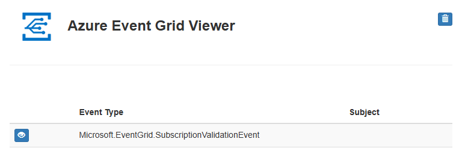

# Route Blob storage events to web endpoint by using Azure Resource Manager template
Azure Event Grid is an eventing service for the cloud. In this article, you use an **Azure Resource Manager template** to create a Blob storage account, subscribe to events for that blob storage, and trigger an event to view the result. Typically, you send events to an endpoint that processes the event data and takes actions. However, to simplify this article, you send the events to a web app that collects and displays the messages.

[Resource Manager template](../azure-resource-manager/templates/overview.md) is a JavaScript Object Notation (JSON) file that defines the infrastructure and configuration for your project. The template uses declarative syntax, which lets you state what you intend to deploy without having to write the sequence of programming commands to create it. If you want to learn more about developing Resource Manager templates, see [Resource Manager documentation](/azure/azure-resource-manager/).

If you don't have an Azure subscription, create a [free account](https://azure.microsoft.com/free/) before you begin.

## Prerequisites
### Create a message endpoint
Before subscribing to the events for the Blob storage, let's create the endpoint for the event message. Typically, the endpoint takes actions based on the event data. To simplify this quickstart, you deploy a [pre-built web app](https://github.com/Azure-Samples/azure-event-grid-viewer) that displays the event messages. The deployed solution includes an App Service plan, an App Service web app, and source code from GitHub.

1. Select **Deploy to Azure** to deploy the solution to your subscription. In the Azure portal, provide values for the parameters.

    [Deploy to Azure](https://portal.azure.com/#create/Microsoft.Template/uri/https%3A%2F%2Fraw.githubusercontent.com%2FAzure-Samples%2Fazure-event-grid-viewer%2Fmaster%2Fazuredeploy.json)
1. The deployment may take a few minutes to complete. After the deployment has succeeded, view your web app to make sure it's running. In a web browser, navigate to: 
`https://<your-site-name>.azurewebsites.net`

1. You see the site but no events have been posted to it yet.

   

## Create a storage account with an Event Grid subscription
The template used in this quickstart is from [Azure Quickstart templates](https://github.com/Azure/azure-quickstart-templates/tree/master/101-event-grid-subscription-and-storage).

[!code-json[<Azure Resource Manager template create Blob strage Event Grid subscription>](~/quickstart-templates/101-event-grid-subscription-and-storage/azuredeploy.json)]

Two Azure resources are defined in the template:

* **Microsoft.Storage/storageAccounts**: create an Azure Storage account.
* **"Microsoft.Storage/storageAccounts/providers/eventSubscriptions**: create an Azure Event Grid subscription for the storage account. 

1. Select the following link to sign in to Azure and open a template. The template creates a key vault and a secret.

    [Deploy to Azure](https://portal.azure.com/#create/Microsoft.Template/uri/https%3A%2F%2Fraw.githubusercontent.com%2FAzure%2Fazure-quickstart-templates%2Fmaster%2F101-event-grid-subscription-and-storage%2Fazuredeploy.json)
2. Specify the **endpoint**: provide the URL of your web app and add `api/updates` to the home page URL.
3. Select **Purchase** to deploy the template. 

  The Azure portal is used here to deploy the template. You can also use the Azure PowerShell, Azure CLI, and REST API. To learn other deployment methods, see [Deploy templates](../azure-resource-manager/templates/deploy-powershell.md).

> [!NOTE]
> You can find more Azure Event Grid template samples [here](https://azure.microsoft.com/resources/templates/?resourceType=Microsoft.Eventgrid).

## Validate the deployment
View your web app again, and notice that a subscription validation event has been sent to it. Select the eye icon to expand the event data. Event Grid sends the validation event so the endpoint can verify that it wants to receive event data. The web app includes code to validate the subscription.

Now, let's trigger an event to see how Event Grid distributes the message to your endpoint.

You trigger an event for the Blob storage by uploading a file. The file doesn't need any specific content. The articles assumes you have a file named testfile.txt, but you can use any file.

When you upload the file to the Azure Blob storage, Event Grid sends a message to the endpoint you configured when subscribing. The message is in the JSON format and it contains an array with one or more events. In the following example, the JSON message contains an array with one event. View your web app and notice that a blob created event was received. 

## Clean up resources
When no longer needed, [delete the resource group](../azure-resource-manager/management/delete-resource-group.md?tabs=azure-portal#delete-resource-group
). 

## Next steps
For more information about Azure Resource Manager templates, see the following articles:

- [Azure Resource Manager documentation](/azure/azure-resource-manager)
- [Define resources in Azure Resource Manager templates](/azure/templates/)
- [Azure Quickstart templates](https://azure.microsoft.com/resources/templates/)
- [Azure Event Grid templates](https://azure.microsoft.com/resources/templates/?resourceType=Microsoft.Eventgrid).
