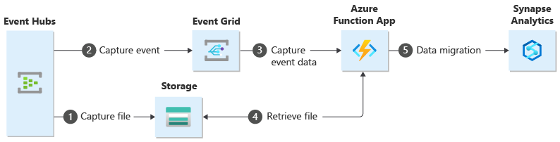

# Choose between Azure messaging services - Event Grid, Event Hubs, and Service Bus

Azure offers three services that assist with delivering event messages throughout a solution. These services are:

* [Event Grid](/azure/event-grid/)
* [Event Hubs](/azure/event-hubs/)
* [Service Bus](/azure/service-bus-messaging/)

Although they have some similarities, each service is designed for particular scenarios. This article describes the differences between these services, and helps you understand which one to choose for your application. In many cases, the messaging services are complementary and can be used together.

## Event vs. message services

There's an important distinction to note between services that deliver an event and services that deliver a message.

### Event

An event is a lightweight notification of a condition or a state change. The publisher of the event has no expectation about how the event is handled. The consumer of the event decides what to do with the notification. Events can be discrete units or part of a series.

Discrete events report state change and are actionable. To take the next step, the consumer only needs to know that something happened. The event data has information about what happened but doesn't have the data that triggered the event. For example, an event notifies consumers that a file was created. It may have general information about the file, but it doesn't have the file itself. Discrete events are ideal for [serverless](https://azure.com/serverless) solutions that need to scale.

Series events report a condition and are analyzable. The events are time-ordered and interrelated. The consumer needs the sequenced series of events to analyze what happened.

### Message

A message is raw data produced by a service to be consumed or stored elsewhere. The message contains the data that triggered the message pipeline. The publisher of the message has an expectation about how the consumer handles the message. A contract exists between the two sides. For example, the publisher sends a message with the raw data, and expects the consumer to create a file from that data and send a response when the work is done.

## Comparison of services

| Service | Purpose | Type | When to use |
| ------- | ------- | ---- | ----------- |
| Event Grid | Reactive programming | Event distribution (discrete) | React to status changes |
| Event Hubs | Big data pipeline | Event streaming (series) | Telemetry and distributed data streaming |
| Service Bus | High-value enterprise messaging | Message | Order processing and financial transactions |

### Event Grid

Event Grid is an eventing backplane that enables event-driven, reactive programming. It uses a publish-subscribe model. Publishers emit events, but have no expectation about which events are handled. Subscribers decide which events they want to handle.

Event Grid is deeply integrated with Azure services and can be integrated with third-party services. It simplifies event consumption and lowers costs by eliminating the need for constant polling. Event Grid efficiently and reliably routes events from Azure and non-Azure resources. It distributes the events to registered subscriber endpoints. The event message has the information you need to react to changes in services and applications. Event Grid isn't a data pipeline, and doesn't deliver the actual object that was updated.

Event Grid supports dead-lettering for events that aren't delivered to an endpoint.

It has the following characteristics:

* dynamically scalable
* low cost
* serverless
* at least once delivery

### Event Hubs

Azure Event Hubs is a big data pipeline. It facilitates the capture, retention, and replay of telemetry and event stream data. The data can come from many concurrent sources. Event Hubs allows telemetry and event data to be made available to a variety of stream-processing infrastructures and analytics services. It is available either as data streams or bundled event batches. This service provides a single solution that enables rapid data retrieval for real-time processing as well as repeated replay of stored raw data. It can capture the streaming data into a file for processing and analysis.

It has the following characteristics:

* low latency
* capable of receiving and processing millions of events per second
* at least once delivery

### Service Bus

Service Bus is intended for traditional enterprise applications. These enterprise applications require transactions, ordering, duplicate detection, and instantaneous consistency. Service Bus enables [cloud-native](https://azure.microsoft.com/overview/cloudnative/) applications to provide reliable state transition management for business processes. When handling high-value messages that cannot be lost or duplicated, use Azure Service Bus. Service Bus also facilitates highly secure communication across hybrid cloud solutions and can connect existing on-premises systems to cloud solutions.

Service Bus is a brokered messaging system. It stores messages in a "broker" (for example, a queue) until the consuming party is ready to receive the messages.

It has the following characteristics:

* reliable asynchronous message delivery (enterprise messaging as a service) that requires polling
* advanced messaging features like FIFO, batching/sessions, transactions, dead-lettering, temporal control, routing and filtering, and duplicate detection
* at least once delivery
* optional in-order delivery

## Use the services together

In some cases, you use the services side by side to fulfill distinct roles. For example, an e-commerce site can use Service Bus to process the order, Event Hubs to capture site telemetry, and Event Grid to respond to events like an item was shipped.

In other cases, you link them together to form an event and data pipeline. You use Event Grid to respond to events in the other services. For an example of using Event Grid with Event Hubs to migrate data to a data warehouse, see [Stream big data into a data warehouse](event-grid-event-hubs-integration.md). The following image shows the workflow for streaming the data.

## Next steps
See the following articles: 
- [Asynchronous messaging options in Azure](/azure/architecture/guide/technology-choices/messaging)
- [Events, Data Points, and Messages - Choosing the right Azure messaging service for your data](https://azure.microsoft.com/blog/events-data-points-and-messages-choosing-the-right-azure-messaging-service-for-your-data/).
- [Storage queues and Service Bus queues - compared and contrasted](../service-bus-messaging/service-bus-azure-and-service-bus-queues-compared-contrasted.md)
- To get started with Event Grid, see [Create and route custom events with Azure Event Grid](custom-event-quickstart.md).
- To get started with Event Hubs, see [Create an Event Hubs namespace and an event hub using the Azure portal](../event-hubs/event-hubs-create.md).
- To get started with Service Bus, see [Create a Service Bus namespace using the Azure portal](../service-bus-messaging/service-bus-create-namespace-portal.md).
