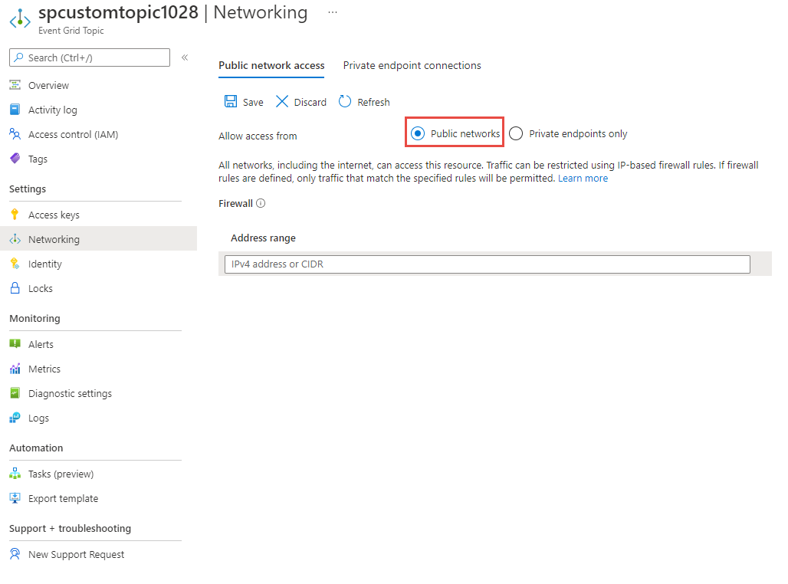
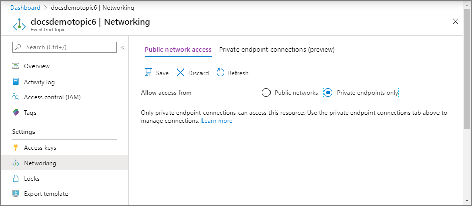

# Configure IP firewall for Azure Event Grid topics or domains (Preview)
By default, topic and domain are accessible from internet as long as the request comes with valid authentication and authorization. With IP firewall, you can restrict it further to only a set of IPv4 addresses or IPv4 address ranges in [CIDR (Classless Inter-Domain Routing)](https://en.wikipedia.org/wiki/Classless_Inter-Domain_Routing) notation. Publishers originating from any other IP address will be rejected and will receive a 403 (Forbidden) response. For more information about network security features supported by Event Grid, see [Network security for Event Grid](network-security.md).

This article describes how to configure IP firewall settings for Azure Event Grid topics or domains.

## Use Azure portal
This section shows you how to use the Azure portal to create inbound IP firewall rules. The steps shown in this section are for topics. You can use similar steps to create inbound IP rules for **domains**. 

1. In the [Azure portal](https://portal.azure.com), Navigate to your event grid topic or domain, and switch to the **Networking** tab.
2. Select **Public networks** to allow all network, including the internet, to access the resource. 

    You can restrict the traffic using IP-based firewall rules. Specify a single IPv4 address or a range of IP addresses in Classless inter-domain routing (CIDR) notation. 

    
3. Select **Private endpoints only** to allow only private endpoint connections to access this resource. Use the **Private endpoint connections** tab on this page to manage connections. 

    
4. Select **Save** on the toolbar. 


## Use Azure CLI
This section shows you how to use Azure CLI commands to create topics with inbound IP rules. The steps shown in this section are for topics. You can use similar steps to create inbound IP rules for **domains**. 


### Prerequisites
Update the Azure Event Grid extension for CLI by running the following command: 

```azurecli-interactive
az extension update -n eventgrid
```

If the extension isn't installed, run the following command to install it: 

```azurecli-interactive
az extension add -n eventgrid
```

### Enable or disable public network access
By default, the public network access is enabled for topics and domains. You can also enable it explicitly or disable it. You can restrict traffic by configuring inbound IP firewall rules. 

#### Enable public network access while creating a topic

```azurecli-interactive
az eventgrid topic create \
    --resource-group $resourceGroupName \
    --name $topicName \
    --location $location \
    --public-network-access enabled
```


#### Disable public network access while creating a topic

```azurecli-interactive
az eventgrid topic create \
    --resource-group $resourceGroupName \
    --name $topicName \
    --location $location \
    --public-network-access disabled
```

> [!NOTE]
> When public network access is disabled for a topic or domain, traffic over public internet isn't allowed. Only private endpoint connections will be allowed to access these resources. 


#### Enable public network access for an existing topic

```azurecli-interactive
az eventgrid topic update \
    --resource-group $resourceGroupName \
    --name $topicName \
    --public-network-access enabled 
```

#### Disable public network access for an existing topic 

```azurecli-interactive
az eventgrid topic update \
    --resource-group $resourceGroupName \
    --name $topicName \
    --public-network-access disabled
```

### Create a topic with single inbound ip rule
The following sample CLI command creates an event grid topic with inbound IP rules. 

```azurecli-interactive
az eventgrid topic create \
    --resource-group $resourceGroupName \
    --name $topicName \
    --location $location \
    --public-network-access enabled \
    --inbound-ip-rules <IP ADDR or CIDR MASK> allow 
```

### Create a topic with multiple inbound ip rules

The following sample CLI command creates an event grid topic two inbound IP rules in one step: 

```azurecli-interactive
az eventgrid topic create \
    --resource-group $resourceGroupName \
    --name $topicName \
    --location $location \
    --public-network-access enabled \
    --inbound-ip-rules <IP ADDR 1 or CIDR MASK 1> allow \
    --inbound-ip-rules <IP ADDR 2 or CIDR MASK 2> allow
```

### Update an existing topic to add inbound IP rules
This example creates an event grid topic first and then adds inbound IP rules for the topic in a separate command. It also updates the inbound IP rules that were set in the second command. 

```azurecli-interactive

# create the event grid topic first
az eventgrid topic create \
    --resource-group $resourceGroupName \
    --name $topicName \
    --location $location

# add inbound IP rules to an existing topic
az eventgrid topic update \
    --resource-group $resourceGroupName \
    --name $topicName \
    --public-network-access enabled \
    --inbound-ip-rules <IP ADDR or CIDR MASK> allow

# later, update topic with additional ip rules
az eventgrid topic update \
    --resource-group $resourceGroupName \
    --name $topicName \
    --public-network-access enabled \
    --inbound-ip-rules <IP ADDR 1 or CIDR MASK 1> allow \
    --inbound-ip-rules <IP ADDR 2 or CIDR MASK 2> allow
```

### Remove an inbound IP rule
The following command removes the second rule you created in the previous step by specifying only the first rule while updating the setting. 

```azurecli-interactive
az eventgrid topic update \
    --resource-group $resourceGroupName \
    --name $topicName \
    --public-network-access enabled \
    --inbound-ip-rules <IP ADDR 1 or CIDR MASK 1> allow
```


## Use PowerShell
This section shows you how to use Azure PowerShell commands to create Azure Event Grid topics with inbound IP firewall rules. The steps shown in this section are for topics. You can use similar steps to create inbound IP rules for **domains**. 

### Prerequisites
Follow instructions from [How to: Use the portal to create an Azure AD application and service principal that can access resources](../active-directory/develop/howto-create-service-principal-portal.md) to create an Azure Active Directory application and note down the following values:

- Directory (tenant) ID
- Application (Client) ID
- Application (client) secret

### Prepare token and headers for REST API calls 
Run the following prerequisite commands to get an authentication token to use with REST API calls, and authorization and other header information. 

```azurepowershell-interactive
# replace <CLIENT ID> and <CLIENT SECRET>
$body = "grant_type=client_credentials&client_id=<CLIENT ID>&client_secret=<CLIENT SECRET>&resource=https://management.core.windows.net"

# get the authentication token. Replace <TENANT ID>
$Token = Invoke-RestMethod -Method Post `
    -Uri https://login.microsoftonline.com/<TENANT ID>/oauth2/token `
    -Body $body `
    -ContentType 'application/x-www-form-urlencoded'

# set authorization and content-type headers
$Headers = @{}
$Headers.Add("Authorization","$($Token.token_type) "+ " " + "$($Token.access_token)")
$Headers.Add("Content-Type","application/json")
```

### Enable public network access for an existing topic
By default, the public network access is enabled for topics and domains. You can restrict traffic by configuring inbound IP firewall rules. 

```azurepowershell-interactive
$body = @{"properties"=@{"publicNetworkAccess"="enabled"}} | ConvertTo-Json -Depth 5

Invoke-RestMethod -Method 'Patch' `
    -Uri "https://management.azure.com/subscriptions/<AZURE SUBSCRIPTION ID>/resourceGroups/<RESOURCE GROUP NAME>/providers/Microsoft.EventGrid/topics/<EVENT GRID TOPIC NAME>?api-version=2020-04-01-preview" `
    -Headers $Headers `
    -Body $body `
    | ConvertTo-Json -Depth 5
```

### Disable public network access for an existing topic
When public network access is disabled for a topic or domain, traffic over public internet isn't allowed. Only private endpoint connections will be allowed to access these resources. 

```azurepowershell-interactive
$body = @{"properties"=@{"publicNetworkAccess"="disabled"}} | ConvertTo-Json -Depth 5

Invoke-RestMethod -Method 'Patch' `
    -Uri "https://management.azure.com/subscriptions/<AZURE SUBSCRIPTION ID>/resourceGroups/<RESOURCE GROUP NAME>/providers/Microsoft.EventGrid/topics/<EVENT GRID TOPIC NAME>?api-version=2020-04-01-preview" `
    -Headers $Headers `
    -Body $body `
    | ConvertTo-Json -Depth 5
```

### Create an event grid topic with inbound rules in one step

```azurepowershell-interactive

# prepare the body for the REST PUT method. Notice that inbound IP rules are included. 
$body = @{"location"="<LOCATION>"; "sku"= @{"name"="basic"}; "properties"=@{"publicNetworkAccess"="enabled"; "inboundIpRules"=@(@{"ipmask"="<IP ADDR or CIDR MASK>";"action"="allow"})}} | ConvertTo-Json -Depth 5

# create the event grid topic with inbound IP rules
Invoke-RestMethod -Method 'Put' `
    -Uri "https://management.azure.com/subscriptions/<AZURE SUBSCRIPTION ID>/resourceGroups/<RESOURCE GROUP NAME>/providers/Microsoft.EventGrid/topics/<EVENT GRID TOPIC NAME>?api-version=2020-04-01-preview" `
    -Headers $Headers `
    -Body $body

# verify that the topic was created
Invoke-RestMethod -Method 'Get' `
    -Uri "https://management.azure.com/subscriptions/<AZURE SUBSCRIPTION ID>/resourceGroups/<RESOURCE GROUP NAME>/providers/Microsoft.EventGrid/topics/<EVENT GRID TOPIC NAME>?api-version=2020-04-01-preview" `
    -Headers $Headers `
    | ConvertTo-Json -Depth 5
```


### Create event grid topic first and then add inbound ip rules

```azurepowershell-interactive

# prepare the body for the REST PUT method. Notice that no inbound IP rules are specified. 
$body = @{"location"="<LOCATION>"; "sku"= @{"name"="basic"}; "properties"=@{"publicNetworkAccess"="enabled";}} | ConvertTo-Json -Depth 5

# create the Event Grid topic
Invoke-RestMethod -Method 'Put' `
    -Uri "https://management.azure.com/subscriptions/<AZURE SUBSCRIPTION ID>/resourceGroups/<RESOURCE GROUP NAME>/providers/Microsoft.EventGrid/topics/<EVENT GRID TOPIC NAME>?api-version=2020-04-01-preview" `
    -Headers $Headers `
    -Body $body`

# verify that the topic was created
Invoke-RestMethod -Method 'Get' `
    -Uri "https://management.azure.com/subscriptions/<AZURE SUBSCRIPTION ID>/resourceGroups/<RESOURCE GROUP NAME>/providers/Microsoft.EventGrid/topics/<EVENT GRID TOPIC NAME>?api-version=2020-04-01-preview" `
    -Headers $Headers `
    | ConvertTo-Json -Depth 5

# prepare the body for REST PUT method. Notice that it includes inbound IP rules now. This feature is available in both basic and premium tiers.
$body = @{"location"="<LOCATION>"; "sku"= @{"name"="basic"}; "properties"=@{"publicNetworkAccess"="enabled"; "inboundIpRules"=@(@{"ipmask"="<IP ADDR or CIDR MASK>";"action"="allow"}, @{"ipmask"="<IP ADDR or CIDR MASK>";"action"="allow"})}} | ConvertTo-Json -Depth 5

# update the topic with inbound IP rules
Invoke-RestMethod -Method 'Put' `
    -Uri "https://management.azure.com/subscriptions/<AZURE SUBSCRIPTION ID>/resourceGroups/<RESOURCE GROUP NAME>/providers/Microsoft.EventGrid/topics/<EVENT GRID TOPIC NAME>?api-version=2020-04-01-preview" `
    -Headers $Headers `
    -Body $body

# verify that the topic was updated
Invoke-RestMethod -Method 'Get' 
    -Uri "https://management.azure.com/subscriptions/<AzURE SUBSCRIPTION ID>/resourceGroups/<RESOURCE GROUP NAME>/providers/Microsoft.EventGrid/topics/<EVENT GRID TOPIC NAME>?api-version=2020-04-01-preview" `
    -Headers $Headers `
    | ConvertTo-Json -Depth 5

```

## Next steps

* For information about monitoring event deliveries, see [Monitor Event Grid message delivery](monitor-event-delivery.md).
* For more information about the authentication key, see [Event Grid security and authentication](security-authentication.md).
* For more information about creating an Azure Event Grid subscription, see [Event Grid subscription schema](subscription-creation-schema.md).
* To troubleshoot network connectivity issues, see [Troubleshoot network connectivity issues](troubleshoot-network-connectivity.md)
