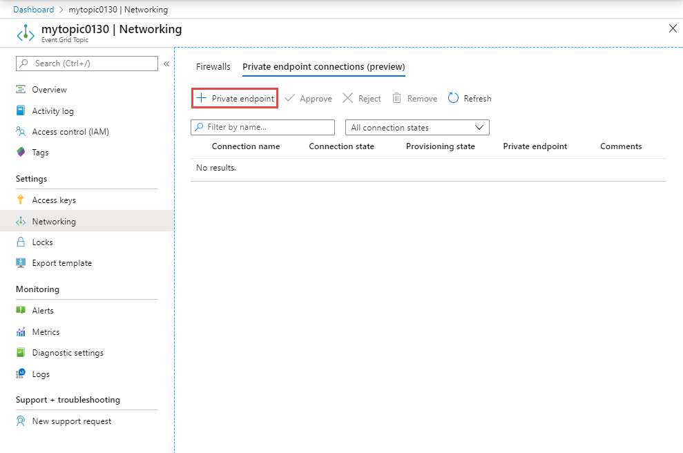
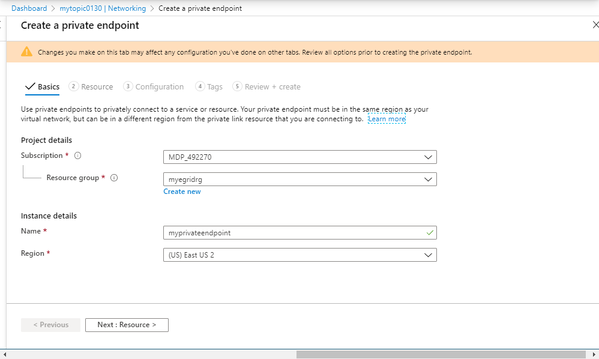
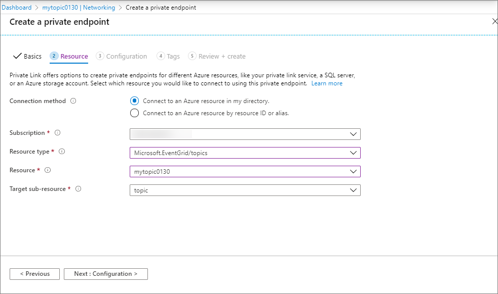
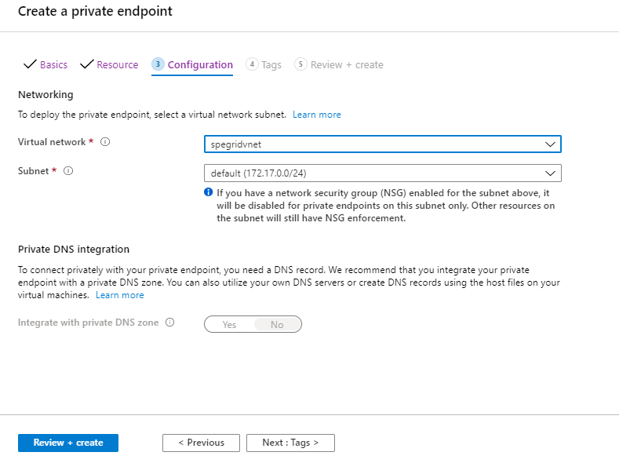
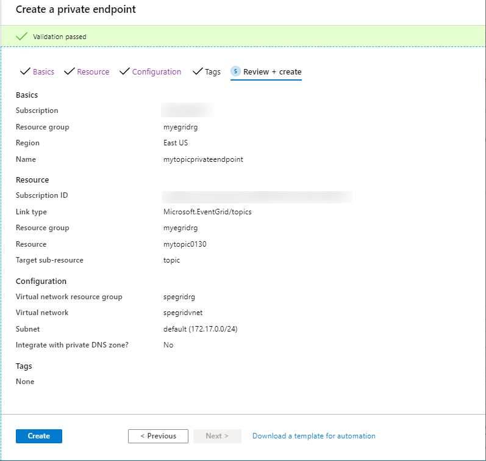

# Configure private endpoints for Event Grid topics or domains
This article describes how to configure private endpoints for Event Grid topics or domains.

## Use Azure portal 

1. Switch to the **Networking** tab of your Event Grid topic page. Select **+ Private endpoint** on the toolbar.

    
2. One the **Basics** page, follow these steps: 
    1. Select an **Azure subscription** in which you want to create the private endpoint. 
    2. Select an **Azure resource group** for the private endpoint. 
    3. Enter a **name** for the endpoint. 
    4. Select the **region** for the endpoint. Your private endpoint must be in the same region as your virtual network, but can in a different region from the private link resource (in this example, the Event Grid topic). 
    5. Then, select **Next: Resource >** button at the bottom of the page. 

      
3. On the **Resource** page, follow these steps: 
    1. For connection method, select **Connect to an Azure resource in my directory**. This example shows how to connect to an Azure resource in your directory. You can also connect to someone else's resource with a resource ID or alias that they've shared with you. 
    2. Select the **Azure subscription** in which your **Event Grid topic/domain** exists. 
    3. For **Resource type**, Select **Microsoft.EventGrid/topics** or **Microsoft.EventGrid/domains** for the **Resource type**.
    4. For **Resource**, select an Event Grid topic/domain from the drop-down list. 
    5. Confirm that the **Target subresource** is set to **topic** or **domain** (based on the resource type you selected).
    6. Select **Next: Configuration >** button at the bottom of the page. 

        
4. On the **Configuration** page, you select the subnet in a virtual network to where you want to deploy the private endpoint. 
    1. Select a **virtual network**. Only virtual networks in the currently selected subscription and location are listed in the drop-down list. 
    2. Select a **subnet** in the virtual network you selected. 
    3. Select **Next: Tags >** button at the bottom of the page. 

    
5. On the **Tags** page, create any tags (names and values) that you want to associate with the private endpoint resource. Then, select **Review + create** button at the bottom of the page. 
6. On the **Review + create**, review all the settings, and select **Create** to create the private endpoint. 

    

## Use Azure CLI

## Use PowerShell

## Next steps
To learn about how to configure IP firewall settings, see [Configure IP firewall for Event Grid topics or domains](configure-firewall.md).