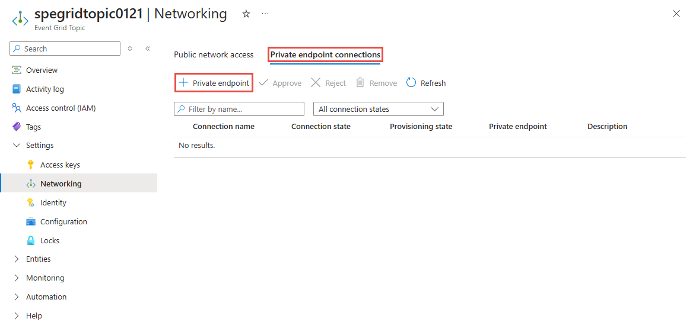
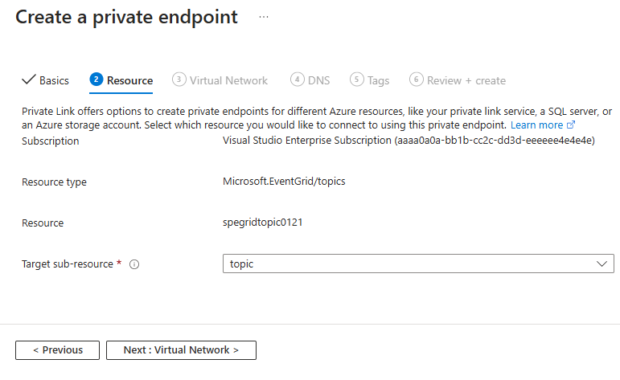

# Configure private endpoints for Azure Event Grid topics or domains
You can use [private endpoints](../private-link/private-endpoint-overview.md) to allow ingress of events directly from your virtual network to your topics and domains securely over a [private link](../private-link/private-link-overview.md) without going through the public internet. The private endpoint uses an IP address from the VNet address space for your topic or domain. For more conceptual information, see [Network security](network-security.md).

This article describes how to configure private endpoints for topics or domains.

## Use Azure portal 
This section shows you how to use the Azure portal to create a private endpoint for a topic or a domain.

> [!NOTE]
> The steps shown in this section are mostly for topics. You can use similar steps to create private endpoints for **domains**. 

1. Sign in to the [Azure portal](https://portal.azure.com) and navigate to your topic or domain.
2. Switch to the **Networking** tab of your topic page. Select **+ Private endpoint** on the toolbar.

    
2. One the **Basics** page, follow these steps: 
    1. Select an **Azure subscription** in which you want to create the private endpoint. 
    2. Select an **Azure resource group** for the private endpoint. 
    3. Enter a **name** for the endpoint. 
    4. Select the **region** for the endpoint. Your private endpoint must be in the same region as your virtual network, but can in a different region from the private link resource (in this example, an  event grid topic). 
    5. Then, select **Next: Resource >** button at the bottom of the page. 

      
3. On the **Resource** page, follow these steps: 
    1. For connection method, if you select **Connect to an Azure resource in my directory**, follow these steps. This example shows how to connect to an Azure resource in your directory. 
        1. Select the **Azure subscription** in which your **topic/domain** exists. 
        1. For **Resource type**, Select **Microsoft.EventGrid/topics** or **Microsoft.EventGrid/domains** for the **Resource type**.
        2. For **Resource**, select an topic/domain from the drop-down list. 
        3. Confirm that the **Target subresource** is set to **topic** or **domain** (based on the resource type you selected).    
        4. Select **Next: Configuration >** button at the bottom of the page. 

            
    2. If you select **Connect to a resource using a resource ID or an alias**, follow these steps:
        1. Enter the ID of the resource. For example: `/subscriptions/<AZURE SUBSCRIPTION ID>/resourceGroups/<RESOURCE GROUP NAME>/providers/Microsoft.EventGrid/topics/<EVENT GRID TOPIC NAME>`.  
        2. For **Resource**, enter **topic** or **domain**. 
        3. (optional) Add a request message. 
        4. Select **Next: Configuration >** button at the bottom of the page. 

            
4. On the **Configuration** page, you select the subnet in a virtual network to where you want to deploy the private endpoint. 
    1. Select a **virtual network**. Only virtual networks in the currently selected subscription and location are listed in the drop-down list. 
    2. Select a **subnet** in the virtual network you selected. 
    3. Select **Next: Tags >** button at the bottom of the page. 

    
5. On the **Tags** page, create any tags (names and values) that you want to associate with the private endpoint resource. Then, select **Review + create** button at the bottom of the page. 
6. On the **Review + create**, review all the settings, and select **Create** to create the private endpoint. 

    
    

### Manage private link connection

When you create a private endpoint, the connection must be approved. If the resource for which you're creating a private endpoint is in your directory, you can approve the connection request provided you have sufficient permissions. If you're connecting to an Azure resource in another directory, you must wait for the owner of that resource to approve your connection request.

There are four provisioning states:

| Service action | Service consumer private endpoint state | Description |
|--|--|--|
| None | Pending | Connection is created manually and is pending approval from the private Link resource owner. |
| Approve | Approved | Connection was automatically or manually approved and is ready to be used. |
| Reject | Rejected | Connection was rejected by the private link resource owner. |
| Remove | Disconnected | Connection was removed by the private link resource owner, the private endpoint becomes informative and should be deleted for cleanup. |
 
###  How to manage a private endpoint connection
The following sections show you how to approve or reject a private endpoint connection. 

1. Sign in to the [Azure portal](https://portal.azure.com).
1. In the search bar, type in **Event Grid topics** or **Event Grid domains**.
1. Select the **topic** or **domain** that you want to manage.
1. Select the **Networking** tab.
1. If there are any connections that are pending, you'll see a connection listed with **Pending** in the provisioning state. 

### To approve a private endpoint
You can approve a private endpoint that's in the pending state. To approve, follow these steps: 

> [!NOTE]
> The steps shown in this section are mostly for topics. You can use similar steps to approve private endpoints for **domains**. 

1. Select the **private endpoint** you wish to approve, and select **Approve** on the toolbar.

    
1. On the **Approve connection** dialog box, enter a comment (optional), and select **Yes**. 

    
1. Confirm that you see the status of the endpoint as **Approved**. 

    

### To reject a private endpoint
You can reject a private endpoint that's in the pending state or approved state. To reject, follow these steps: 

> [!NOTE]
> The steps shown in this section are for topics. You can use similar steps to reject private endpoints for **domains**. 

1. Select the **private endpoint** you wish to reject, and select **Reject** on the toolbar.

    
1. On the **Reject connection** dialog box, enter a comment (optional), and select **Yes**. 

    
1. Confirm that you see the status of the endpoint as **Rejected**. 

    

    > [!NOTE]
    > You can't approve a private endpoint in the Azure portal once it's rejected. 


## Use Azure CLI
To create a private endpoint, use the [az network private-endpoint create](/cli/azure/network/private-endpoint?view=azure-cli-latest#az-network-private-endpoint-create) method as shown in the following example:

```azurecli-interactive
az network private-endpoint create \
    --resource-group <RESOURECE GROUP NAME> \
    --name <PRIVATE ENDPOINT NAME> \
    --vnet-name <VIRTUAL NETWORK NAME> \
    --subnet <SUBNET NAME> \
    --private-connection-resource-id "/subscriptions/<SUBSCRIPTION ID>/resourceGroups/<RESOURCE GROUP NAME>/providers/Microsoft.EventGrid/topics/<TOPIC NAME> \
    --connection-name <PRIVATE LINK SERVICE CONNECTION NAME> \
    --location <LOCATION> \
    --group-ids topic
```

For descriptions of the parameters used in the example, see documentation for [az network private-endpoint create](/cli/azure/network/private-endpoint?view=azure-cli-latest#az-network-private-endpoint-create). A few points to note in this example are: 

- For `private-connection-resource-id`, specify the resource ID of the **topic** or **domain**. The preceding example uses the type: topic.
- for `group-ids`, specify `topic` or `domain`. In the preceding example, `topic` is used. 

To delete a private endpoint, use the [az network private-endpoint delete](/cli/azure/network/private-endpoint?view=azure-cli-latest#az-network-private-endpoint-delete) method as shown in the following example:

```azurecli-interactive
az network private-endpoint delete --resource-group <RESOURECE GROUP NAME> --name <PRIVATE ENDPOINT NAME>
```

> [!NOTE]
> The steps shown in this section are for topics. You can use similar steps to create private endpoints for **domains**. 


### Prerequisites
Update the Azure Event Grid extension for CLI by running the following command: 

```azurecli-interactive
az extension update -n eventgrid
```

If the extension isn't installed, run the following command to install it: 

```azurecli-interactive
az extension add -n eventgrid
```

### Create a private endpoint
To create a private endpoint, use the [az network private-endpoint create](/cli/azure/network/private-endpoint?view=azure-cli-latest#az-network-private-endpoint-create) method as shown in the following example:

```azurecli-interactive
az network private-endpoint create \
    --resource-group <RESOURECE GROUP NAME> \
    --name <PRIVATE ENDPOINT NAME> \
    --vnet-name <VIRTUAL NETWORK NAME> \
    --subnet <SUBNET NAME> \
    --private-connection-resource-id "/subscriptions/<SUBSCRIPTION ID>/resourceGroups/<RESOURCE GROUP NAME>/providers/Microsoft.EventGrid/topics/<TOPIC NAME> \
    --connection-name <PRIVATE LINK SERVICE CONNECTION NAME> \
    --location <LOCATION> \
    --group-ids topic
```

For descriptions of the parameters used in the example, see documentation for [az network private-endpoint create](/cli/azure/network/private-endpoint?view=azure-cli-latest#az-network-private-endpoint-create). A few points to note in this example are: 

- For `private-connection-resource-id`, specify the resource ID of the **topic** or **domain**. The preceding example uses the type: topic.
- for `group-ids`, specify `topic` or `domain`. In the preceding example, `topic` is used. 

To delete a private endpoint, use the [az network private-endpoint delete](/cli/azure/network/private-endpoint?view=azure-cli-latest#az-network-private-endpoint-delete) method as shown in the following example:

```azurecli-interactive
az network private-endpoint delete --resource-group <RESOURECE GROUP NAME> --name <PRIVATE ENDPOINT NAME>
```

> [!NOTE]
> The steps shown in this section are for topics. You can use similar steps to create private endpoints for **domains**. 

#### Sample script
Here's a sample script that creates the following Azure resources:

- Resource group
- Virtual network
- Subnet in the virtual network
- Azure Event Grid topic
- Private endpoint for the topic

> [!NOTE]
> The steps shown in this section are for topics. You can use similar steps to create private endpoints for domains.

```azurecli-interactive
subscriptionID="<AZURE SUBSCRIPTION ID>"
resourceGroupName="<RESOURCE GROUP NAME>"
location="<LOCATION>"
vNetName="<VIRTUAL NETWORK NAME>"
subNetName="<SUBNET NAME>"
topicName = "<TOPIC NAME>"
connectionName="<ENDPOINT CONNECTION NAME>"
endpointName=<ENDPOINT NAME>

# resource ID of the topic. replace <SUBSCRIPTION ID>, <RESOURCE GROUP NAME>, and <TOPIC NAME>
topicResourceID="/subscriptions/<SUBSCRIPTION ID>/resourceGroups/<RESOURCE GROUP NAME>/providers/Microsoft.EventGrid/topics/<TOPIC NAME>"

# select subscription
az account set --subscription $subscriptionID

# create resource group
az group create --name $resourceGroupName --location $location

# create vnet 
az network vnet create \
    --resource-group $resourceGroupName \
    --name $vNetName \
    --address-prefix 10.0.0.0/16

# create subnet
az network vnet subnet create \
    --resource-group $resourceGroupName \
    --vnet-name $vNetName \
    --name $subNetName \
    --address-prefixes 10.0.0.0/24

# disable private endpoint network policies for the subnet
az network vnet subnet update \
    --resource-group $resourceGroupName \
    --vnet-name $vNetName \
    --name $subNetName \
    --disable-private-endpoint-network-policies true

# create event grid topic. update <LOCATION>
az eventgrid topic create \
    --resource-group $resourceGroupName \
    --name $topicName \
    --location $location

# verify that the topic was created.
az eventgrid topic show \
    --resource-group $resourceGroupName \
    --name $topicName

# create private endpoint for the topic you created
az network private-endpoint create 
    --resource-group $resourceGroupName \
    --name $endpointName \
    --vnet-name $vNetName \
    --subnet $subNetName \
    --private-connection-resource-id $topicResourceID \
    --connection-name $connectionName \
    --location $location \
    --group-ids topic

# get topic 
az eventgrid topic show \
    --resource-group $resourceGroupName \
    --name $topicName

```

### Approve a private endpoint
The following sample CLI snippet shows you how to approve a private endpoint connection. 

```azurecli-interactive
az eventgrid topic private-endpoint-connection approve \
    --resource-group $resourceGroupName \
    --topic-name $topicName \
    --name  $endpointName \
    --description "connection approved"
```


### Reject a private endpoint
The following sample CLI snippet shows you how to reject a private endpoint connection. 

```azurecli-interactive
az eventgrid topic private-endpoint-connection reject \
    --resource-group $resourceGroupName \
    --topic-name $topicName \
    --name $endpointName \
    --description "Connection rejected"
```

### Disable public network access
By default, public network access is enabled for an Event Grid topic or domain. To allow access via private endpoints only, disable public network access by running the following command:  

```azurecli-interactive
az eventgrid topic update \
    --resource-group $resourceGroupName \
    --name $topicName \
    --public-network-access disabled
```


## Use PowerShell
This section shows you how to create a private endpoint for a topic or domain using PowerShell. 

### Prerequisite
Follow instructions from [How to: Use the portal to create an Azure AD application and service principal that can access resources](../active-directory/develop/howto-create-service-principal-portal.md) to create an Azure Active Directory application and note down the values for **Directory (tenant) ID**, **Application (Client) ID**, and **Application (client) secret**. 

### Prepare token and headers for REST API calls 
Run the following prerequisite commands to get an authentication token to use with REST API calls and authorization and other header information. 

```azurepowershell-interactive
$body = "grant_type=client_credentials&client_id=<CLIENT ID>&client_secret=<CLIENT SECRET>&resource=https://management.core.windows.net"

# get authentication token
$Token = Invoke-RestMethod -Method Post `
    -Uri https://login.microsoftonline.com/<TENANT ID>/oauth2/token  `
    -Body $body  `
    -ContentType 'application/x-www-form-urlencoded' 

# set authorization and content-type headers
$Headers = @{}
$Headers.Add("Authorization","$($Token.token_type) "+ " " + "$($Token.access_token)")
```

### Create a subnet with endpoint network policies disabled

```azurepowershell-interactive

# create resource group
New-AzResourceGroup -ResourceGroupName <RESOURCE GROUP NAME>  -Location <LOCATION>

# create virtual network
$virtualNetwork = New-AzVirtualNetwork `
                    -ResourceGroupName <RESOURCE GROUP NAME> `
                    -Location <LOCATION> `
                    -Name <VIRTUAL NETWORK NAME> `
                    -AddressPrefix 10.0.0.0/16

# create subnet with endpoint network policy disabled
$subnetConfig = Add-AzVirtualNetworkSubnetConfig `
                    -Name example-privatelinksubnet `
                    -AddressPrefix 10.0.0.0/24 `
                    -PrivateEndpointNetworkPoliciesFlag "Disabled" `
                    -VirtualNetwork $virtualNetwork

# update virtual network
$virtualNetwork | Set-AzVirtualNetwork
```

### Create an event grid topic with a private endpoint

> [!NOTE]
> The steps shown in this section are for topics. You can use similar steps to create private endpoints for **domains**. 


```azurepowershell-interactive
$body = @{"location"="<LOCATION>"; "properties"=@{"publicNetworkAccess"="disabled"}} | ConvertTo-Json

# create topic
Invoke-RestMethod -Method 'Put'  `
    -Uri "https://management.azure.com/subscriptions/<AZURE SUBSCRIPTION ID>/resourceGroups/<RESOURCE GROUP NAME>/providers/Microsoft.EventGrid/topics/<EVENT GRID TOPIC NAME>?api-version=2020-04-01-preview"  `
    -Headers $Headers  `
    -Body $body

# verify that the topic was created
$topic=Invoke-RestMethod -Method 'Get'  `
    -Uri "https://management.azure.com/subscriptions/<AZURE SUBSCRIPTION ID>/resourceGroups/<RESOURCE GROUP NAME>/providers/Microsoft.EventGrid/topics/<EVENT GRID TOPIC NAME>?api-version=2020-04-01-preview"   `
    -Headers $Headers  

# create private link service connection
$privateEndpointConnection = New-AzPrivateLinkServiceConnection `
                                -Name "<PRIVATE LINK SERVICE CONNECTION NAME>" `
                                -PrivateLinkServiceId $topic.Id `
                                -GroupId "topic"

# get virtual network info 
$virtualNetwork = Get-AzVirtualNetwork  `
                    -ResourceGroupName  <RESOURCE GROUP NAME> `
                    -Name <VIRTUAL NETWORK NAME>

# get subnet info
$subnet = $virtualNetwork | Select -ExpandProperty subnets `
                             | Where-Object  {$_.Name -eq <SUBNET NAME>}  

# now, you are ready to create a private endpoint 
$privateEndpoint = New-AzPrivateEndpoint -ResourceGroupName <RESOURCE GROUP NAME>  `
                                        -Name <PRIVATE ENDPOINT NAME>   `
                                        -Location <LOCATION> `
                                        -Subnet  $subnet   `
                                        -PrivateLinkServiceConnection $privateEndpointConnection

# verify that the endpoint was created
Invoke-RestMethod -Method 'Get'  `
    -Uri "https://management.azure.com/subscriptions/<AZURE SUBSCRIPTION ID>/resourceGroups/<RESOURCE GROUP NAME>/providers/Microsoft.EventGrid/topics/<EVENT GRID TOPIC NAME>/privateEndpointConnections?api-version=2020-04-01-preview"   `
    -Headers $Headers   `
    | ConvertTo-Json -Depth 5

```

When you verify that the endpoint was created, you should see the result similar to the following:

```json

{
  "value": [
    {
      "properties": {
        "privateEndpoint": {
          "id": "/subscriptions/<AZURE SUBSCRIPTION ID>/resourceGroups/<RESOURCE GROUP NAME>/providers/Microsoft.Network/privateEndpoints/<PRIVATE ENDPOINT NAME>"
        },
        "groupIds": [
          "topic"
        ],
        "privateLinkServiceConnectionState": {
          "status": "Approved",
          "description": "Auto-approved",
          "actionsRequired": "None"
        },
        "provisioningState": "Succeeded"
      },
      "id": "/subscriptions/<AZURE SUBSCRIPTION ID>/resourceGroups/<RESOURCE GROUP NAME>/providers/Microsoft.EventGrid/topics/<EVENT GRID TOPIC NAME>/privateEndpointConnections/<PRIVATE ENDPOINT NAME>.<GUID>",
      "name": "myConnection",
      "type": "Microsoft.EventGrid/topics/privateEndpointConnections"
    }
  ]
}
```

### Approve a private endpoint connection
The following sample PowerShell snippet shows you how to approve a private endpoint. 

> [!NOTE]
> The steps shown in this section are for topics. You can use similar steps to approve private endpoints for **domains**. 

```azurepowershell-interactive
$approvedBody = @{"properties"=@{"privateLinkServiceConnectionState"=@{"status"="approved";"description"="connection approved";"actionsRequired"="none"}}} | ConvertTo-Json

# approve endpoint connection
Invoke-RestMethod -Method 'Put'  `
    -Uri "https://management.azure.com/subscriptions/<AzuRE SUBSCRIPTION ID>/resourceGroups/<RESOURCE GROUP NAME>/providers/Microsoft.EventGrid/topics/<EVENT GRID TOPIC NAME>/privateEndpointConnections/<PRIVATE ENDPOINT NAME>.<GUID>?api-version=2020-04-01-preview"  `
    -Headers $Headers  `
    -Body $approvedBody

# confirm that the endpoint connection was approved
Invoke-RestMethod -Method 'Get'  `
    -Uri "https://management.azure.com/subscriptions/<AZURE SUBSCRIPTION ID>/resourceGroups/<RESOURCE GROUP NAME>/providers/Microsoft.EventGrid/topics/<EVENT GRID TOPIC NAME>/privateEndpointConnections/<PRIVATE ENDPOINT NAME>.<GUID>?api-version=2020-04-01-preview"  `
    -Headers $Headers

```

### Reject a private endpoint connection
The following example shows you how to reject a private endpoint using PowerShell. You can get the GUID for the private endpoint from the result of the previous GET command. 

> [!NOTE]
> The steps shown in this section are for topics. You can use similar steps to reject private endpoints for **domains**. 


```azurepowershell-interactive
$rejectedBody = @{"properties"=@{"privateLinkServiceConnectionState"=@{"status"="rejected";"description"="connection rejected";"actionsRequired"="none"}}} | ConvertTo-Json

# reject private endpoint
Invoke-RestMethod -Method 'Put'  `
    -Uri "https://management.azure.com/subscriptions/<AZURE SUBSCRIPTION ID>/resourceGroups/<RESOURCE GROUP NAME>/providers/Microsoft.EventGrid/topics/<EVENT GRID TOPIC NAME>/privateEndpointConnections/<PRIVATE ENDPOINT NAME>.<GUID>?api-version=2020-04-01-preview"  `
    -Headers $Headers  `
    -Body $rejectedBody

# confirm that endpoint was rejected
Invoke-RestMethod -Method 'Get' 
    -Uri "https://management.azure.com/subscriptions/<AZURE SUBSCRIPTION ID>/resourceGroups/<RESOURCE GROUP NAME>/providers/Microsoft.EventGrid/topics/<EVENT GRID TOPIC NAME>/privateEndpointConnections/<PRIVATE ENDPOINT NAME>.<GUID>?api-version=2020-04-01-preview" ` 
    -Headers $Headers
```

You can approve the connection even after it's rejected via API. If you use Azure portal, you can't approve an endpoint that has been rejected. 

## Next steps
* To learn about how to configure IP firewall settings, see [Configure IP firewall for Azure Event Grid topics or domains](configure-firewall.md).
* To troubleshoot network connectivity issues, see [Troubleshoot network connectivity issues](troubleshoot-network-connectivity.md)
