# Create, view, and manage Azure Event Grid namespaces

A namespace in Azure Event Grid is a logical container for one or more topics, clients, client groups, topic spaces and permission bindings. It provides a unique namespace, allowing you to have multiple resources in the same Azure region. With an Azure Event Grid namespace you can group now together related resources and manage them as a single unit in your Azure subscription.

Please follow the next sections to create, view and manage an Azure Event Grid namespace.

## Create a namespace

1. Sign-in to the Azure portal.

2. In the search box, enter Event Grid and select Event Grid service.

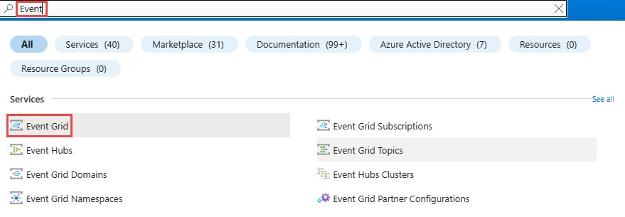

3. In the Overview page, select Create in any of the namespace cards available in the MQTT events or Custom events sections.

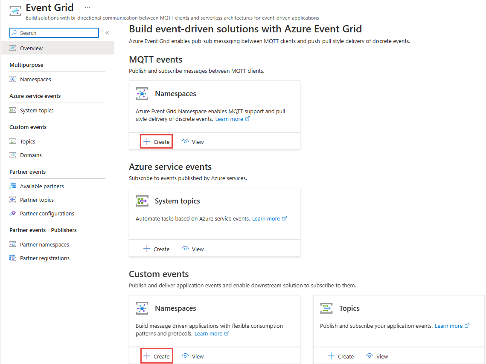

4. On the Basics tab, select the Azure subscription, resource group, name, location and throughput units for your Event Grid namespace.

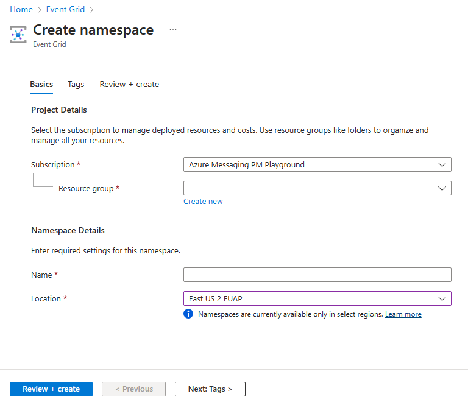

5. On the Tags tab, add the tags in case you need them.

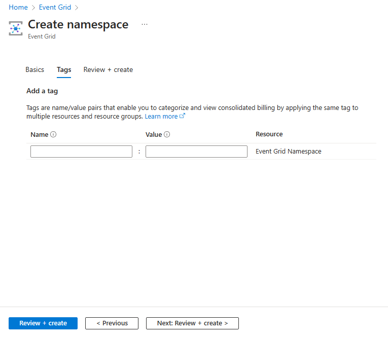

6. On the Select Review + create tab, review your settings.

7. Select Create.

## View a namespace

1. Sign-in to the Azure portal.

2. In the search box, enter Event Grid and select Event Grid service.

3. In the Overview page, select View in any of the namespace cards available in the MQTT events or Custom events sections.

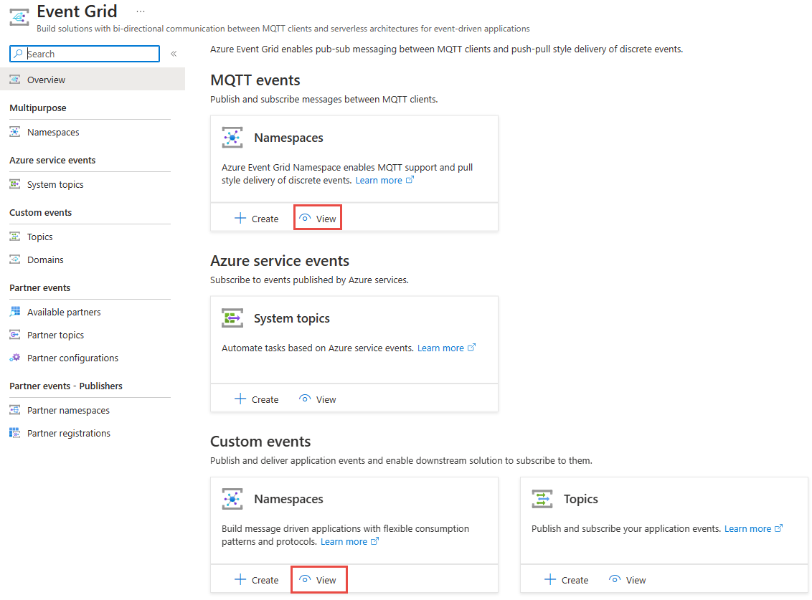

4. In the View page, filter by the subscription you want to explore resources and select Apply.

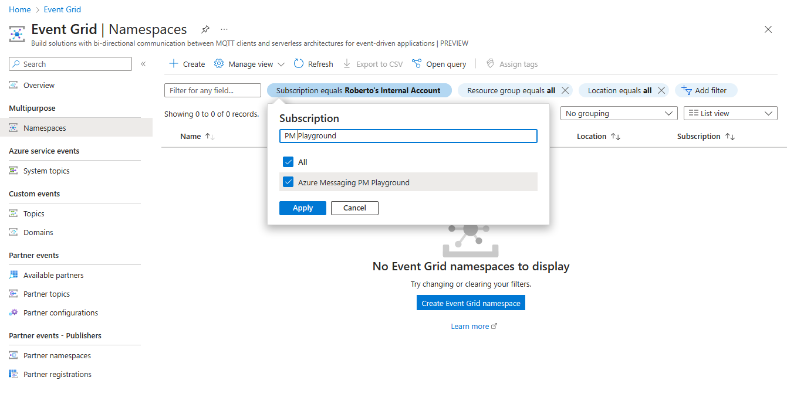

5. Select the namespace from the list of resources in the subscription.

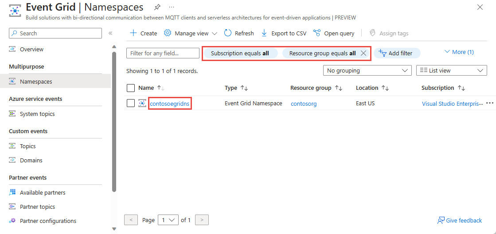

6. Explore the namespace settings and features available.

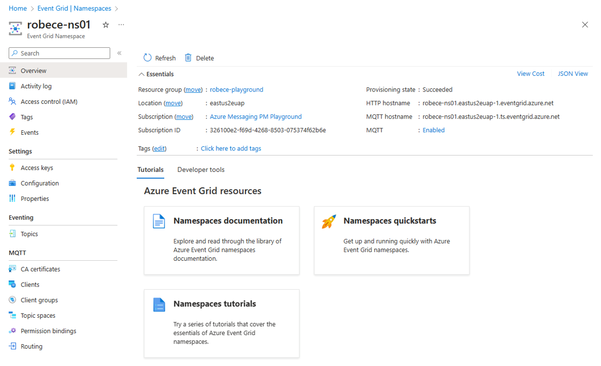

## Enable MQTT

In case you want to enable the MQTT capabilities in the Azure Event Grid namespace, you will need go to **Configuration** and check the option Enable MQTT.

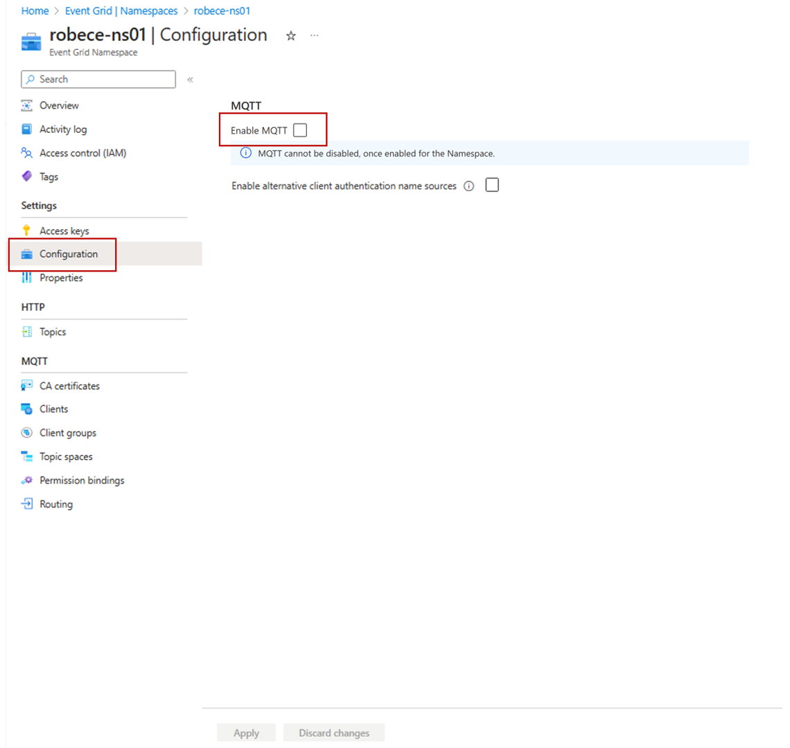

> [!NOTE]
> Please note once MQTT is enabled it cannot be disabled.

## Delete a namespace

1. Follow instructions from the [View a namespace](#view-a-namespace) section to view all the namespaces, and select the namespace that you want to delete from the list. 
2. On the **Overview** page, select **Delete** on the toolbar. 

    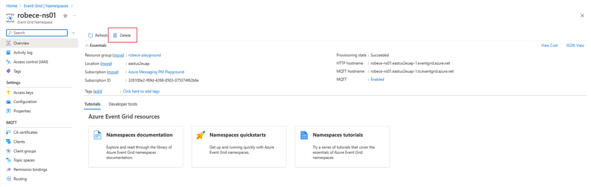

3. On the confirmation page, type the name of the resource and select **Delete** to confirm the deletion. It deletes the namespace and also all the nested topics, subscriptions, and MQTT resources.

    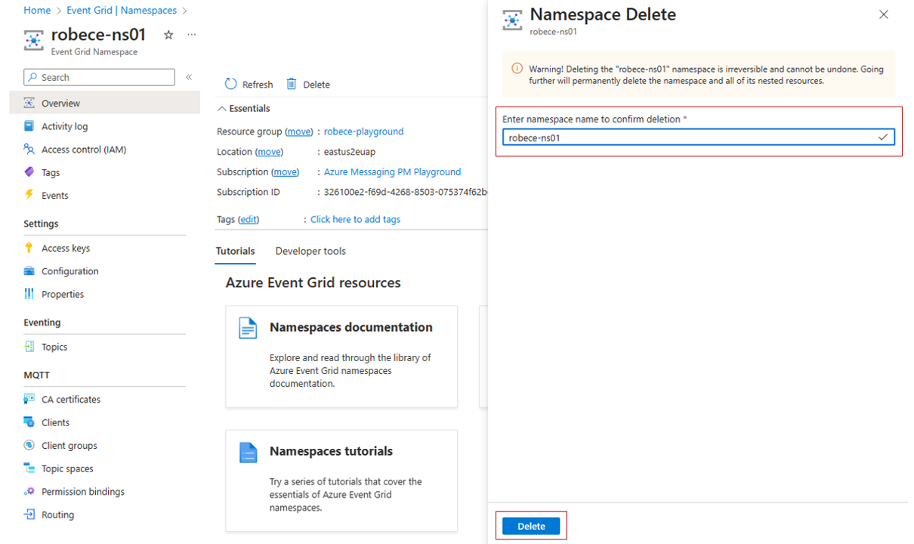

# Next steps

See the [Client authentication using CA certificate chain](mqtt-certificate-chain-client-authentication.md) section to learn more about namespaces for IoT solutions supported by Azure Event Grid. 