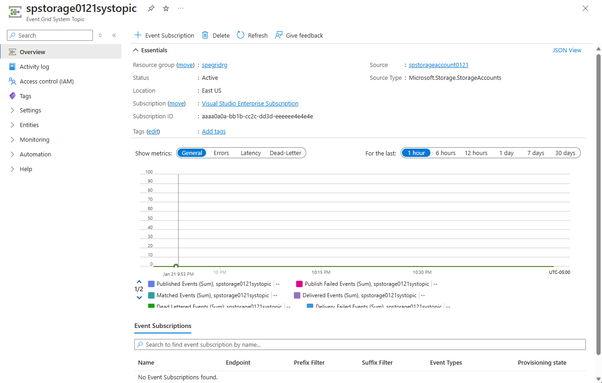

# Create, view, and manage Event Grid system topics in the Azure portal
This article shows you how to create and manage system topics using the Azure portal. For an overview of system topics, see [System topics](system-topics.md).

## Create a system topic
You can create a system topic for an Azure resource (Storage account, Event Hubs namespace, etc.) in two ways:

- Using the **Events** page of a resource, for example, Storage Account or Event Hubs Namespace. When you use the **Events** page in the Azure portal to create an event subscription for an event raised by an Azure source (for example: Azure Storage account), the portal creates a system topic for the Azure resource and then creates a subscription for the system topic. You specify the name of the system topic if you are creating an event subscription on the Azure resource for the first time. From the second time onwards, the system topic name is displayed for you in the read-only mode. See [Quickstart: Route Blob storage events to web endpoint with the Azure portal](blob-event-quickstart-portal.md#subscribe-to-the-blob-storage) for detailed steps.
- Using the **Event Grid System Topics** page. The following steps are for creating a system topic using the **Event Grid System Topics** page. 

1. Sign in to [Azure portal](https://portal.azure.com).
2. In the search box at the top, type **Event Grid System Topics**, and then press **ENTER**. 

    
3. On the **Event Grid System Topics** page, select **+ Add** on the toolbar.

    
4. On the **Create Event Grid System Topic** page, do the following steps:
    1. Select the **topic type**. In the following example, **Storage Accounts** option is selected. 
    2. Select the **Azure subscription** that has your storage account resource. 
    3. Select the **resource group** that has the storage account. 
    4. Select the **storage account**. 
    5. Enter a **name** for the system topic to be created. 
    
        > [!NOTE]
        > You can use this system topic name to search metrics and diagnostic logs.
    6. Select **Review + create**.

        
    5. Review settings and select **Create**. 
        
        
    6. After the deployment succeeds, select **Go to resource** to see the **Event Grid System Topic** page for the system topic you created. 

        

## View all system topics
Follow these steps to view all existing Event Grid system topics. 

1. Sign in to [Azure portal](https://portal.azure.com).
2. In the search box at the top, type **Event Grid System Topics**, and then press **ENTER**. 

    
3. On the **Event Grid System Topics** page, you see all the system topics. 

    
4. Select a **system topic** from the list to see details about it. 

    

    This page shows you details about the system topic such as the following information: 
    - Source. Name of the resource on which the system topic was created.
    - Source type. Type of the resource. For example: `Microsoft.Storage.StorageAccounts`, `Microsoft.EventHub.Namespaces`, `Microsoft.Resources.ResourceGroups` and so on.
    - Any subscriptions created for the system topic.

    This page allows operations such as the following ones:
    - Create an event subscription Select **+Event Subscription** on the toolbar. 
    - Delete an event subscription. Select **Delete** on the toolbar. 
    - Add tags for the system topic. Select **Tags** on the left menu, and specify tag names and values. 

## Delete a system topic
1. Follow instructions from the [View system topics](#view-all-system-topics) section to view all system topics, and select the system topic that you want to delete from the list. 
2. On the **Event Grid System Topic** page, select **Delete** on the toolbar. 

    
3. On the confirmation page, select **OK** to confirm the deletion. It deletes the system topic and also all the event subscriptions for the system topic.  

## Create an event subscription
1. Follow instructions from the [View system topics](#view-all-system-topics) section to view all system topics, and select the system topic that you want to delete from the list. 
2. On the **Event Grid System Topic** page, select **+ Event Subscription** from the toolbar. 

    
3. Confirm that the **Topic Type**, **Source Resource**, and **Topic Name** are automatically populated. Enter a name, select an **Endpoint Type**, and specify the **endpoint**. Then, select **Create** to create the event subscription. 

    

## Next steps
See the [System topics in Azure Event Grid](system-topics.md) section to learn more about system topics and topic types supported by Azure Event Grid. 
