# Create and route custom events with the Azure portal and Event Grid

Azure Event Grid is an eventing service for the cloud. In this article, you use the Azure portal to create a custom topic, subscribe to the custom topic, and trigger the event to view the result. Typically, you send events to an endpoint that processes the event data and takes actions. However, to simplify this article, you send the events to a web app that collects and displays the messages.

When you're finished, you see that the event data has been sent to the web app.


[!INCLUDE [quickstarts-free-trial-note.md](../../includes/quickstarts-free-trial-note.md)]

[!INCLUDE [event-grid-register-provider-portal.md](../../includes/event-grid-register-provider-portal.md)]

## Create a custom topic

An event grid topic provides a user-defined endpoint that you post your events to. 

1. Sign in to [Azure portal](https://portal.azure.com/).

1. To create a custom topic, select **Create a resource**. 

   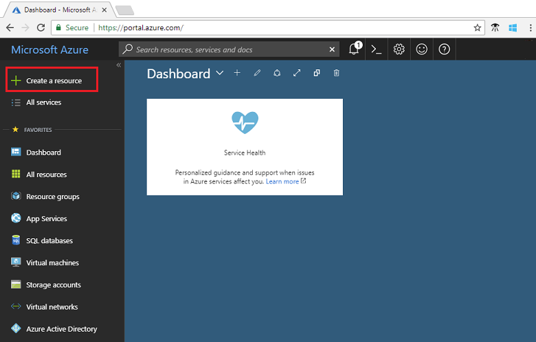

1. Search for *Event Grid Topic* and select it from the available options.

   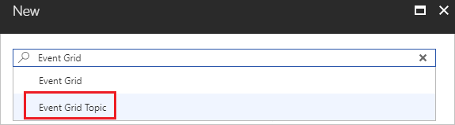

1. Select **Create**.

   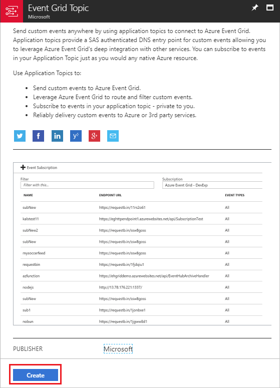

1. Provide a unique name for the custom topic. The topic name must be unique because it's represented by a DNS entry. Don't use the name shown in the image. Instead, create your own name. Provide a name for the resource group. Select **Create**.

   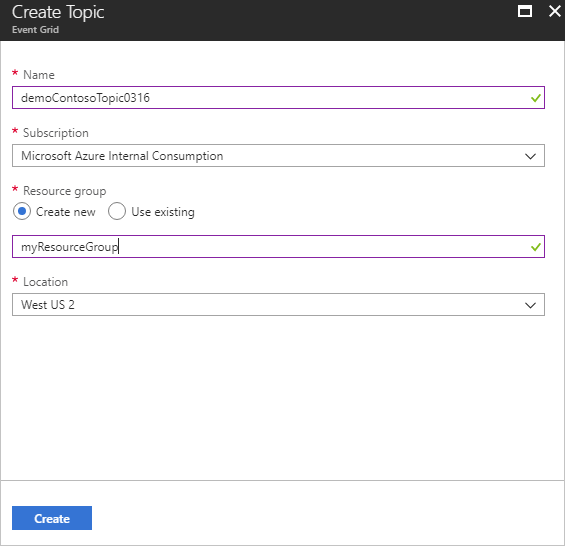

1. After the custom topic has been created, you see the successful notification.

   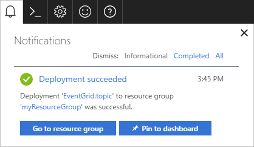

   If the deployment didn't succeed, find out what caused the error. Select **Deployment failed**.

   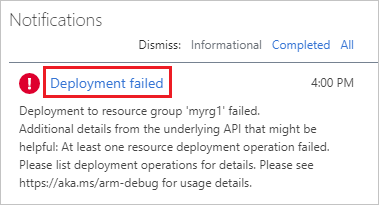

   Select the error message.

   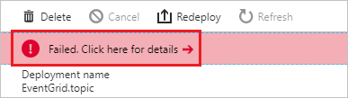

   The following image shows a deployment that failed because the name for the custom topic is already in use. If you see this error, retry the deployment with a different name.

   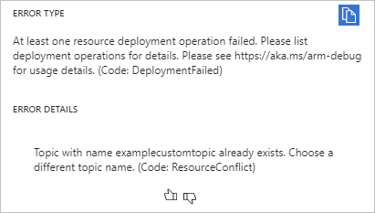

## Create a message endpoint

Before subscribing to the custom topic, let's create the endpoint for the event message. Typically, the endpoint takes actions based on the event data. To simplify this quickstart, you deploy a [pre-built web app](https://github.com/Azure-Samples/azure-event-grid-viewer) that displays the event messages. The deployed solution includes an App Service plan, an App Service web app, and source code from GitHub.

1. Select **Deploy to Azure** to deploy the solution to your subscription. In the Azure portal, provide values for the parameters.

   <a href="https://portal.azure.com/#create/Microsoft.Template/uri/https%3A%2F%2Fraw.githubusercontent.com%2FAzure-Samples%2Fazure-event-grid-viewer%2Fmaster%2Fazuredeploy.json" target="_blank"></a>

1. The deployment may take a few minutes to complete. After the deployment has succeeded, view your web app to make sure it's running. In a web browser, navigate to: 
`https://<your-site-name>.azurewebsites.net`

1. You see the site but no events have been posted to it yet.

   

## Subscribe to custom topic

You subscribe to an event grid topic to tell Event Grid which events you want to track, and where to send the events.

1. In the portal, select your custom topic.

   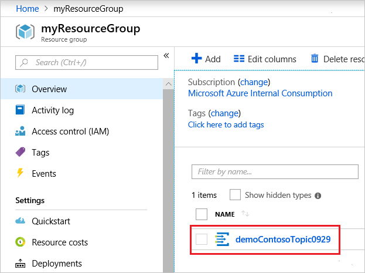

1. Select **+ Event Subscription**.

   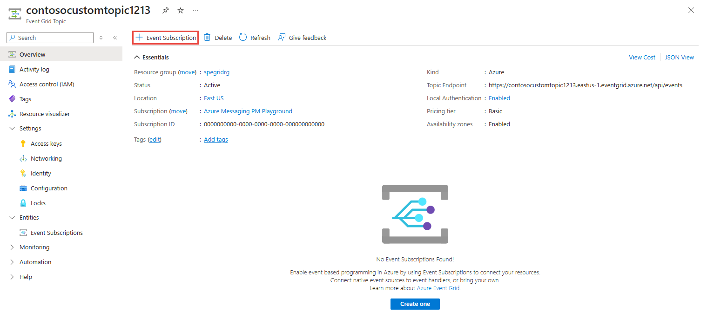

1. Select **Web Hook** for the endpoint type. Provide a name for the event subscription.

   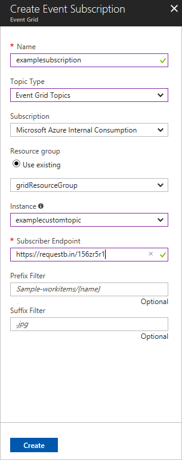

1. Select **Select an endpoint**. 

1. For the web hook endpoint, provide the URL of your web app and add `api/updates` to the home page URL. Select **Confirm Selection**.

   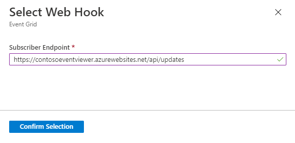

1. When finished providing the event subscription values, select **Create**.

View your web app again, and notice that a subscription validation event has been sent to it. Select the eye icon to expand the event data. Event Grid sends the validation event so the endpoint can verify that it wants to receive event data. The web app includes code to validate the subscription.

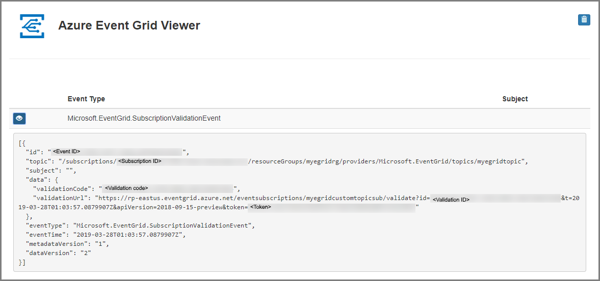

## Send an event to your topic

Now, let's trigger an event to see how Event Grid distributes the message to your endpoint. Use either Azure CLI or PowerShell to send a test event to your custom topic. Typically, an application or Azure service would send the event data.

The first example uses Azure CLI. It gets the URL and key for the custom topic, and sample event data. Use your custom topic name for `<topic_name>`. It creates sample event data. The `data` element of the JSON is the payload of your event. Any well-formed JSON can go in this field. You can also use the subject field for advanced routing and filtering. CURL is a utility that sends HTTP requests.

```azurecli-interactive
endpoint=$(az eventgrid topic show --name <topic_name> -g myResourceGroup --query "endpoint" --output tsv)
key=$(az eventgrid topic key list --name <topic_name> -g myResourceGroup --query "key1" --output tsv)

event='[ {"id": "'"$RANDOM"'", "eventType": "recordInserted", "subject": "myapp/vehicles/motorcycles", "eventTime": "'`date +%Y-%m-%dT%H:%M:%S%z`'", "data":{ "make": "Ducati", "model": "Monster"},"dataVersion": "1.0"} ]'

curl -X POST -H "aeg-sas-key: $key" -d "$event" $endpoint
```

The second example uses PowerShell to perform similar steps.

```azurepowershell-interactive
$endpoint = (Get-AzureRmEventGridTopic -ResourceGroupName gridResourceGroup -Name <topic-name>).Endpoint
$keys = Get-AzureRmEventGridTopicKey -ResourceGroupName gridResourceGroup -Name <topic-name>

$eventID = Get-Random 99999

#Date format should be SortableDateTimePattern (ISO 8601)
$eventDate = Get-Date -Format s

#Construct body using Hashtable
$htbody = @{
    id= $eventID
    eventType="recordInserted"
    subject="myapp/vehicles/motorcycles"
    eventTime= $eventDate   
    data= @{
        make="Ducati"
        model="Monster"
    }
    dataVersion="1.0"
}

#Use ConvertTo-Json to convert event body from Hashtable to JSON Object
#Append square brackets to the converted JSON payload since they are expected in the event's JSON payload syntax
$body = "["+(ConvertTo-Json $htbody)+"]"

Invoke-WebRequest -Uri $endpoint -Method POST -Body $body -Headers @{"aeg-sas-key" = $keys.Key1}
```

You've triggered the event, and Event Grid sent the message to the endpoint you configured when subscribing. View your web app to see the event you just sent.

```json
[{
  "id": "1807",
  "eventType": "recordInserted",
  "subject": "myapp/vehicles/motorcycles",
  "eventTime": "2017-08-10T21:03:07+00:00",
  "data": {
    "make": "Ducati",
    "model": "Monster"
  },
  "dataVersion": "1.0",
  "metadataVersion": "1",
  "topic": "/subscriptions/{subscription-id}/resourceGroups/{resource-group}/providers/Microsoft.EventGrid/topics/{topic}"
}]
```


## Clean up resources

If you plan to continue working with this event, don't clean up the resources created in this article. Otherwise, delete the resources you created in this article.

Select the resource group, and select **Delete resource group**.

## Next steps

Now that you know how to create custom topics and event subscriptions, learn more about what Event Grid can help you do:

- [About Event Grid](overview.md)
- [Route Blob storage events to a custom web endpoint](../storage/blobs/storage-blob-event-quickstart.md?toc=%2fazure%2fevent-grid%2ftoc.json)
- [Monitor virtual machine changes with Azure Event Grid and Logic Apps](monitor-virtual-machine-changes-event-grid-logic-app.md)
- [Stream big data into a data warehouse](event-grid-event-hubs-integration.md)
