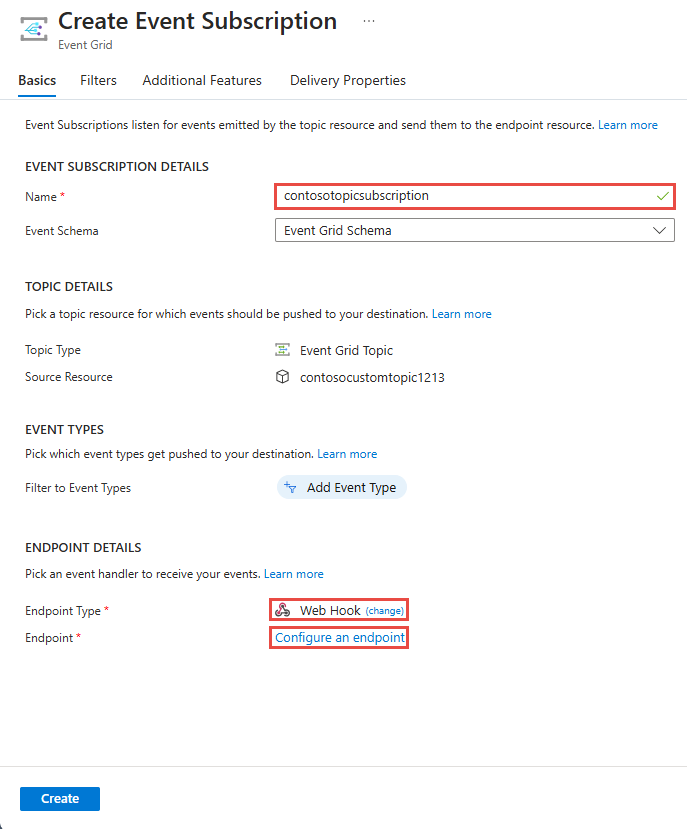

# Create and route custom events with the Azure portal and Event Grid

Azure Event Grid is an eventing service for the cloud. In this article, you use the Azure portal to create a custom topic, subscribe to the topic, and trigger the event to view the result. You send the event to an Azure Function that logs the event data. When you're finished, you see that the event data has been sent to an endpoint and logged.

[!INCLUDE [quickstarts-free-trial-note.md](../../includes/quickstarts-free-trial-note.md)]

[!INCLUDE [event-grid-register-provider-portal.md](../../includes/event-grid-register-provider-portal.md)]

## Create a custom topic

An event grid topic provides a user-defined endpoint that you post your events to. 

1. Log in to [Azure portal](https://portal.azure.com/).

1. To create a custom topic, select **Create a resource**. 

   

1. Search for *Event Grid Topic* and select it from the available options.

   

1. Select **Create**.

   

1. Provide a unique name for the custom topic. The topic name must be unique because it is represented by a DNS entry. Do not use the name shown in the image. Instead, create your own name. Provide a name for the resource group. Select **Create**.

   

1. After the custom topic has been created, you see the successful notification.

   

   If the deployment didn't succeed, find out what caused the error. Select **Deployment failed**.

   

   Select the error message.

   

   The following image shows a deployment that failed because the name for the custom topic is already in use. If you see this error, retry the deployment with a different name.

   

## Create an Azure Function

Before subscribing to the topic, let's create the endpoint for the event message. In this article, you use Azure Functions to create a function app for the endpoint.

1. To create a function, select **Create a resource**.

   

1. Select **Compute** and **Function App**.

   

1. Provide a unique name for the Azure Function. Do not use the name shown in the image. Select the resource group you created in this article. For hosting plan, use **Consumption Plan**. Use the suggested new storage account. You can turn off Application Insights. After providing the values, select **Create**.

   

1. When the deployment finishes, select **Go to resource**.

   

1. Next to **Functions**, select **+**.

   

1. From the available options, select **Custom function**.

   

1. Scroll down until you find **Event Grid trigger**. Select **C#**.

   

1. Accept the default values, and select **Create**.

   

Your function is now ready to receive events.

## Subscribe to a topic

You subscribe to a topic to tell Event Grid which events you want to track, and where to send the events.

1. In your Azure function, select **Add Event Grid Subscription**.

   

1. Provide values for the subscription. Select **Event Grid Topics** for the topic type. For subscription and resource group, select the subscription and resource group where you created your custom topic. For instance, select the name of your custom topic. The subscriber endpoint is prepopulated with the URL for the function.

   

1. Before triggering the event, open the logs for the function so you can see the event data when it is sent. At the bottom of your Azure function, select **Logs**.

   

Now, let's trigger an event to see how Event Grid distributes the message to your endpoint. To simplify this article, use Cloud Shell to send sample event data to the custom topic. Typically, an application or Azure service would send the event data.

[!INCLUDE [cloud-shell-try-it.md](../../includes/cloud-shell-try-it.md)]

## Send an event to your topic

Use either Azure CLI or PowerShell to send a test event to your custom topic.

The first example uses Azure CLI. It gets the URL and key for the topic, and sample event data. Use your topic name for `<topic_name>`. To see the full event, use `echo "$body"`. The `data` element of the JSON is the payload of your event. Any well-formed JSON can go in this field. You can also use the subject field for advanced routing and filtering. CURL is a utility that sends HTTP requests.

```azurecli-interactive
endpoint=$(az eventgrid topic show --name <topic_name> -g myResourceGroup --query "endpoint" --output tsv)
key=$(az eventgrid topic key list --name <topic_name> -g myResourceGroup --query "key1" --output tsv)

body=$(eval echo "'$(curl https://raw.githubusercontent.com/Azure/azure-docs-json-samples/master/event-grid/customevent.json)'")

curl -X POST -H "aeg-sas-key: $key" -d "$body" $endpoint
```

The second example uses PowerShell to perform similar steps.

```azurepowershell-interactive
$endpoint = (Get-AzureRmEventGridTopic -ResourceGroupName gridResourceGroup -Name <topic-name>).Endpoint
$keys = Get-AzureRmEventGridTopicKey -ResourceGroupName gridResourceGroup -Name <topic-name>

$eventID = Get-Random 99999

#Date format should be SortableDateTimePattern (ISO 8601)
$eventDate = Get-Date -Format s

#Construct body using Hashtable
$htbody = @{
    id= $eventID
    eventType="recordInserted"
    subject="myapp/vehicles/motorcycles"
    eventTime= $eventDate   
    data= @{
        make="Ducati"
        model="Monster"
    }
    dataVersion="1.0"
}

#Use ConvertTo-Json to convert event body from Hashtable to JSON Object
#Append square brackets to the converted JSON payload since they are expected in the event's JSON payload syntax
$body = "["+(ConvertTo-Json $htbody)+"]"

Invoke-WebRequest -Uri $endpoint -Method POST -Body $body -Headers @{"aeg-sas-key" = $keys.Key1}
```

You've triggered the event, and Event Grid sent the message to the endpoint you configured when subscribing. Look at the logs to see the event data.


## Clean up resources

If you plan to continue working with this event, don't clean up the resources created in this article. Otherwise, delete the resources you created in this article.

Select the resource group, and select **Delete resource group**.

## Next steps

Now that you know how to create custom topics and event subscriptions, learn more about what Event Grid can help you do:

- [About Event Grid](overview.md)
- [Route Blob storage events to a custom web endpoint](../storage/blobs/storage-blob-event-quickstart.md?toc=%2fazure%2fevent-grid%2ftoc.json)
- [Monitor virtual machine changes with Azure Event Grid and Logic Apps](monitor-virtual-machine-changes-event-grid-logic-app.md)
- [Stream big data into a data warehouse](event-grid-event-hubs-integration.md)
