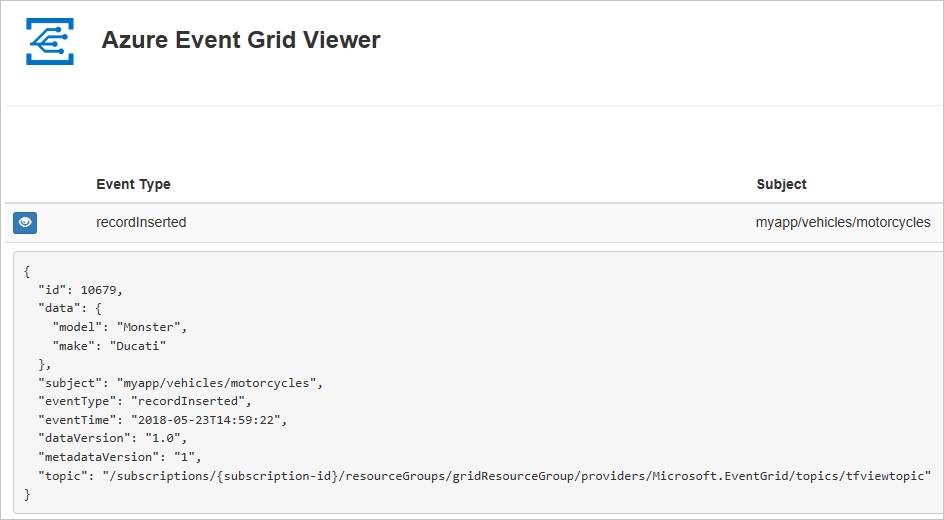

# Quickstart: Route custom events to web endpoint with Azure CLI and Event Grid

Azure Event Grid is an eventing service for the cloud. In this article, you use the Azure CLI to create a custom topic, subscribe to the custom topic, and trigger the event to view the result.

Typically, you send events to an endpoint that processes the event data and takes actions. However, to simplify this article, you send the events to a web app that collects and displays the messages.

When you're finished, you see that the event data has been sent to the web app.



[!INCLUDE [quickstarts-free-trial-note.md](../../includes/quickstarts-free-trial-note.md)]

[!INCLUDE [azure-cli-prepare-your-environment.md](../../includes/azure-cli-prepare-your-environment.md)]

- This article requires version 2.0.70 or later of the Azure CLI. If using Azure Cloud Shell, the latest version is already installed.

## Create a resource group

Event Grid topics are Azure resources, and must be placed in an Azure resource group. The resource group is a logical collection into which Azure resources are deployed and managed.

Create a resource group with the [az group create](/cli/azure/group#az_group_create) command. 

The following example creates a resource group named *gridResourceGroup* in the *westus2* location.

```azurecli-interactive
az group create --name gridResourceGroup --location westus2
```

[!INCLUDE [event-grid-register-provider-cli.md](../../includes/event-grid-register-provider-cli.md)]

## Create a custom topic

An event grid topic provides a user-defined endpoint that you post your events to. The following example creates the custom topic in your resource group. Replace `<your-topic-name>` with a unique name for your topic. The custom topic name must be unique because it's part of the DNS entry. Additionally, it must be between 3-50 characters and contain only values a-z, A-Z, 0-9, and "-"

```azurecli-interactive
topicname=<your-topic-name>

az eventgrid topic create --name $topicname -l westus2 -g gridResourceGroup
```

## Create a message endpoint

Before subscribing to the custom topic, let's create the endpoint for the event message. Typically, the endpoint takes actions based on the event data. To simplify this quickstart, you deploy a [pre-built web app](https://github.com/Azure-Samples/azure-event-grid-viewer) that displays the event messages. The deployed solution includes an App Service plan, an App Service web app, and source code from GitHub.

Replace `<your-site-name>` with a unique name for your web app. The web app name must be unique because it's part of the DNS entry.

```azurecli-interactive
sitename=<your-site-name>

az deployment group create \
  --resource-group gridResourceGroup \
  --template-uri "https://raw.githubusercontent.com/Azure-Samples/azure-event-grid-viewer/master/azuredeploy.json" \
  --parameters siteName=$sitename hostingPlanName=viewerhost
```

The deployment may take a few minutes to complete. After the deployment has succeeded, view your web app to make sure it's running. In a web browser, navigate to: 
`https://<your-site-name>.azurewebsites.net`

You should see the site with no messages currently displayed.

## Subscribe to a custom topic

You subscribe to an event grid topic to tell Event Grid which events you want to track and where to send those events. The following example subscribes to the custom topic you created, and passes the URL from your web app as the endpoint for event notification.

The endpoint for your web app must include the suffix `/api/updates/`.

```azurecli-interactive
endpoint=https://$sitename.azurewebsites.net/api/updates

az eventgrid event-subscription create \
  --source-resource-id "/subscriptions/{subscription-id}/resourceGroups/{resource-group}/providers/Microsoft.EventGrid/topics/$topicname" \
  --name demoViewerSub \
  --endpoint $endpoint
  
```

View your web app again, and notice that a subscription validation event has been sent to it. Select the eye icon to expand the event data. Event Grid sends the validation event so the endpoint can verify that it wants to receive event data. The web app includes code to validate the subscription.


## Send an event to your custom topic

Let's trigger an event to see how Event Grid distributes the message to your endpoint. First, let's get the URL and key for the custom topic.

```azurecli-interactive
endpoint=$(az eventgrid topic show --name $topicname -g gridResourceGroup --query "endpoint" --output tsv)
key=$(az eventgrid topic key list --name $topicname -g gridResourceGroup --query "key1" --output tsv)
```

To simplify this article, you use sample event data to send to the custom topic. Typically, an application or Azure service would send the event data. The following example creates sample event data:

```azurecli-interactive
event='[ {"id": "'"$RANDOM"'", "eventType": "recordInserted", "subject": "myapp/vehicles/motorcycles", "eventTime": "'`date +%Y-%m-%dT%H:%M:%S%z`'", "data":{ "make": "Ducati", "model": "Monster"},"dataVersion": "1.0"} ]'
```

The `data` element of the JSON is the payload of your event. Any well-formed JSON can go in this field. You can also use the subject field for advanced routing and filtering.

CURL is a utility that sends HTTP requests. In this article, use CURL to send the event to the topic. 

```azurecli-interactive
curl -X POST -H "aeg-sas-key: $key" -d "$event" $endpoint
```

You've triggered the event, and Event Grid sent the message to the endpoint you configured when subscribing. View your web app to see the event you just sent.

```json
[{
  "id": "1807",
  "eventType": "recordInserted",
  "subject": "myapp/vehicles/motorcycles",
  "eventTime": "2017-08-10T21:03:07+00:00",
  "data": {
    "make": "Ducati",
    "model": "Monster"
  },
  "dataVersion": "1.0",
  "metadataVersion": "1",
  "topic": "/subscriptions/{subscription-id}/resourceGroups/{resource-group}/providers/Microsoft.EventGrid/topics/{topic}"
}]
```

## Clean up resources
If you plan to continue working with this event or the event viewer app, don't clean up the resources created in this article. Otherwise, use the following command to delete the resources you created in this article.

```azurecli-interactive
az group delete --name gridResourceGroup
```

## Next steps

Now that you know how to create topics and event subscriptions, learn more about what Event Grid can help you do:

- [About Event Grid](overview.md)
- [Route Blob storage events to a custom web endpoint](../storage/blobs/storage-blob-event-quickstart.md?toc=%2fazure%2fevent-grid%2ftoc.json)
- [Monitor virtual machine changes with Azure Event Grid and Logic Apps](monitor-virtual-machine-changes-event-grid-logic-app.md)
- [Stream big data into a data warehouse](event-grid-event-hubs-integration.md)
