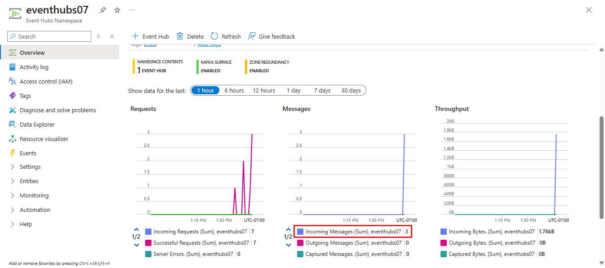

# Quickstart: Route custom events to Azure Event Hubs with Azure CLI and Event Grid

Azure Event Grid is an eventing service for the cloud. Azure Event Hubs is one of the supported event handlers. In this article, you use the Azure CLI to create a custom topic, subscribe to the custom topic, and trigger the event to view the result. You send the events to an event hub.

[!INCLUDE [quickstarts-free-trial-note.md](../../includes/quickstarts-free-trial-note.md)]

## Create a resource group

Event Grid topics are Azure resources, and must be placed in an Azure resource group. The resource group is a logical collection into which Azure resources are deployed and managed.

Create a resource group with the [az group create](/cli/azure/group#az-group-create) command. 

The following example creates a resource group named *gridResourceGroup* in the *westus2* location.

```azurecli-interactive
az group create --name gridResourceGroup --location westus2
```

[!INCLUDE [event-grid-register-provider-cli.md](../../includes/event-grid-register-provider-cli.md)]

## Create a Custom Topic

An event grid topic provides a user-defined endpoint that you post your events to. The following example creates the custom topic in your resource group. Replace `<your-topic-name>` with a unique name for your custom topic. The custom topic name must be unique because it's represented by a DNS entry.

```azurecli-interactive
topicname=<your-topic-name>
az eventgrid topic create --name $topicname -l westus2 -g gridResourceGroup
```

## Create event hub

Before subscribing to the custom topic, let's create the endpoint for the event message. You create an event hub for collecting the events.

```azurecli-interactive
namespace=<unique-namespace-name>
hubname=demohub

az eventhubs namespace create --name $namespace --resource-group gridResourceGroup
az eventhubs eventhub create --name $hubname --namespace-name $namespace --resource-group gridResourceGroup
```

## Subscribe to a custom topic

You subscribe to an event grid topic to tell Event Grid which events you want to track. The following example subscribes to the custom topic you created, and passes the resource ID of the event hub for the endpoint. The endpoint is in the format:

`/subscriptions/<subscription-id>/resourceGroups/<resource-group-name>/providers/Microsoft.EventHub/namespaces/<namespace-name>/eventhubs/<hub-name>`

The following script gets the resource ID for the event hub, and subscribes to an event grid topic. It sets the endpoint type to `eventhub` and uses the event hub ID for the endpoint.

```azurecli-interactive
hubid=$(az eventhubs eventhub show --name $hubname --namespace-name $namespace --resource-group gridResourceGroup --query id --output tsv)

az eventgrid event-subscription create \
  --topic-name $topicname \
  -g gridResourceGroup \
  --name subtoeventhub \
  --endpoint-type eventhub \
  --endpoint $hubid
```

The account that creates the event subscription must have write access to the event hub.

## Send an event to your custom topic

Let's trigger an event to see how Event Grid distributes the message to your endpoint. First, let's get the URL and key for the custom topic.

```azurecli-interactive
endpoint=$(az eventgrid topic show --name $topicname -g gridResourceGroup --query "endpoint" --output tsv)
key=$(az eventgrid topic key list --name $topicname -g gridResourceGroup --query "key1" --output tsv)
```

To simplify this article, you use sample event data to send to the custom topic. Typically, an application or Azure service would send the event data. CURL is a utility that sends HTTP requests. In this article, use CURL to send the event to the custom topic.  The following example sends three events to the event grid topic:

```azurecli-interactive
for i in 1 2 3
do
   event='[ {"id": "'"$RANDOM"'", "eventType": "recordInserted", "subject": "myapp/vehicles/motorcycles", "eventTime": "'`date +%Y-%m-%dT%H:%M:%S%z`'", "data":{ "make": "Ducati", "model": "Monster"},"dataVersion": "1.0"} ]'
   curl -X POST -H "aeg-sas-key: $key" -d "$event" $endpoint
done
```

Navigate to the event hub in the portal, and notice that Event Grid sent those three events to the event hub.



Typically, you create an application that retrieves the events from the event hub. To create an application that gets messages from an event hub, see:

* [Get started receiving messages with the Event Processor Host in .NET Standard](../event-hubs/event-hubs-dotnet-standard-getstarted-receive-eph.md)
* [Receive events from Azure Event Hubs using Java](../event-hubs/event-hubs-java-get-started-receive-eph.md)
* [Receive events from Event Hubs using Apache Storm](../event-hubs/event-hubs-storm-getstarted-receive.md)

## Clean up resources
If you plan to continue working with this event, don't clean up the resources created in this article. Otherwise, use the following command to delete the resources you created in this article.

```azurecli-interactive
az group delete --name gridResourceGroup
```

## Next steps

Now that you know how to create topics and event subscriptions, learn more about what Event Grid can help you do:

- [About Event Grid](overview.md)
- [Route Blob storage events to a custom web endpoint](../storage/blobs/storage-blob-event-quickstart.md?toc=%2fazure%2fevent-grid%2ftoc.json)
- [Monitor virtual machine changes with Azure Event Grid and Logic Apps](monitor-virtual-machine-changes-event-grid-logic-app.md)
- [Stream big data into a data warehouse](event-grid-event-hubs-integration.md)
