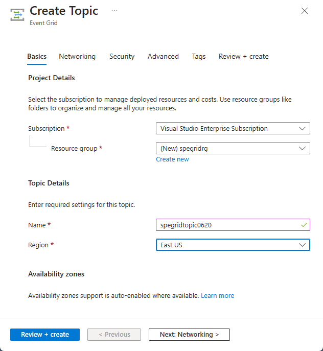
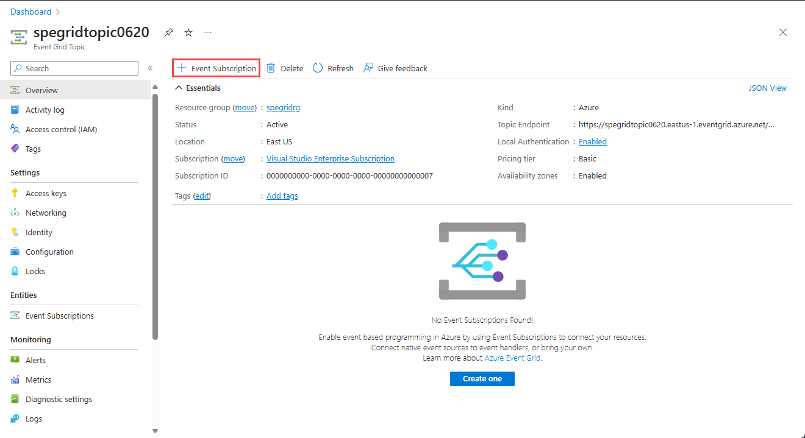
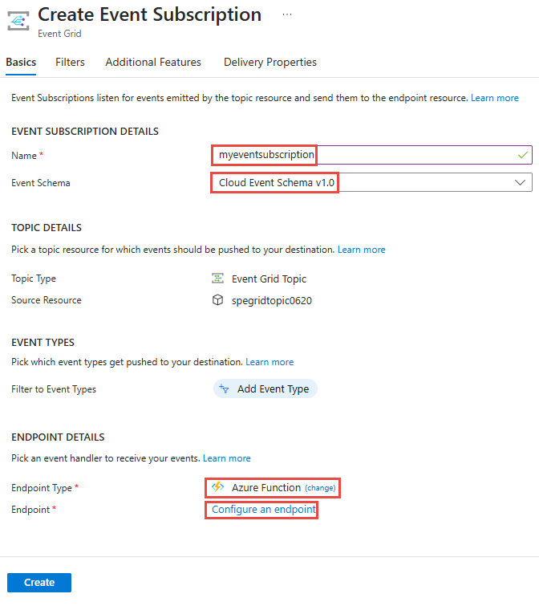
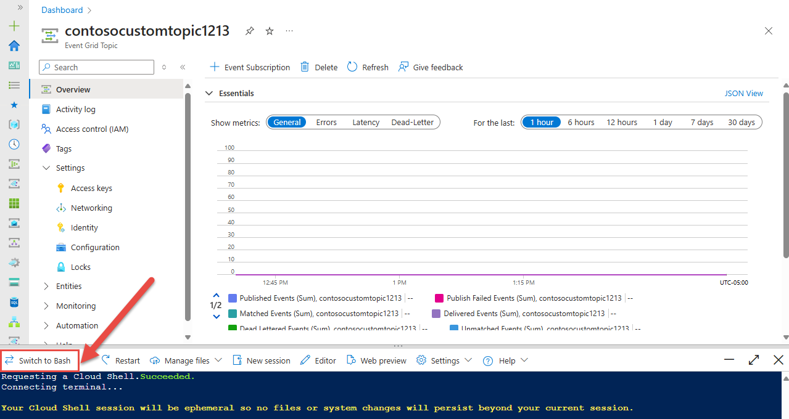

# Quickstart: Route custom events to an Azure Function with Event Grid

Azure Event Grid is an eventing service for the cloud. Azure Functions is one of the supported event handlers. In this article, you use the Azure portal to create a custom topic, subscribe to the custom topic, and trigger the event to view the result. You send the events to an Azure Function.

[!INCLUDE [quickstarts-free-trial-note.md](../../includes/quickstarts-free-trial-note.md)]

## Create Azure Function

Before subscribing to the custom topic, let's create a function to handle the events. In the Azure portal, click 'Create a resource' and type 'function' then choose 'Function App' and click create. Select 'Create new' under resource group and give it a name. You'll use this for the rest of the tutorial. Give the Function App a name, leave the 'Publish' toggle on 'Code', select any runtime and region, then hit create.

Once your Function App is ready, navigate to it and click '+ New Function'. Select 'In-portal' for development environment and hit continue. Under create a function, choose 'More templates' to view more templates and then search for 'Azure Event Grid Trigger' and select it. If this is your first time using this trigger, you may have to click 'Install' to install the extension.


Once you've installed the extension, click continue, give your function a name, and then hit create.

[!INCLUDE [event-grid-register-provider-portal.md](../../includes/event-grid-register-provider-portal.md)]

## Create a custom topic

An event grid topic provides a user-defined endpoint that you post your events to. 

1. Sign in to [Azure portal](https://portal.azure.com/).
2. Select **All services** on the left navigational menu, search for **Event Grid**, and select **Event Grid Topics**. 

    
3. On the **Event Grid Topics** page, select **+ Add** on the toolbar. 

    

4. On the **Create Topic** page, follow these steps:

    1. Provide a unique **name** for the custom topic. The topic name must be unique because it's represented by a DNS entry. Don't use the name shown in the image. Instead, create your own name - it must be between 3-50 characters and contain only values a-z, A-Z, 0-9, and "-".
    2. Select your Azure **subscription**.
    3. Select the same resource group from the previous steps.
    4. Select a **location** for the event grid topic.
    5. Keep the default value **Event Grid Schema** for the **Event Schema** field. 

       
    6. Select **Create**. 

5. After the custom topic has been created, you see the successful notification. Select **Go to resource group**. 

   

6. On the **Resource Group** page, select the event grid topic. 

   

7. You see the **Event Grid Topic** page for your event grid. Keep this page open. You use it later in the quickstart. 

    

## Subscribe to custom topic

You subscribe to an event grid topic to tell Event Grid which events you want to track, and where to send the events.

1. Now, on the **Event Grid Topic** page for your custom topic, select **+ Event Subscription** on the toolbar.

   

2. On the **Create Event Subscription** page, follow these steps:
    1. Enter a **name** for the event subscription.
    3. Select **Azure Function** for the **Endpoint type**. 
    4. Choose **Select an endpoint**. 

       

    5. For the function endpoint, select the Azure Subscription and Resource Group your Function App is in and then select the Function App and function you created earlier. Select **Confirm Selection**.

       

    6. Back on the **Create Event Subscription** page, select **Create**.

## Send an event to your topic

Now, let's trigger an event to see how Event Grid distributes the message to your endpoint. Use either Azure CLI or PowerShell to send a test event to your custom topic. Typically, an application or Azure service would send the event data.

The first example uses Azure CLI. It gets the URL and key for the custom topic, and sample event data. Use your custom topic name for `<topic name>`. It creates sample event data. The `data` element of the JSON is the payload of your event. Any well-formed JSON can go in this field. You can also use the subject field for advanced routing and filtering. CURL is a utility that sends HTTP requests.


### Azure CLI
1. In the Azure portal, select **Cloud Shell**. Select **Bash** in the top-left corner of the Cloud Shell window. 

    
1. Run the following command to get the **endpoint** for the topic: After you copy and paste the command, update the **topic name** and **resource group name** before you run the command. 

    ```azurecli
    endpoint=$(az eventgrid topic show --name <topic name> -g <resource group name> --query "endpoint" --output tsv)
    ```
2. Run the following command to get the **key** for the custom topic: After you copy and paste the command, update the **topic name** and **resource group** name before you run the command. 

    ```azurecli
    key=$(az eventgrid topic key list --name <topic name> -g <resource group name> --query "key1" --output tsv)
    ```
3. Copy the following statement with the event definition, and press **ENTER**. 

    ```json
    event='[ {"id": "'"$RANDOM"'", "eventType": "recordInserted", "subject": "myapp/vehicles/motorcycles", "eventTime": "'`date +%Y-%m-%dT%H:%M:%S%z`'", "data":{ "make": "Ducati", "model": "Monster"},"dataVersion": "1.0"} ]'
    ```
4. Run the following **Curl** command to post the event:

    ```
    curl -X POST -H "aeg-sas-key: $key" -d "$event" $endpoint
    ```

### Azure PowerShell
The second example uses PowerShell to perform similar steps.

1. In the Azure portal, select **Cloud Shell** (alternatively go to `https://shell.azure.com/`). Select **PowerShell** in the top-left corner of the Cloud Shell window. See the sample **Cloud Shell** window image in the Azure CLI section.
2. Set the following variables. After you copy and paste each command, update the **topic name** and **resource group name** before you run the command:

    ```powershell
    $resourceGroupName = <resource group name>
    $topicName = <topic name>
    ```
3. Run the following commands to get the **endpoint** and the **keys** for the topic:

    ```powershell
    $endpoint = (Get-AzEventGridTopic -ResourceGroupName $resourceGroupName -Name $topicName).Endpoint
    $keys = Get-AzEventGridTopicKey -ResourceGroupName $resourceGroupName -Name $topicName
    ```
4. Prepare the event. Copy and run the statements in the Cloud Shell window. 

    ```powershell
    $eventID = Get-Random 99999

    #Date format should be SortableDateTimePattern (ISO 8601)
    $eventDate = Get-Date -Format s

    #Construct body using Hashtable
    $htbody = @{
        id= $eventID
        eventType="recordInserted"
        subject="myapp/vehicles/motorcycles"
        eventTime= $eventDate   
        data= @{
            make="Ducati"
            model="Monster"
        }
        dataVersion="1.0"
    }
    
    #Use ConvertTo-Json to convert event body from Hashtable to JSON Object
    #Append square brackets to the converted JSON payload since they are expected in the event's JSON payload syntax
    $body = "["+(ConvertTo-Json $htbody)+"]"
    ```
5. Use the **Invoke-WebRequest** cmdlet to send the event. 

    ```powershell
    Invoke-WebRequest -Uri $endpoint -Method POST -Body $body -Headers @{"aeg-sas-key" = $keys.Key1}
    ```

### Verify in the Event Grid Viewer
You've triggered the event, and Event Grid sent the message to the endpoint you configured when subscribing. Navigate to your Event Grid triggered function and open the logs. You should see a copy of the data payload of the event in the logs. If you don't make sure you open the logs window first, or hit reconnect, and then try sending a test event again.


## Clean up resources
If you plan to continue working with this event, don't clean up the resources created in this article. Otherwise, delete the resources you created in this article.

1. Select **Resource Groups** on the left menu. If you don't see it on the left menu, select **All Services** on the left menu, and select **Resource Groups**. 
2. Select the resource group to launch the **Resource Group** page. 
3. Select **Delete resource group** on the toolbar. 
4. Confirm deletion by entering the name of the resource group, and select **Delete**. 

    

    The other resource group you see in the image was created and used by the Cloud Shell window. Delete it if you don't plan to use the Cloud Shell window later. 

## Next steps

Now that you know how to create topics and event subscriptions, learn more about what Event Grid can help you do:

- [About Event Grid](overview.md)
- [Route Blob storage events to a custom web endpoint](../storage/blobs/storage-blob-event-quickstart.md?toc=%2fazure%2fevent-grid%2ftoc.json)
- [Monitor virtual machine changes with Azure Event Grid and Logic Apps](monitor-virtual-machine-changes-event-grid-logic-app.md)
- [Stream big data into a data warehouse](event-grid-event-hubs-integration.md)
