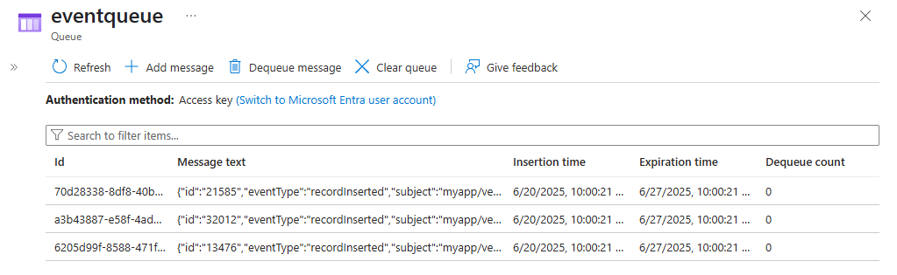

# Quickstart: Route custom events to Azure Queue storage with Azure CLI and Event Grid

Azure Event Grid is an eventing service for the cloud. Azure Queue storage is one of the supported event handlers. In this article, you use the Azure CLI to create a custom topic, subscribe to the custom topic, and trigger the event to view the result. You send the events to the Queue storage.

[!INCLUDE [quickstarts-free-trial-note.md](../../includes/quickstarts-free-trial-note.md)]

[!INCLUDE [azure-cli-prepare-your-environment.md](../../includes/azure-cli-prepare-your-environment.md)]

- This article requires version 2.0.56 or later of the Azure CLI. If using Azure Cloud Shell, the latest version is already installed.

- If you are using Azure PowerShell on your local machine instead of using Cloud Shell in the Azure portal, ensure that you have Azure PowerShell version 1.1.0 or greater. Download the latest version of Azure PowerShell on your Windows machine from [Azure downloads - Command-line tools](https://azure.microsoft.com/downloads/). 

This article gives you commands for using Azure CLI. 

## Create a resource group

Event Grid topics are Azure resources, and must be placed in an Azure resource group. The resource group is a logical collection into which Azure resources are deployed and managed.

Create a resource group with the [az group create](/cli/azure/group#az_group_create) command. 

The following example creates a resource group named *gridResourceGroup* in the *westus2* location.

```azurecli-interactive
az group create --name gridResourceGroup --location westus2
```

[!INCLUDE [event-grid-register-provider-cli.md](../../includes/event-grid-register-provider-cli.md)]

## Create a custom topic

An event grid topic provides a user-defined endpoint that you post your events to. The following example creates the custom topic in your resource group. Replace `<topic_name>` with a unique name for your custom topic. The event grid topic name must be unique because it's represented by a DNS entry.

```azurecli-interactive
az eventgrid topic create --name <topic_name> -l westus2 -g gridResourceGroup
```

## Create Queue storage

Before subscribing to the custom topic, let's create the endpoint for the event message. You create a Queue storage for collecting the events.

```azurecli-interactive
storagename="<unique-storage-name>"
queuename="eventqueue"

az storage account create -n $storagename -g gridResourceGroup -l westus2 --sku Standard_LRS
az storage queue create --name $queuename --account-name $storagename
```

## Subscribe to a custom topic

You subscribe to a custom topic to tell Event Grid which events you want to track. The following example subscribes to the custom topic you created, and passes the resource ID of the Queue storage for the endpoint. With Azure CLI, you pass the Queue storage ID as the endpoint. The endpoint is in the format:

`/subscriptions/<subscription-id>/resourcegroups/<resource-group-name>/providers/Microsoft.Storage/storageAccounts/<storage-name>/queueservices/default/queues/<queue-name>`

The following script gets the resource ID of the storage account for the queue. It constructs the ID for the queue storage, and subscribes to an event grid topic. It sets the endpoint type to `storagequeue` and uses the queue ID for the endpoint.

```azurecli-interactive
storageid=$(az storage account show --name $storagename --resource-group gridResourceGroup --query id --output tsv)
queueid="$storageid/queueservices/default/queues/$queuename"
topicid=$(az eventgrid topic show --name <topic_name> -g gridResourceGroup --query id --output tsv)

az eventgrid event-subscription create \
  --source-resource-id $topicid \
  --name <event_subscription_name> \
  --endpoint-type storagequeue \
  --endpoint $queueid \
  --expiration-date "<yyyy-mm-dd>"
```

The account that creates the event subscription must have write access to the queue storage. Notice that an [expiration date](concepts.md#event-subscription-expiration) is set for the subscription.

If you use the REST API to create the subscription, you pass the ID of the storage account and the name of the queue as a separate parameter.

```json
"destination": {
  "endpointType": "storagequeue",
  "properties": {
    "queueName":"eventqueue",
    "resourceId": "/subscriptions/<subscription-id>/resourcegroups/<resource-group-name>/providers/Microsoft.Storage/storageAccounts/<storage-name>"
  }
  ...
```

## Send an event to your custom topic

Let's trigger an event to see how Event Grid distributes the message to your endpoint. First, let's get the URL and key for the custom topic. Again, use your custom topic name for `<topic_name>`.

```azurecli-interactive
endpoint=$(az eventgrid topic show --name <topic_name> -g gridResourceGroup --query "endpoint" --output tsv)
key=$(az eventgrid topic key list --name <topic_name> -g gridResourceGroup --query "key1" --output tsv)
```

To simplify this article, you use sample event data to send to the custom topic. Typically, an application or Azure service would send the event data. CURL is a utility that sends HTTP requests. In this article, use CURL to send the event to the custom topic.  The following example sends three events to the event grid topic:

```azurecli-interactive
for i in 1 2 3
do
   event='[ {"id": "'"$RANDOM"'", "eventType": "recordInserted", "subject": "myapp/vehicles/motorcycles", "eventTime": "'`date +%Y-%m-%dT%H:%M:%S%z`'", "data":{ "make": "Ducati", "model": "Monster"},"dataVersion": "1.0"} ]'
   curl -X POST -H "aeg-sas-key: $key" -d "$event" $endpoint
done
```

Navigate to the Queue storage in the portal, and notice that Event Grid sent those three events to the queue.



> [!NOTE]
> If you use an [Azure Queue storage trigger for Azure Functions](../azure-functions/functions-bindings-storage-queue-trigger.md) for a queue that receives messages from Event Grid, you may see the following error message on the function execution: `The input is not a valid Base-64 string as it contains a non-base 64 character, more than two padding characters, or an illegal character among the padding characters.`
> 
> The reason is that when you use an [Azure Queue storage trigger](../azure-functions/functions-bindings-storage-queue-trigger.md), Azure Functions expect a **base64 encoded string**, but Event Grid sends messages to a storage queue in a plain text format. Currently, it's not possible to configure the queue trigger for Azure Functions to accept plain text. 


## Clean up resources
If you plan to continue working with this event, don't clean up the resources created in this article. Otherwise, use the following command to delete the resources you created in this article.

```azurecli-interactive
az group delete --name gridResourceGroup
```

## Next steps

Now that you know how to create topics and event subscriptions, learn more about what Event Grid can help you do:

- [About Event Grid](overview.md)
- [Route Blob storage events to a custom web endpoint](../storage/blobs/storage-blob-event-quickstart.md?toc=%2fazure%2fevent-grid%2ftoc.json)
- [Monitor virtual machine changes with Azure Event Grid and Logic Apps](monitor-virtual-machine-changes-event-grid-logic-app.md)
- [Stream big data into a data warehouse](event-grid-event-hubs-integration.md)

See the following samples to learn about publishing events to and consuming events from Event Grid using different programming languages. 

- [Azure Event Grid samples for .NET](/samples/azure/azure-sdk-for-net/azure-event-grid-sdk-samples/)
- [Azure Event Grid samples for Java](/samples/azure/azure-sdk-for-java/eventgrid-samples/)
- [Azure Event Grid samples for Python](/samples/azure/azure-sdk-for-python/eventgrid-samples/)
- [Azure Event Grid samples for JavaScript](/samples/azure/azure-sdk-for-js/eventgrid-javascript/)
- [Azure Event Grid samples for TypeScript](/samples/azure/azure-sdk-for-js/eventgrid-typescript/)
