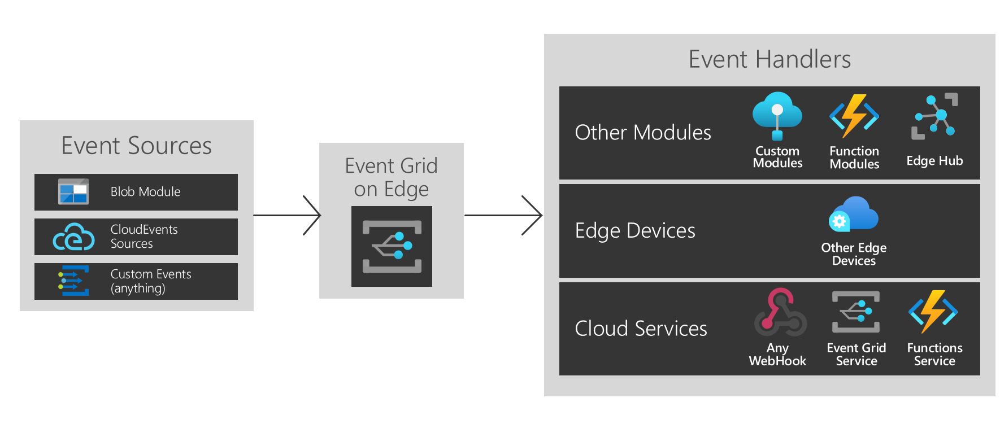

# What is Azure Event Grid on Azure IoT Edge?
Event Grid on IoT Edge brings the power and flexibility of Azure Event Grid to the edge. Create topics, publish events, and subscribe multiple destinations whether they're modules on the same device, other edge devices, or services in the cloud.

As in the cloud, the Event Grid on IoT Edge module handles routing, filtering, and reliable delivery of events at scale. Filter events to ensure that only relevant events are sent to different event handlers using advanced string, numerical, and boolean filters. Retry logic makes sure that the event reaches the target destination even if it's not available at the time of publish. It allows you to use Event Grid on IoT Edge as a powerful store and forward mechanism.

Event Grid on IoT Edge supports both CloudEvents v1.0 and custom event schemas. It also supports the same Pub/Sub semantics as Event Grid in the cloud for easy interoperability.

This article provides an overview of Azure Event Grid on IoT Edge. For step-by-step instructions to use this module on edge, see [Publish, subscribe to events locally](pub-sub-events-webhook-local.md). 

This image shows some of the ways you can use Event Grid on IoT Edge, and isn't a comprehensive list of supported functionality.

## When to use Event Grid on IoT Edge

Event Grid on IoT Edge provides an easy to use, reliable eventing model for between the edge and the cloud.

Event Grid on IoT Edge is built with a symmetrical runtime surface area to the Azure cloud service, so you can use the same events and API calls wherever you need. Whether you do pub/sub in the cloud, on the edge, or between the two, Event Grid on IoT Edge can now be your one go-to solution.

Use Event Grid on IoT Edge to trigger simple workflows between modules. For example, create a topic and publish "storage blob created" events from your storage module to the topic. You can now subscribe one or several functions or custom modules to that topics.

Extend your functionality between edge devices. If you're publishing blob module events and want to use the computational power of multiple near by edge devices, create cross-device subscriptions.

Finally, connect to the cloud. If your blob module events are to be periodically synced to the cloud, use the greater compute available on the cloud, or send processed data up, create additional cloud service subscriptions.

Event Grid on IoT Edge provides a flexible and reliable decoupled eventing architecture.

## Event sources

Much like in the cloud, Event Grid on IoT Edge allows direct integration between modules to build event driven architectures. Currently, the events can be sent to Event Grid on IoT Edge from:

* Azure Blob Storage on IoT Edge
* CloudEvents sources
* Custom modules & containers via HTTP POST

## Event handlers

Event Grid on IoT Edge is built to send events to anywhere you want. Currently, the following destinations are supported:

* Other modules including IoT Hub, functions, and custom modules
* Other edge devices
* WebHooks
* Azure Event Grid cloud service
* Event Hubs
* Service Bus Queues
* Service Bus Topics
* Storage Queues

## Supported environments
Currently, Windows 64-bit, Linux 64-bit, and ARM 32-bit environments are supported.

## Concepts

There are five concepts in Azure Event Grid that let you get started:

* **Events** — What happened.
* **Event sources** — Where the event took place.
* **Topics** — The endpoint where publishers send events.
* **Event subscriptions** — The endpoint or built-in mechanism to route events, sometimes to more than one handler. Subscriptions are also used by handlers to intelligently filter incoming events.
* **Event handlers** — The app or service that reacts to the event.

## Cost

Event Grid on IoT Edge is free during public preview.

## Issues
Report any issues with using Event Grid on IoT Edge at [https://github.com/Azure/event-grid-iot-edge/issues](https://github.com/Azure/event-grid-iot-edge/issues).

## Next steps

* [Publish, subscribe to events locally](pub-sub-events-webhook-local.md)
* [Publish, subscribe to events in cloud](pub-sub-events-webhook-cloud.md)
* [Forward events to Event Grid cloud](forward-events-event-grid-cloud.md)
* [Forward events to IoTHub](forward-events-iothub.md)
* [React to Blob Storage events locally](react-blob-storage-events-locally.md)