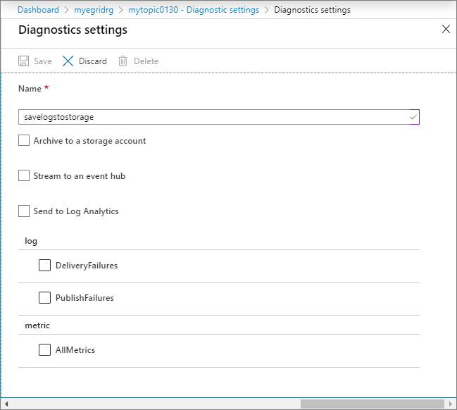

#  Diagnostic logs for an Azure event grid topic
Diagnostic settings allow Event Grid users to capture and view publish and delivery failure Logs in one of the following places: an Azure storage account, an event hub, or a Log Analytics workspace. This article provides step-by-step instructions to enable diagnostic logs for an event grid topic.

## Prerequisites

- A provisioned event grid topic
- A provisioned destination for capturing diagnostic logs. It can one of the following destinations:
    - Azure storage account
    - Event hub
    - Log Analytics workspace

## Steps for enabling diagnostic logs for a topic

1. Sign in to the [Azure portal](https://portal.azure.com).
2. Navigate to the event grid topic for which you want to enable diagnostic log settings. 
3. Select **Diagnostic settings** under **Monitoring** in the left menu.
4. On the **Diagnostic settings** page, select **Add New Diagnostic Setting**. 
    
    
5. Specify a **name** for the diagnostic setting. 

    	 
6. Enable one or more of the capture destinations for the logs, and then configure them by selecting a previous created capture resource. 
    - If you select **Archive to a storage account**, select **Storage account - Configure**, and then select the storage account in your Azure subscription. 

        
    - If you select **Stream to an event hub**, select **Event hub - Configure**, and then select the Event Hubs namespace, event hub, and the access policy. 
        
    - If you select **Send to Log Analytics**, select the Log Analytics workspace.
        
7. Select the **DeliveryFailures** and **PublishFailures** options in the **Log** section. 
    
8. Select **Save**. Select **X** in the right-corner to close the page. 
9. Now, back on the **Diagnostic settings** page, confirm that you see a new entry in the **Diagnostics Settings** table. 
    

	 You can also enable collection of all metrics for the topic. 

## Next steps
If you need more help, post your issue in the [Stack Overflow forum](https://stackoverflow.com/questions/tagged/azure-eventgrid) or open a [support ticket](https://azure.microsoft.com/support/options/). 
