#  Enable Diagnostic logs for Azure event grid topics or domains
Diagnostic settings allow Event Grid users to capture and view **publish and delivery failure** Logs in either a Storage account, an event hub, or a Log Analytics Workspace. This article provides step-by-step instructions to enable these settings on an Event Grid Topic.

## Prerequisites

- A provisioned event grid topic
- A provisioned destination for capturing diagnostic logs. It can one of the following destinations in the same location as the event grid topic:
    - Azure storage account
    - Event hub
    - Log Analytics workspace

## Enable diagnostic logs for a custom topic

> [!NOTE]
> The following procedure provides step-by-step instructions for enabling diagnostic logs for a topic. Steps for enabling diagnostic logs for a domain are very similar. In step 2, navigate to the event grid **domain** in the Azure portal.  

1. Sign in to the [Azure portal](https://portal.azure.com).
2. Navigate to the event grid topic for which you want to enable diagnostic log settings. 
    1. In the search bar at the top, search for **Event Grid Topics**. 
    
        
    1. Select the **topic** from the list for which you want to configure diagnostic settings. 
1. Select **Diagnostic settings** under **Monitoring** in the left menu.
1. On the **Diagnostic settings** page, select **Add New Diagnostic Setting**. 
    
    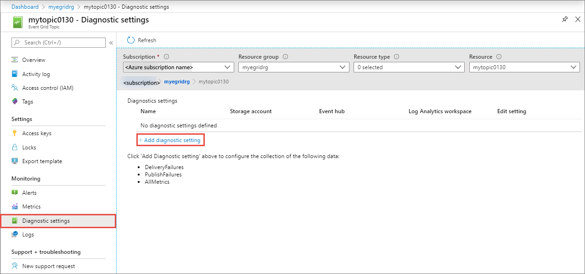
5. Specify a **name** for the diagnostic setting. 
7. Select the **DeliveryFailures** and **PublishFailures** options in the **Log** section. 
    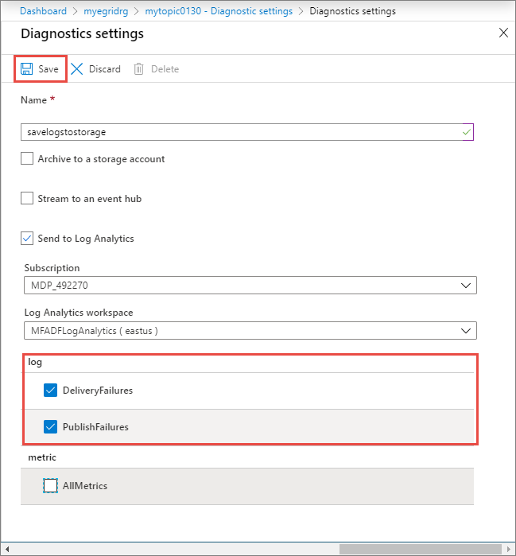
6. Enable one or more of the capture destinations for the logs, and then configure them by selecting a previous created capture resource. 
    - If you select **Archive to a storage account**, select **Storage account - Configure**, and then select the storage account in your Azure subscription. 

        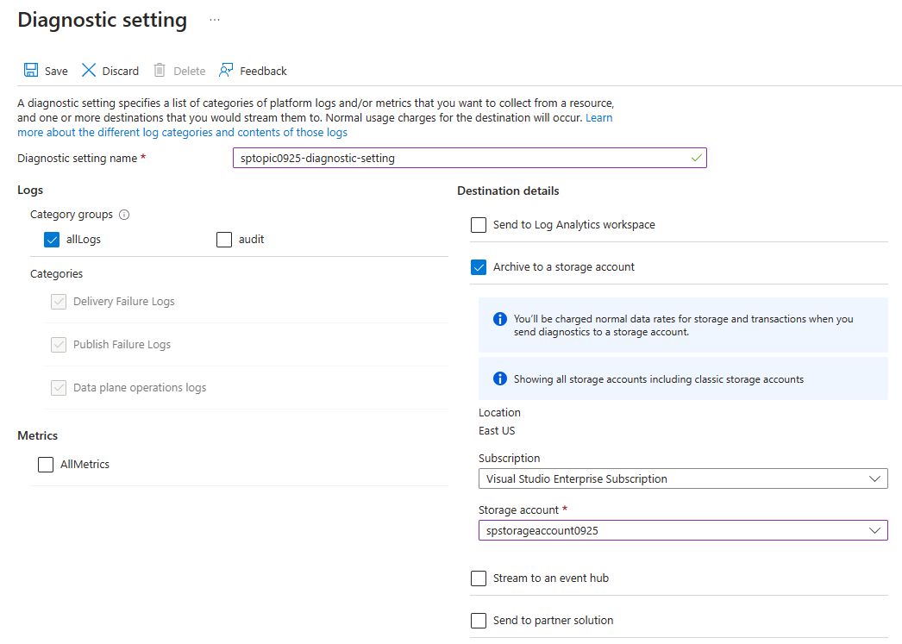
    - If you select **Stream to an event hub**, select **Event hub - Configure**, and then select the Event Hubs namespace, event hub, and the access policy. 
        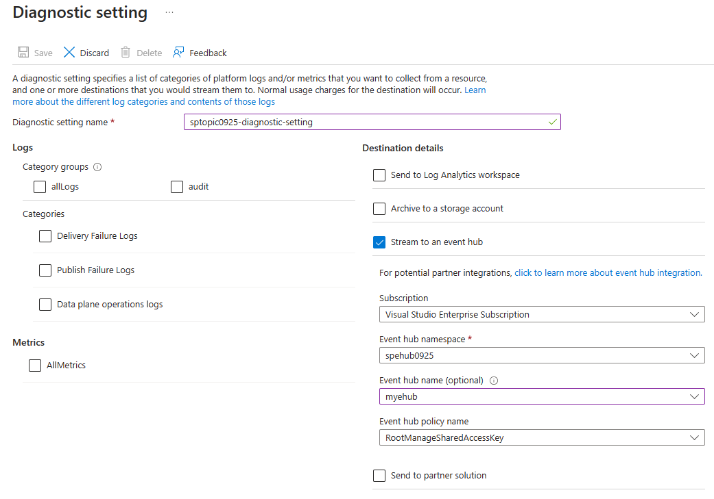
    - If you select **Send to Log Analytics**, select the Log Analytics workspace.
        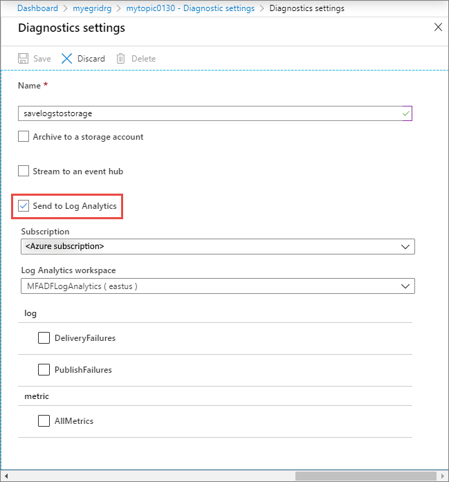
8. Select **Save**. Then, select **X** in the right-corner to close the page. 
9. Now, back on the **Diagnostic settings** page, confirm that you see a new entry in the **Diagnostics Settings** table. 
    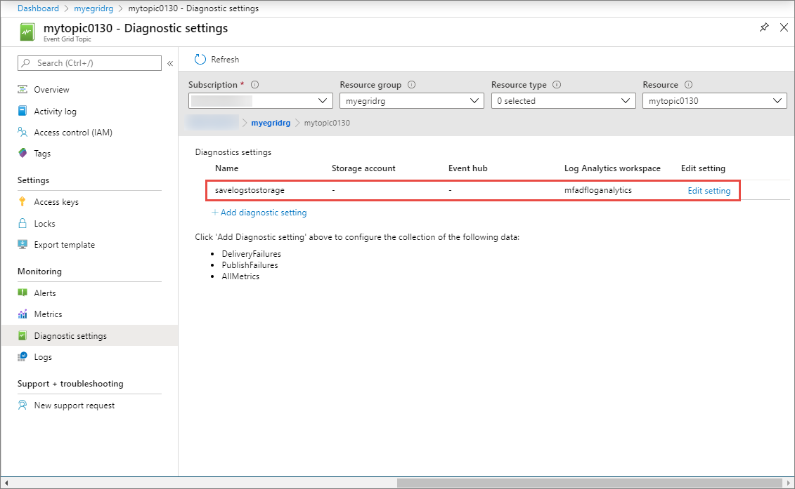

	 You can also enable collection of all metrics for the topic. 

## Enable diagnostic logs for a system topic

1. Sign in to the [Azure portal](https://portal.azure.com).
2. Navigate to the event grid topic for which you want to enable diagnostic log settings. 
    1. In the search bar at the top, search for **Event Grid System Topics**. 
    
        
    1. Select the **system topic** for which you want to configure diagnostic settings. 
    
        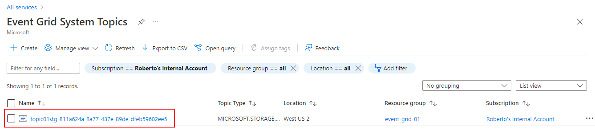
3. Select **Diagnostic settings** under **Monitoring** on the left menu, and then select **Add diagnostic setting**. 

    
4. Specify a **name** for the diagnostic setting. 
7. Select the **DeliveryFailures** in the **Log** section. 
    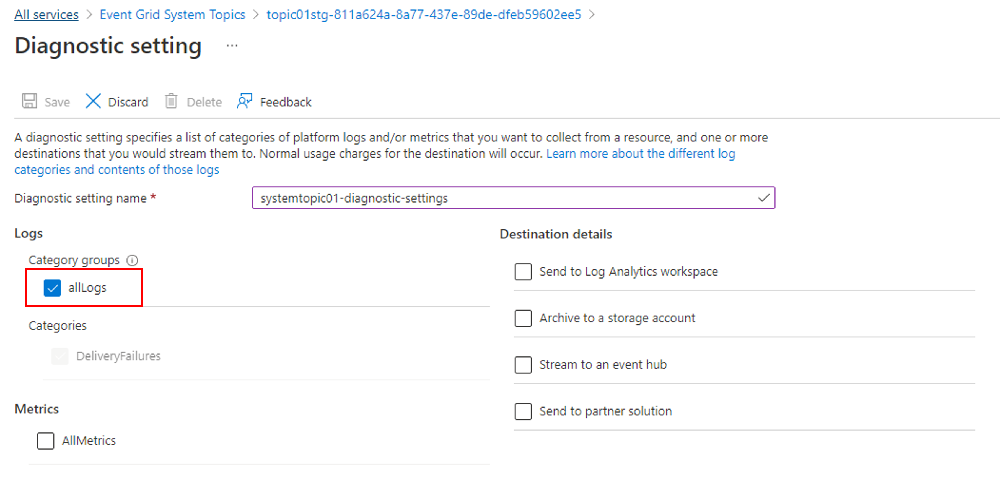
6. Enable one or more of the capture destinations for the logs, and then configure them by selecting a previous created capture resource. 
    - If you select **Send to Log Analytics**, select the Log Analytics workspace.
        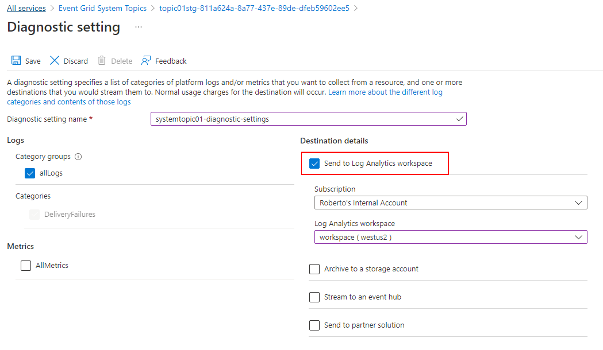 
    - If you select **Archive to a storage account**, select **Storage account - Configure**, and then select the storage account in your Azure subscription. 

        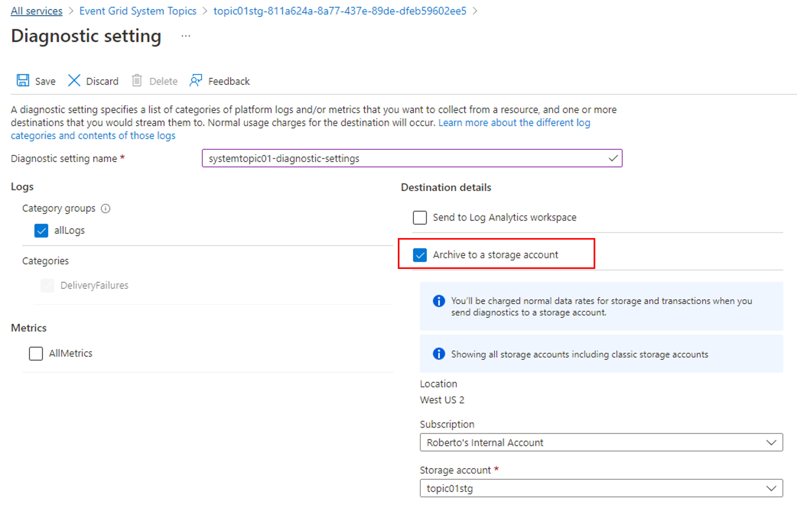
    - If you select **Stream to an event hub**, select **Event hub - Configure**, and then select the Event Hubs namespace, event hub, and the access policy. 
        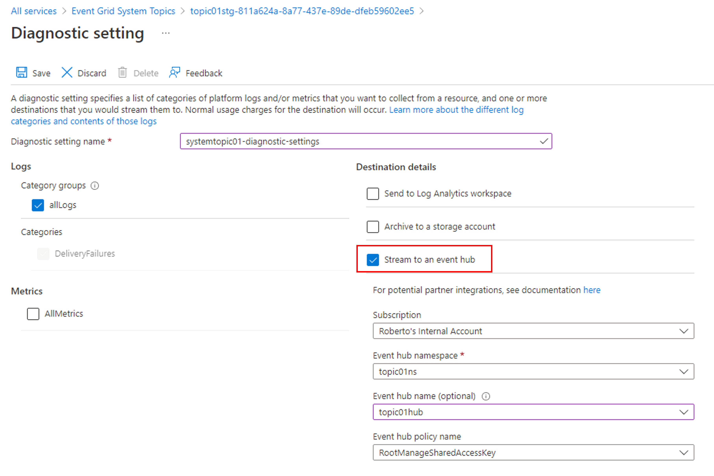
8. Select **Save**. Then, select **X** in the right-corner to close the page. 
9. Now, back on the **Diagnostic settings** page, confirm that you see a new entry in the **Diagnostics Settings** table. 
    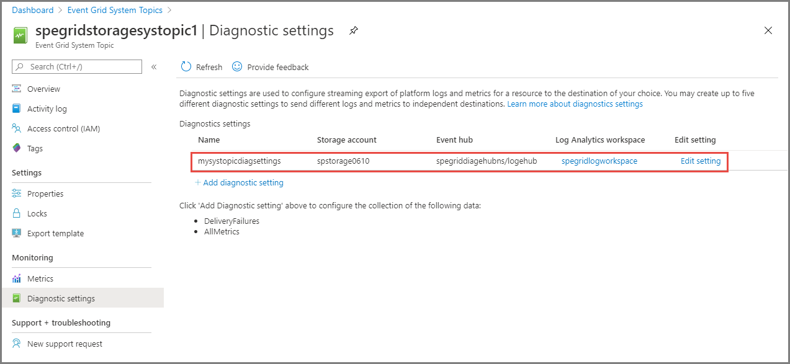

	 You can also enable collection of all **metrics** for the system topic.

    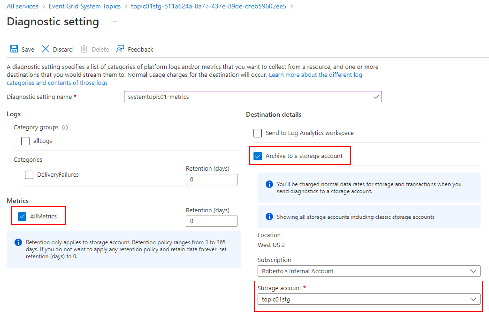

## View diagnostic logs in Azure Storage 

1. Once you enable a storage account as a capture destination and Event Grid starts emitting diagnostic logs, you should see new containers named **insights-logs-deliveryfailures** and **insights-logs-publishfailures** in the storage account. 

    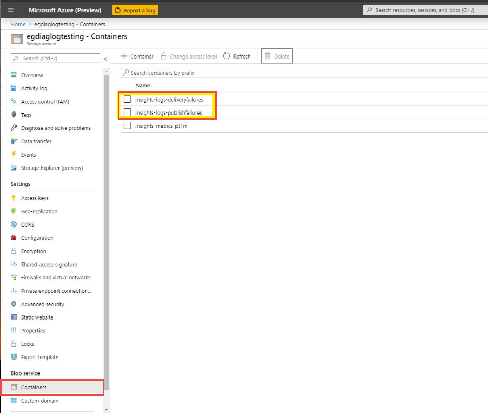
2. As you navigate through one of the containers, you will end up at a blob in JSON format. The file contains log entries for either a delivery failure or a publish failure. The navigation path represents the **ResourceId** of the event grid topic and the timestamp (minute level) as to when the log entries were emitted. The blob/JSON file, which is downloadable, in the end adheres to the schema described in the next section. 

    [ 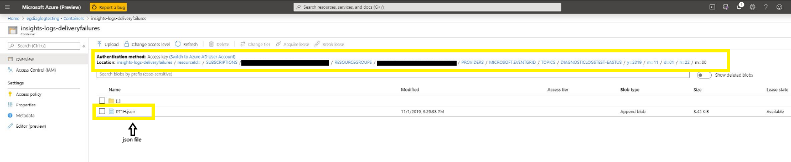 ](./media/enable-diagnostic-logs-topic/select-json.png)
3. You should see content in the JSON file similar to the following example: 

    ```json
    {
        "time": "2019-11-01T00:17:13.4389048Z",
        "resourceId": "/SUBSCRIPTIONS/SAMPLE-SUBSCTIPTION-ID /RESOURCEGROUPS/SAMPLE-RESOURCEGROUP-NAME/PROVIDERS/MICROSOFT.EVENTGRID/TOPICS/SAMPLE-TOPIC-NAME ",
        "eventSubscriptionName": "SAMPLEDESTINATION",
        "category": "DeliveryFailures",
        "operationName": "Deliver",
        "message": "Message:outcome=NotFound, latencyInMs=2635, systemId=17284f7c-0044-46fb-84b7-59fda5776017, state=FilteredFailingDelivery, deliveryTime=11/1/2019 12:17:10 AM, deliveryCount=0, probationCount=0, deliverySchema=EventGridEvent, eventSubscriptionDeliverySchema=EventGridEvent, fields=InputEvent, EventSubscriptionId, DeliveryTime, State, Id, DeliverySchema, LastDeliveryAttemptTime, SystemId, fieldCount=, requestExpiration=1/1/0001 12:00:00 AM, delivered=False publishTime=11/1/2019 12:17:10 AM, eventTime=11/1/2019 12:17:09 AM, eventType=Type, deliveryTime=11/1/2019 12:17:10 AM, filteringState=FilteredWithRpc, inputSchema=EventGridEvent, publisher=DIAGNOSTICLOGSTEST-EASTUS.EASTUS-1.EVENTGRID.AZURE.NET, size=363, fields=Id, PublishTime, SerializedBody, EventType, Topic, Subject, FilteringHashCode, SystemId, Publisher, FilteringTopic, TopicCategory, DataVersion, MetadataVersion, InputSchema, EventTime, fieldCount=15, url=sb://diagnosticlogstesting-eastus.servicebus.windows.net/, deliveryResponse=NotFound: The messaging entity 'sb://diagnosticlogstesting-eastus.servicebus.windows.net/eh-diagnosticlogstest' could not be found. TrackingId:c98c5af6-11f0-400b-8f56-c605662fb849_G14, SystemTracker:diagnosticlogstesting-eastus.servicebus.windows.net:eh-diagnosticlogstest, Timestamp:2019-11-01T00:17:13, referenceId: ac141738a9a54451b12b4cc31a10dedc_G14:"
    }
    ```

## Next steps
For the log schema and other conceptual information about diagnostic logs for topics or domains, see [Diagnostic logs](diagnostic-logs.md).
