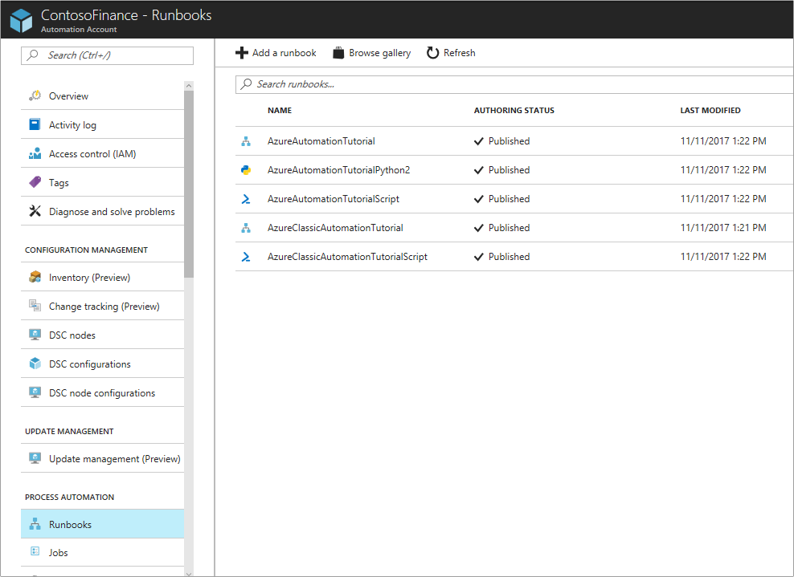
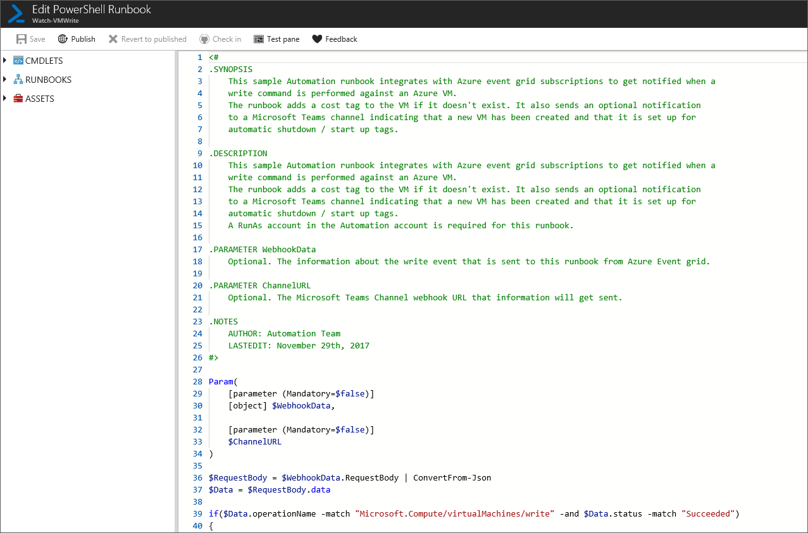
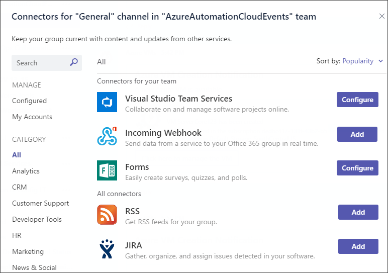
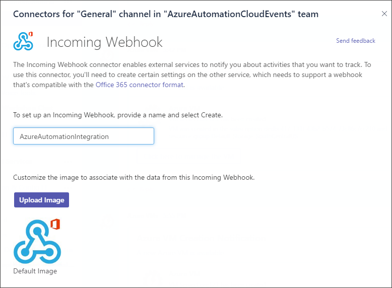
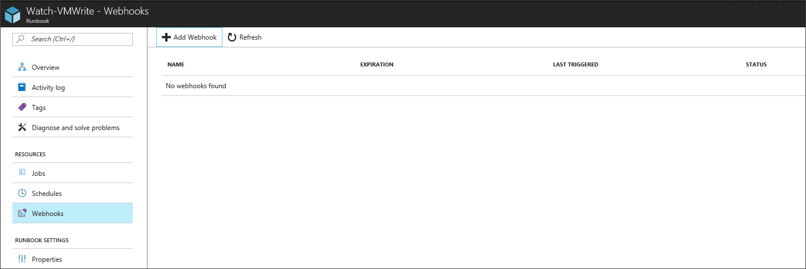
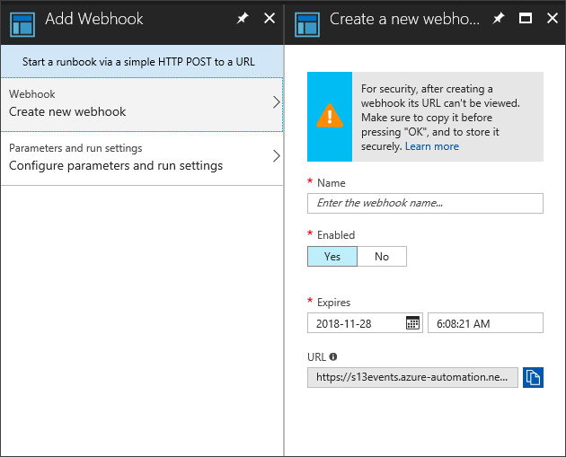
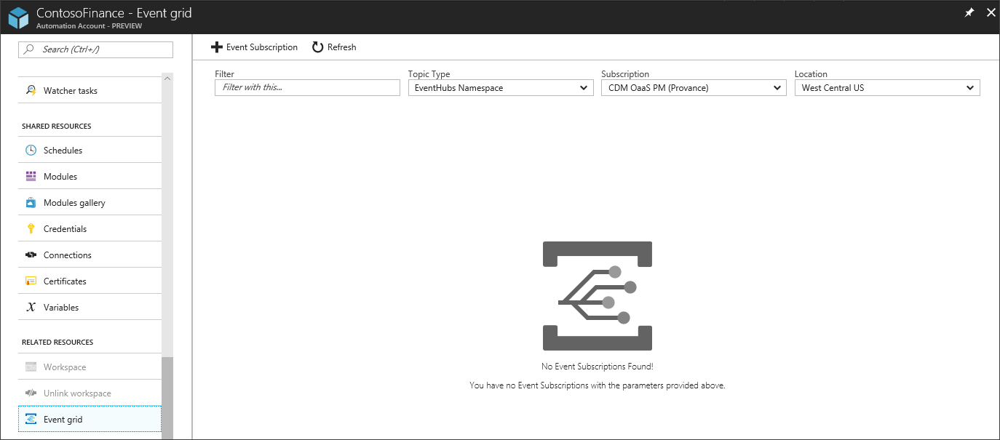
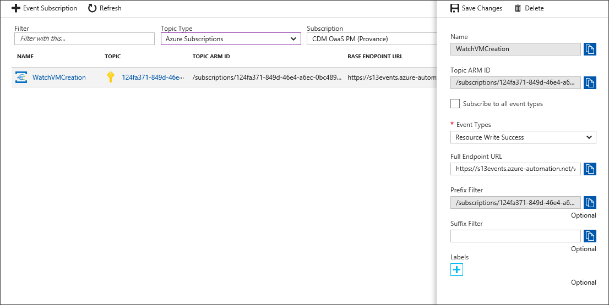

# Integrating Azure Automation with Event Grid and Microsoft Teams

In this tutorial, you learn how to:

> [!div class="checklist"]
> * Import runbook that adds a VM tag and sends a notification to Microsoft Teams.
> * Create an optional Microsoft Teams webhook.
> * Create a webhook for the runbook.
> * Create an event grid subscription.
> * Create VM that triggers runbook.

## Prerequisites

To complete this tutorial, the following are required.
+ Azure subscription. If you don't have one yet, you can [activate your MSDN subscriber benefits](https://azure.microsoft.com/pricing/member-offers/msdn-benefits-details/) or sign up for a [free account](https://azure.microsoft.com/free/?WT.mc_id=A261C142F).
+ [Automation account](../automation/automation-offering-get-started.md) to hold the runbook that is triggered from the event grid subscription.

## Import runbook that adds a VM tag and sends a notification to Microsoft Teams
1.	Open the Automation account, and click on the Runbooks page.
2.	Click on the “Browse gallery” button.

3.	Search for “Event Grid” and import the runbook into the Automation account.

4.	Click on “Edit” to view the Runbook source and click on the “Publish” button.

## Create an optional Microsoft Teams webhook
1.	In Microsoft Teams, choose More Options (...) next to the channel name and choose connectors.

2.  Scroll through the list of connectors to Incoming Webhook, and click Add.

3.	Enter AzureAutomationIntegration for the name and click Create.

4.  Copy the webhook to the clipboard and save it. The webhook URL is used for sending information to Microsoft Teams.
5.  Select Done to save the webhook.

## Create a webhook for the runbook
1.  Open up the Watch-VMWrite runbook.
2.  Click on Webhooks and the Add webhook button

2.	Enter “WatchVMEventGrid” for the name and copy the URL into the clipboard and save.

3.	Select parameters and enter the Microsoft Teams webhook URL and leave the WEBHOOKDATA blank.

4.  Select OK to create the Automation runbook webhook.

## Create an event grid subscription
1.	Click on the Event Grid page from the Automation Account overview.

2.	Click on the new Event subscription button.
3.	Configure the subscription with the following information:
    *	Enter AzureAutomation for the name. 
    *	In Topic Type, choose Azure Subscriptions. 
    *	Uncheck the "Subscribe to all event types"
    *	In Event Types, choose Resource Write Success.
    *	In Subscriber Endpoint, enter the Webhook URL for the Watch-VMWrite runbook.
    *	In Prefix Filter, enter subscription and resource group you want to look for new VMs created. It should look like /subscriptions/124aa551-849d-46e4-a6dc-0bc4895422aB/resourcegroups/ContosoResourceGroup/providers/Microsoft.Compute/virtualMachines

6.  Click "Create" to save the event grid subscription.

## Create VM that triggers runbook
1.  Create a new virtual machine in the resource group you specified in the event grid subscription prefix filter.
2.  The Watch-VMWrite runbook should be called and a new Tag added to the VM.

3.  A new message is sent to the Teams channel.

## Next steps

* [Create and route custom events with Event Grid](../event-grid/custom-event-quickstart.md)
