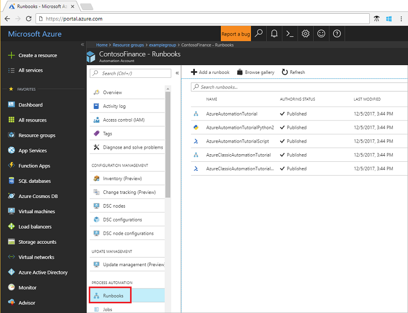
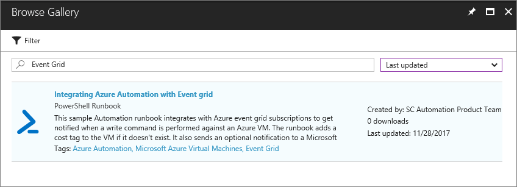
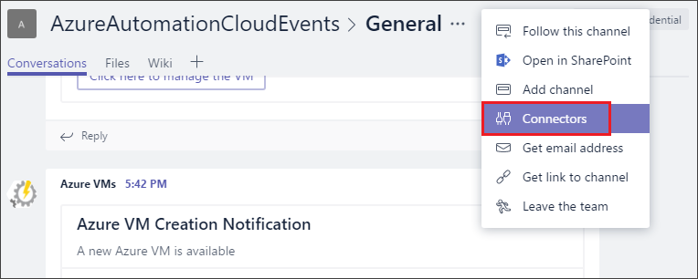
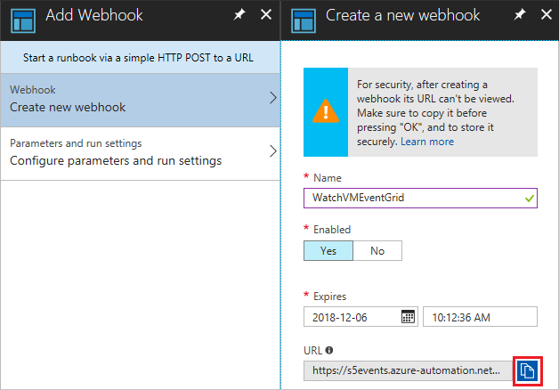
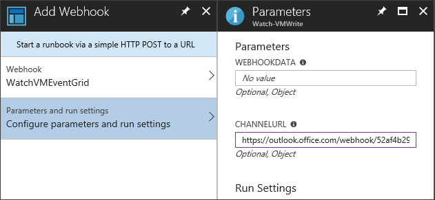
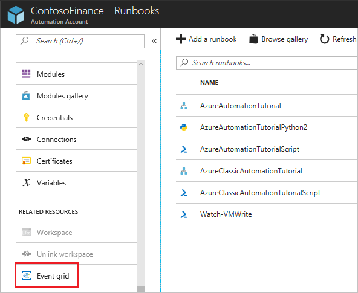
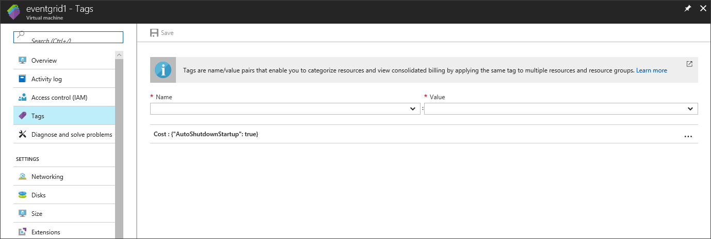
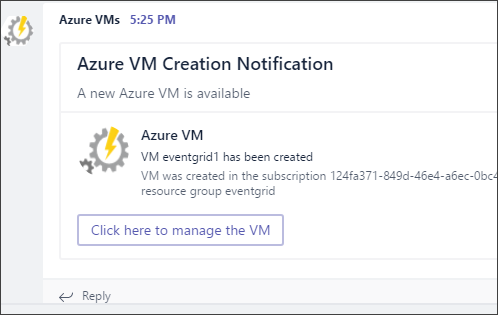

# Integrate Azure Automation with Event Grid and Microsoft Teams

In this tutorial, you learn how to:

> [!div class="checklist"]
> * Import an Event Grid sample runbook.
> * Create an optional Microsoft Teams webhook.
> * Create a webhook for the runbook.
> * Create an Event Grid subscription.
> * Create a VM that triggers the runbook.

If you don't have an Azure subscription, create a [free account](https://azure.microsoft.com/free/?WT.mc_id=A261C142F) before you begin.

## Prerequisites

To complete this tutorial, an [Azure Automation account](../automation/automation-offering-get-started.md) is required to hold the runbook that is triggered from the Azure Event Grid subscription.

* The `AzureRM.Tags` module needs to be loaded in your Automation Account, see [How to import modules in Azure Automation](../automation/automation-update-azure-modules.md) to learn how to import modules into Azure Automation.

## Import an Event Grid sample runbook

1. Select your Automation account, and select the **Runbooks** page.

   

2. Select the **Browse gallery** button.

3. Search for **Event Grid**, and select **Integrating Azure Automation with Event grid**.

    

4. Select **Import** and name it **Watch-VMWrite**.

5. After it has imported, select **Edit** to view the runbook source. Select the **Publish** button.

> [!NOTE]
> Line 74 in the script needs to have the line changed to `Update-AzureRmVM -ResourceGroupName $VMResourceGroup -VM $VM -Tag $Tag | Write-Verbose`. The `-Tags` parameter is now `-Tag`.

## Create an optional Microsoft Teams webhook

1. In Microsoft Teams, select **More Options** next to the channel name, and then select **Connectors**.

    

2. Scroll through the list of connectors to **Incoming Webhook**, and select **Add**.

3. Enter **AzureAutomationIntegration** for the name, and select **Create**.

4. Copy the webhook to the clipboard, and save it. The webhook URL is used to send information to Microsoft Teams.

5. Select **Done** to save the webhook.

## Create a webhook for the runbook

1. Open the Watch-VMWrite runbook.

2. Select **Webhooks**, and select the **Add Webhook** button.

3. Enter **WatchVMEventGrid** for the name. Copy the URL to the clipboard, and save it.

    

4. Select **Configure parameters and run settings**, and enter the Microsoft Teams webhook URL for **CHANNELURL**. Leave **WEBHOOKDATA** blank.

    

5. Select **Create** to create the Automation runbook webhook.

## Create an Event Grid subscription

1. On the **Automation Account** overview page, select **Event grid**.

    

2. Click **+ Event Subscription**.

3. Configure the subscription with the following information:

   * For **Topic Type**, select **Azure Subscriptions**.
   * Uncheck the **Subscribe to all event types** check box.
   * Enter **AzureAutomation** for the name.
   * In the **Defined Event Types** drop-down, uncheck all options except **Resource Write Success**.
   * For **Endpoint Type**, select **Webhook**.
   * Click **Select an endpoint**. On the **Select Web Hook** page that opens up, paste the webhook url you created for the Watch-VMWrite runbook.
   * Under **FILTERS**, enter the subscription and resource group where you want to look for the new VMs created. It should look like:
 `/subscriptions/<subscription-id>/resourcegroups/<resource-group-name>/providers/Microsoft.Compute/virtualMachines`

4. Select **Create** to save the Event Grid subscription.

## Create a VM that triggers the runbook

1. Create a new VM in the resource group you specified in the Event Grid subscription prefix filter.

2. The Watch-VMWrite runbook should be called and a new tag added to the VM.

    

3. A new message is sent to the Microsoft Teams channel.

    

## Next steps

In this tutorial, you set up integration between Event Grid and Automation. You learned how to:

> [!div class="checklist"]
> * Import an Event Grid sample runbook.
> * Create an optional Microsoft Teams webhook.
> * Create a webhook for the runbook.
> * Create an Event Grid subscription.
> * Create a VM that triggers the runbook.

> [!div class="nextstepaction"]
> [Create and route custom events with Event Grid](../event-grid/custom-event-quickstart.md)
