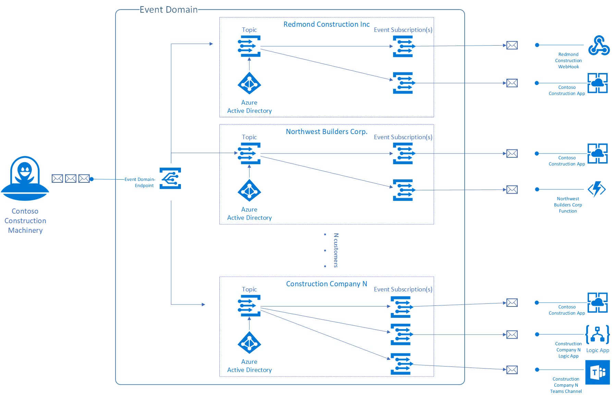

# Understand event domains for managing Event Grid topics

This article describes how to use event domains to manage the flow of custom events to your various business organizations, customers, or applications. Use event domains to:

* Manage multitenant eventing architectures at scale.
* Manage your authorization and authentication.
* Partition your topics without managing each individually.
* Avoid individually publishing to each of your topic endpoints.

## Event domain overview

An event domain is a management tool for large numbers of Event Grid topics related to the same application. You can think of it as a meta-topic that can have thousands of individual topics.

Event domains make available to you the same architecture used by Azure services (like Storage and IoT Hub) to publish their events. They allow you to publish events to thousands of topics. Domains also give you authorization and authentication control over each topic so you can partition your tenants.

### Example use case

Event domains are most easily explained using an example. Let's say you run Contoso Construction Machinery, where you manufacture tractors, digging equipment, and other heavy machinery. As a part of running the business, you push real-time information to customers about equipment maintenance, systems health, and contract updates. All of this information goes to various endpoints including your app, customer endpoints, and other infrastructure that customers have set up.

Event domains allow you to model Contoso Construction Machinery as a single eventing entity. Each of your customers is represented as a topic within the domain. Authentication and authorization are handled using Azure Active Directory. Each of your customers can subscribe to their topic and get their events delivered to them. Managed access through the event domain ensures they can only access their topic.

It also gives you a single endpoint, which you can publish all of your customer events to. Event Grid will take care of making sure each topic is only aware of events scoped to its tenant.



## Access management

With a domain, you get fine grain authorization and authentication control over each topic via Azure's role-based access control (RBAC). You can use these roles to restrict each tenant in your application to only the topics you wish to grant them access to.

RBAC in event domains works the same way [managed access control](security-authorization.md) works in the rest of Event Grid and Azure. Use RBAC to create and enforce custom role definitions in event domains.

### Built in roles

Event Grid has two built-in role definitions to make RBAC easier for working with event domains. These roles are **EventGrid EventSubscription Contributor (Preview)** and **EventGrid EventSubscription Reader (Preview)**. You assign these roles to users who need to subscribe to topics in your event domain. You scope the role assignment to only the topic that users need to subscribe to.

For information about these roles, see [Built-in roles for Event Grid](security-authorization.md#built-in-roles).

## Subscribing to topics

Subscribing to events on a topic within an event domain is the same as [creating an Event Subscription on a custom topic](./custom-event-quickstart.md) or subscribing to an event from an Azure service.

### Domain scope subscriptions

Event domains also allow for domain-scope subscriptions. An event subscription on an event domain will receive all events sent to the domain regardless of the topic the events are sent to. Domain scope subscriptions can be useful for management and auditing purposes.

## Publishing to an event domain

When you create an event domain, you're given a publishing endpoint similar to if you had created a topic in Event Grid. 

To publish events to any topic in an Event Domain, push the events to the domain's endpoint the [same way you would for a custom topic](./post-to-custom-topic.md). The only difference is that you must specify the topic you'd like the event to be delivered to.

For example, publishing the following array of events would send event with `"id": "1111"` to topic `foo` while the event with `"id": "2222"` would be sent to topic `bar`:

```json
[{
  "topic": "foo",
  "id": "1111",
  "eventType": "maintenanceRequested",
  "subject": "myapp/vehicles/diggers",
  "eventTime": "2018-10-30T21:03:07+00:00",
  "data": {
    "make": "Contoso",
    "model": "Small Digger"
  },
  "dataVersion": "1.0"
},
{
  "topic": "bar",
  "id": "2222",
  "eventType": "maintenanceCompleted",
  "subject": "myapp/vehicles/tractors",
  "eventTime": "2018-10-30T21:04:12+00:00",
  "data": {
    "make": "Contoso",
    "model": "Big Tractor"
  },
  "dataVersion": "1.0"
}]
```

Event domains handle publishing to topics for you. Instead of publishing events to each topic you manage individually, you can publish all of your events to the domain's endpoint. Event Grid makes sure each event is sent to the correct topic.

## Limits and quotas
Here are the limits and quotas related to event domains:

- 100,000 topics per event domain 
- 100 event domains per Azure subscription 
- 500 event subscriptions per topic in an event domain
- 50 domain scope subscriptions 
- 5,000 events per second ingestion rate (into a domain)

If these limits don't suit you, reach out the product team by opening a support ticket or by sending an email to [askgrid@microsoft.com](mailto:askgrid@microsoft.com). 

## Pricing
Event domains use the same [operations pricing](https://azure.microsoft.com/pricing/details/event-grid/) that all other features in Event Grid use.

Operations work the same in event domains as they do in custom topics. Each ingress of an event to an event domain is an operation, and each delivery attempt for an event is an operation.

## Next steps

* To learn about setting up event domains, creating topics, creating event subscriptions, and publishing events, see [Manage event domains](./how-to-event-domains.md).
