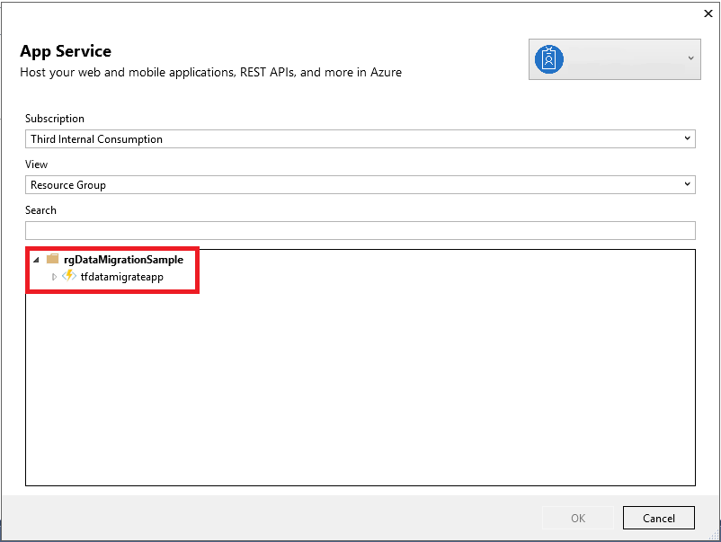
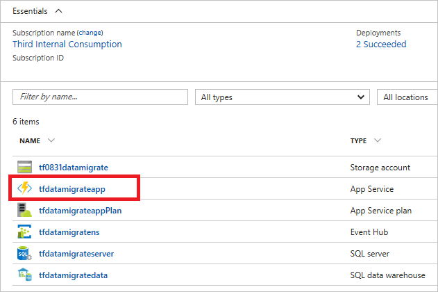
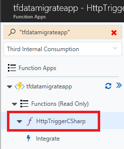
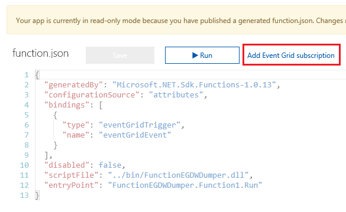
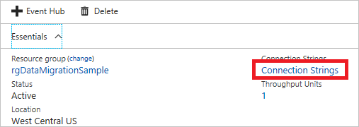
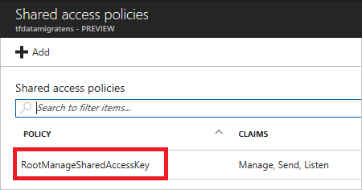
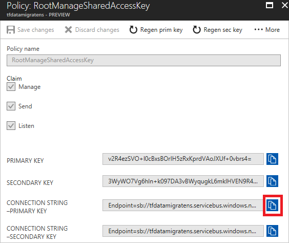

# Stream big data into a data warehouse

Azure [Event Grid](overview.md) is an intelligent event routing service that enables you to react to notifications from apps and services. For example, it can trigger an Azure Function to process Event Hubs data that has been captured to an Azure Blob storage or Data Lake Store, and migrate the data to other data repositories. This [Event Hubs Capture and Event Grid sample](https://github.com/Azure/azure-event-hubs/tree/master/samples/e2e/EventHubsCaptureEventGridDemo) shows how to use Event Hubs Capture with Event Grid to seamlessly migrate Event Hubs data from blob storage to a SQL Data Warehouse.


As data is sent to the event hub, Capture pulls data from the stream and generates storage blobs with the data in Avro format. When Capture generates the blob, it triggers an event. Event Grid distributes data about the event to subscribers. In this case, the event data is sent to the Azure Functions endpoint. The event data includes the path of the generated blob. The function uses that URL to retrieve the file, and send it to the data warehouse.

In this article, you:

* Deploy the following infrastructure:
  * Event hub with Capture enabled
  * Storage account for the files from Capture
  * Azure app service plan for hosting the function app
  * Function app for processing the event
  * SQL Server for hosting the data warehouse
  * SQL Data Warehouse for storing the migrated data
* Create a table in the data warehouse
* Add code to the function app
* Subscribe to the event
* Run app that sends data to the event hub
* View migrated data in data warehouse

## About the event data

Event Grid distributes event data to the subscribers. The following example shows event data for creating a Capture file. In particular, notice the `fileUrl` property in the `data` object. The function app gets this value and uses it to retrieve the Capture file.

```json
[
    {
        "topic": "/subscriptions/<guid>/resourcegroups/rgDataMigrationSample/providers/Microsoft.EventHub/namespaces/tfdatamigratens",
        "subject": "eventhubs/hubdatamigration",
        "eventType": "Microsoft.EventHub.CaptureFileCreated",
        "eventTime": "2017-08-31T19:12:46.0498024Z",
        "id": "14e87d03-6fbf-4bb2-9a21-92bd1281f247",
        "data": {
            "fileUrl": "https://tf0831datamigrate.blob.core.windows.net/windturbinecapture/tfdatamigratens/hubdatamigration/1/2017/08/31/19/11/45.avro",
            "fileType": "AzureBlockBlob",
            "partitionId": "1",
            "sizeInBytes": 249168,
            "eventCount": 1500,
            "firstSequenceNumber": 2400,
            "lastSequenceNumber": 3899,
            "firstEnqueueTime": "2017-08-31T19:12:14.674Z",
            "lastEnqueueTime": "2017-08-31T19:12:44.309Z"
        }
    }
]
```

## Prerequisites

To complete this tutorial, you must have:

* An Azure subscription. If you don't have an Azure subscription, create a [free account](https://azure.microsoft.com/free/?WT.mc_id=A261C142F) before you begin.
* [Visual studio 2017 Version 15.3.2 or greater](https://www.visualstudio.com/vs/) with workloads for: .NET desktop development, Azure development, ASP.NET and web development, Node.js development, and Python development.
* The [EventHubsCaptureEventGridDemo sample project](https://github.com/Azure/azure-event-hubs/tree/master/samples/e2e/EventHubsCaptureEventGridDemo) downloaded to your computer.

## Deploy the infrastructure

To simplify this article, you deploy the required infrastructure with a Resource Manager template. To see the resources that are deployed, view the [template](https://github.com/Azure/azure-docs-json-samples/blob/master/event-grid/EventHubsDataMigration.json).

For Azure CLI, use:

```azurecli-interactive
az group create -l westcentralus -n rgDataMigrationSample

az group deployment create \
  --resource-group rgDataMigrationSample \
  --template-uri https://raw.githubusercontent.com/Azure/azure-docs-json-samples/master/event-grid/EventHubsDataMigration.json \
  --parameters eventHubNamespaceName=<event-hub-namespace> eventHubName=hubdatamigration sqlServerName=<sql-server-name> sqlServerUserName=<user-name> sqlServerPassword=<password> sqlServerDatabaseName=<database-name> storageName=<unique-storage-name> functionAppName=<app-name>
```

For PowerShell, use:

```powershell
New-AzureRmResourceGroup -Name rgDataMigration -Location westcentralus

New-AzureRmResourceGroupDeployment -ResourceGroupName rgDataMigration -TemplateUri https://raw.githubusercontent.com/Azure/azure-docs-json-samples/master/event-grid/EventHubsDataMigration.json -eventHubNamespaceName <event-hub-namespace> -eventHubName hubdatamigration -sqlServerName <sql-server-name> -sqlServerUserName <user-name> -sqlServerDatabaseName <database-name> -storageName <unique-storage-name> -functionAppName <app-name>
```

Provide a password value when prompted.

## Create a table in SQL Data Warehouse

Add a table to your data warehouse by running the [CreateDataWarehouseTable.sql](https://github.com/Azure/azure-event-hubs/blob/master/samples/e2e/EventHubsCaptureEventGridDemo/scripts/CreateDataWarehouseTable.sql) script. To run the script, use Visual Studio or the Query Editor in the portal.

The script to run is:

```sql
CREATE TABLE [dbo].[Fact_WindTurbineMetrics] (
    [DeviceId] nvarchar(50) COLLATE SQL_Latin1_General_CP1_CI_AS NULL, 
    [MeasureTime] datetime NULL, 
    [GeneratedPower] float NULL, 
    [WindSpeed] float NULL, 
    [TurbineSpeed] float NULL
)
WITH (CLUSTERED COLUMNSTORE INDEX, DISTRIBUTION = ROUND_ROBIN);
```

## Publish the Azure Functions app

1. Open the [EventHubsCaptureEventGridDemo sample project](https://github.com/Azure/azure-event-hubs/tree/master/samples/e2e/EventHubsCaptureEventGridDemo) in Visual Studio 2017 (15.3.2 or greater).

1. In Solution Explorer, right-click **FunctionEGDWDumper**, and select **Publish**.

   

1. Select **Azure Function App** and **Select Existing**. Select **Publish**.

   

1. Select the function app that you deployed through the template. Select **OK**.

   

1. When Visual Studio has configured the profile, select **Publish**.

   

After publishing the function, you're ready to subscribe to the event.

## Subscribe to the event

1. Go to the [Azure portal](https://portal.azure.com/). Select your resource group and function app.

   

1. Select the function.

   

1. Select **Add Event Grid subscription**.

   

9. Give the event grid subscription a name. Use **Event Hubs Namespaces** as the event type. Provide values to select your instance of the Event Hubs namespace. Leave the subscriber endpoint as the provided value. Select **Create**.

   

## Run the app to generate data

You've finished setting up your event hub, SQL data warehouse, Azure function app, and event subscription. The solution is ready to migrate data from the event hub to the data warehouse. Before running an application that generates data for event hub, you need to configure a few values.

1. In the portal, select your event hub namespace. Select **Connection Strings**.

   

2. Select **RootManageSharedAccessKey**

   

3. Copy **Connection string - primary Key**

   

4. Go back to your Visual Studio project. In the WindTurbineDataGenerator project, open **program.cs**.

5. Replace the two constant values. Use the copied value for **EventHubConnectionString**. Use **hubdatamigration** the event hub name.

   ```cs
   private const string EventHubConnectionString = "Endpoint=sb://demomigrationnamespace.servicebus.windows.net/...";
   private const string EventHubName = "hubdatamigration";
   ```

6. Build the solution. Run the WindTurbineGenerator.exe application. After a couple of minutes, query the table in your data warehouse for the migrated data.

## Next steps

* To learn about differences in the Azure messaging services, see [Choose between Azure services that deliver messages](compare-messaging-services.md).
* For an introduction to Event Grid, see [About Event Grid](overview.md).
* For an introduction to Event Hubs Capture, see [Enable Event Hubs Capture using the Azure portal](../event-hubs/event-hubs-capture-enable-through-portal.md).
* For more information about setting up and running the sample, see [Event Hubs Capture and Event Grid sample](https://github.com/Azure/azure-event-hubs/tree/master/samples/e2e/EventHubsCaptureEventGridDemo).