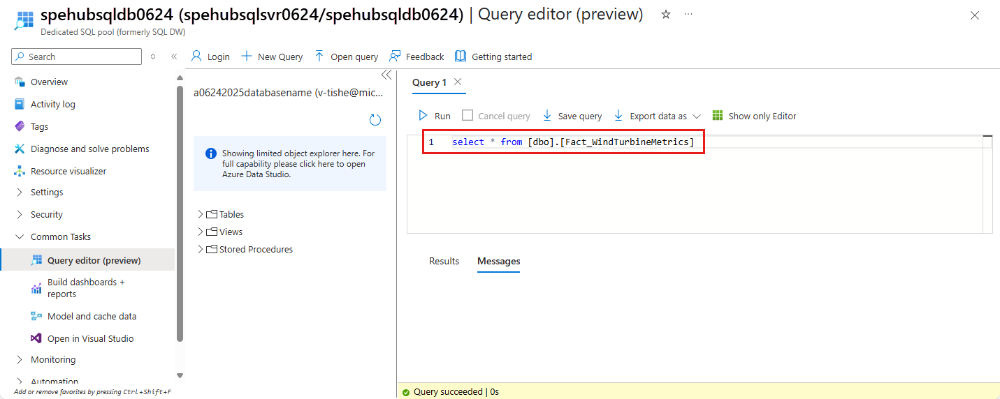

# Tutorial: Migrate Event Hubs captured data from Azure Storage to Azure Synapse Analytics using Azure Event Grid and Azure Functions
In this tutorial, you'll migrate Event Hubs captured data from Azure Blob Storage to Azure Synapse Analytics, specifically a dedicated SQL pool, using Azure Event Grid and Azure Functions.

:::image type="content" source="media/event-hubs-functions-synapse-analytics/overview.svg" alt-text="Application overview":::

This diagram depicts the workflow of the solution you build in this tutorial:

1. Data sent to an Azure event hub is captured in an Azure blob storage.
2. When the data capture is complete, an event is generated and sent to Azure Event Grid.
3. Azure Event Grid forwards this event data to an Azure function app.
4. The function app uses the blob URL in the event data to retrieve the blob from the storage.
5. The function app migrates the blob data to an Azure Synapse Analytics.

In this article, you take the following steps:

> [!div class="checklist"]
> - Deploy the required infrastructure for the tutorial
> - Publish code to a Functions App
> - Create an Event Grid subscription
> - Stream sample data into Event Hubs
> - Verify captured data in Azure Synapse Analytics

## Prerequisites
To complete this tutorial, you must have:

- This article assumes that you are familiar with Event Grid and Event Hubs (especially the Capture feature). If you aren't familiar with Azure Event Grid, see [Introduction to Azure Event Grid](overview.md). To learn about the Capture feature of Azure Event Hubs, see [Capture events through Azure Event Hubs in Azure Blob Storage or Azure Data Lake Storage](../event-hubs/event-hubs-capture-overview.md).
- An Azure subscription. If you don't have an Azure subscription, create a [free account](https://azure.microsoft.com/free/) before you begin.
- [Visual studio](https://www.visualstudio.com/vs/) with workloads for: .NET desktop development, Azure development, ASP.NET and web development, Node.js development, and Python development.
- Download the [EventHubsCaptureEventGridDemo sample project](https://github.com/Azure/azure-event-hubs/tree/master/samples/e2e/EventHubsCaptureEventGridDemo) to your computer.
    - WindTurbineDataGenerator – A simple publisher that sends sample wind turbine data to an event hub with the Capture feature enabled.
    - FunctionDWDumper – An Azure function that receives a notification from Azure Event Grid when an Avro file is captured to the Azure Storage blob. It receives the blob’s URI path, reads its contents, and pushes this data to Azure Synapse Analytics (dedicated SQL pool).

## Deploy the infrastructure
In this step, you deploy the required infrastructure with a [Resource Manager template](https://github.com/Azure/azure-docs-json-samples/blob/master/event-grid/EventHubsDataMigration.json). When you deploy the template, the following resources are created:

* Event hub with the Capture feature enabled.
* Storage account for the captured files.
* App service plan for hosting the function app
* Function app for processing the event
* SQL Server for hosting the data warehouse
* Azure Synapse Analytics (dedicated SQL pool) for storing the migrated data

### Use Azure CLI to deploy the infrastructure

1. Sign in to the [Azure portal](https://portal.azure.com).
2. Select **Cloud Shell** button at the top.

    :::image type="content" source="media/event-hubs-functions-synapse-analytics/azure-portal.png" alt-text="Screenshot of Azure portal showing the selection of Cloud Shell button.":::
3. You see the Cloud Shell opened at the bottom of the browser.
    1. If you're using the Cloud Shell for the first time:
        1. If you see an option to select between **Bash** and **PowerShell**, select **Bash**.

            :::image type="icon" source="~/reusable-content/ce-skilling/azure/media/cloud-shell/launch-cloud-shell-button.png" alt-text="Button to launch the Azure Cloud Shell." border="false" link="https://shell.azure.com":::

        1. Create a storage account by selecting **Create storage**. Azure Cloud Shell requires an Azure storage account to store some files.

            :::image type="content" source="media/event-hubs-functions-synapse-analytics/create-storage-cloud-shell.png" alt-text="Screenshot showing the creation of storage for Cloud Shell.":::
        3. Wait until the Cloud Shell is initialized.

            :::image type="content" source="media/event-hubs-functions-synapse-analytics/cloud-shell-initialized.png" alt-text="Screenshot showing the Cloud Shell initialized.":::
4. In the Cloud Shell,  select **Bash** as shown in the above image, if it isn't already selected.
1. Create an Azure resource group by running the following CLI command:
    1. Copy and paste the following command into the Cloud Shell window. Change the resource group name and location if you want.

        ```azurecli
        az group create -l eastus -n rgDataMigration
        ```
    2. Press **ENTER**.

        Here's an example:

        ```azurecli
        user@Azure:~$ az group create -l eastus -n rgDataMigration
        {
          "id": "/subscriptions/00000000-0000-0000-0000-0000000000000/resourceGroups/rgDataMigration",
          "location": "eastus",
          "managedBy": null,
          "name": "rgDataMigration",
          "properties": {
            "provisioningState": "Succeeded"
          },
          "tags": null
        }
        ```
2. Deploy all the resources mentioned in the previous section (event hub, storage account, functions app, Azure Synapse Analytics) by running the following CLI command:
    1. Copy and paste the command into the Cloud Shell window. Alternatively, you can copy/paste into an editor of your choice, set values, and then copy the command to the Cloud Shell. If you see an error due to an Azure resource name, delete the resource group, fix the name, and retry the command again.

        > [!IMPORTANT]
        > Specify values for the following entities before running the command:
        > - Name of the resource group you created earlier.
        > - Name for the event hub namespace.
        > - Name for the event hub. You can leave the value as it is (hubdatamigration).
        > - Name for the SQL server.
        > - Name of the SQL user and password.
        > - Name for the database.
        > - Name of the storage account.
        > - Name for the function app.


        ```azurecli
        az deployment group create \
            --resource-group rgDataMigration \
            --template-uri https://raw.githubusercontent.com/Azure/azure-docs-json-samples/master/event-grid/EventHubsDataMigration.json \
            --parameters eventHubNamespaceName=<event-hub-namespace> eventHubName=hubdatamigration sqlServerName=<sql-server-name> sqlServerUserName=<user-name> sqlServerPassword=<password> sqlServerDatabaseName=<database-name> storageName=<unique-storage-name> functionAppName=<app-name>
        ```
    3. Press **ENTER** in the Cloud Shell window to run the command. This process might take a while since you're creating a bunch of resources. In the result of the command, ensure that there have been no failures.
1. Close the Cloud Shell by selecting the **Cloud Shell** button in the portal (or) **X** button in the top-right corner of the Cloud Shell window.

### Verify that the resources are created

1. In the Azure portal, select **Resource groups** on the left menu.
2. Filter the list of resource groups by entering the name of your resource group in the search box.
3. Select your resource group in the list.

    :::image type="content" source="media/event-hubs-functions-synapse-analytics/select-resource-group.png" alt-text="Screenshot showing the selection of your resource group.":::
4. Confirm that you see the following resources in the resource group:

    :::image type="content" source="media/event-hubs-functions-synapse-analytics/resources-in-resource-group.png" alt-text="Screenshot showing resources in the resource group." lightbox="media/event-hubs-functions-synapse-analytics/resources-in-resource-group.png":::

### Create a table in Azure Synapse Analytics
In this section, you create a table in the dedicated SQL pool you created earlier.

1. In the list of resources in the resource group, select your **dedicated SQL pool**.
2. On the **Dedicated SQL pool** page, in the **Common Tasks** section on the left menu, select **Query editor (preview)**.

    :::image type="content" source="media/event-hubs-functions-synapse-analytics/sql-data-warehouse-page.png" alt-text="Screenshot showing the selection of Query Editor on a Dedicated SQL pool page in the Azure portal.":::
2. Enter the name of **user** and **password** for the SQL server, and select **OK**. If you see a message about allowing your client to access the SQL server, select **Allowlist IP &lt;your IP Address&gt; on server &lt;your SQL server&gt;**, and then select **OK**.
1. In the query window, copy and run the following SQL script:

    ```sql
    CREATE TABLE [dbo].[Fact_WindTurbineMetrics] (
        [DeviceId] nvarchar(50) COLLATE SQL_Latin1_General_CP1_CI_AS NULL,
        [MeasureTime] datetime NULL,
        [GeneratedPower] float NULL,
        [WindSpeed] float NULL,
        [TurbineSpeed] float NULL
    )
    WITH (CLUSTERED COLUMNSTORE INDEX, DISTRIBUTION = ROUND_ROBIN);
    ```

    :::image type="content" source="media/event-hubs-functions-synapse-analytics/run-sql-query.png" alt-text="Screenshot showing the query editor.":::
5. Keep this tab or window open so that you can verify that the data is created at the end of the tutorial.

## Publish the Azure Functions app
First, get the publish profile for the Functions app from the Azure portal. Then, use the publish profile to publish the Azure Functions project or app from Visual Studio.

### Get the publish profile

1. On the **Resource Group** page, select the **Azure Functions app** in the list of resources.

    :::image type="content" source="media/event-hubs-functions-synapse-analytics/select-function-app.png" lightbox="media/event-hubs-functions-synapse-analytics/select-function-app.png" alt-text="Screenshot showing the selection of the function app in the list of resources for a resource group.":::
1. On the **Function App** page for your app, select **Get publish profile** on the command bar.

    :::image type="content" source="media/event-hubs-functions-synapse-analytics/get-publish-profile.png" lightbox="media/event-hubs-functions-synapse-analytics/get-publish-profile.png" alt-text="Screenshot showing the selection of the **Get Publish Profile** button on the command bar of the function app page.":::
1. Download and save the file into the **FunctionEGDDumper** subfolder of the **EventHubsCaptureEventGridDemo** folder.

### Use the publish profile to publish the Functions app

1. Launch Visual Studio.
2. Open the **EventHubsCaptureEventGridDemo.sln** solution that you downloaded from the [GitHub](https://github.com/Azure/azure-event-hubs/tree/master/samples/e2e/EventHubsCaptureEventGridDemo) as part of the prerequisites. You can find it in the `/samples/e2e/EventHubsCaptureEventGridDemo` folder.
3. In Solution Explorer, right-click **FunctionEGDWDumper** project, and select **Publish**.
4. In the following screen, select **Start** or **Add a publish profile**.
5. In the **Publish** dialog box, select **Import Profile** for **Target**, and select **Next**.

    :::image type="content" source="media/event-hubs-functions-synapse-analytics/import-profile.png" alt-text="Screenshot showing the selection **Import Profile** on the **Publish** dialog box.":::
1. On the **Import profile** tab, select the publish settings file that you saved earlier in the **FunctionEGDWDumper** folder, and then select **Finish**.
1. When Visual Studio has configured the profile, select **Publish**. Confirm that the publishing succeeded.
2. In the web browser that has the **Azure Function** page open, select  **Functions** in the middle pane. Confirm that the **EventGridTriggerMigrateData** function shows up in the list. If you don't see it, try publishing from Visual Studio again, and then refresh the page in the portal.

    :::image type="content" source="media/event-hubs-functions-synapse-analytics/confirm-function-creation.png" alt-text="Screenshot showing the confirmation of function creation.":::

After publishing the function, you're ready to subscribe to the event.

## Subscribe to the event

1. In a new tab or new window of a web browser, sign in to the [Azure portal](https://portal.azure.com).
2. In the Azure portal, select **Resource groups** on the left menu.
3. Filter the list of resource groups by entering the name of your resource group in the search box.
4. Select your resource group in the list.
1. Select the **Event Hubs namespace** from the list of resources.
1. On the **Event Hubs Namespace** page, select **Events** on the left menu, and then select **+ Event Subscription** on the toolbar.

    :::image type="content" source="media/event-hubs-functions-synapse-analytics/event-hub-add-subscription-link.png" alt-text="Screenshot of the Events page for an Event Hubs namespace with Add event subscription link selected. ":::
1. On the **Create Event Subscription** page, follow these steps:
    1. Enter a name for the **event subscription**.
    1. Enter a name for the **system topic**. A system topic provides an endpoint for the sender to send events. For more information, see [System topics](system-topics.md)
    1. For **Endpoint Type**, select **Azure Function**.
    1. For **Endpoint**, select the link.
    1. On the **Select Azure Function** page, follow these steps if they aren't automatically filled.
        1. Select the Azure subscription that has the Azure function.
        1. Select the resource group for the function.
        1. Select the function app.
        1. Select the deployment slot.
        1. Select the function **EventGridTriggerMigrateData**.
    1. On the **Select Azure Function** page, select **Confirm Selection**.
    1. Then, back on the **Create Event Subscription** page, select **Create**.

        :::image type="content" source="media/event-hubs-functions-synapse-analytics/event-subscription-select-function.png" alt-text="Screenshot of the Create an event subscription page." lightbox="media/event-hubs-functions-synapse-analytics/event-subscription-select-function.png":::
1. Verify that the event subscription is created. Switch to the **Event Subscriptions** tab on the **Events** page for the Event Hubs namespace.

    :::image type="content" source="media/event-hubs-functions-synapse-analytics/confirm-event-subscription.png" alt-text="Screenshot showing the Event Subscriptions tab on the Events page." lightbox="media/event-hubs-functions-synapse-analytics/confirm-event-subscription.png":::

## Run the app to generate data
You've finished setting up your event hub, dedicate SQL pool (formerly SQL Data Warehouse), Azure function app, and event subscription. Before running an application that generates data for event hub, you need to configure a few values.

1. In the Azure portal, navigate to your resource group as you did earlier.
2. Select the Event Hubs namespace.
3. In the **Event Hubs Namespace** page, select **Shared access policies** on the left menu.
4. Select **RootManageSharedAccessKey** in the list of policies.

    :::image type="content" source="media/event-hubs-functions-synapse-analytics/event-hub-namespace-shared-access-policies.png" alt-text="Screenshot showing the Shared access policies page for an Event Hubs namespace.":::
1. Select the copy button next to the **Connection string-primary key** text box.
1. Go back to your Visual Studio solution.
1. Right-click **WindTurbineDataGenerator** project, and select **Set as Startup project**.
1. In the WindTurbineDataGenerator project, open **program.cs**.
1. Replace `<EVENT HUBS NAMESPACE CONNECTION STRING>` with the connection string you copied from the portal.
1. If you've used a different name for the event hub other than `hubdatamigration`, replace `<EVENT HUB NAME>` with the name of the event hub.

   ```cs
   private const string EventHubConnectionString = "Endpoint=sb://demomigrationnamespace.servicebus.windows.net/...";
   private const string EventHubName = "hubdatamigration";
   ```
6. Build the solution. Run the **WindTurbineGenerator.exe** application.
7. After a couple of minutes, in the other browser tab where you have the query window open, query the table in your data warehouse for the migrated data.

    ```sql
    select * from [dbo].[Fact_WindTurbineMetrics]
    ```

    :::image type="content" source="media/event-hubs-functions-synapse-analytics/query-results.png" alt-text="Screenshot showing the query results.":::

## Monitor the solution
This section helps you with monitoring or troubleshooting the solution.

### View captured data in the storage account
1. Navigate to the resource group and select the storage account used for capturing event data.
1. On the **Storage account** page, select **Storage browser** on the left menu.
1. Expand **BLOB CONTAINERS**, and select **windturbinecapture**.
1. Open the folder named same as your **Event Hubs namespace** in the right pane.
1. Open the folder named same as your event hub (**hubdatamigration**).
1. Drill through the folders and you see the AVRO files. Here's an example:

    :::image type="content" source="media/event-hubs-functions-synapse-analytics/storage-captured-file.png" alt-text="Screenshot showing the captured file in the storage." lightbox="media/event-hubs-functions-synapse-analytics/storage-captured-file.png":::


### Verify that the Event Grid trigger invoked the function
1. Navigate to the resource group and select the function app.
1. Select **Functions** tab in the middle pane.
1. Select the **EventGridTriggerMigrateData** function from the list.
1. On the **Function** page, select **Monitor** on the left menu.
1. Select **Configure** to configure application insights to capture invocation logs.
1. Create a new **Application Insights** resource or use an existing resource.
1. Navigate back to the **Monitor** page for the function.
1. Confirm that the client application (**WindTurbineDataGenerator**) that's sending the events is still running. If not, run the app.
1. Wait for a few minutes (5 minutes or more) and select the **Refresh** button to see function invocations.

    :::image type="content" source="media/event-hubs-functions-synapse-analytics/function-invocations.png" alt-text="Screenshot showing the Function invocations.":::
1. Select an invocation to see details.

    Event Grid distributes event data to the subscribers. The following example shows event data generated when data streaming through an event hub is captured in a blob. In particular, notice the `fileUrl` property in the `data` object points to the blob in the storage. The function app uses this URL to retrieve the blob file with captured data.

    ```json
    {
      "topic": "/subscriptions/<AZURE SUBSCRIPTION ID>/resourcegroups/rgDataMigration/providers/Microsoft.EventHub/namespaces/spehubns1207",
      "subject": "hubdatamigration",
      "eventType": "Microsoft.EventHub.CaptureFileCreated",
      "id": "4538f1a5-02d8-4b40-9f20-36301ac976ba",
      "data": {
        "fileUrl": "https://spehubstorage1207.blob.core.windows.net/windturbinecapture/spehubns1207/hubdatamigration/0/2020/12/07/21/49/12.avro",
        "fileType": "AzureBlockBlob",
        "partitionId": "0",
        "sizeInBytes": 473444,
        "eventCount": 2800,
        "firstSequenceNumber": 55500,
        "lastSequenceNumber": 58299,
        "firstEnqueueTime": "2020-12-07T21:49:12.556Z",
        "lastEnqueueTime": "2020-12-07T21:50:11.534Z"
      },
      "dataVersion": "1",
      "metadataVersion": "1",
      "eventTime": "2020-12-07T21:50:12.7065524Z"
    }
    ```

### Verify that the data is stored in the dedicated SQL pool
In the browser tab where you have the query window open, query the table in your dedicated SQL pool for the migrated data.





## Next steps
* For more information about setting up and running the sample, see [Event Hubs Capture and Event Grid sample](https://github.com/Azure/azure-event-hubs/tree/master/samples/e2e/EventHubsCaptureEventGridDemo).
* In this tutorial, you created an event subscription for the `CaptureFileCreated` event. For more information about this event and all the events supported by Azure Blob Storage, see [Azure Event Hubs as an Event Grid source](event-schema-event-hubs.md).
* To learn more about the Event Hubs Capture feature, see [Capture events through Azure Event Hubs in Azure Blob Storage or Azure Data Lake Storage](../event-hubs/event-hubs-capture-overview.md).
