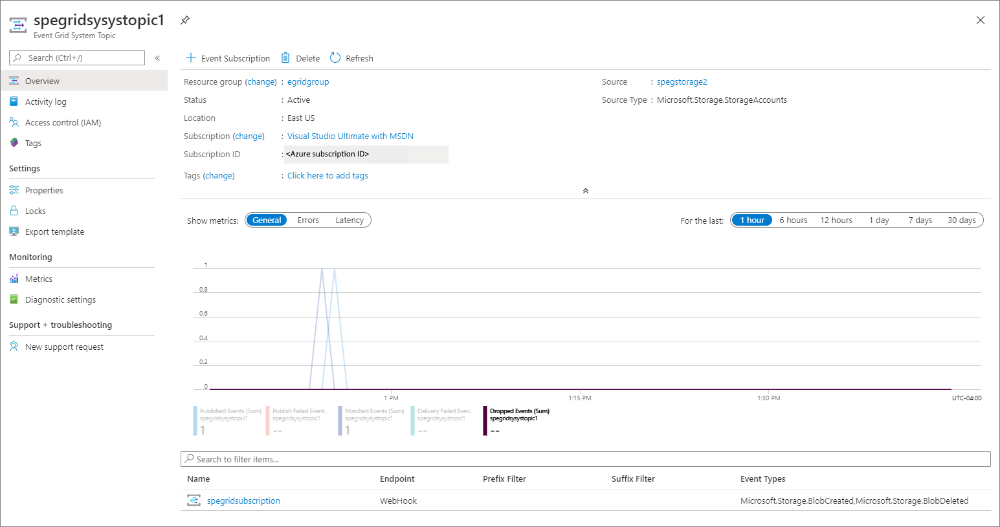

1. Sign in to [Azure portal](https://portal.azure.com).
2. In the search box at the top, type **Event Grid System Topics**, and then press **ENTER**. 

    
3. On the **Event Grid System Topics** page, you see all the system topics. 

    
4. Select a **system topic** from the list to see details about it. 

    

    This page shows you details about the system topic such as the following information: 
    - Source. Name of the resource on which the system topic was created.
    - Source type. Type of the resource. For example: `Microsoft.Storage.StorageAccounts`, `Microsoft.EventHub.Namespaces`, `Microsoft.Resources.ResourceGroups` and so on.
    - Any subscriptions created for the system topic.

    This page allows operations such as the following ones:
    - Create an event subscription Select **+Event Subscription** on the toolbar. 
    - Delete an event subscription. Select **Delete** on the toolbar. 
    - Add tags for the system topic. Select **Tags** on the left menu, and specify tag names and values.