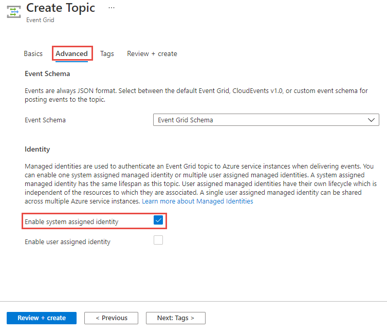

# Event delivery with a managed identity
This article describes how to enable a [managed service identity](../active-directory/managed-identities-azure-resources/overview.md) for Azure event grid custom topics or domains. Use it to forward events to supported destinations such as Service Bus queues and topics, event hubs, and storage accounts.

Here are the steps that are covered in detail in this article:
1. Create a custom topic or domain with a system-assigned identity, or update an existing custom topic or domain to enable identity. 
1. Add the identity to an appropriate role (for example, Service Bus Data Sender) on the destination (for example, a Service Bus queue).
1. When you create event subscriptions, enable the usage of the identity to deliver events to the destination. 

> [!NOTE]
> Currently, it's not possible to deliver events using [private endpoints](../private-link/private-endpoint-overview.md). For more information, see the [Private endpoints](#private-endpoints) section at the end of this article. 

## Create a custom topic or domain with an identity
First, let's look at how to create a topic or a domain with a system-managed identity.

### Use the Azure portal
You can enable system-assigned identity for a custom topic or domain while you create it in the Azure portal. The following image shows how to enable a system-managed identity for a custom topic. Basically, you select the option **Enable system assigned identity** on the **Advanced** page of the topic creation wizard. You'll see this option on the **Advanced** page of the domain creation wizard too. 



### Use the Azure CLI
You can also use the Azure CLI to create a custom topic or domain with a system-assigned identity. Use the `az eventgrid topic create` command with the `--identity` parameter set to `systemassigned`. If you don't specify a value for this parameter, the default value `noidentity` is used. 

```azurecli-interactive
# create a custom topic with a system-assigned identity
az eventgrid topic create -g <RESOURCE GROUP NAME> --name <TOPIC NAME> -l <LOCATION>  --identity systemassigned
```

Similarly, you can use the `az eventgrid domain create` command to create a domain with a system-managed identity.

## Enable an identity for an existing custom topic or domain
In the previous section, you learned how to enable a system-managed identity while you created a custom topic or a domain. In this section, you learn how to enable a system-managed identity for an existing custom topic or domain. 

### Use the Azure portal
The following procedure shows you how to enable system-managed identity for a custom topic. The steps for enabling an identity for a domain are similar. 

1. Go to the [Azure portal](https://portal.azure.com).
2. Search for **event grid topics** in the search bar at the top.
3. Select the **custom topic** for which you want to enable the managed identity. 
4. Switch to the **Identity** tab. 
5. Turn **on** the switch to enable the identity. 
1. Select **Save** on the toolbar to save the setting. 

    :::image type="content" source="./media/managed-service-identity/identity-existing-topic.png" alt-text="Identity page for a custom topic"::: 

You can use similar steps to enable an identity for an event grid domain.

### Use the Azure CLI
Use the `az eventgrid topic update` command with `--identity` set to `systemassigned` to enable system-assigned identity for an existing custom topic. If you want to disable the identity, specify `noidentity` as the value. 

```azurecli-interactive
# Update the topic to assign a system-assigned identity. 
az eventgrid topic update -g $rg --name $topicname --identity systemassigned --sku basic 
```

The command for updating an existing domain is similar (`az eventgrid domain update`).

## Supported destinations and Azure roles
After you enable identity for your event grid custom topic or domain, Azure automatically creates an identity in Azure Active Directory. Add this identity to appropriate Azure roles so that the custom topic or domain can forward events to supported destinations. For example, add the identity to the **Azure Event Hubs Data Sender** role for an Azure Event Hubs namespace so that the event grid custom topic can forward events to event hubs in that namespace. 

Currently, Azure event grid supports custom topics or domains configured with a system-assigned managed identity to forward events to the following destinations. This table also gives you the roles that the identity should be in so that the custom topic can forward the events.

| Destination | Azure role | 
| ----------- | --------- | 
| Service Bus queues and topics | [Azure Service Bus Data Sender](../service-bus-messaging/authenticate-application.md#azure-built-in-roles-for-azure-service-bus) |
| Azure Event Hubs | [Azure Event Hubs Data Sender](../event-hubs/authorize-access-azure-active-directory.md#azure-built-in-roles-for-azure-event-hubs) | 
| Azure Blob storage | [Storage Blob Data Contributor](../storage/common/storage-auth-aad-rbac-portal.md#azure-roles-for-blobs-and-queues) |
| Azure Queue storage |[Storage Queue Data Message Sender](../storage/common/storage-auth-aad-rbac-portal.md#azure-roles-for-blobs-and-queues) | 

## Add an identity to Azure roles on destinations
This section describes how to add the identity for your custom topic or domain to an Azure role. 

### Use the Azure portal
You can use the Azure portal to assign the custom topic or domain identity to an appropriate role so that the custom topic or domain can forward events to the destination. 

The following example adds a managed identity for an event grid custom topic named **msitesttopic** to the **Azure Service Bus Data Sender** role for a Service Bus namespace that contains a queue or topic resource. When you add to the role at the namespace level, the event grid custom topic can forward events to all entities within the namespace. 

1. Go to your **Service Bus namespace** in the [Azure portal](https://portal.azure.com). 
1. Select **Access Control** in the left pane. 
1. Select **Add** in the **Add a role assignment** section. 
1. On the **Add a role assignment** page, do the following steps:
    1. Select the role. In this case, it's **Azure Service Bus Data Sender**. 
    1. Select the **identity** for your event grid custom topic or domain. 
    1. Select **Save** to save the configuration.

The steps are similar for adding an identity to other roles mentioned in the table. 

### Use the Azure CLI
The example in this section shows you how to use the Azure CLI to add an identity to an Azure role. The sample commands are for event grid custom topics. The commands for event grid domains are similar. 

#### Get the principal ID for the custom topic's system identity 
First, get the principal ID of the custom topic's system-managed identity and assign the identity to appropriate roles.

```azurecli-interactive
topic_pid=$(az ad sp list --display-name "$<TOPIC NAME>" --query [].objectId -o tsv)
```

#### Create a role assignment for event hubs at various scopes 
The following CLI example shows how to add a custom topic's identity to the **Azure Event Hubs Data Sender** role at the namespace level or at the event hub level. If you create the role assignment at the namespace level, the custom topic can forward events to all event hubs in that namespace. If you create a role assignment at the event hub level, the custom topic can forward events only to that specific event hub. 


```azurecli-interactive
role="Azure Event Hubs Data Sender" 
namespaceresourceid=$(az eventhubs namespace show -n $<EVENT HUBS NAMESPACE NAME> -g <RESOURCE GROUP of EVENT HUB> --query "{I:id}" -o tsv) 
eventhubresourceid=$(az eventhubs eventhub show -n <EVENT HUB NAME> --namespace-name <EVENT HUBS NAMESPACE NAME> -g <RESOURCE GROUP of EVENT HUB> --query "{I:id}" -o tsv) 

# create role assignment for the whole namespace 
az role assignment create --role "$role" --assignee "$topic_pid" --scope "$namespaceresourceid" 

# create role assignment scoped to just one event hub inside the namespace 
az role assignment create --role "$role" --assignee "$topic_pid" --scope "$eventhubresourceid" 
```

#### Create a role assignment for a Service Bus topic at various scopes 
The following CLI example shows how to add an event grid custom topic's identity to the **Azure Service Bus Data Sender** role at the namespace level or at the Service Bus topic level. If you create the role assignment at the namespace level, the event grid topic can forward events to all entities (Service Bus queues or topics) within that namespace. If you create a role assignment at the Service Bus queue or topic level, the event grid custom topic can forward events only to that specific Service Bus queue or topic. 

```azurecli-interactive
role="Azure Service Bus Data Sender" 
namespaceresourceid=$(az servicebus namespace show -n $RG\SB -g "$RG" --query "{I:id}" -o tsv 
sbustopicresourceid=$(az servicebus topic show -n topic1 --namespace-name $RG\SB -g "$RG" --query "{I:id}" -o tsv) 

# create role assignment for the whole namespace 
az role assignment create --role "$role" --assignee "$topic_pid" --scope "$namespaceresourceid" 

# create role assignment scoped to just one hub inside the namespace 
az role assignment create --role "$role" --assignee "$topic_pid" --scope "$sbustopicresourceid" 
```

## Create event subscriptions that use an identity
After you have an event grid custom topic or a domain with a system-managed identity and have added the identity to the appropriate role on the destination, you're ready to create subscriptions that use the identity. 

### Use the Azure portal
When you create an event subscription, you see an option to enable the use of a system-assigned identity for an endpoint in the **ENDPOINT DETAILS** section. 


You can also enable using a system-assigned identity to be used for dead-lettering on the **Additional Features** tab. 


### Use the Azure CLI - Service Bus queue 
In this section, you learn how to use the Azure CLI to enable the use of a system-assigned identity to deliver events to a Service Bus queue. The identity must be a member of the **Azure Service Bus Data Sender** role. It must also be a member of the **Storage Blob Data Contributor** role on the storage account that's used for dead-lettering. 

#### Define variables
First, specify values for the following variables to be used in the CLI command. 

```azurecli-interactive
subid="<AZURE SUBSCRIPTION ID>"
rg = "<RESOURCE GROUP of EVENT GRID CUSTOM TOPIC>"
topicname = "<EVENT GRID TOPIC NAME>"

# get the service bus queue resource id
queueid=$(az servicebus queue show --namespace-name <SERVICE BUS NAMESPACE NAME> --name <QUEUE NAME> --resource-group <RESOURCE GROUP NAME> --query id --output tsv)
sb_esname = "<Specify a name for the event subscription>" 
```

#### Create an event subscription by using a managed identity for delivery 
This sample command creates an event subscription for an event grid custom topic with an endpoint type set to **Service Bus queue**. 

```azurecli-interactive
az eventgrid event-subscription create  
    --source-resource-id /subscriptions/$subid/resourceGroups/$rg/providers/Microsoft.EventGrid/topics/$topicname
    --delivery-identity-endpoint-type servicebusqueue  
    --delivery-identity systemassigned 
    --delivery-identity-endpoint $queueid
    -n $sb_esname 
```

#### Create an event subscription by using a managed identity for delivery and dead-lettering
This sample command creates an event subscription for an event grid custom topic with an endpoint type set to **Service Bus queue**. It also specifies that the system-managed identity is to be used for dead-lettering. 

```azurecli-interactive
storageid=$(az storage account show --name demoStorage --resource-group gridResourceGroup --query id --output tsv)
deadletterendpoint="$storageid/blobServices/default/containers/<BLOB CONTAINER NAME>"

az eventgrid event-subscription create  
    --source-resource-id /subscriptions/$subid/resourceGroups/$rg/providers/Microsoft.EventGrid/topics/$topicname 
    --delivery-identity-endpoint-type servicebusqueue
    --delivery-identity systemassigned 
    --delivery-identity-endpoint $queueid
    --deadletter-identity-endpoint $deadletterendpoint 
    --deadletter-identity systemassigned 
    -n $sb_esnameq 
```

### Use the Azure CLI - Event Hubs 
In this section, you learn how to use the Azure CLI to enable the use of a system-assigned identity to deliver events to an event hub. The identity must be a member of the **Azure Event Hubs Data Sender** role. It must also be a member of the **Storage Blob Data Contributor** role on the storage account that's used for dead-lettering. 

#### Define variables
```azurecli-interactive
subid="<AZURE SUBSCRIPTION ID>"
rg = "<RESOURCE GROUP of EVENT GRID CUSTOM TOPIC>"
topicname = "<EVENT GRID CUSTOM TOPIC NAME>"

hubid=$(az eventhubs eventhub show --name <EVENT HUB NAME> --namespace-name <NAMESPACE NAME> --resource-group <RESOURCE GROUP NAME> --query id --output tsv)
eh_esname = "<SPECIFY EVENT SUBSCRIPTION NAME>" 
```

#### Create an event subscription by using a managed identity for delivery 
This sample command creates an event subscription for an event grid custom topic with an endpoint type set to **Event Hubs**. 

```azurecli-interactive
az eventgrid event-subscription create  
    --source-resource-id /subscriptions/$subid/resourceGroups/$rg/providers/Microsoft.EventGrid/topics/$topicname 
    --delivery-identity-endpoint-type eventhub 
    --delivery-identity systemassigned 
    --delivery-identity-endpoint $hubid
    -n $sbq_esname 
```

#### Create an event subscription by using a managed identity for delivery + deadletter 
This sample command creates an event subscription for an event grid custom topic with an endpoint type set to **Event Hubs**. It also specifies that the system-managed identity is to be used for dead-lettering. 

```azurecli-interactive
storageid=$(az storage account show --name demoStorage --resource-group gridResourceGroup --query id --output tsv)
deadletterendpoint="$storageid/blobServices/default/containers/<BLOB CONTAINER NAME>"

az eventgrid event-subscription create
    --source-resource-id /subscriptions/$subid/resourceGroups/$rg/providers/Microsoft.EventGrid/topics/$topicname 
    --delivery-identity-endpoint-type servicebusqueue  
    --delivery-identity systemassigned 
    --delivery-identity-endpoint $hubid
    --deadletter-identity-endpoint $eh_deadletterendpoint
    --deadletter-identity systemassigned 
    -n $eh_esname 
```

### Use the Azure CLI - Azure Storage queue 
In this section, you learn how to use the Azure CLI to enable the use of a system-assigned identity to deliver events to an Azure Storage queue. The identity must be a member of the **Storage Queue Data Message Sender** role on the storage account. It must also be a member of the **Storage Blob Data Contributor** role on the storage account that's used for dead-lettering.

#### Define variables  

```azurecli-interactive
subid="<AZURE SUBSCRIPTION ID>"
rg = "<RESOURCE GROUP of EVENT GRID CUSTOM TOPIC>"
topicname = "<EVENT GRID CUSTOM TOPIC NAME>"

# get the storage account resource id
storageid=$(az storage account show --name <STORAGE ACCOUNT NAME> --resource-group <RESOURCE GROUP NAME> --query id --output tsv)

# build the resource id for the queue
queueid="$storageid/queueservices/default/queues/<QUEUE NAME>" 

sa_esname = "<SPECIFY EVENT SUBSCRIPTION NAME>" 
```

#### Create an event subscription by using a managed identity for delivery 

```azurecli-interactive
az eventgrid event-subscription create 
    --source-resource-id /subscriptions/$subid/resourceGroups/$rg/providers/Microsoft.EventGrid/topics/$topicname 
    --delivery-identity-endpoint-type storagequeue  
    --delivery-identity systemassigned 
    --delivery-identity-endpoint $queueid
    -n $sa_esname 
```

#### Create an event subscription by using a managed identity for delivery + deadletter 

```azurecli-interactive
storageid=$(az storage account show --name demoStorage --resource-group gridResourceGroup --query id --output tsv)
deadletterendpoint="$storageid/blobServices/default/containers/<BLOB CONTAINER NAME>"

az eventgrid event-subscription create  
    --source-resource-id /subscriptions/$subid/resourceGroups/$rg/providers/Microsoft.EventGrid/topics/$topicname 
    --delivery-identity-endpoint-type storagequeue  
    --delivery-identity systemassigned 
    --delivery-identity-endpoint $queueid
    --deadletter-identity-endpoint $deadletterendpoint 
    --deadletter-identity systemassigned 
    -n $sa_esname 
```

## Private endpoints
Currently, it's not possible to deliver events using [private endpoints](../private-link/private-endpoint-overview.md). That is, there is no support if you have strict network isolation requirements where your delivered events traffic must not leave the private IP space. 

However, if your requirements call for a secure way to send events using an encrypted channel and a known identity of the sender (in this case, Event Grid) using public IP space, you could deliver events to Event Hubs, Service Bus, or Azure Storage service using an Azure event grid custom topic or a domain with system-managed identity configured as shown in this article. Then, you can use a private link configured in Azure Functions or your webhook deployed on your virtual network to pull events. See the sample: [Connect to private endpoints with Azure Functions](/samples/azure-samples/azure-functions-private-endpoints/connect-to-private-endpoints-with-azure-functions/).

Under this configuration, the traffic goes over the public IP/internet from Event Grid to Event Hubs, Service Bus, or Azure Storage, but the channel can be encrypted and a managed identity of Event Grid is used. If you configure your Azure Functions or webhook deployed to your virtual network to use an Event Hubs, Service Bus, or Azure Storage via private link, that section of the traffic will evidently stay within Azure.


## Next steps
For more information about managed service identities, see [What are managed identities for Azure resources](../active-directory/managed-identities-azure-resources/overview.md). 
