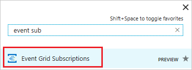
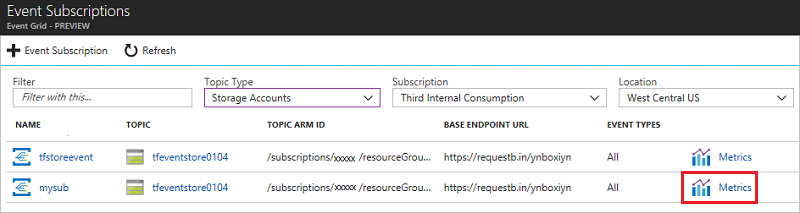
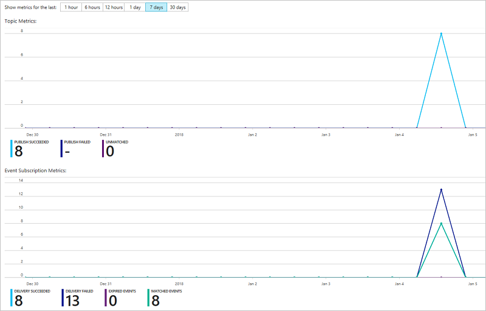
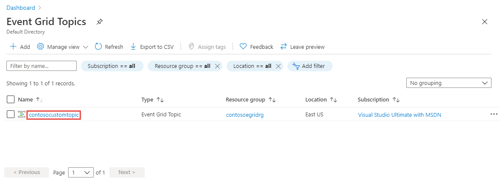
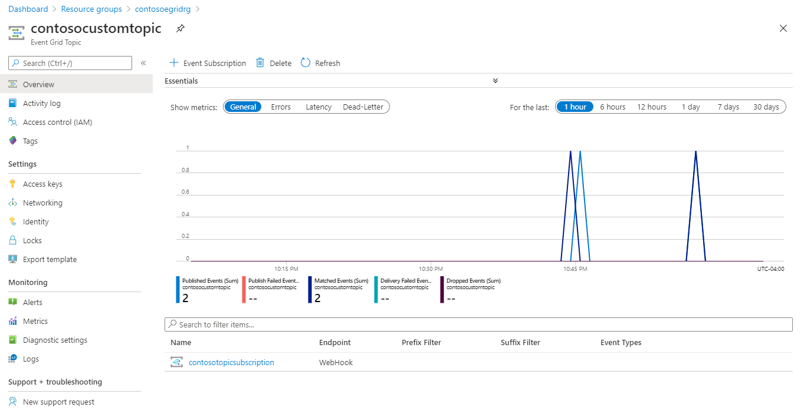

# Monitor Event Grid message delivery 

This article describes how to use the portal to see the status of event deliveries.

Event Grid provides durable delivery. It delivers each message at least once for each subscription. Events are sent to the registered webhook of each subscription immediately. If a webhook does not acknowledge receipt of an event within 60 seconds of the first delivery attempt, Event Grid retries delivery of the event.

For information about event delivery and retries, [Event Grid message delivery and retry](delivery-and-retry.md).

## Delivery metrics

The portal displays metrics for the status of delivering event messages.

For topics, the metrics are:

* **Publish Succeeded**: Event successfully sent to the topic, and processed with a 2xx response.
* **Publish Failed**: Event sent to the topic but rejected with an error code.
* **Unmatched**: Event successfully published to the topic, but not matched to an event subscription. The event was dropped.

For subscriptions, the metrics are:

* **Delivery Succeeded**: Event successfully delivered to the subscription's endpoint, and received a 2xx response.
* **Delivery Failed**: Event sent to subscription's endpoint, but received a 4xx or 5xx response.
* **Expired Events**: Event was not delivered and all retry attempts were sent. The event was dropped.
* **Matched Events**: Event in the topic was matched by the event subscription.

## Event subscription status

To see metrics for an event subscription, search for **Event Grid Subscriptions** in the available services, and select it.

Filter by the type of event, the subscription, and location. Select **Metrics** for the subscription to view.

View the metrics for the event topic and subscription.

## Custom event status

If you have published a custom topic, you can view the metrics for it. Select the resource group containing the topic, and select the topic.

View the metrics for the custom event topic.

## Next steps

* For information about event delivery and retries, [Event Grid message delivery and retry](delivery-and-retry.md).
* For an introduction to Event Grid, see [About Event Grid](overview.md).
* To quickly get started using Event Grid, see [Create and route custom events with Azure Event Grid](custom-event-quickstart.md).
