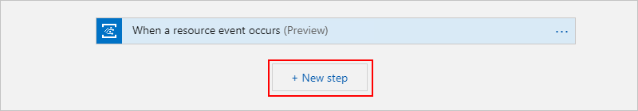
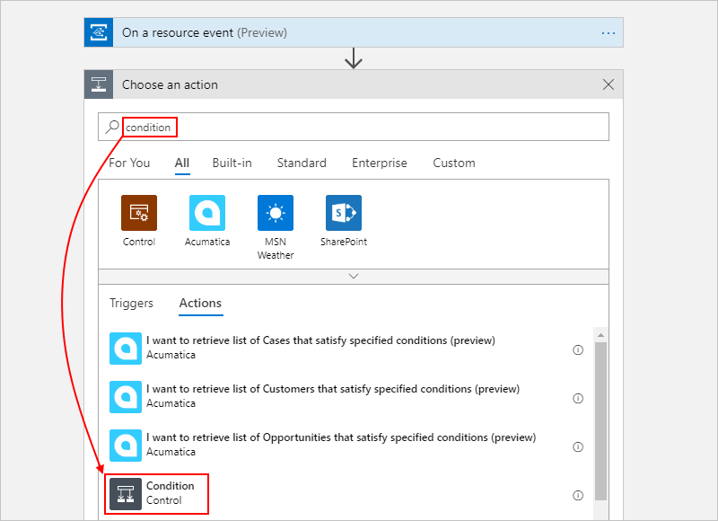
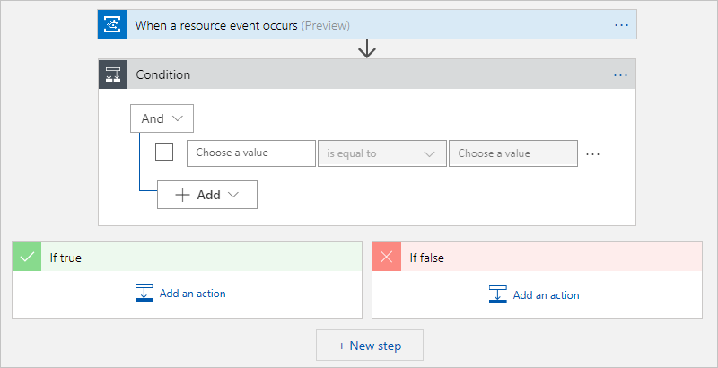
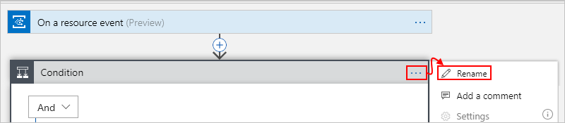
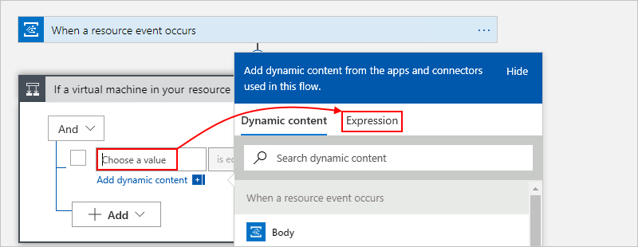
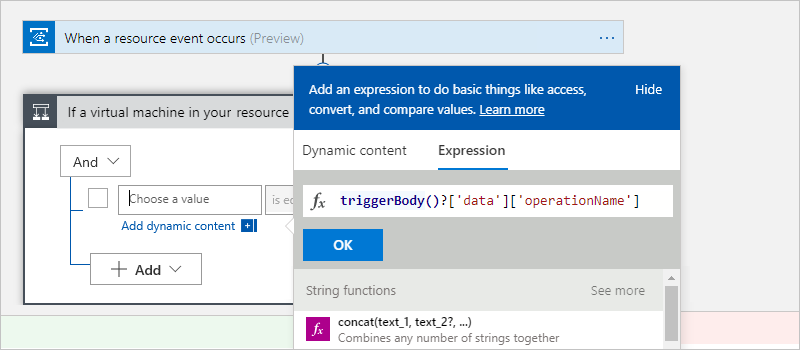
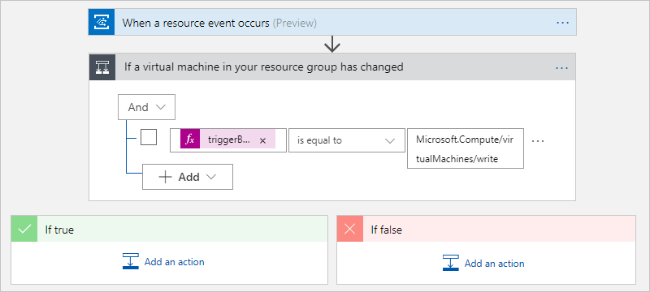
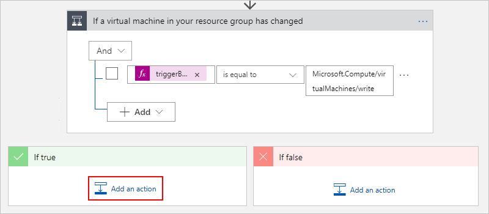

# Tutorial: Monitor virtual machine changes by using Azure Event Grid and Logic Apps

To monitor and respond to specific events that happen in Azure resources or third-party resources, you can automate and run tasks as a workflow by creating a [logic app](../logic-apps/logic-apps-overview.md) that uses minimal code. These resources can publish events to an [Azure event grid](../event-grid/overview.md). In turn, the event grid pushes those events to subscribers that have queues, webhooks, or [event hubs](../event-hubs/event-hubs-what-is-event-hubs.md) as endpoints. As a subscriber, your logic app can wait for those events from the event grid before running automated workflows to perform tasks.

For example, here are some events that publishers can send to subscribers through the Azure Event Grid service:

* Create, read, update, or delete a resource. For example, you can monitor changes that might incur charges on your Azure subscription and affect your bill.

* Add or remove a person from an Azure subscription.

* Your app performs a particular action.

* A new message appears in a queue.

This tutorial creates a logic app that monitors changes to a virtual machine, and sends emails about those changes. When you create a logic app with an event subscription for an Azure resource, events flow from that resource through an event grid to the logic app. The tutorial walks you through building this logic app:

In this tutorial, you learn how to:

> [!div class="checklist"]
> * Create a logic app that monitors events from an event grid.
> * Add a condition that specifically checks for virtual machine changes.
> * Send email when your virtual machine changes.

## Prerequisites

* An Azure subscription. If you don't have an Azure subscription, [sign up for a free Azure account](https://azure.microsoft.com/free/).

* An email account from an email provider supported by Logic Apps for sending notifications, such as Office 365 Outlook, Outlook.com, or Gmail. For other providers, [review the connectors list here](/connectors/).

  This tutorial uses an Office 365 Outlook account. If you use a different email account, the general steps stay the same, but your UI might appear slightly different.

* A [virtual machine](https://azure.microsoft.com/services/virtual-machines) that's alone in its own Azure resource group. If you haven't already done so, create a virtual machine through the [Create a VM tutorial](../virtual-machines/windows/quick-create-portal.md). To make the virtual machine publish events, you [don't need to do anything else](../event-grid/overview.md).

## Create blank logic app

1. Sign in to the [Azure portal](https://portal.azure.com) with your Azure account credentials.

1. From the main Azure menu, select **Create a resource** > **Integration** > **Logic App**.

   

1. Under **Logic App**, provide information about your logic app resource. When you're done, select **Create**.

   

   | Property | Required | Value | Description |
   |----------|----------|-------|-------------|
   | **Name** | Yes | <*logic-app-name*> | Provide a unique name for your logic app. |
   | **Subscription** | Yes | <*Azure-subscription-name*> | Select the same Azure subscription for all the services in this tutorial. |
   | **Resource group** | Yes | <*Azure-resource-group*> | The Azure resource group name for your logic app, which you can select for all the services in this tutorial. |
   | **Location** | Yes | <*Azure-region*> | Select the same region for all services in this tutorial. |
   |||

1. After Azure deploys your logic app, the Logic Apps Designer shows a page with an introduction video and commonly used triggers. Scroll past the video and triggers.

1. Under **Templates**, select **Blank Logic App**.

   

   The Logic Apps Designer now shows you the [*triggers*](../logic-apps/logic-apps-overview.md#logic-app-concepts) that you can use to start your logic app. Every logic app must start with a trigger, which fires when a specific event happens or when a specific condition is met. Each time the trigger fires, Azure Logic Apps creates a workflow instance that runs your logic app.

## Add an Event Grid trigger

Now add the Event Grid trigger, which you use to monitor the resource group for your virtual machine.

1. On the designer, in the search box, enter `event grid` as your filter. From the triggers list, select the **When a resource event occurs** trigger.

   

1. When prompted, sign in to Azure Event Grid with your Azure account credentials. In the **Tenant** list, which shows the Azure Active Directory tenant that's associated with your Azure subscription, check that the correct tenant appears, for example:

   

   > [!NOTE]
   > If you're signed in with a personal Microsoft account, such as @outlook.com or @hotmail.com, 
   > the Event Grid trigger might not appear correctly. As a workaround, select 
   > [Connect with Service Principal](../active-directory/develop/howto-create-service-principal-portal.md), 
   > or authenticate as a member of the Azure Active Directory that's associated with 
   > your Azure subscription, for example, *user-name*@emailoutlook.onmicrosoft.com.

1. Now subscribe your logic app to events from the publisher. Provide the details about your event subscription as described in the following table, for example:

   

   | Property | Required | Value | Description |
   | -------- | -------- | ----- | ----------- |
   | **Subscription** | Yes | <*event-publisher-Azure-subscription-name*> | Select the name for the Azure subscription that's associated with the *event publisher*. For this tutorial, select the Azure subscription name for your virtual machine. |
   | **Resource Type** | Yes | <*event-publisher-Azure-resource-type*> | Select the Azure resource type for the event publisher. For more information about Azure resource types, see [Azure resource providers and types](../azure-resource-manager/management/resource-providers-and-types.md). For this tutorial, select the `Microsoft.Resources.ResourceGroups` value to monitor Azure resource groups. |
   | **Resource Name** |  Yes | <*event-publisher-Azure-resource-name*> | Select the Azure resource name for the event publisher. This list varies based on the resource type that you selected. For this tutorial, select the name for the Azure resource group that includes your virtual machine. |
   | **Event Type Item** |  No | <*event-types*> | Select one or more specific event types to filter and send to your event grid. For example, you can optionally add these event types to detect when resources are changed or deleted: 

- `Microsoft.Resources.ResourceActionSuccess`  - `Microsoft.Resources.ResourceDeleteSuccess`  - `Microsoft.Resources.ResourceWriteSuccess` 
For more information, see these topics: 

- [Azure Event Grid event schema for resource groups](../event-grid/event-schema-resource-groups.md)  - [Understand event filtering](../event-grid/event-filtering.md)  - [Filter events for Event Grid](../event-grid/how-to-filter-events.md) |
   | To add optional properties, select **Add new parameter**, and then select the properties that you want. | No | {see descriptions} | * **Prefix Filter**: For this tutorial, leave this property empty. The default behavior matches all values. However, you can specify a prefix string as a filter, for example, a path and a parameter for a specific resource. 
* **Suffix Filter**: For this tutorial, leave this property empty. The default behavior matches all values. However, you can specify a suffix string as a filter, for example, a file name extension, when you want only specific file types. 
* **Subscription Name**: For this tutorial, you can provide a unique name for your event subscription. |
   |||

1. Save your logic app. On the designer toolbar, select **Save**. To collapse and hide an action's details in your logic app, select the action's title bar.

   

   When you save your logic app with an event grid trigger, Azure automatically creates an event subscription for your logic app to your selected resource. So when the resource publishes an event to the event grid, that event grid automatically pushes the event to your logic app. This event triggers your logic app, then creates and runs an instance of the workflow that you define in these next steps.

Your logic app is now live and listens to events from the event grid, but doesn't do anything until you add actions to the workflow.

## Add a condition

If you want to your logic app to run only when a specific event or operation happens, add a condition that checks for the `Microsoft.Compute/virtualMachines/write` operation. When this condition is true, your logic app sends you email with details about the updated virtual machine.

1. In Logic App Designer, under the event grid trigger, select **New step**.

   

1. Under **Choose an action**, in the search box, enter `condition` as your filter. From the actions list, select the **Condition** action.

   

   The Logic App Designer adds an empty condition to your workflow, including action paths to follow based whether the condition is true or false.

   

1. Rename the condition title to `If a virtual machine in your resource group has changed`. On the condition's title bar, select the ellipses (**...**) button, and select **Rename**.

   

1. Create a condition that checks the event `body` for a `data` object where the `operationName` property is equal to the `Microsoft.Compute/virtualMachines/write` operation. Learn more about [Event Grid event schema](../event-grid/event-schema.md).

   1. On the first row under **And**, click inside the left box. In the dynamic content list that appears, select **Expression**.

      

   1. In the expression editor, enter this expression, which returns the operation name from the trigger, and select **OK**:

      `triggerBody()?['data']['operationName']`

      For example:

      

   1. In the middle box, keep the operator **is equal to**.

   1. In the right box, enter this value, which is the specific operation that you to monitor:

      `Microsoft.Compute/virtualMachines/write`

   Your finished condition now looks like this example:

   

   If you switch from design view to code view and back to design view, the expression that you specified in the condition resolves to the **data.operationName** token:

   

1. Save your logic app.

## Send email notifications

Now add an [*action*](../logic-apps/logic-apps-overview.md#logic-app-concepts) so that you can receive an email when the specified condition is true.

1. In the condition's **If true** box, select **Add an action**.

   

1. Under **Choose an action**, in the search box, enter `send an email` as your filter. Based on your email provider, find and select the matching connector. Then select the "send email" action for your connector. For example:

   * For an Azure work or school account, select the Office 365 Outlook connector.

   * For personal Microsoft accounts, select the Outlook.com connector.

   * For Gmail accounts, select the Gmail connector.

   This tutorial continues with the Office 365 Outlook connector. If you use a different provider, the steps remain the same, but your UI might appear slightly different.

   

1. If you don't already have a connection for your email provider, sign in to your email account when you're asked for authentication.

1. Rename the send email action to this title: `Send email when virtual machine updated`

1. Provide information about the email as specified in the following table:

   

   > [!TIP]
   > To select output from the previous steps in your workflow, click inside an edit box so that the dynamic content list appears, 
   > or select **Add dynamic content**. For more results, select **See more** for each section in the list. 
   > To close the dynamic content list, select **Add dynamic content** again.

   | Property | Required | Value | Description |
   | -------- | -------- | ----- | ----------- |
   | **To** | Yes | <*recipient\@domain*> | Enter the recipient's email address. For testing purposes, you can use your own email address. |
   | **Subject** | Yes | `Resource updated:` **Subject** | Enter the content for the email's subject. For this tutorial, enter the specified text, and select the event's **Subject** field. Here, your email subject includes the name for the updated resource (virtual machine). |
   | **Body** | Yes | `Resource:` **Topic** 
`Event type:` **Event Type**
`Event ID:` **ID**
`Time:` **Event Time** | Enter the content for the email's body. For this tutorial, enter the specified text and select the event's **Topic**, **Event Type**, **ID**, and **Event Time** fields so that your email includes the resource that fired the event, event type, event timestamp, and event ID for the update. For this tutorial, the resource is the Azure resource group selected in the trigger. 
To add blank lines in your content, press Shift + Enter. |
   ||||

   > [!NOTE]
   > If you select a field that represents an array, 
   > the designer automatically adds a **For each** loop 
   > around the action that references the array. 
   > That way, your logic app performs that action on each array item.

   Now, your email action might look like this example:

   

   And your finished logic app might look like this example:

   

1. Save your logic app. To collapse and hide each action's details in your logic app, select the action's title bar.

   Your logic app is now live, but waits for changes to your virtual machine before doing anything. To test your logic app now, continue to the next section.

## Test your logic app workflow

1. To check that your logic app is getting the specified events, update your virtual machine.

   For example, you can resize your virtual machine in the Azure portal or [resize your VM with Azure PowerShell](../virtual-machines/windows/resize-vm.md).

   After a few moments, you should get an email. For example:

   

1. To review the runs and trigger history for your logic app, on your logic app menu, select **Overview**. To view more details about a run, select the row for that run.

   

1. To view the inputs and outputs for each step, expand the step that you want to review. This information can help you diagnose and debug problems in your logic app.

   

Congratulations, you've created and run a logic app that monitors resource events through an event grid and emails you when those events happen. You also learned how easily you can create workflows that automate processes and integrate systems and cloud services.

You can monitor other configuration changes with event grids and logic apps, for example:

* A virtual machine gets role-based access control (RBAC) rights.
* Changes are made to a network security group (NSG) on a network interface (NIC).
* Disks for a virtual machine are added or removed.
* A public IP address is assigned to a virtual machine NIC.

## Clean up resources

This tutorial uses resources and performs actions that incur charges on your Azure subscription. So when you're done with the tutorial and testing, make sure that you disable or delete any resources where you don't want to incur charges.

* To stop running your logic app without deleting your work, disable your app. On your logic app menu, select **Overview**. On the toolbar, select **Disable**.

  

  > [!TIP]
  > If you don't see the logic app menu, try returning to the Azure dashboard, and reopen your logic app.

* To permanently delete your logic app, on the logic app menu, select **Overview**. On the toolbar, select **Delete**. Confirm that you want to delete your logic app, and select **Delete**.

## Next steps

* [Create and route custom events with Event Grid](../event-grid/custom-event-quickstart.md)
