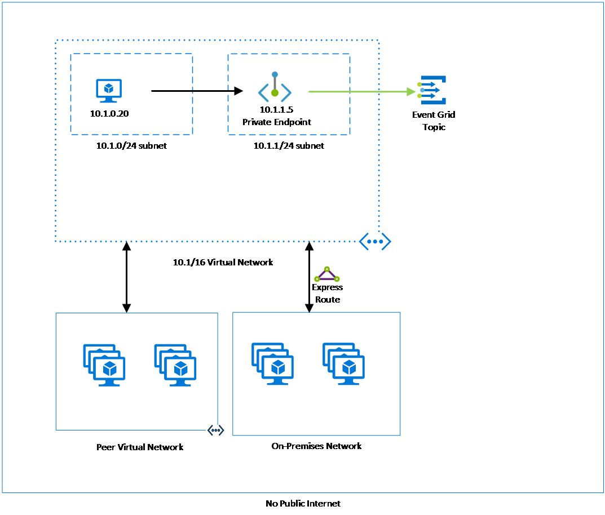

# Network security for Azure Event Grid resources
This article describes how to use the following security features with Azure Event Grid: 

- Service tags for egress
- IP Firewall rules for ingress (preview)
- Private endpoints for ingress

## Service tags
A service tag represents a group of IP address prefixes from a given Azure service. Microsoft manages the address prefixes encompassed by the service tag and automatically updates the service tag as addresses change, minimizing the complexity of frequent updates to network security rules. For more information about service tags, see [Service tags overview](../virtual-network/service-tags-overview.md).

You can use service tags to define network access controls on [network security groups](../virtual-network/security-overview.md#security-rules) or [Azure Firewall](../firewall/service-tags.md). Use service tags in place of specific IP addresses when you create security rules. By specifying the service tag name (for example, **AzureEventGrid**) in the appropriate *source* or *destination* field of a rule, you can allow or deny the traffic for the corresponding service.

| Service tag | Purpose | Can use inbound or outbound? | Can be regional? | Can use with Azure Firewall? |
| --- | -------- |:---:|:---:|:---:|
| AzureEventGrid | Azure Event Grid. | Both | No | No |

## IP firewall 
Azure Event Grid supports IP-based access controls for publishing to topics and domains. With IP-based controls, you can limit the publishers to a topic or domain to only a set of approved set of machines and cloud services. This feature complements the [authentication mechanisms](security-authentication.md) supported by Event Grid.

By default, topic and domain are accessible from internet as long as the request comes with valid authentication and authorization. With IP firewall, you can restrict it further to only a set of IP addresses or IP address ranges in [CIDR (Classless Inter-Domain Routing)](https://en.wikipedia.org/wiki/Classless_Inter-Domain_Routing) notation. Publishers originating from any other IP address will be rejected and will receive a 403 (Forbidden) response.

For step-by-step instructions to configure IP firewall for topics and domains, see [Configure IP firewall](configure-firewall.md).

## Private endpoints
You can use [private endpoints](../private-link/private-endpoint-overview.md) to allow ingress of events directly from your virtual network to your topics and domains securely over a [private link](../private-link/private-link-overview.md) without going through the public internet. A private endpoint is a special network interface for an Azure service in your VNet. When you create a private endpoint for your topic or domain, it provides secure connectivity between clients on your VNet and your Event Grid resource. The private endpoint is assigned an IP address from the IP address range of your VNet. The connection between the private endpoint and the Event Grid service uses a secure private link.

Using private endpoints for your Event Grid resource enables you to:

- Secure access to your topic or domain from a VNet over Microsoft backbone network as opposed to the public internet.
- Securely connect from on-premises networks that connect to the VNet using VPN or ExpressRoutes with private-peering.

When you create a private endpoint for a topic or domain in your VNet, a consent request is sent for approval to the resource owner. If the user requesting the creation of the private endpoint is also an owner of the resource, this consent request is automatically approved. Otherwise, the connection is in **pending** state until approved. Applications in the VNet can connect to the Event Grid service over the private endpoint seamlessly, using the same connection strings and authorization mechanisms that they would use otherwise. Resource owners can manage consent requests and the private endpoints, through the **Private endpoints** tab for the resource in the Azure portal.

### Connect to private endpoints
Publishers on a VNet using the private endpoint should use the same connection string for the topic or domain as clients connecting to the public endpoint. DNS resolution automatically routes connections from the VNet to the topic or domain over a private link. Event Grid creates a [private DNS zone](../dns/private-dns-overview.md) attached to the VNet with the necessary update for the private endpoints, by default. However, if you're using your own DNS server, you may need to make additional changes to your DNS configuration.

### DNS changes for private endpoints
When you create a private endpoint, the DNS CNAME record for the resource is updated to an alias in a subdomain with the prefix `privatelink`. By default, a private DNS zone is created that corresponds to the private link's subdomain. 

When you resolve the topic or domain endpoint URL from outside the VNet with the private endpoint, it resolves to the public endpoint of the service. The DNS resource records for 'topicA', when resolved from **outside the VNet** hosting the private endpoint, will be:

| Name                                          | Type      | Value                                         |
| --------------------------------------------- | ----------| --------------------------------------------- |  
| `topicA.westus.eventgrid.azure.net`             | CNAME     | `topicA.westus.privatelink.eventgrid.azure.net` |
| `topicA.westus.privatelink.eventgrid.azure.net` | CNAME     | \<Azure traffic manager profile\>

You can deny or control access for a client outside the VNet through the public endpoint using the [IP firewall](#ip-firewall). 

When resolved from the VNet hosting the private endpoint, the topic or domain endpoint URL resolves to the private endpoint's IP address. The DNS resource records for the topic 'topicA', when resolved from **inside the VNet** hosting the private endpoint, will be:

| Name                                          | Type      | Value                                         |
| --------------------------------------------- | ----------| --------------------------------------------- |  
| `topicA.westus.eventgrid.azure.net`             | CNAME     | `topicA.westus.privatelink.eventgrid.azure.net` |
| `topicA.westus.privatelink.eventgrid.azure.net` | A         | 10.0.0.5

This approach enables access to the topic or domain using the same connection string for clients on the VNet hosting the private endpoints, and clients outside the VNet.

If you're using a custom DNS server on your network, clients can resolve the FQDN for the topic or domain endpoint to the private endpoint IP address. Configure your DNS server to delegate your private link subdomain to the private DNS zone for the VNet, or configure the A records for `topicOrDomainName.regionName.privatelink.eventgrid.azure.net` with the private endpoint IP address.

The recommended DNS zone name is `privatelink.eventgrid.azure.net`.

### Private endpoints and publishing

The following table describes the various states of the private endpoint connection and the effects on publishing:

| Connection State   |  Successfully publish (Yes/No) |
| ------------------ | -------------------------------|
| Approved           | Yes                            |
| Rejected           | No                             |
| Pending            | No                             |
| Disconnected       | No                             |

For publishing to be successful, the private endpoint connection state should be **approved**. If a connection is rejected, it can't be approved using the Azure portal. The only possibility is to delete the connection and create a new one instead.

## Pricing and quotas
**Private endpoints** is available in both basic and premium tiers of Event Grid. Event Grid allows up to 64 private endpoint connections to be created per topic or domain. 

**IP Firewall** feature is available in both basic and premium tiers of Event Grid. We allow up to 16 IP Firewall rules to be created per topic or domain.

## Next steps
You can configure IP firewall for your Event Grid resource to restrict access over the public internet from only a select set of IP Addresses or IP Address ranges. For step-by-step instructions, see [Configure IP firewall](configure-firewall.md).

You can configure private endpoints to restrict access from only from selected virtual networks. For step-by-step instructions, see [Configure private endpoints](configure-private-endpoints.md).

To troubleshoot network connectivity issues, see [Troubleshoot network connectivity issues](troubleshoot-network-connectivity.md)
