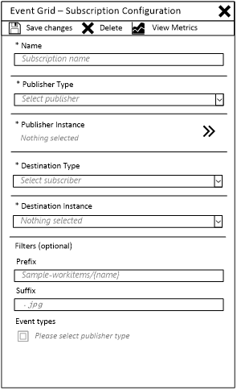
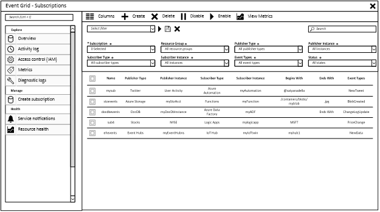

# What is Event Grid?

Azure Event Grid provides reliable distribution of events for all services in Azure and third-party services. It is an eventing backplane that enables event-based programming with publisher/subscriber semantics. Publishers push events to Event Grid, which pushes them to subscribers with WebHooks, queues, and Event Hubs as endpoints. Event Grid takes care of the proper routing, filtering, and multicasting of the events to destinations.

The following image shows a conceptual view of Event Grid's functional place within Azure. 

## Basic concepts

### Events
Events are anything a user may want to react to. Some example events are:

* Create, read, update, or delete a resource 
* New message in a queue
* Tweet
* Change in stock ticker

Events are published by Azure services or third-party services. They include a standard set of properties and publisher defined properties. Events are lightweight objects with a maximum size of 64 kb. They are always published in batches with a minimum batch size of one. The event consumer decides how to handle the event. Details of the event schema and properties can be found in the [Event schema documentation](event-schema.md). 

### Publishers
Event publishers are Azure services or third-party services that are integrated with Event Grid to publish events. With Azure publishers, you do not need to do anything to make the service publish events to your event subscription. As soon as you connect your event subscription to the publisher, it begins publishing events from the connected resource to Event Grid. Third-party services may require you to configure your event publishing.

It is important to note that publishers do not publish events to a specific event subscription. Instead, they push events to Event Grid, and Event Grid matches them to subscriptions. For example, if event A matches the filters for both subscription one and subscription two, the event is pushed by both subscriptions.

Use the Event Grid API to discover the available Event Grid publishers.

### Subscribers
Subscribers are consumers of events. They decide how to react to the events pushed to them. Subscribers can be other Azure services, third-party services such as Slack, or custom web apps. 

### Event subscriptions
Event subscriptions are user configured entities that direct the proper set of events from a publisher to a subscriber. Subscriptions can filter events based on the resource path of the event and the type of event. Subscriptions can deliver events to an Event Hub, a queue, or a WebHook.

When you create an event subscription, all events that match your subscription filter are pushed to the specified endpoint. A subscription's throughput is only limited by what the endpoint can handle.
 
## What do I use Event Grid for?

Event Grid has three main benefits for customers and services in Azure: 

1. Elimination of polling – By providing all services with push-push capabilities, Event Grid eliminates the need for long polling to detect changes. Services and customers no longer need to balance the cost of continuous polling with the latency of widely spaced polling. 
2. Latency – Event Grid aims to deliver events with subsecond latency. Services and user applications can immediately react to events. 
3. Universal backplane – As the preferred method of connecting services within Azure, services no longer need to build customer one-off connections between each other. Once an Azure service is connected as a publisher to Event Grid, and other services can consume events from it. Similarly, when an Azure service is connected as a subscriber, it may now consume events from any other Azure service. 

## How do I use Event Grid?

Using Event Grid is relatively simple. When publishers add an event to Event Grid, they specify the type of event and a full path where the event originated. Consumers create an Event Grid subscription that connects any resource to an HTTP endpoint, Event Hub, or queue hosted by the event consumer. In the Event Grid subscription, consumers filter events based on type and the path. 

You can manage your Event Grid subscriptions through the portal or REST API. 

### Portal

Within the portal, you can manage event subscriptions from three places: 
1. Event publishers blade – You can select Event Subscriptions from the menu, and list all subscriptions consuming events from the source. You can create new subscriptions to consume events from that source. 

2. Event subscribers blade – You can list and create subscriptions.  
   
  

3. Event Grid blade – You can perform management activities for your subscriptions. 

  

### Resource Manager REST API

You can programmatically perform management operations with Event Grid REST API. Using the REST API, you can:

* discover publishers
* view the available events and their schemas for each publisher
* create new Event Grid subscriptions
* list subscriptions, and filter by event source or destination
* update subscriptions
* delete subscriptions 

## Next steps

* To create your first Event Grid publisher and subscriber, see [Create and route custom events](custom-event-quickstart.md).
