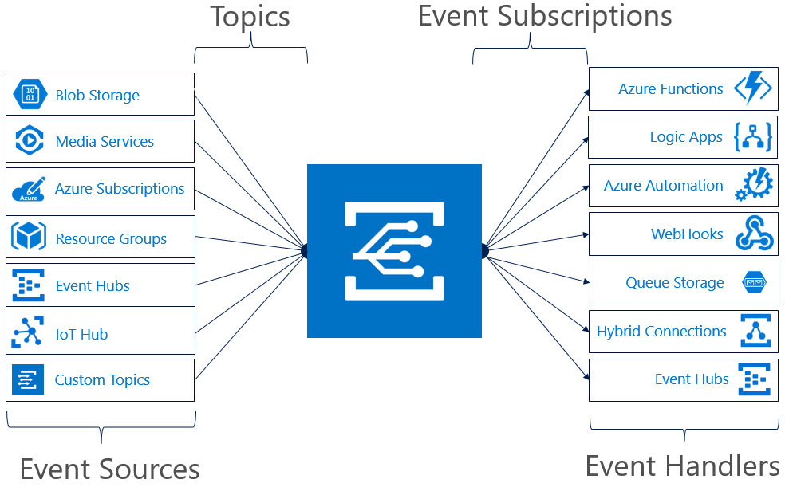
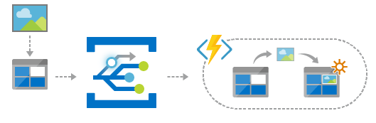
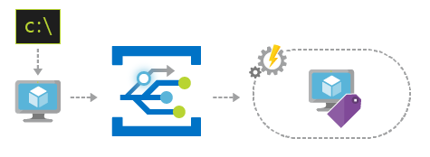
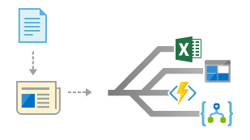

# An introduction to Azure Event Grid

Azure Event Grid allows you to easily build applications with event-based architectures. First select the Azure resource you would like to subscribe to, and then give the event handler or WebHook endpoint to send the event to. Event Grid has built-in support for events coming from Azure services, like storage blobs and resource groups. Event Grid also has support for your own events, using custom topics. 

You can use filters to route specific events to different endpoints, multicast to multiple endpoints, and make sure your events are reliably delivered.

Currently, Azure Event Grid is available in all public regions. It is not yet available in the Azure Germany, Azure China, or Azure Government clouds.

This article provides an overview of Azure Event Grid. If you want to get started with Event Grid, see [Create and route custom events with Azure Event Grid](custom-event-quickstart.md). 

Please note: this image shows how Event Grid connects sources and handlers, and is not a comprehensive list of supported integrations.

## Event sources

For full details on the capabilities of each source as well as related articles, see [event sources](event-sources.md). Currently, the following Azure services support sending events to Event Grid:

* Azure Subscriptions (management operations)
* Container Registry
* Custom Topics
* Event Hubs
* IoT Hub
* Media Services
* Resource Groups (management operations)
* Service Bus
* Storage Blob
* Storage General-purpose v2 (GPv2)

## Event handlers

For full details on the capabilities of each handler as well as related articles, see [event handlers](event-handlers.md). Currently, the following Azure services support handling events from Event Grid: 

* Azure Automation
* Azure Functions
* Event Hubs
* Hybrid Connections
* Logic Apps
* Microsoft Flow
* Queue Storage
* WebHooks

## Concepts

There are five concepts in Azure Event Grid that let you get going:

* **Events** - What happened.
* **Event sources** - Where the event took place.
* **Topics** - The endpoint where publishers send events.
* **Event subscriptions** - The endpoint or built-in mechanism to route events, sometimes to multiple handlers. Subscriptions are also used by handlers to intelligently filter incoming events.
* **Event handlers** - The app or service reacting to the event.

For more information about these concepts, see [Concepts in Azure Event Grid](concepts.md).

## Capabilities

Here are some of the key features of Azure Event Grid:

* **Simplicity** - Point and click to aim events from your Azure resource to any event handler or endpoint.
* **Advanced filtering** - Filter on event type or event publish path to ensure event handlers only receive relevant events.
* **Fan-out** - Subscribe multiple endpoints to the same event to send copies of the event to as many places as needed.
* **Reliability** - Utilize 24-hour retry with exponential backoff to ensure events are delivered.
* **Pay-per-event** - Pay only for the amount you use Event Grid.
* **High throughput** - Build high-volume workloads on Event Grid with support for millions of events per second.
* **Built-in Events** - Get up and running quickly with resource-defined built-in events.
* **Custom Events** - Use Event Grid route, filter, and reliably deliver custom events in your app.

For a comparison of Event Grid, Event Hubs, and Service Bus, see [Choose between Azure services that deliver messages](compare-messaging-services.md).

## What can I do with Event Grid?

Azure Event Grid provides several capabilities that vastly improve serverless, ops automation, and integration work: 

### Serverless application architectures

Event Grid connects data sources and event handlers. For example, use Event Grid to instantly trigger a serverless function to run image analysis each time a new photo is added to a blob storage container. 

### Ops Automation

Event Grid allows you to speed automation and simplify policy enforcement. For example, Event Grid can notify Azure Automation when a virtual machine is created, or a SQL Database is spun up. These events can be used to automatically check that service configurations are compliant, put metadata into operations tools, tag virtual machines, or file work items.

### Application integration

Event Grid connects your app with other services. For example, create a custom topic to send your app's event data to Event Grid, and take advantage of its reliable delivery, advanced routing, and direct integration with Azure. Alternatively, you can use Event Grid with Logic Apps to process data anywhere, without writing code. 

## How much does Event Grid cost?

Azure Event Grid uses a pay-per-event pricing model, so you only pay for what you use. The first 100,000 operations per month are free. Operations are defined as event ingress, subscription delivery attempts, management calls, and filtering by subject suffix. For details, see the [pricing page](https://azure.microsoft.com/pricing/details/event-grid/).

## Next steps

* [Route Storage Blob events](../storage/blobs/storage-blob-event-quickstart.md?toc=%2fazure%2fevent-grid%2ftoc.json)  
  Respond to storage blob events by using Event Grid.
* [Create and subscribe to custom events](custom-event-quickstart.md)  
  Jump right in and start sending your own custom events to any endpoint using the Azure Event Grid quickstart.
* [Using Logic Apps as an Event Handler](monitor-virtual-machine-changes-event-grid-logic-app.md)  
  A tutorial on building an app using Logic Apps to react to events pushed by Event Grid.
* [Stream big data into a data warehouse](event-grid-event-hubs-integration.md)  
  A tutorial that uses Azure Functions to stream data from Event Hubs to SQL Data Warehouse.
* [Event Grid REST API reference](/rest/api/eventgrid)  
  Provides more technical information about the Azure Event Grid, and a reference for managing Event Subscriptions, routing, and filtering.
