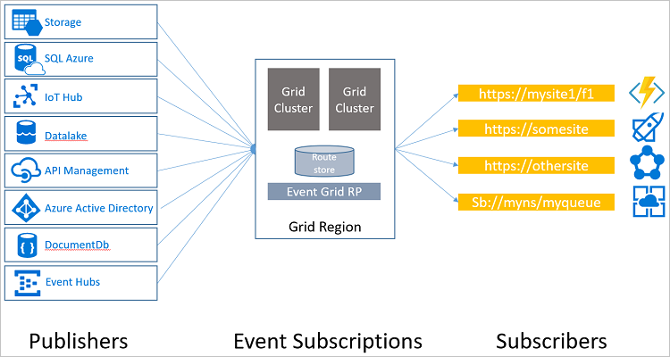

# An introduction to Azure Event Grid

Azure Event Grid allows you to easily build applications with event-based architectures. You select the Azure resource you would like to subscribe to, and give the event handler or WebHook endpoint to send the event to. Event Grid has built-in support for events coming from Azure services, like storage blobs and resource groups. Event Grid also has custom support for application and third-party events, using custom topics and custom webhooks. 

You can use filters to route specific events to different endpoints, multicast to multiple endpoints, and make sure your events are reliably delivered. Event Grid also has built in support for custom and third-party events.

For the preview release, Event Grid supports **westus2** and **westcentralus** locations. Other regions will be added.

This article provides an overview of Azure Event Grid. If you want to get started with Event Grid, see [Create and route custom events with Azure Event Grid](custom-event-quickstart.md).

Currently, Blob Storage is not publicly available as a publisher. You must register for the preview release to react to storage blob events. For more information, see [Route Blob storage events to a custom web endpoint (preview)](../storage/blobs/storage-blob-event-quickstart.md?toc=%2fazure%2fevent-grid%2ftoc.json)

## Concepts

There are five concepts in Azure Event Grid that let you get going:

* **Events** - What happened.
* **Event sources/publishers** - Where the event took place.
* **Topics** - The endpoint where publishers send events.
* **Event subscriptions** - The endpoint or built-in mechanism to route events, sometimes to multiple handlers. Subscriptions are also used by handlers to intelligently filter incoming events.
* **Event handlers** - The app or service reacting to the event.

For more information about these concepts, see [Concepts in Azure Event Grid](concepts.md).

## Capabilities

Here are some of the key features of Azure Event Grid:

* **Simplicity** - Point and click to aim events from your Azure resource to any event handler or endpoint.
* **Advanced filtering** - Filter on event type or event publish path to ensure event handlers only receive relevant events.
* **Fan-out** - Subscribe multiple endpoints to the same event to send copies of the event to as many places as needed.
* **Reliability** - Utilize 24-hour retry with exponential backoff to ensure events are delivered.
* **Pay-per-event** - Pay only for the amount you use Event Grid.
* **High throughput** - Build high-volume workloads on Event Grid with support for millions of events per second.
* **Built-in Events** - Get up and running quickly with resource-defined built-in events.
* **Custom Events** - use Event Grid route, filter, and reliably deliver custom events in your app.

## Built-in publisher and handler integration

Azure offers built-in event support using numerous services, including both publishers and handlers.

### Publishers

Currently, the following Azure services have built-in publisher support for event grid:

* Resource Groups (management operations)
* Azure Subscriptions (management operations)
* Event Hubs
* Custom Topics

Other Azure services will be added this year.

### Handlers

Currently, the following Azure services have built-in handler support for Event Grid: 

* Azure Functions
* Logic Apps
* Azure Automation
* WebHooks
* Microsoft Flow

Other Azure services will be added this year.

## What can I do with Event Grid?

Azure Event Grid provides several capabilities that vastly improve serverless, ops automation, and integration work: 

### Serverless application architectures

Event Grid connects data sources and event handlers. For example, use Event Grid to instantly trigger a serverless function to run image analysis each time a new photo is added to a blob storage container. 

### Ops Automation

Event Grid allows you to speed automation and simplify policy enforcement. For example, Event Grid can notify Azure Automation when a virtual machine is created, or a SQL Database is spun up. These events can be used to automatically check that service configurations are compliant, put metadata into operations tools, tag virtual machines, or file work items.

### Application integration

Event Grid connects your app with other services. For example, create a custom topic to send your app's event data to Event Grid, and take advantage of its reliable delivery, advanced routing, and direct integration with Azure. Alternatively, you can use Event Grid with Logic Apps to process data anywhere, without writing code. 

## How is Event Grid different from other Azure integration services?

Event Grid is an eventing backplane that enables event-driven, reactive programming. It is deeply integrated with Azure services and can be integrated with third-party services. The event message contains the information you need to react to changes in services and applications. Event Grid is not a data pipeline, and does not deliver the actual object that was updated.

Service Bus is well suited for traditional enterprise applications that require transactions, ordering, duplicate detection, and instantaneous consistency. Event Grid is designed for speed, scale, breadth, and low cost in a reactive model. It is well suited to serverless architecture.

Event Grid complements other Azure services like Logic Apps and Event Hubs. Event Grid triggers the logic app to begin its workflow. Event Hubs works with Event Grid by enabling you to react to events from Event Hubs Capture, and build data ingress and transformation pipelines.

## How much does Event Grid cost?

Azure Event Grid uses a pay-per-event pricing model, so you only pay for what you use.

Event Grid costs $0.60 per million operations ($0.30 during preview) and the first 100,000 operation per month are free. Operations are defined as event ingress, advanced match, delivery attempt, and management calls.  More details can be found on the [pricing page](https://azure.microsoft.com/pricing/details/event-grid/).

## Next steps

* [Create and subscribe to custom events](custom-event-quickstart.md)  
  Jump right in and start sending your own custom events to any endpoint using the Azure Event Grid quickstart.
* [Using Logic Apps as an Event Handler](monitor-virtual-machine-changes-event-grid-logic-app.md)  
  A tutorial on building an app using Logic Apps to react to events pushed by Event Grid.
* [Stream big data into a data warehouse](event-grid-event-hubs-integration.md)  
  A tutorial that uses Azure Functions to stream data from Event Hubs to SQL Data Warehouse.
* [Event Grid REST API reference](/rest/api/eventgrid)  
  Provides more technical information about the Azure Event Grid, and a reference for managing Event Subscriptions, routing, and filtering.