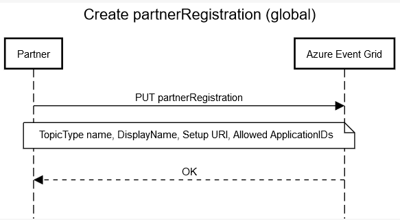
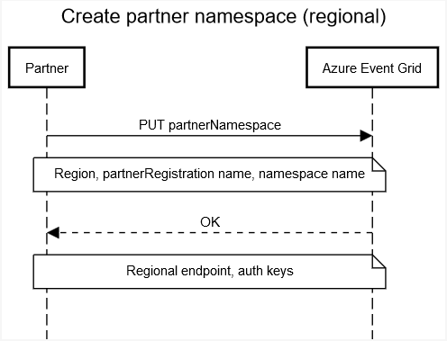
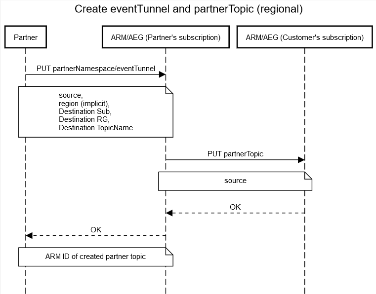
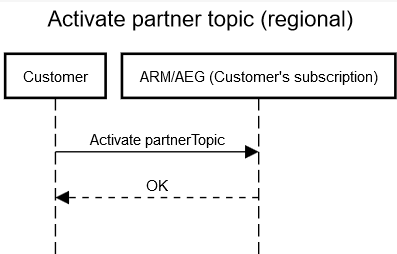

# Partner onboarding overview (Azure Event Grid)

This article describes how to privately use the Azure Event Grid partner resources and how to become a publicly available partner topic type.

You don't need special permission to begin using the Event Grid resource types associated with publishing events as an Event Grid partner. In fact, you can use them today to publish events privately to your own Azure subscriptions and to test out the resource model if you're considering becoming a partner.

> [!NOTE]
> For step-by-step instruction on how to onboard as an Event Grid partner by using the Azure portal, see [How to onboard as an Event Grid partner (Azure portal)](onboard-partner.md). 

## How Partner Events work
The Partner Events feature take the existing architecture that Event Grid already uses to publish events from Azure resources, such as Azure Storage and Azure IoT Hub, and makes those tools publicly available for anyone to use. Using these tools is by default private to your Azure subscription only. To make your events publicly available, fill out the form and [contact the Event Grid team](mailto:gridpartner@microsoft.com).

The Partner Events feature allow you to publish events to Azure Event Grid for multitenant consumption.

## Onboarding and event publishing overview

### Partner flow

1. Create an Azure tenant if you don't already have one.
1. Use the Azure CLI to create a new Event Grid `partnerRegistration`. This resource includes information such as display name, description, setup URI, and so on.

    

1. Create one or more partner namespaces in each region where you want to publish events. The Event Grid service provisions a publishing endpoint (for example, `https://contoso.westus-1.eventgrid.azure.net/api/events`) and access keys.

    

1. Provide a way for customers to register in your system that they want a partner topic.
1. Contact the Event Grid team to let them know you want your partner topic type to become public.

### Customer flow

1. Your customer visits the Azure portal to note the Azure subscription ID and resource group they want the partner topic created in.
1. The customer requests a partner topic via your system. In response, you create an event tunnel to your partner namespace.
1. Event Grid creates a **Pending** partner topic in the customer's Azure subscription and resource group.

    

1. The customer activates the partner topic via the Azure portal. Events may now flow from your service to the customer's Azure subscription.

    

## Resource model
The following resource model is for Partner Events.

### Partner registrations
* Resource: `partnerRegistrations`
* Used by: Partners
* Description: Captures the global metadata of the software as a service (SaaS) partner (for example, name, display name, description, setup URI).
    
    Creating or updating a partner registration is a self-serve operation for the partners. This self-serve ability enables partners to build and test the complete end-to-end flow.
    
    Only Microsoft-approved partner registrations are discoverable by customers.
* Scope: Created in the partner's Azure subscription. Metadata is visible to customers after it's made public.

### Partner namespaces
* Resource: `partnerNamespaces`
* Used by: Partners
* Description: Provides a regional resource for publishing customer events to. Each partner namespace has a publishing endpoint and auth keys. The namespace is also how the partner requests a partner topic for a given customer and lists active customers.
* Scope: Lives in the partner's subscription.

### Event channel
* Resource: `partnerNamespaces/eventChannels`
* Used by: Partners
* Description: The event channels are a mirror of the customer's partner topic. By creating an event channel and specifying the customer's Azure subscription and resource group in the metadata, you signal to Event Grid to create a partner topic for the customer. Event Grid issues an Azure Resource Manager call to create a corresponding partner topic in the customer's subscription. The partner topic is created in a pending state. There's a one-to-one link between each event channel and partner topic.
* Scope: Lives in the partner's subscription.

### Partner topics
* Resource: `partnerTopics`
* Used by: Customers
* Description: Partner topics are similar to custom topics and system topics in Event Grid. Each partner topic is associated with a specific source (for example, `Contoso:myaccount`) and a specific partner topic type (for example, Contoso). Customers create event subscriptions on the partner topic to route events to various event handlers.

    Customers can't directly create this resource. The only way to create a partner topic is through a partner operation that creates an event channel.
* Scope: Lives in the customer's subscription.

### Partner topic types
* Resource: `partnerTopicTypes`
* Used by: Customers
* Description: Partner topic types are tenant-wide resource types that enable customers to discover the list of approved partner topic types. The URL looks like https://management.azure.com/providers/Microsoft.EventGrid/partnerTopicTypes)
* Scope: Global

## Publish events to Event Grid
When you create a partner namespace in an Azure region, you get a regional endpoint and corresponding auth keys. Publish batches of events to this endpoint for all customer event channels in that namespace. Based on the source field in the event, Azure Event Grid maps each event with the corresponding partner topics.

### Event schema: CloudEvents v1.0
Publish events to Azure Event Grid by using the CloudEvents 1.0 schema. Event Grid supports both structured mode and batched mode. CloudEvents 1.0 is the only supported event schema for partner namespaces.

### Example flow

1.	The publishing service does an HTTP POST to `https://contoso.westus2-1.eventgrid.azure.net/api/events?api-version=2018-01-01`.
1.	In the request, include a header value named aeg-sas-key that contains a key for authentication. This key is provisioned during the creation of the partner namespace. For example, a valid header value is aeg-sas-key: VXbGWce53249Mt8wuotr0GPmyJ/nDT4hgdEj9DpBeRr38arnnm5OFg==.
1.	Set the Content-Type header to "application/cloudevents-batch+json; charset=UTF-8a".
1.	Run an HTTP POST query to the publishing URL with a batch of events that correspond to that region. For example:

``` json
[
{
    "specversion" : "1.0-rc1",
    "type" : "com.contoso.ticketcreated",
    "source" : " com.contoso.account1",
    "subject" : "tickets/123",
    "id" : "A234-1234-1234",
    "time" : "2019-04-05T17:31:00Z",
    "comexampleextension1" : "value",
    "comexampleothervalue" : 5,
    "datacontenttype" : "application/json",
    "data" : {
          object-unique-to-each-publisher
    }
},
{
    "specversion" : "1.0-rc1",
    "type" : "com.contoso.ticketclosed",
    "source" : "https://contoso.com/account2",
    "subject" : "tickets/456",
    "id" : "A234-1234-1234",
    "time" : "2019-04-05T17:31:00Z",
    "comexampleextension1" : "value",
    "comexampleothervalue" : 5,
    "datacontenttype" : "application/json",
    "data" : {
          object-unique-to-each-publisher
    }
}
]
```

After posting to the partner namespace endpoint, you receive a response. The response is a standard HTTP response code. Some common responses are:

| Result                             | Response              |
|------------------------------------|-----------------------|
| Success                            | 200 OK                |
| Event data has incorrect format    | 400 Bad Request       |
| Invalid access key                 | 401 Unauthorized      |
| Incorrect endpoint                 | 404 Not Found         |
| Array or event exceeds size limits | 413 Payload Too Large |

## References

  * [Swagger](https://github.com/ahamad-MS/azure-rest-api-specs/blob/master/specification/eventgrid/resource-manager/Microsoft.EventGrid/preview/2020-04-01-preview/EventGrid.json)
  * [ARM template](/azure/templates/microsoft.eventgrid/allversions)
  * [ARM template schema](https://github.com/Azure/azure-resource-manager-schemas/blob/master/schemas/2020-04-01-preview/Microsoft.EventGrid.json)
  * [REST APIs](/azure/templates/microsoft.eventgrid/2020-04-01-preview/partnernamespaces)
  * [CLI extension](/cli/azure/)

### SDKs
  * [.NET](https://www.nuget.org/packages/Microsoft.Azure.Management.EventGrid/5.3.1-preview)
  * [Python](https://pypi.org/project/azure-mgmt-eventgrid/3.0.0rc6/)
  * [Java](https://search.maven.org/artifact/com.microsoft.azure.eventgrid.v2020_04_01_preview/azure-mgmt-eventgrid/1.0.0-beta-3/jar)
  * [Ruby](https://rubygems.org/gems/azure_mgmt_event_grid/versions/0.19.0)
  * [JS](https://www.npmjs.com/package/@azure/arm-eventgrid/v/7.0.0)
  * [Go](https://github.com/Azure/azure-sdk-for-go)


## Next steps
- [Partner topics overview](partner-events-overview.md)
- [Partner topics onboarding form](https://aka.ms/gridpartnerform)
- [Auth0 partner topic](auth0-overview.md)
- [How to use the Auth0 partner topic](auth0-how-to.md)
