# Tutorial: Send email notifications about Azure IoT Hub events using Event Grid and Logic Apps

Azure Event Grid enables you to react to events in IoT Hub by triggering actions in your downstream business applications.

This article walks through a sample configuration that uses IoT Hub and Event Grid. At the end, you have an Azure logic app set up to send a notification email every time a device is added to your IoT hub. 

## Prerequisites

* An active Azure subscription. If you don't have a subscription, you can [create a free Azure account](https://azure.microsoft.com/pricing/free-trial/).

* An email account from any email provider that is supported by Azure Logic Apps, such as Office 365 Outlook, Outlook.com, or Gmail. This email account is used to send the event notifications. For a complete list of supported Logic App connectors, see the [Connectors overview](https://docs.microsoft.com/connectors/).

  > [!IMPORTANT]
  > Before you use Gmail, check whether you have a G-Suite business account (email address with a custom domain) 
  > or a Gmail consumer account (email address with @gmail.com or @googlemail.com). Only G-Suite business accounts 
  > can use the Gmail connector with other connectors without restriction in logic apps. If you have a Gmail consumer account, 
  > you can use the Gmail connector with only specific Google-approved services, or you can 
  > [create a Google client app to use for authentication](https://docs.microsoft.com/connectors/gmail/#authentication-and-bring-your-own-application). 
  > For more information, see [Data security and privacy policies for Google connectors in Azure Logic Apps](../connectors/connectors-google-data-security-privacy-policy.md).

* An IoT Hub in Azure. If you haven't created one yet, see [Get started with IoT Hub](../iot-hub/iot-hub-csharp-csharp-getstarted.md) for a walkthrough.

## Create a logic app

First, create a logic app and add an event grid trigger that monitors the resource group for your virtual machine. 

### Create a logic app resource

1. In the [Azure portal](https://portal.azure.com), select **Create a resource**, then type "logic app" in the search box and select return. Select **Logic App** from the results.

   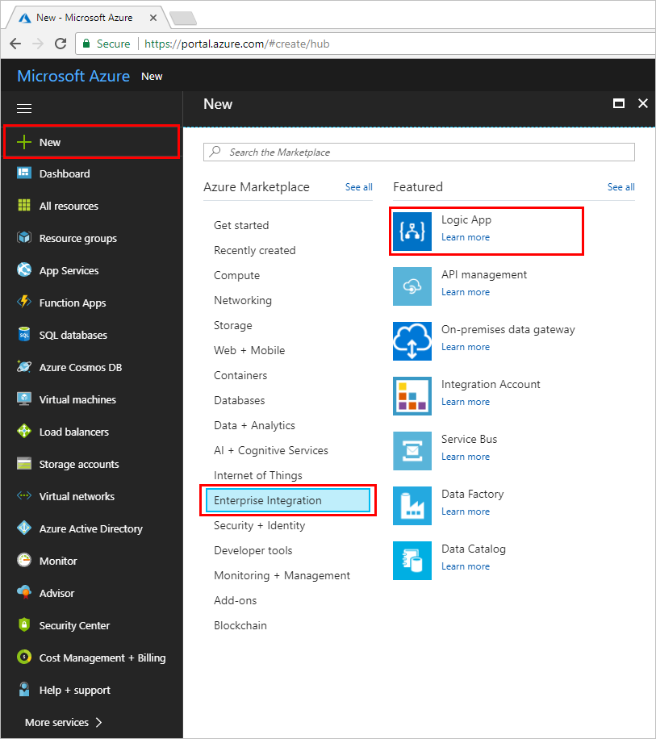

1. On the next screen, select **Create**. 

1. Give your logic app a name that's unique in your subscription, then select the same subscription, resource group, and location as your IoT hub. 

   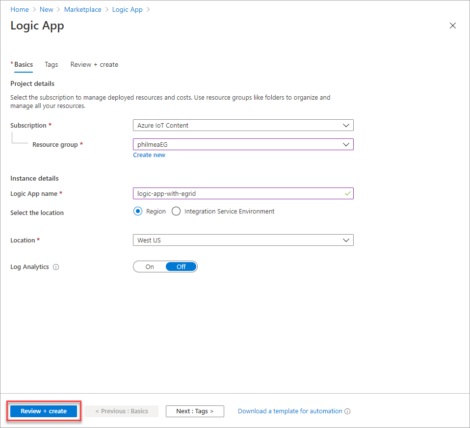

1. Select **Create**.

1. Once the resource is created, navigate to your logic app. To do this, select **Resource groups**, then select the resource group you created for this tutorial. Then find the logic app in the list of resources and select it. 

1. In the Logic Apps Designer, page down to see **Templates**. Choose **Blank Logic App** so that you can build your logic app from scratch.

### Select a trigger

A trigger is a specific event that starts your logic app. For this tutorial, the trigger that sets off the workflow is receiving a request over HTTP.  

1. In the connectors and triggers search bar, type **HTTP**.

1. Select **Request - When an HTTP request is received** as the trigger. 

   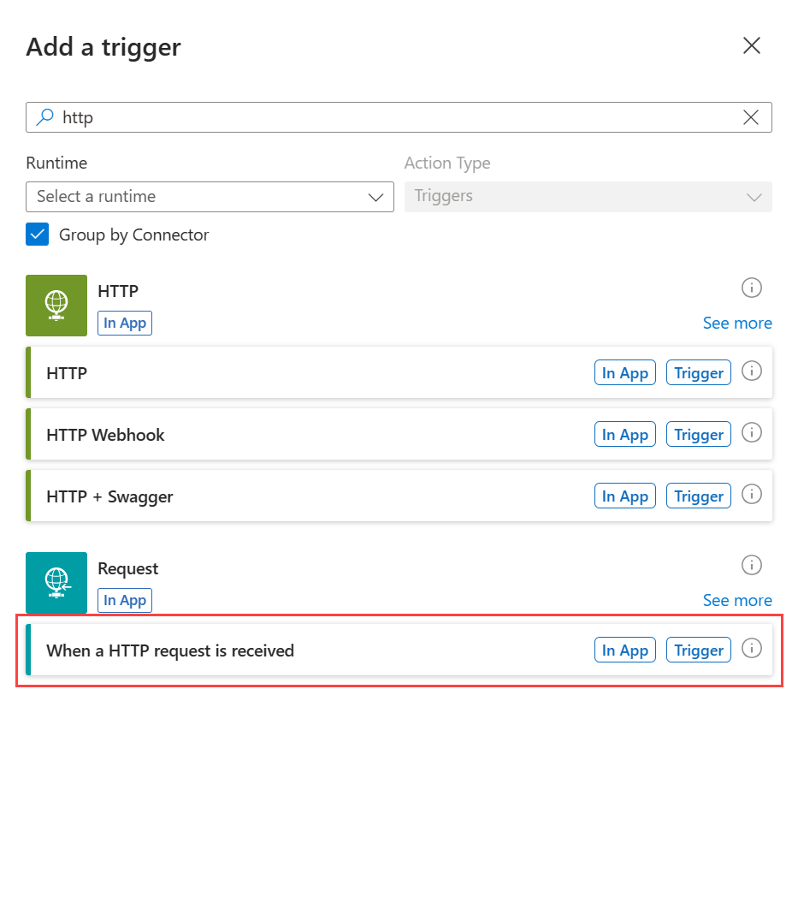

1. Select **Use sample payload to generate schema**. 

   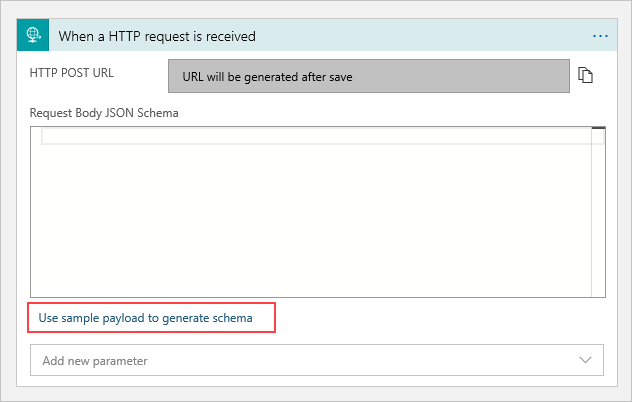

1. Paste the following sample JSON code into the text box, then select **Done**:

   ```json
   [{
     "id": "56afc886-767b-d359-d59e-0da7877166b2",
     "topic": "/SUBSCRIPTIONS/<subscription ID>/RESOURCEGROUPS/<resource group name>/PROVIDERS/MICROSOFT.DEVICES/IOTHUBS/<hub name>",
     "subject": "devices/LogicAppTestDevice",
     "eventType": "Microsoft.Devices.DeviceCreated",
     "eventTime": "2018-01-02T19:17:44.4383997Z",
     "data": {
       "twin": {
         "deviceId": "LogicAppTestDevice",
         "etag": "AAAAAAAAAAE=",
         "deviceEtag": "null",
         "status": "enabled",
         "statusUpdateTime": "0001-01-01T00:00:00",
         "connectionState": "Disconnected",
         "lastActivityTime": "0001-01-01T00:00:00",
         "cloudToDeviceMessageCount": 0,
         "authenticationType": "sas",
         "x509Thumbprint": {
           "primaryThumbprint": null,
           "secondaryThumbprint": null
         },
         "version": 2,
         "properties": {
           "desired": {
             "$metadata": {
               "$lastUpdated": "2018-01-02T19:17:44.4383997Z"
             },
             "$version": 1
           },
           "reported": {
             "$metadata": {
               "$lastUpdated": "2018-01-02T19:17:44.4383997Z"
             },
             "$version": 1
           }
         }
       },
       "hubName": "egtesthub1",
       "deviceId": "LogicAppTestDevice"
     },
     "dataVersion": "1",
     "metadataVersion": "1"
   }]
   ```

1. You may receive a pop-up notification that says, **Remember to include a Content-Type header set to application/json in your request.** You can safely ignore this suggestion, and move on to the next section. 

### Create an action

Actions are any steps that occur after the trigger starts the logic app workflow. For this tutorial, the action is to send an email notification from your email provider. 

1. Select **New step**. This opens a window to **Choose an action**.

1. Search for **Email**.

1. Based on your email provider, find and select the matching connector. This tutorial uses **Office 365 Outlook**. The steps for other email providers are similar. 

   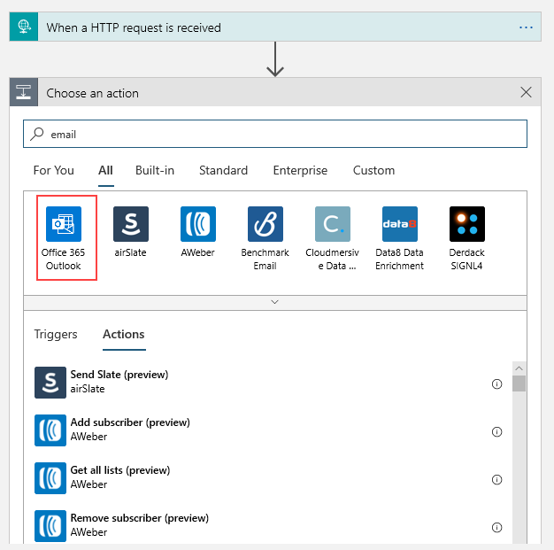

1. Select the **Send an email** action. 

1. If prompted, sign in to your email account. 

1. Build your email template. 

   * **To**: Enter the email address to receive the notification emails. For this tutorial, use an email account that you can access for testing. 

   * **Subject**: Fill in the text for the subject. When you click on the Subject text box, you can select dynamic content to include. For example, this tutorial uses `IoT Hub alert: {event Type}`. If you can't see Dynamic content, select the **Add dynamic content** hyperlink -- this toggles it on and off.

   * **Body**: Write the text for your email. Select JSON properties from the selector tool to include dynamic content based on event data. If you can't see the Dynamic content, select the **Add dynamic content** hyperlink under the **Body** text box. If it doesn't show you the fields you want, click *more* in the Dynamic content screen to include the fields from the previous action.

   Your email template may look like this example:

   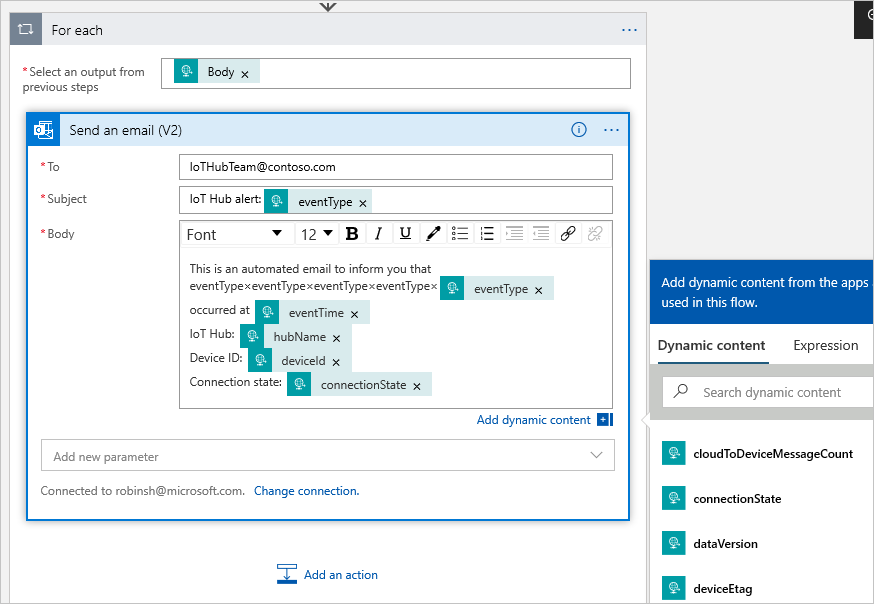

1. Save your logic app. 

### Copy the HTTP URL

Before you leave the Logic Apps Designer, copy the URL that your logic apps is listening to for a trigger. You use this URL to configure Event Grid. 

1. Expand the **When a HTTP request is received** trigger configuration box by clicking on it. 

1. Copy the value of **HTTP POST URL** by selecting the copy button next to it. 

   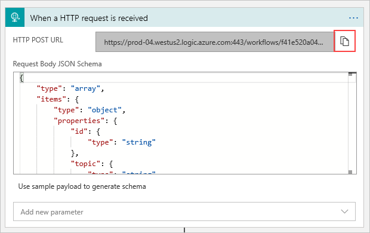

1. Save this URL so that you can refer to it in the next section. 

## Configure subscription for IoT Hub events

In this section, you configure your IoT Hub to publish events as they occur. 

1. In the Azure portal, navigate to your IoT hub. You can do this by selecting **Resource groups**, then select the resource group for this tutorial, and then select your IoT hub from the list of resources.

2. Select **Events**.

   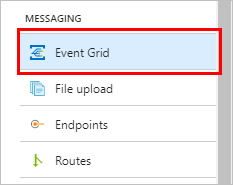

3. Select **Event subscription**. 

   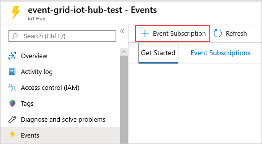

4. Create the event subscription with the following values: 

    1. In the **EVENT SUBSCRIPTION DETAILS** section, do the following tasks:
        1. Provide a **name** for the event subscription. 
        2. Select **Event Grid Schema** for **Event Schema**. 
   2. In the **TOPIC DETAILS** section, do the following tasks:
       1. Confirm that the **Topic type** is set to **IoT Hub**. 
       2. Confirm that the name of the IoT hub is set as the value for the **Source Resource** field. 
       3. Enter a name for the **system topic** that will be created for you. To learn about system topics, see [Overview of system topics](system-topics.md).
   3. In the **EVENT TYPES** section, do the following tasks: 
        1. For **Filter to Event Types**, uncheck all of the choices except **Device Created**.

           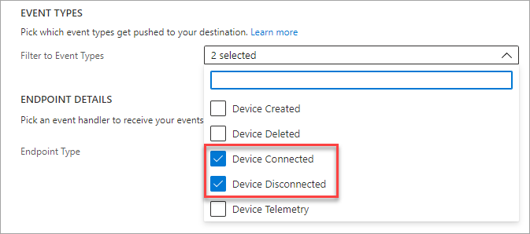
   4. In the **ENDPOINT DETAILS** section, do the following tasks: 
       1. Select **Endpoint Type** as **Web Hook**.
       2. Click **select an endpoint**, paste the URL that you copied from your logic app, and confirm selection.

         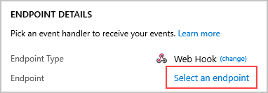

         When you're done, the pane should look like the following example: 

        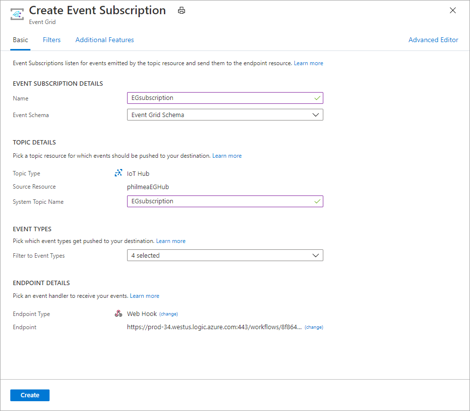

5. You could save the event subscription here, and receive notifications for every device that is created in your IoT hub. For this tutorial, though, let's use the optional fields to filter for specific devices. Select **Filters** at the top of the pane.

6. Select **Add new filter**. Fill in the fields with these values:

   * **Key**: Select `Subject`.

   * **Operator**: Select `String begins with`.

   * **Value**:  Enter `devices/Building1_` to filter for device events in building 1.
  
   Add another filter with these values:

   * **Key**: Select `Subject`.

   * **Operator**: Select `String ends with`.

   * **Value**: Enter `_Temperature` to filter for device events related to temperature.

   The **Filters** tab of your event subscription should now look similar to this image:

   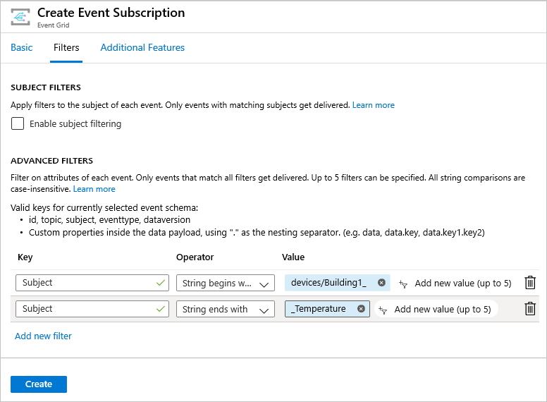

7. Select **Create** to save the event subscription.

## Create a new device

Test your logic app by creating a new device to trigger an event notification email. 

1. From your IoT hub, select **IoT Devices**. 

2. Select **New**.

3. For **Device ID**, enter `Building1_Floor1_Room1_Light`.

4. Select **Save**. 

5. You can add multiple devices with different device IDs to test the event subscription filters. Try these examples: 

   * Building1_Floor1_Room1_Light
   * Building1_Floor2_Room2_Temperature
   * Building2_Floor1_Room1_Temperature
   * Building2_Floor1_Room1_Light

   If you added the four examples, your list of IoT devices should look like the following image:

   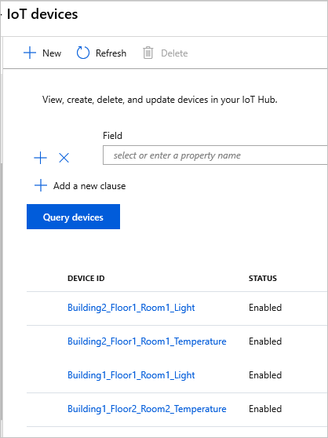

6. Once you've added a few devices to your IoT hub, check your email to see which ones triggered the logic app. 

## Use the Azure CLI

Instead of using the Azure portal, you can accomplish the IoT Hub steps using the Azure CLI. For details, see the Azure CLI pages for [creating an event subscription](https://docs.microsoft.com/cli/azure/eventgrid/event-subscription) and [creating an IoT device](https://docs.microsoft.com/cli/azure/ext/azure-iot/iot/hub/device-identity).

## Clean up resources

This tutorial used resources that incur charges on your Azure subscription. When you're finished trying out the tutorial and testing your results, disable or delete resources that you don't want to keep. 

To delete all of the resources created in this tutorial, delete the resource group. 

1. Select **Resource groups**, then select the resource group you created for this tutorial.

2. On the Resource group pane, select **Delete resource group**. You are prompted to enter the resource group name, and then you can delete it. All of the resources contained therein are also removed.

If you don't want to remove all of the resources, you can manage them one by one. 

If you don't want to lose the work on your logic app, disable it instead of deleting it. 

1. Navigate to your logic app.

2. On the **Overview** blade select **Delete** or **Disable**. 

Each subscription can have one free IoT hub. If you created a free hub for this tutorial, then you don't need to delete it to prevent charges.

1. Navigate to your IoT hub. 

2. On the **Overview** blade select **Delete**. 

Even if you keep your IoT hub, you may want to delete the event subscription that you created. 

1. In your IoT hub, select **Event Grid**.

2. Select the event subscription that you want to remove. 

3. Select **Delete**. 

## Next steps

* Learn more about [Reacting to IoT Hub events by using Event Grid to trigger actions](../iot-hub/iot-hub-event-grid.md).
* [Learn how to order device connected and disconnected events](../iot-hub/iot-hub-how-to-order-connection-state-events.md)
* Learn about what else you can do with [Event Grid](overview.md).