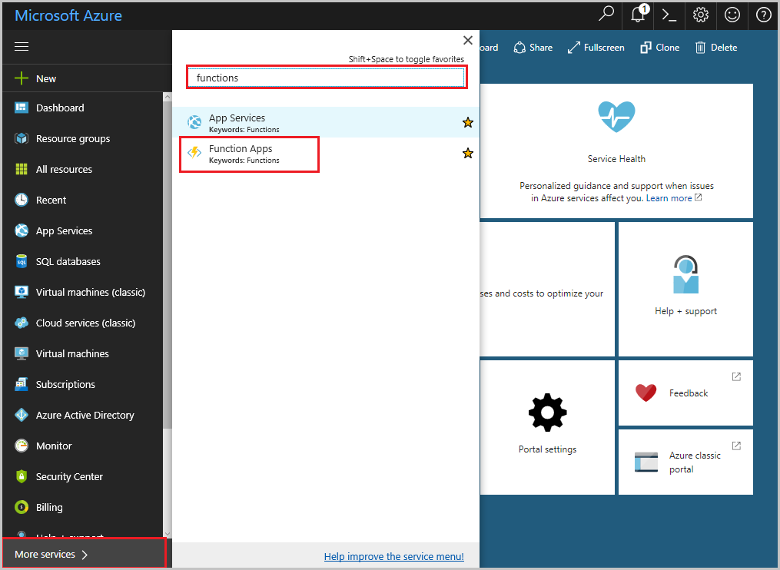
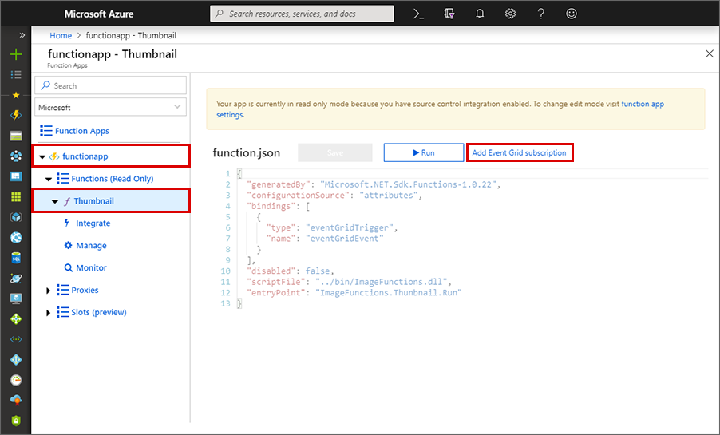
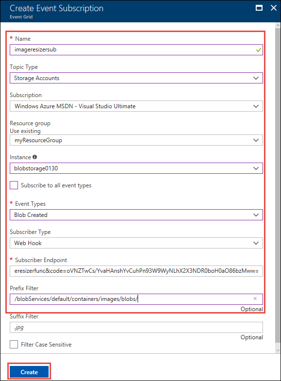

# Automate resizing uploaded images using Event Grid

[Azure Event Grid](overview.md) is an eventing service for the cloud. Event Grid enables you to create subscriptions to events raised by Azure services or third-party resources.  

This tutorial is part two of a series of Storage tutorials. It extends the [previous Storage tutorial][previous-tutorial] to add serverless automatic thumbnail generation using Azure Event Grid and Azure Functions. Event Grid enables [Azure Functions](..\azure-functions\functions-overview.md) to respond to [Azure Blob storage](..\storage\blobs\storage-blobs-introduction.md) events and generate thumbnails of uploaded images. An event subscription is created against the Blob storage create event. When a blob is added to a specific Blob storage container, a function endpoint is called. Data passed to the function binding from Event Grid is used to access the blob and generate the thumbnail image.

You use the Azure CLI and the Azure portal to add the resizing functionality to an existing image upload app.


In this tutorial, you learn how to:

> [!div class="checklist"]
> * Create a general Azure Storage account
> * Deploy serverless code using Azure Functions
> * Create a Blob storage event subscription in Event Grid

## Prerequisites

To complete this tutorial:

You must have completed the previous Blob storage tutorial: [Upload image data in the cloud with Azure Storage][previous-tutorial].

[!INCLUDE [quickstarts-free-trial-note](../../includes/quickstarts-free-trial-note.md)]

If you've not previously registered the Event Grid resource provider in your subscription, make sure it's registered.

```azurepowershell-interactive
Register-AzureRmResourceProvider -ProviderNamespace Microsoft.EventGrid
```

```azurecli-interactive
az provider register --namespace Microsoft.EventGrid
```

[!INCLUDE [cloud-shell-try-it.md](../../includes/cloud-shell-try-it.md)]

If you choose to install and use the CLI locally, this tutorial requires the Azure CLI version 2.0.14 or later. Run `az --version` to find the version. If you need to install or upgrade, see [Install Azure CLI]( /cli/azure/install-azure-cli). 

If you are not using Cloud Shell, you must first sign in using `az login`.

## Create an Azure Storage account

Azure Functions requires a general storage account. Create a separate general storage account in the resource group by using the [az storage account create](/cli/azure/storage/account#az-storage-account-create) command.

Storage account names must be between 3 and 24 characters in length and may contain numbers and lowercase letters only. 

In the following command, substitute your own globally unique name for the general storage account where you see the `<general_storage_account>` placeholder. 

```azurecli-interactive
az storage account create --name <general_storage_account> \
--location westcentralus --resource-group myResourceGroup \
--sku Standard_LRS --kind storage
```

## Create a function app  

You must have a function app to host the execution of your function. The function app provides an environment for serverless execution of your function code. Create a function app by using the [az functionapp create](/cli/azure/functionapp#az-functionapp-create) command. 

In the following command, substitute your own unique function app name where you see the `<function_app>` placeholder. The function app name is used as the default DNS domain for the function app, and so the name needs to be unique across all apps in Azure. For `<general_storage_account>`, substitute the name of the general storage account you created.

```azurecli-interactive
az functionapp create --name <function_app> --storage-account  <general_storage_account>  \
--resource-group myResourceGroup --consumption-plan-location westcentralus
```

Now you must configure the function app to connect to the Blob storage account you created in the [previous tutorial][previous-tutorial].

## Configure the function app

The function needs the connection string to connect to the Blob storage account. The function code that you deploy to Azure in the following step looks for the connection string in the app setting myblobstorage_STORAGE, and it looks for the thumbnail image container name in app setting myContainerName. Get the connection string with the [az storage account show-connection-string](/cli/azure/storage/account#show-connection-string) command. Set application settings with the [az functionapp config appsettings set](/cli/azure/functionapp/config/appsettings#set) command.

In the following CLI commands, `<blob_storage_account>` is the name of the Blob storage account you created in the previous tutorial.

```azurecli-interactive
storageConnectionString=$(az storage account show-connection-string \
--resource-group myResourceGroup --name <blob_storage_account> \
--query connectionString --output tsv)

az functionapp config appsettings set --name <function_app> \
--resource-group myResourceGroup \
--settings myblobstorage_STORAGE=$storageConnectionString \
myContainerName=thumbnails FUNCTIONS_EXTENSION_VERSION=~2
```

The `FUNCTIONS_EXTENSION_VERSION=~2` setting makes the function app run on version 2.x of the Azure Functions runtime.

You can now deploy a function code project to this function app.

## Deploy the function code 

# [\.NET](#tab/net)

The sample C# script (.csx) resize is available on [GitHub](https://github.com/Azure-Samples/function-image-upload-resize). Deploy this Functions code project to the function app by using the [az functionapp deployment source config](/cli/azure/functionapp/deployment/source#config) command. 

In the following command, `<function_app>` is the name of the function app you created earlier.

```azurecli-interactive
az functionapp deployment source config --name <function_app> \
--resource-group myResourceGroup --branch master --manual-integration \
--repo-url https://github.com/Azure-Samples/function-image-upload-resize
```

# [Node.js](#tab/nodejs)
The sample Node.js resize function is available on [GitHub](https://github.com/Azure-Samples/storage-blob-resize-function-node). Deploy this Functions code project to the function app by using the [az functionapp deployment source config](/cli/azure/functionapp/deployment/source#config) command.

In the following command, `<function_app>` is the name of the function app you created earlier.

```azurecli-interactive
az functionapp deployment source config --name <function_app> \
--resource-group myResourceGroup --branch master --manual-integration \
--repo-url https://github.com/Azure-Samples/storage-blob-resize-function-node
```
---

The image resize function is triggered by HTTP requests sent to it from the Event Grid service. You tell Event Grid that you want to get these notifications at your function's URL by creating an event subscription. For this tutorial you subscribe to blob-created events.

The data passed to the function from the Event Grid notification includes the URL of the blob. That URL is in turn passed to the input binding to obtain the uploaded image from Blob storage. The function generates a thumbnail image and writes the resulting stream to a separate container in Blob storage. 

This project uses `EventGridTrigger` for the trigger type. Using the Event Grid trigger is recommended over generic HTTP triggers. Event Grid automatically validates Event Grid Function triggers. With generic HTTP triggers, you must implement the [validation response](security-authentication.md#webhook-event-delivery).

To learn more about this function, see the [function.json and run.csx files](https://github.com/Azure-Samples/function-image-upload-resize/tree/master/imageresizerfunc).
 
The function project code is deployed directly from the public sample repository. To learn more about deployment options for Azure Functions, see [Continuous deployment for Azure Functions](../azure-functions/functions-continuous-deployment.md).

## Create an event subscription

An event subscription indicates which provider-generated events you want sent to a specific endpoint. In this case, the endpoint is exposed by your function. Use the following steps to create an event subscription that sends notifications to your function in the Azure portal: 

1. In the [Azure portal](https://portal.azure.com), click the arrow at the bottom left to expand all services, type *functions* in the **Filter** field, and then choose **Function Apps**. 

    

2. Expand your function app, choose the **imageresizerfunc** function, and then select **Add Event Grid subscription**.

    

3. Use the event subscription settings as specified in the table.
    
    

    | Setting      | Suggested value  | Description                                        |
    | ------------ |  ------- | -------------------------------------------------- |
    | **Name** | imageresizersub | Name that identifies your new event subscription. | 
    | **Topic type** |  Storage accounts | Choose the Storage account event provider. | 
    | **Subscription** | Your Azure subscription | By default, your current Azure subscription is selected.   |
    | **Resource group** | myResourceGroup | Select **Use existing** and choose the resource group you have been using in this tutorial.  |
    | **Instance** |  Your Blob storage account |  Choose the Blob storage account you created. |
    | **Event types** | Blob created | Uncheck all types other than **Blob created**. Only event types of `Microsoft.Storage.BlobCreated` are passed to the function.| 
    | **Subscriber type** |  Web Hook |  Choices are Web Hook or Event Hubs. |
    | **Subscriber endpoint** | autogenerated | Use the endpoint URL that is generated for you. | 
    | **Prefix filter** | /blobServices/default/containers/images/blobs/ | Filters storage events to only those on the **images** container.| 

4. Click **Create** to add the event subscription. This creates an event subscription that triggers  `imageresizerfunc` when a blob is added to the *images* container. The function resizes the images and adds them to the *thumbnails* container.

Now that the backend services are configured, you test the image resize functionality in the sample web app. 

## Test the sample app

To test image resizing in the web app, browse to the URL of your published app. The default URL of the web app is `https://<web_app>.azurewebsites.net`.

Click the **Upload photos** region to select and upload a file. You can also drag a photo to this region. 

Notice that after the uploaded image disappears, a copy of the uploaded image is displayed in the **Generated thumbnails** carousel. This image was resized by the function, added to the *thumbnails* container, and downloaded by the web client.

 

## Next steps

In this tutorial, you learned how to:

> [!div class="checklist"]
> * Create a general Azure Storage account
> * Deploy serverless code using Azure Functions
> * Create a Blob storage event subscription in Event Grid

Advance to part three of the Storage tutorial series to learn how to secure access to the storage account.

> [!div class="nextstepaction"]
> [Secure access to an applications data in the cloud](../storage/blobs/storage-secure-access-application.md?toc=%2fazure%2fstorage%2fblobs%2ftoc.json)

+ To learn more about Event Grid, see [An introduction to Azure Event Grid](overview.md). 
+ To try another tutorial that features Azure Functions, see [Create a function that integrates with Azure Logic Apps](..\azure-functions\functions-twitter-email.md). 

[previous-tutorial]: ../storage/blobs/storage-upload-process-images.md
