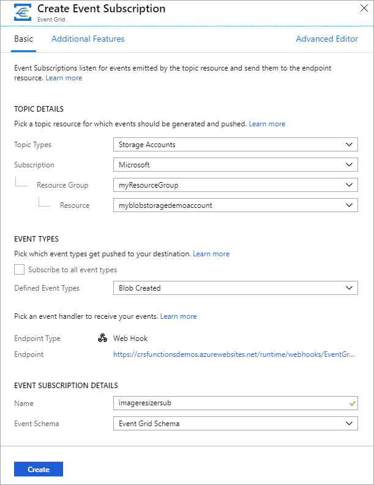
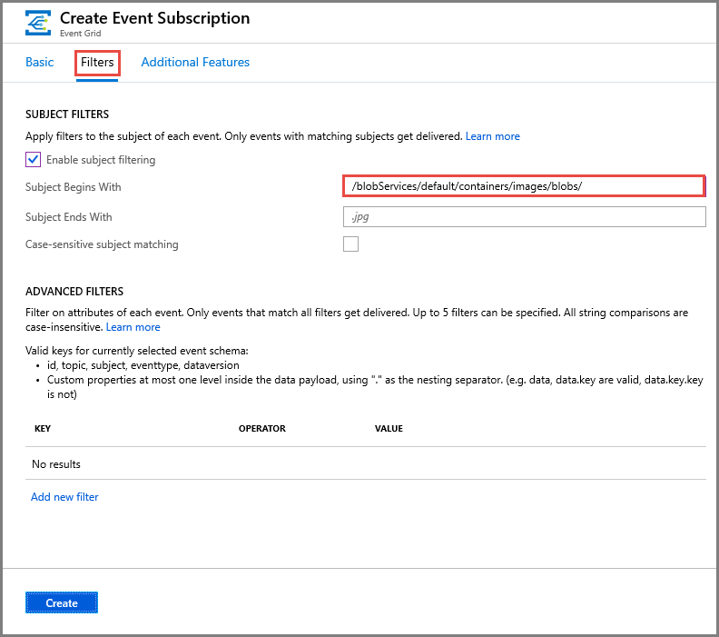
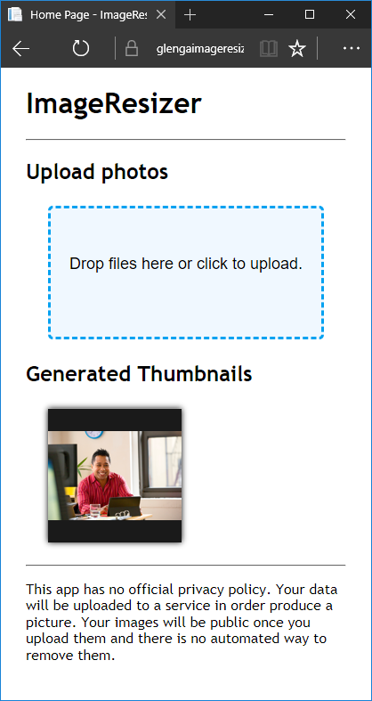

# Tutorial Step 2: Automate resizing uploaded images using Event Grid

This tutorial extends the [Upload image data in the cloud with Azure Storage][previous-tutorial] tutorial to add serverless automatic thumbnail generation using [Azure Event Grid](overview.md) and [Azure Functions](../azure-functions/functions-overview.md). Here's the high-level workflow: 

In this tutorial, you do the following steps:

> [!div class="checklist"]
> * Create an Azure Storage account
> * Create, configure, and deploy a function app
> * Create an event subscription to storage events 
> * Test the sample app

## Prerequisites

To complete this tutorial:

- You need an [Azure subscription](../guides/developer/azure-developer-guide.md#understanding-accounts-subscriptions-and-billing). This tutorial doesn't work with the **free** subscription. 
- You must have completed the previous Blob storage tutorial: [Upload image data in the cloud with Azure Storage][previous-tutorial].  

## Create an Azure Storage account
Azure Functions requires a general storage account. In addition to the Blob storage account you created in the previous tutorial, create a separate general storage account in the resource group. Storage account names must be between 3 and 24 characters in length and may contain numbers and lowercase letters only.

Set variables to hold the name of the resource group that you created in the previous tutorial, the location for resources to be created, and the name of the new storage account that Azure Functions requires. Then, create the storage account for the Azure function.

# [Azure CLI](#tab/azure-cli)

Use the [az storage account create](/cli/azure/storage/account) command.

> [!NOTE]
> Use the following commands in the Bash shell of the Cloud Shell. Use the drop-drown list at the top-left corner of the Cloud Shell to switch to Bash shell if needed. 

Run the following commands to create an Azure storage account.     

```azurecli-interactive
functionstorage="funcstorage$RANDOM"
az storage account create --name $functionstorage --location $region --resource-group $rgName --sku Standard_LRS --kind StorageV2  --allow-blob-public-access true
```

# [PowerShell](#tab/azure-powershell)

Use the [New-AzStorageAccount](/powershell/module/az.storage/new-azstorageaccount) command.

```azurepowershell-interactive
$functionstorage="funcstorage"  + (Get-Random).ToString()   
New-AzStorageAccount -ResourceGroupName $rgName -AccountName $functionstorage -Location $region -SkuName Standard_LRS -Kind StorageV2 -AllowBlobPublicAccess $true       
```

---

## Create a function app  

You must have a function app to host the execution of your function. The function app provides an environment for serverless execution of your function code. In the following command, provide your own unique function app name. The function app name is used as the default DNS domain for the function app, and so the name needs to be unique across all apps in Azure. Specify a name for the function app that's to be created, then create the Azure function.

# [Azure CLI](#tab/azure-cli)

Create a function app by using the [az functionapp create](/cli/azure/functionapp) command.

```azurecli-interactive
functionapp="funcapp$RANDOM"
az functionapp create --name $functionapp --storage-account $functionstorage --resource-group $rgName --consumption-plan-location $region --functions-version 4
```

# [PowerShell](#tab/azure-powershell)

Create a function app by using the [New-AzFunctionApp](/powershell/module/az.functions/new-azfunctionapp) command.

```azurepowershell-interactive
$functionapp="funcapp" + (Get-Random).ToString()    
New-AzFunctionApp -Location $region -Name $functionapp -ResourceGroupName $rgName -Runtime PowerShell -StorageAccountName $functionstorage    
```

---

Now configure the function app to connect to the Blob storage account you created in the [previous tutorial][previous-tutorial].

## Configure the function app

The function needs credentials for the Blob storage account, which are added to the application settings of the function app using either the [az functionapp config appsettings set](/cli/azure/functionapp/config/appsettings) or [Update-AzFunctionAppSetting](/powershell/module/az.functions/update-azfunctionappsetting) command.

# [Azure CLI](#tab/azure-cli)

```azurecli-interactive
storageConnectionString=$(az storage account show-connection-string --resource-group $rgName --name $blobStorageAccount --query connectionString --output tsv)

az functionapp config appsettings set --name $functionapp --resource-group $rgName --settings AzureWebJobsStorage=$storageConnectionString THUMBNAIL_CONTAINER_NAME=thumbnails THUMBNAIL_WIDTH=100 FUNCTIONS_EXTENSION_VERSION=~2 FUNCTIONS_WORKER_RUNTIME=dotnet
```

# [PowerShell](#tab/azure-powershell)

```azurepowershell-interactive
$storageConnectionString=$(az storage account show-connection-string --resource-group $rgName --name $blobStorageAccount --query connectionString --output tsv)

Update-AzFunctionAppSetting -Name $functionapp -ResourceGroupName $rgName -AppSetting @{'AzureWebJobsStorage'=$storageConnectionString; 'THUMBNAIL_CONTAINER_NAME'='thumbnails'; 'THUMBNAIL_WIDTH'=100; 'FUNCTIONS_EXTENSION_VERSION'='~2'; 'FUNCTIONS_WORKER_RUNTIME'='dotnet'}

```

---

The `FUNCTIONS_EXTENSION_VERSION=~2` setting makes the function app run on version 2.x of the Azure Functions runtime. You can now deploy a function code project to this function app.

## Deploy the function code 

The sample C# resize function is available on [GitHub](https://github.com/Azure-Samples/function-image-upload-resize). Deploy this code project to the function app by using the [az functionapp deployment source config](/cli/azure/functionapp/deployment/source) command.

```azurecli-interactive
az functionapp deployment source config --name $functionapp --resource-group $rgName --branch master --manual-integration --repo-url https://github.com/Azure-Samples/function-image-upload-resize
```

The image resize function is triggered by HTTP requests sent to it from the Event Grid service. You tell Event Grid that you want to get these notifications at your function's URL by creating an event subscription. For this tutorial, you subscribe to blob-created events.

The data passed to the function from the Event Grid notification includes the URL of the blob. That URL is in turn passed to the input binding to obtain the uploaded image from Blob storage. The function generates a thumbnail image and writes the resulting stream to a separate container in Blob storage.

This project uses `EventGridTrigger` for the trigger type. Using the Event Grid trigger is recommended over generic HTTP triggers. Event Grid automatically validates Event Grid Function triggers. With generic HTTP triggers, you must implement the [validation response](security-authentication.md).

To learn more about this function, see the [function.json and run.csx files](https://github.com/Azure-Samples/function-image-upload-resize/tree/master/ImageFunctions).

The function project code is deployed directly from the public sample repository. To learn more about deployment options for Azure Functions, see [Continuous deployment for Azure Functions](../azure-functions/functions-continuous-deployment.md).

## Create an event subscription

An event subscription indicates which provider-generated events you want sent to a specific endpoint. In this case, the endpoint is exposed by your function. Use the following steps to create an event subscription that sends notifications to your function in the Azure portal:

1. In the [Azure portal](https://portal.azure.com), at the top of the page search for and select `Function App` and choose the function app that you created. Select **Functions** and choose the **Thumbnail** function.

    :::image type="content" source="media/resize-images-on-storage-blob-upload-event/choose-thumbnail-function.png" alt-text="Choose the Thumbnail function in the portal":::

1.  Select select **Integration** then choose the **Event Grid Trigger** and select **Create Event Grid subscription**.

    :::image type="content" source="./media/resize-images-on-storage-blob-upload-event/add-event-subscription.png" alt-text="Navigate to Add Event Grid subscription in the Azure portal" :::

1. Use the event subscription settings as specified in the table.
    
    

    | Setting      | Suggested value  | Description                                        |
    | ------------ | ---------------- | -------------------------------------------------- |
    | **Name** | imageresizersub | Name that identifies your new event subscription. |
    | **Topic type** | Storage accounts | Choose the Storage account event provider. |
    | **Subscription** | Your Azure subscription | By default, your current Azure subscription is selected. |
    | **Resource group** | myResourceGroup | Select **Use existing** and choose the resource group you have been using in this tutorial. |
    | **Resource** | Your Blob storage account | Choose the Blob storage account where images are stored, not the one used by the Azure function app. |
    | **System Topic Name** | imagestoragesystopic | Specify a name for the system topic. To learn about system topics, see [System topics overview](system-topics.md). |    
    | **Event types** | Blob created | Uncheck all types other than **Blob created**. Only event types of `Microsoft.Storage.BlobCreated` are passed to the function. |
    | **Endpoint type** | autogenerated | Predefined as **Azure Function**. |
    | **Endpoint** | autogenerated | Name of the function. In this case, it's **Thumbnail**. |

1. Switch to the **Filters** tab, and do the following actions:
    1. Select **Enable subject filtering** option.
    1. For **Subject begins with**, enter the following value: **/blobServices/default/containers/images/**.

        

1. Select **Create** to add the event subscription to create an event subscription that triggers the `Thumbnail` function when a blob is added to the `images` container. The function resizes the images and adds them to the `thumbnails` container.

Now that the backend services are configured, you test the image resize functionality in the sample web app.

## Test the sample app

To test image resizing in the web app, browse to the URL of your published app. The default URL of the web app is `https://<web_app>.azurewebsites.net`.

Select **Upload photos** to select and upload a file. You can also drag a photo to this region.

Notice that after the uploaded image disappears, a copy of the uploaded image is displayed in the **Generated Thumbnails** carousel. This image was resized by the function, added to the *thumbnails* container, and downloaded by the web client.



[previous-tutorial]: storage-upload-process-images.md

## Next steps
See other tutorials in the Tutorials section of the table of content (TOC).
