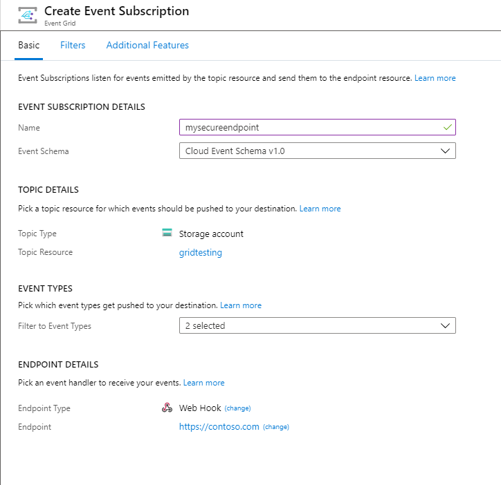
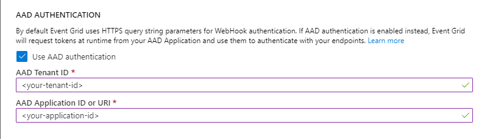
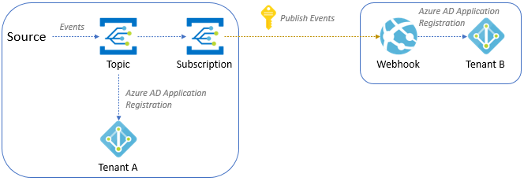

# Deliver events to Microsoft Entra protected endpoints
This article describes how to use Microsoft Entra ID to secure the connection between your **event subscription** and your **webhook endpoint**. It uses the Azure portal for demonstration, however the feature can also be enabled using CLI, PowerShell, or the SDKs.

> [!IMPORTANT]
> Additional access check has been introduced as part of create or update of event subscription on March 30, 2021 to address a security vulnerability. The subscriber client's service principal needs to be either an owner or have a role assigned on the destination application service principal. Reconfigure your Microsoft Entra Application following the new instructions below.For an overview of Microsoft Entra applications and service principals, see [Microsoft identity platform (v2.0) overview](/entra/identity-platform/v2-overview).

## Scenarios
This article explains how to implement the following two scenarios in detail: 

- [Delivering events to a webhook that is in the same Microsoft Entra tenant as the event subscription](#deliver-events-to-a-webhook-in-the-same-azure-ad-tenant). You can use either a Microsoft Entra user or a Microsoft Entra application as the event subscription writer in this scenario. 
- [Delivering events to a webhook that is in a different Microsoft Entra tenant from the event subscription](#deliver-events-to-a-webhook-in-a-different-azure-ad-tenant). You can only use a Microsoft Entra application as an event subscription writer in this scenario. 

    In the first scenario, you run all the steps or scripts in a single tenant that has both the event subscription and the webhook. And, in the second scenario, you run some steps in the tenant that has the event subscription and some steps in the tenant that has the webhook. 

<a name='deliver-events-to-a-webhook-in-the-same-azure-ad-tenant'></a>

## Deliver events to a Webhook in the same Microsoft Entra tenant

The following diagram depicts how Event Grid events are delivered to a webhook in the same tenant as the event subscription.  

:::image type="content" source="./media/secure-webhook-delivery/single-tenant-diagram.png" alt-text="Image that depicts secure delivery of events to a webhook that's in the same tenant.":::

There are two subsections in this section. Read through both the scenarios or the one that you're interested in. 

- [Configure the event subscription by using a Microsoft Entra ID **user**](#configure-the-event-subscription-by-using-an-azure-ad-user)
- [Configure the event subscription by using a Microsoft Entra ID **application**](#configure-the-event-subscription-by-using-an-azure-ad-application) 


<a name='configure-the-event-subscription-by-using-an-azure-ad-user'></a>

### Configure the event subscription by using a Microsoft Entra user

This section shows how to configure the event subscription by using a Microsoft Entra user. 

1. Create a Microsoft Entra application for the webhook configured to work with the Microsoft directory (single tenant).

2. Open the [Azure Shell](https://portal.azure.com/#cloudshell/) in the tenant and select the PowerShell environment.

3. Modify the value of **$webhookAadTenantId** to connect to the tenant.

    - Variables:
        - **$webhookAadTenantId**: Azure tenant ID

    ```Shell
    PS /home/user>$webhookAadTenantId = "[REPLACE_WITH_YOUR_TENANT_ID]"
    PS /home/user>Connect-AzureAD -TenantId $webhookAadTenantId
    ```

4. Open the [following script](scripts/powershell-webhook-secure-delivery-microsoft-entra-user.md) and update the values of **$webhookAppObjectId** and **$eventSubscriptionWriterUserPrincipalName** with your identifiers, then continue to run the script.

    - Variables:
        - **$webhookAppObjectId**: Microsoft Entra application ID created for the webhook
        - **$eventSubscriptionWriterUserPrincipalName**: Azure user principal name of the user who creates event subscription

    > [!NOTE]
    > You don't need to modify the value of **$eventGridAppId**. In this script, **AzureEventGridSecureWebhookSubscriber** is set for the **$eventGridRoleName**. Remember, you must be a member of the [Microsoft Entra Application Administrator role](/entra/identity/role-based-access-control/permissions-reference#all-roles) or be an owner of the service principal of webhook app in Microsoft Entra ID to execute this script.

    If you see the following error message, you need to elevate to the service principal. An extra access check has been introduced as part of create or update of event subscription on March 30, 2021 to address a security vulnerability. The subscriber client's service principal needs to be either an owner or have a role assigned on the destination application service principal. 
    
    ```
    New-AzureADServiceAppRoleAssignment: Error occurred while executing NewServicePrincipalAppRoleAssignment
    Code: Authorization_RequestDenied
    Message: Insufficient privileges to complete the operation.
    ```    
5. In the portal, when creating an event subscription, follow these steps:

    1. Select the endpoint type as **Web Hook**.
    2. Specify the endpoint **URI**.
    
        
    3. Select the **Additional features** tab at the top of the **Create Event Subscriptions** page.
    4. On the **Additional features** tab, do these steps:
        1. Select **Use Microsoft Entra authentication**, and configure the tenant ID and application ID:
        2. Copy the Microsoft Entra tenant ID from the output of the script and enter it in the **Microsoft Entra tenant ID** field.
        3. Copy the Microsoft Entra application ID from the output of the script and enter it in the **Microsoft Entra Application ID** field. You can use the Microsoft Entra Application ID URI instead of using the application ID. For more information about application ID URI, see [this article](../app-service/configure-authentication-provider-aad.md).
    
            

<a name='configure-the-event-subscription-by-using-an-azure-ad-application'></a>

### Configure the event subscription by using a Microsoft Entra application

This section shows how to configure the event subscription by using a Microsoft Entra application. 

1. Create a Microsoft Entra application for the Event Grid subscription writer configured to work with the Microsoft directory (Single tenant).

2. Create a secret for the Microsoft Entra application and save the value (you need this value later).

3. Go to the **Access control (IAM)** page for the Event Grid topic and assign **Event Grid Contributor** role to the Event Grid subscription writer app. This step allows you to have access to the Event Grid resource when you logged-in into Azure with the Microsoft Entra application by using Azure CLI.

4. Create a Microsoft Entra application for the webhook configured to work with the Microsoft directory (Single tenant).

5. Open the [Azure Shell](https://portal.azure.com/#cloudshell/) in the tenant and select the PowerShell environment.

6. Modify the value of **$webhookAadTenantId** to connect to the tenant.

    - Variables:
        - **$webhookAadTenantId**: Azure tenant ID

    ```Shell
    PS /home/user>$webhookAadTenantId = "[REPLACE_WITH_YOUR_TENANT_ID]"
    PS /home/user>Connect-AzureAD -TenantId $webhookAadTenantId
    ```

7. Open the [following script](scripts/powershell-webhook-secure-delivery-microsoft-entra-app.md) and update the values of **$webhookAppObjectId** and **$eventSubscriptionWriterAppId** with your identifiers, then continue to run the script.

    - Variables:
        - **$webhookAppObjectId**: Microsoft Entra application ID created for the webhook
        - **$eventSubscriptionWriterAppId**: Microsoft Entra application ID for Event Grid subscription writer app.

    > [!NOTE]
    > You don't need to modify the value of **```$eventGridAppId```**. In this script, **AzureEventGridSecureWebhookSubscriber** as set for the **```$eventGridRoleName```**. Remember, you must be a member of the [Microsoft Entra Application Administrator role](/entra/identity/role-based-access-control/permissions-reference#all-roles) or be an owner of the service principal of webhook app in Microsoft Entra ID to execute this script.

8. Sign-in as the Event Grid subscription writer Microsoft Entra Application by running the command.

    ```azurecli
    PS /home/user>az login --service-principal -u [REPLACE_WITH_EVENT_GRID_SUBSCRIPTION_WRITER_APP_ID] -p [REPLACE_WITH_EVENT_GRID_SUBSCRIPTION_WRITER_APP_SECRET_VALUE] --tenant [REPLACE_WITH_TENANT_ID]
    ```

9. Create your subscription by running the command.

    ```azurecli
    PS /home/user>az eventgrid system-topic event-subscription create --name [REPLACE_WITH_SUBSCRIPTION_NAME] -g [REPLACE_WITH_RESOURCE_GROUP] --system-topic-name [REPLACE_WITH_SYSTEM_TOPIC] --endpoint [REPLACE_WITH_WEBHOOK_ENDPOINT] --event-delivery-schema [REPLACE_WITH_WEBHOOK_EVENT_SCHEMA] --azure-active-directory-tenant-id [REPLACE_WITH_TENANT_ID] --azure-active-directory-application-id-or-uri [REPLACE_WITH_APPLICATION_ID_FROM_SCRIPT] --endpoint-type webhook
    ```

    > [!NOTE]
    > This scenario uses a system topic. If you want to create a subscription for custom topics or domains by using Azure CLI, see [CLI reference](/cli/azure/eventgrid).

10. If everything was correctly configured, you can successfully create the webhook subscription in your Event Grid topic.

    > [!NOTE]
    > At this point, Event Grid is now passing the Microsoft Entra bearer token to the webhook client in every message. You'll need to validate the authorization token in your webhook.

<a name='deliver-events-to-a-webhook-in-a-different-azure-ad-tenant'></a>

## Deliver events to a Webhook in a different Microsoft Entra tenant 

To secure the connection between your event subscription and your webhook endpoint that are in different Microsoft Entra tenants, you need to use a Microsoft Entra ID **application** as shown in this section. Currently, it's not possible to secure this connection by using a Microsoft Entra ID **user** in the Azure portal. 



Based on the diagram, follow next steps to configure both tenants.

### Tenant A

Do the following steps in **Tenant A**: 

1. Create a Microsoft Entra application for the Event Grid subscription writer configured to work with any Microsoft Entra directory (multitenant).

2. Create a secret for the Microsoft Entra application, and save the value (you need this value later).

3. Navigate to the **Access control (IAM)** page for the Event Grid topic. Assign the **Event Grid Contributor** role to Microsoft Entra application of the Event Grid subscription writer. This step allows the application to have access to the Event Grid resource when you sign in into Azure with the Microsoft Entra application by using Azure CLI.

### Tenant B

Do the following steps in **Tenant B**:

1. Create a Microsoft Entra Application for the webhook configured to work with the Microsoft directory (single tenant).
5. Open the [Azure Shell](https://portal.azure.com/#cloudshell/), and select the PowerShell environment.
6. Modify the **$webhookAadTenantId** value to connect to the **Tenant B**.
    - Variables:
        - **$webhookAadTenantId**: Azure Tenant ID for the **Tenant B**

        ```Shell
        PS /home/user>$webhookAadTenantId = "[REPLACE_WITH_YOUR_TENANT_ID]"
        PS /home/user>Connect-AzureAD -TenantId $webhookAadTenantId
        ```
7. Open the [following script](scripts/powershell-webhook-secure-delivery-microsoft-entra-app.md), and update values of **$webhookAppObjectId** and **$eventSubscriptionWriterAppId** with your identifiers, then continue to run the script.

    - Variables:
        - **$webhookAppObjectId**: Microsoft Entra application ID created for the webhook
        - **$eventSubscriptionWriterAppId**: Microsoft Entra application ID for Event Grid subscription writer

            > [!NOTE]
            > You don't need to modify the value of **```$eventGridAppId```**. In this script, **AzureEventGridSecureWebhookSubscriber** is set for **```$eventGridRoleName```**. Remember, you must be a member of the [Microsoft Entra Application Administrator role](/entra/identity/role-based-access-control/permissions-reference#all-roles) or be an owner of the service principal of webhook app in Microsoft Entra ID to execute this script.

    If you see the following error message, you need to elevate to the service principal. An extra access check has been introduced as part of create or update of event subscription on March 30, 2021 to address a security vulnerability. The subscriber client's service principal needs to be either an owner or have a role assigned on the destination application service principal. 
    
    ```
    New-AzureADServiceAppRoleAssignment: Error occurred while executing NewServicePrincipalAppRoleAssignment
    Code: Authorization_RequestDenied
    Message: Insufficient privileges to complete the operation.
    ```

### Tenant A

Back in **Tenant A**, do the following steps: 

1. Open the [Azure Shell](https://portal.azure.com/#cloudshell/), and sign in as the Event Grid subscription writer Microsoft Entra Application by running the command.

    ```azurecli
    PS /home/user>az login --service-principal -u [REPLACE_WITH_APP_ID] -p [REPLACE_WITH_SECRET_VALUE] --tenant [REPLACE_WITH_TENANT_ID]
    ```
2. Create your subscription by running the command.

    ```azurecli
    PS /home/user>az eventgrid system-topic event-subscription create --name [REPLACE_WITH_SUBSCRIPTION_NAME] -g [REPLACE_WITH_RESOURCE_GROUP] --system-topic-name [REPLACE_WITH_SYSTEM_TOPIC] --endpoint [REPLACE_WITH_WEBHOOK_ENDPOINT] --event-delivery-schema [REPLACE_WITH_WEBHOOK_EVENT_SCHEMA] --azure-active-directory-tenant-id [REPLACE_WITH_TENANT_B_ID] --azure-active-directory-application-id-or-uri [REPLACE_WITH_APPLICATION_ID_FROM_SCRIPT] --endpoint-type webhook
    ```

    > [!NOTE]
    > In this scenario we are using an Event Grid System Topic. See [here](/cli/azure/eventgrid), if you want to create a subscription for custom topics or Event Grid domains by using the Azure CLI.
3. If everything was correctly configured, you can successfully create the webhook subscription in your Event Grid topic.

    > [!NOTE]
    > At this point, Event Grid is now passing the Microsoft Entra Bearer token to the webhook client in every message. You'll need to validate the Authorization token in your webhook.

## Next steps

* For conceptual information, see [WebHook event delivery](webhook-event-delivery.md).
* For information about monitoring event deliveries, see [Monitor Event Grid message delivery](monitor-event-delivery.md).
* For more information about the authentication key, see [Event Grid security and authentication](security-authentication.md).
* For more information about creating an Azure Event Grid subscription, see [Event Grid subscription schema](subscription-creation-schema.md).
