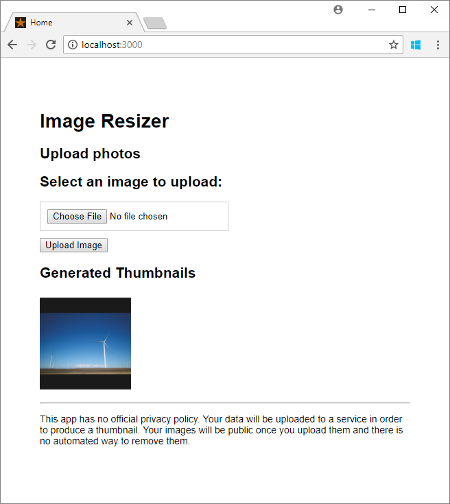

# Step 1: Upload image data in the cloud with Azure Storage

This tutorial is part one of a series. In this tutorial, you'll learn how to deploy a web app. The web app uses the Azure Blob Storage client library to upload images to a storage account. When you're finished, you'll have a web app that stores and displays images from Azure storage.

# [.NET v12 SDK](#tab/dotnet)

:::image type="content" source="media/storage-upload-process-images/image-resizer-app.png" alt-text="Screenshot of the Image Resizer .NET app.":::

# [JavaScript v12 SDK](#tab/javascript)


:::image type="content" source="media/storage-upload-process-images/upload-app-nodejs-thumb.png" alt-text="Screenshot of the Image Resizer JavaScript app.":::

---

In part one of the series, you learn how to:

> [!div class="checklist"]

> - Create a storage account
> - Create a container and set permissions
> - Retrieve an access key
> - Deploy a web app to Azure
> - Configure app settings
> - Interact with the web app

## Prerequisites

To complete this tutorial, you need an Azure subscription. Create a [free account](https://azure.microsoft.com/free/?ref=microsoft.com&utm_source=microsoft.com&utm_medium=docs&utm_campaign=visualstudio) before you begin.

[!INCLUDE [cloud-shell-try-it.md](../../includes/cloud-shell-try-it.md)]

To install and use the CLI locally, run Azure CLI version 2.0.4 or later. Run `az --version` to find the version. If you need to install or upgrade, see [Install the Azure CLI](/cli/azure/install-azure-cli).

## Create a resource group

The following example creates a resource group named `myResourceGroup`.

# [PowerShell](#tab/azure-powershell)

Create a resource group with the [New-AzResourceGroup](/powershell/module/az.resources/new-azresourcegroup) command. An Azure resource group is a logical container into which Azure resources are deployed and managed.

```powershell
New-AzResourceGroup -Name myResourceGroup -Location southeastasia
```

# [Azure CLI](#tab/azure-cli)

Create a resource group with the [az group create](/cli/azure/group) command. An Azure resource group is a logical container into which Azure resources are deployed and managed.

```azurecli
az group create --name myResourceGroup --location southeastasia
```

---

## Create a storage account

The sample uploads images to a blob container in an Azure storage account. A storage account provides a unique namespace to store and access your Azure storage data objects.

> [!IMPORTANT]
> In part 2 of the tutorial, you use Azure Event Grid with Blob storage. Make sure to create your storage account in an Azure region that supports Event Grid. For a list of supported regions, see [Azure products by region](https://azure.microsoft.com/global-infrastructure/services/?products=event-grid&regions=all).

In the following command, replace your own globally unique name for the Blob storage account where you see the `<blob_storage_account>` placeholder.

# [PowerShell](#tab/azure-powershell)

Create a storage account in the resource group you created by using the [New-AzStorageAccount](/powershell/module/az.storage/new-azstorageaccount) command.

```powershell
$blobStorageAccount="<blob_storage_account>"

New-AzStorageAccount -ResourceGroupName myResourceGroup -Name $blobStorageAccount -SkuName Standard_LRS -Location southeastasia -Kind StorageV2 -AccessTier Hot
```

# [Azure CLI](#tab/azure-cli)

Create a storage account in the resource group you created by using the [az storage account create](/cli/azure/storage/account) command.

```azurecli
blobStorageAccount="<blob_storage_account>"

az storage account create --name $blobStorageAccount --location southeastasia \
  --resource-group myResourceGroup --sku Standard_LRS --kind StorageV2 --access-tier hot
```

---

## Create Blob storage containers

The app uses two containers in the Blob storage account. Containers are similar to folders and store blobs. The *images* container is where the app uploads full-resolution images. In a later part of the series, an Azure function app uploads resized image thumbnails to the *thumbnail* container.

The *images* container's public access is set to `off`. The *thumbnails* container's public access is set to `container`. The `container` public access setting permits users who visit the web page to view the thumbnails.

# [PowerShell](#tab/azure-powershell)

Get the storage account key by using the [Get-AzStorageAccountKey](/powershell/module/az.storage/get-azstorageaccountkey) command. Then, use this key to create two containers with the [New-AzStorageContainer](/powershell/module/az.storage/new-azstoragecontainer) command.

```powershell
$blobStorageAccountKey = ((Get-AzStorageAccountKey -ResourceGroupName myResourceGroup -Name $blobStorageAccount)| Where-Object {$_.KeyName -eq "key1"}).Value
$blobStorageContext = New-AzStorageContext -StorageAccountName $blobStorageAccount -StorageAccountKey $blobStorageAccountKey

New-AzStorageContainer -Name images -Context $blobStorageContext
New-AzStorageContainer -Name thumbnails -Permission Container -Context $blobStorageContext
```

# [Azure CLI](#tab/azure-cli)

Get the storage account key by using the [az storage account keys list](/cli/azure/storage/account/keys) command. Then, use this key to create two containers with the [az storage container create](/cli/azure/storage/container) command.

```azurecli
blobStorageAccountKey=$(az storage account keys list -g myResourceGroup \
  -n $blobStorageAccount --query "[0].value" --output tsv)

az storage container create --name images \
  --account-name $blobStorageAccount \
  --account-key $blobStorageAccountKey

az storage container create --name thumbnails \
  --account-name $blobStorageAccount \
  --account-key $blobStorageAccountKey --public-access container
```

---

Make a note of your Blob storage account name and key. The sample app uses these settings to connect to the storage account to upload the images.

## Create an App Service plan

An [App Service plan](../app-service/overview-hosting-plans.md) specifies the location, size, and features of the web server farm that hosts your app.

The following example creates an App Service plan named `myAppServicePlan` in the **Free** pricing tier:

# [PowerShell](#tab/azure-powershell)

Create an App Service plan with the [New-AzAppServicePlan](/powershell/module/az.websites/new-azappserviceplan) command.

```powershell
New-AzAppServicePlan -ResourceGroupName myResourceGroup -Name myAppServicePlan -Tier "Free"
```

# [Azure CLI](#tab/azure-cli)

Create an App Service plan with the [az appservice plan create](/cli/azure/appservice/plan) command.

```azurecli
az appservice plan create --name myAppServicePlan --resource-group myResourceGroup --sku Free
```

---

## Create a web app

The web app provides a hosting space for the sample app code that's deployed from the GitHub sample repository.

In the following command, replace `<web_app>` with a unique name. Valid characters are `a-z`, `0-9`, and `-`. If `<web_app>` isn't unique, you get the error message: *Website with given name `<web_app>` already exists.* The default URL of the web app is `https://<web_app>.azurewebsites.net`.

# [PowerShell](#tab/azure-powershell)

Create a [web app](../app-service/overview.md) in the `myAppServicePlan` App Service plan with the [New-AzWebApp](/powershell/module/az.websites/new-azwebapp) command.

```powershell
$webapp="<web_app>"

New-AzWebApp -ResourceGroupName myResourceGroup -Name $webapp -AppServicePlan myAppServicePlan
```

# [Azure CLI](#tab/azure-cli)

Create a [web app](../app-service/overview.md) in the `myAppServicePlan` App Service plan with the [az webapp create](/cli/azure/webapp) command.

```azurecli
webapp="<web_app>"

az webapp create --name $webapp --resource-group myResourceGroup --plan myAppServicePlan
```

---

## Deploy the sample app from the GitHub repository

# [.NET v12 SDK](#tab/dotnet)

App Service supports several ways to deploy content to a web app. In this tutorial, you deploy the web app from a [public GitHub sample repository](https://github.com/Azure-Samples/storage-blob-upload-from-webapp). Configure GitHub deployment to the web app with the [az webapp deployment source config](/cli/azure/webapp/deployment/source) command.

The sample project contains an [ASP.NET MVC](https://www.asp.net/mvc) app. The app accepts an image, saves it to a storage account, and displays images from a thumbnail container. The web app uses the [Azure.Storage](/dotnet/api/azure.storage), [Azure.Storage.Blobs](/dotnet/api/azure.storage.blobs), and [Azure.Storage.Blobs.Models](/dotnet/api/azure.storage.blobs.models) namespaces to interact with the Azure Storage service.

```azurecli
az webapp deployment source config --name $webapp --resource-group myResourceGroup \
  --branch master --manual-integration \
  --repo-url https://github.com/Azure-Samples/storage-blob-upload-from-webapp
```

```powershell
az webapp deployment source config --name $webapp --resource-group myResourceGroup `
  --branch master --manual-integration `
  --repo-url https://github.com/Azure-Samples/storage-blob-upload-from-webapp
```

# [JavaScript v12 SDK](#tab/javascript)

App Service supports several ways to deploy content to a web app. In this tutorial, you deploy the web app from a [public GitHub sample repository](https://github.com/Azure-Samples/azure-sdk-for-js-storage-blob-stream-nodejs). Configure GitHub deployment to the web app with the [az webapp deployment source config](/cli/azure/webapp/deployment/source) command.

```azurecli
az webapp deployment source config --name $webapp --resource-group myResourceGroup \
  --branch master --manual-integration \
  --repo-url https://github.com/Azure-Samples/azure-sdk-for-js-storage-blob-stream-nodejs
```

```powershell
az webapp deployment source config --name $webapp --resource-group myResourceGroup `
  --branch master --manual-integration `
  --repo-url https://github.com/Azure-Samples/azure-sdk-for-js-storage-blob-stream-nodejs
```

---

## Configure web app settings

# [.NET v12 SDK](#tab/dotnet)

The sample web app uses the [Azure Storage APIs for .NET](/dotnet/api/overview/azure/storage) to upload images. Storage account credentials are set in the app settings for the web app. Add app settings to the deployed app with the [az webapp config appsettings set](/cli/azure/webapp/config/appsettings) or [New-AzStaticWebAppSetting](/powershell/module/az.websites/new-azstaticwebappsetting) command.

```azurecli
az webapp config appsettings set --name $webapp --resource-group myResourceGroup \
  --settings AzureStorageConfig__AccountName=$blobStorageAccount \
    AzureStorageConfig__ImageContainer=images \
    AzureStorageConfig__ThumbnailContainer=thumbnails \
    AzureStorageConfig__AccountKey=$blobStorageAccountKey
```

```powershell
New-AzStaticWebAppSetting -ResourceGroupName myResourceGroup -Name $webapp `
  -AppSetting @{ `
    AzureStorageConfig__AccountName = $blobStorageAccount `
    AzureStorageConfig__ImageContainer = images `
    AzureStorageConfig__ThumbnailContainer = thumbnails `
    AzureStorageConfig__AccountKey = $blobStorageAccountKey `
  }
```

# [JavaScript v12 SDK](#tab/javascript)

The sample web app uses the [Azure Storage client library for JavaScript](https://github.com/Azure/azure-sdk-for-js/tree/master/sdk/storage) to upload images. The storage account credentials are set in the app settings for the web app. Add app settings to the deployed app with the [az webapp config appsettings set](/cli/azure/webapp/config/appsettings) or [New-AzStaticWebAppSetting](/powershell/module/az.websites/new-azstaticwebappsetting) command.

```azurecli
az webapp config appsettings set --name $webapp --resource-group myResourceGroup \
  --settings AZURE_STORAGE_ACCOUNT_NAME=$blobStorageAccount \
    AZURE_STORAGE_ACCOUNT_ACCESS_KEY=$blobStorageAccountKey
```

```powershell
az webapp config appsettings set --name $webapp --resource-group myResourceGroup `
  --settings AZURE_STORAGE_ACCOUNT_NAME=$blobStorageAccount `
  AZURE_STORAGE_ACCOUNT_ACCESS_KEY=$blobStorageAccountKey
```

---

After you deploy and configure the web app, you can test the image upload functionality in the app.

## Upload an image

To test the web app, browse to the URL of your published app. The default URL of the web app is `https://<web_app>.azurewebsites.net`.

# [.NET v12 SDK](#tab/dotnet)

Select the **Upload photos** region to specify and upload a file, or drag a file onto the region. The image disappears if successfully uploaded. The **Generated Thumbnails** section will remain empty until we test it later in this tutorial.

:::image type="content" source="media/storage-upload-process-images/upload-photos.png" alt-text="Screenshot of the page to upload photos in the Image Resizer .NET app.":::

In the sample code, the `UploadFileToStorage` task in the *Storagehelper.cs* file is used to upload the images to the *images* container within the storage account using the [UploadAsync](/dotnet/api/azure.storage.blobs.blobclient.uploadasync) method. The following code sample contains the `UploadFileToStorage` task.

```csharp
public static async Task<bool> UploadFileToStorage(Stream fileStream, string fileName,
                                                    AzureStorageConfig _storageConfig)
{
    // Create a URI to the blob
    Uri blobUri = new Uri("https://" +
                          _storageConfig.AccountName +
                          ".blob.core.windows.net/" +
                          _storageConfig.ImageContainer +
                          "/" + fileName);

    // Create StorageSharedKeyCredentials object by reading
    // the values from the configuration (appsettings.json)
    StorageSharedKeyCredential storageCredentials =
        new StorageSharedKeyCredential(_storageConfig.AccountName, _storageConfig.AccountKey);

    // Create the blob client.
    BlobClient blobClient = new BlobClient(blobUri, storageCredentials);

    // Upload the file
    await blobClient.UploadAsync(fileStream);

    return await Task.FromResult(true);
}
```

The following classes and methods are used in the preceding task:

| Class | Method |
|-------|--------|
| [Uri](/dotnet/api/system.uri) | [Uri constructor](/dotnet/api/system.uri.-ctor) |
| [StorageSharedKeyCredential](/dotnet/api/azure.storage.storagesharedkeycredential) | [StorageSharedKeyCredential(String, String) constructor](/dotnet/api/azure.storage.storagesharedkeycredential.-ctor) |
| [BlobClient](/dotnet/api/azure.storage.blobs.blobclient) | [UploadAsync](/dotnet/api/azure.storage.blobs.blobclient.uploadasync) |

# [JavaScript v12 SDK](#tab/javascript)

Select **Choose File** to select a file, then select **Upload Image**. The **Generated Thumbnails** section will remain empty until we test it later in this tutorial.

:::image type="content" source="media/storage-upload-process-images/upload-app-nodejs.png" alt-text="Screenshot of the page to upload photos in the Image Resizer JavaScript app.":::

In the sample code, the `post` route is responsible for uploading the image into a blob container. The route uses the modules to help process the upload:

- [Multer](https://github.com/expressjs/multer) implements the upload strategy for the route handler.
- [into-stream](https://github.com/sindresorhus/into-stream) converts the buffer into a stream as required by [uploadStream](/javascript/api/%40azure/storage-blob/blockblobclient#uploadstream-readable--number--number--blockblobuploadstreamoptions-).

As the file is sent to the route, the contents of the file stay in memory until the file is uploaded to the blob container.

> [!IMPORTANT]
> Loading large files into memory may have a negative effect on your web app's performance. If you expect users to post large files, you may want to consider staging files on the web server file system and then scheduling uploads into Blob storage. Once the files are in Blob storage, you can remove them from the server file system.

```javascript
if (process.env.NODE_ENV !== 'production') {
  require('dotenv').config();
}

const {
  BlobServiceClient,
  StorageSharedKeyCredential,
  newPipeline
} = require('@azure/storage-blob');

const express = require('express');
const router = express.Router();
const containerName1 = 'thumbnails';
const multer = require('multer');
const inMemoryStorage = multer.memoryStorage();
const uploadStrategy = multer({ storage: inMemoryStorage }).single('image');
const getStream = require('into-stream');
const containerName2 = 'images';
const ONE_MEGABYTE = 1024 * 1024;
const uploadOptions = { bufferSize: 4 * ONE_MEGABYTE, maxBuffers: 20 };

const sharedKeyCredential = new StorageSharedKeyCredential(
  process.env.AZURE_STORAGE_ACCOUNT_NAME,
  process.env.AZURE_STORAGE_ACCOUNT_ACCESS_KEY);
const pipeline = newPipeline(sharedKeyCredential);

const blobServiceClient = new BlobServiceClient(
  `https://${process.env.AZURE_STORAGE_ACCOUNT_NAME}.blob.core.windows.net`,
  pipeline
);

const getBlobName = originalName => {
  // Use a random number to generate a unique file name, 
  // removing "0." from the start of the string.
  const identifier = Math.random().toString().replace(/0\./, '');
  return `${identifier}-${originalName}`;
};

router.get('/', async (req, res, next) => {

  let viewData;

  try {
    const containerClient = blobServiceClient.getContainerClient(containerName1);
    const listBlobsResponse = await containerClient.listBlobFlatSegment();

    for await (const blob of listBlobsResponse.segment.blobItems) {
      console.log(`Blob: ${blob.name}`);
    }

    viewData = {
      title: 'Home',
      viewName: 'index',
      accountName: process.env.AZURE_STORAGE_ACCOUNT_NAME,
      containerName: containerName1
    };

    if (listBlobsResponse.segment.blobItems.length) {
      viewData.thumbnails = listBlobsResponse.segment.blobItems;
    }
  } catch (err) {
    viewData = {
      title: 'Error',
      viewName: 'error',
      message: 'There was an error contacting the blob storage container.',
      error: err
    };
    res.status(500);
  } finally {
    res.render(viewData.viewName, viewData);
  }
});

router.post('/', uploadStrategy, async (req, res) => {
  const blobName = getBlobName(req.file.originalname);
  const stream = getStream(req.file.buffer);
  const containerClient = blobServiceClient.getContainerClient(containerName2);;
  const blockBlobClient = containerClient.getBlockBlobClient(blobName);

  try {
    await blockBlobClient.uploadStream(stream,
      uploadOptions.bufferSize, uploadOptions.maxBuffers,
      { blobHTTPHeaders: { blobContentType: "image/jpeg" } });
    res.render('success', { message: 'File uploaded to Azure Blob Storage.' });
  } catch (err) {
    res.render('error', { message: err.message });
  }
});

module.exports = router;
```

---

## Verify the image is shown in the storage account

Sign in to the [Azure portal](https://portal.azure.com). From the left menu, select **Storage accounts**, then select the name of your storage account. Select **Containers**, then select the **images** container.

Verify the image is shown in the container.

:::image type="content" source="media/storage-upload-process-images/images-in-container.png" alt-text="Screenshot of the Container page showing the list of uploaded images.":::

## Test thumbnail viewing

To test thumbnail viewing, you'll upload an image to the **thumbnails** container to check whether the app can read the **thumbnails** container.

Sign in to the [Azure portal](https://portal.azure.com). From the left menu, select **Storage accounts**, then select the name of your storage account. Select **Containers**, then select the **thumbnails** container. Select **Upload** to open the **Upload blob** pane.

Choose a file with the file picker and select **Upload**.

Navigate back to your app to verify that the image uploaded to the **thumbnails** container is visible.

# [.NET v12 SDK](#tab/dotnet)


# [JavaScript v12 SDK](#tab/javascript)



---

In part two of the series, you automate thumbnail image creation so you don't need this image. In the **thumbnails** container, select the image you uploaded, and select **Delete** to remove the image.

You can enable Content Delivery Network (CDN) to cache content from your Azure storage account. For more information, see [Integrate an Azure storage account with Azure CDN](../cdn/cdn-create-a-storage-account-with-cdn.md).

## Next steps

In part one of the series, you learned how to configure a web app to interact with storage.

Go on to part two of the series to learn about using Event Grid to trigger an Azure function to resize an image.

> [!div class="nextstepaction"]
> [Use Event Grid to trigger an Azure Function to resize an uploaded image](resize-images-on-storage-blob-upload-event.md)
