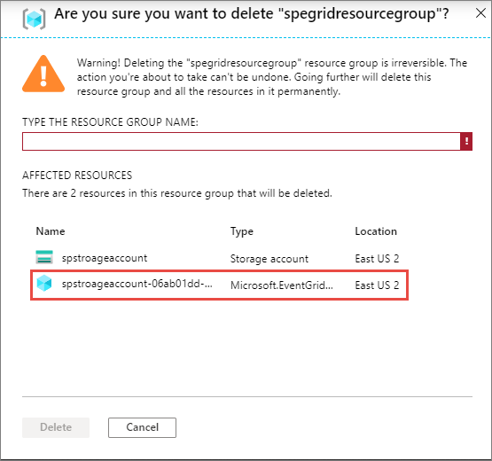

# System topics in Azure Event Grid
The Azure Event Grid service creates system topics when you create a first event subscription for an Azure event source. Currently, Event Grid doesn't create system topics for topic sources that were created before Mar, 15, 2020. For all the topic sources you created on or after this date, Event Grid automatically creates system topics. This article describes **system topics** in Azure Event Grid.

> [!NOTE]
> This feature is currently not enabled for Azure Government cloud. 

## Overview
When you create first event subscription for an Azure event source such as Azure Storage account, provisioning process for the subscription creates an additional resource of type **Microsoft.EventGrid/systemTopics**. When the last event subscription to the Azure event source is deleted, the system topic is automatically deleted.

System topic isn't applicable to custom topic scenarios, that is, Event Grid topics and Event Grid domains. 

## Location
For Azure event sources that are in a specific region/location, system topic is created in the same location as the Azure event source. For example, if you create an event subscription for an Azure blob storage in East US, the system topic is created in East US. For global Azure event sources such as Azure subscriptions, resource groups, or Azure Maps, Event Grid creates the system topic in **global** location. 

## Resource group 
In general, system topic is created in the same resource group that the Azure event source is in. For event subscriptions created at Azure subscription scope, system topic is created under the resource group **Default-EventGrid**. If the resource group doesn't exist, Azure Event Grid creates it before creating the system topic. 

When you try to delete the resource group with the storage account, you'll see the system topic in the list of affected resources.  

## Next steps
See the following articles: 

- [Custom topics](custom-topics.md)
- [Domains](event-domains.md)