# Trigger Azure Function Apps from Azure IoT Hub events

Azure Event Grid enables you to react to events in IoT Hub by triggering actions in your downstream business applications.
This article walks through a sample configuration that uses IoT Hub and Event Grid. By the end, you will have a Function App being triggered every time a device is added to your IoT Hub.

## Prerequisites

* An active Azure account. If you don't have one, you can [create a free account](http://azure.microsoft.com/pricing/free-trial/).
* An IoT Hub in Azure. If you haven't created one yet, see [Get started with IoT Hub](../iot-hub/iot-hub-csharp-csharp-getstarted.md) for a walkthrough.

## Create an Event Grid topic

1. In the [Azure portal](https://portal.azure.com), select **Create a resource** search for Event Grid and select **Event Grid Topic**.

   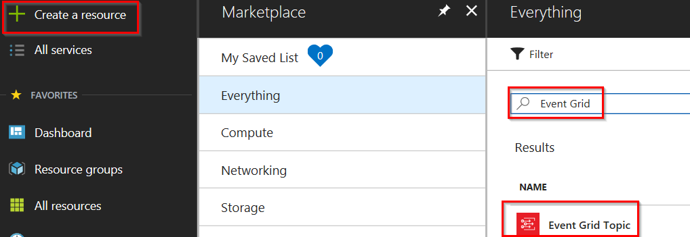
2. Give the Event Grid Topic a name that’s unique in your subscription, then select the name of your subscription, resource group, **same location** as your IoT Hub, and choose **Create**.

   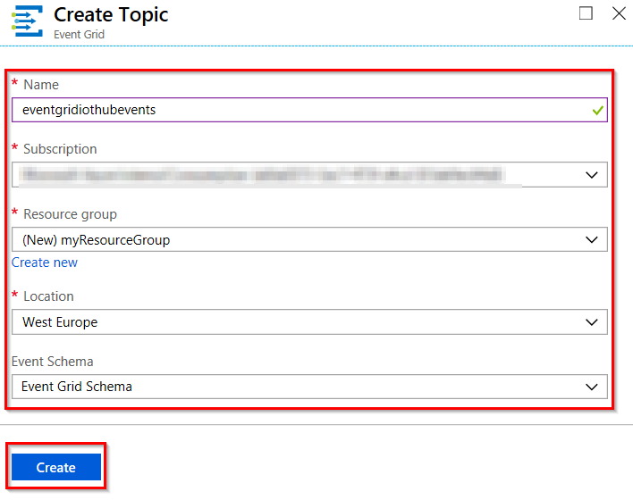
3. Select the Notification icon in the upper-right corner of the portal and watch for the **Deployment succeeded** message.

   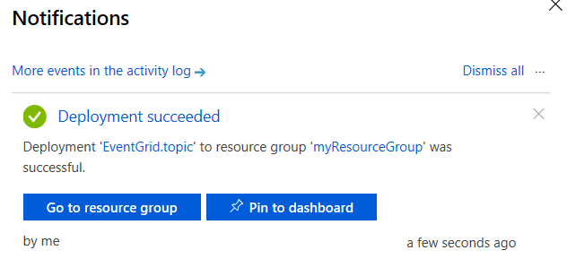

## Create a Function app

1. In the [Azure portal](https://portal.azure.com), select **Create a resource** > **Compute** > **Function App**.

   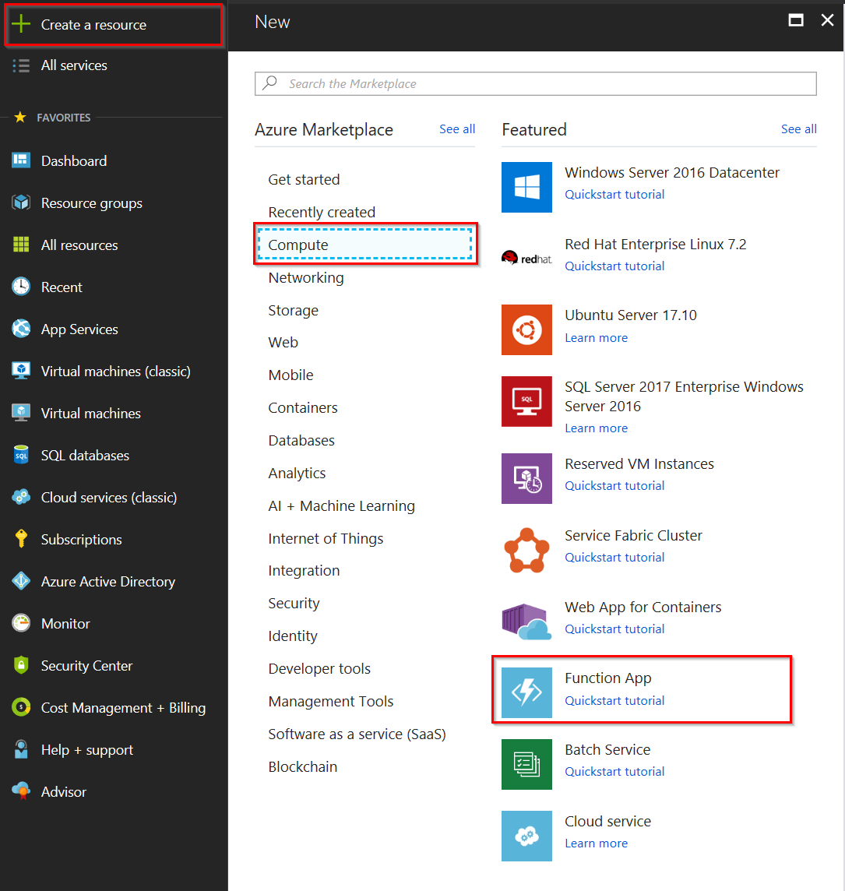
2. Give a unique name to your Function App. The Function App name is used as the default DNS domain for the function app, and so the name needs to be unique across all apps in Azure. Then select the same subscription, resource group, and location as your IoT Hub. Setup your Function App as shown below.

   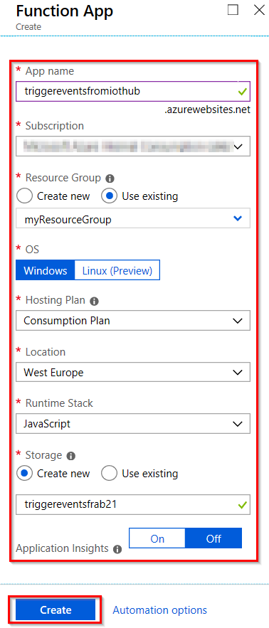
3. Select **Create** to provision and deploy the function app.
4. Select the Notification icon in the upper-right corner of the portal and watch for the **Deployment succeeded** message.
5. Select **Go to resource** to view your new function app.

## Create a trigger

A trigger is a specific event that starts your Function App. For this tutorial, you learn how to use an Event Grid trigger to invoke a function when an event is received from Event Grid. To learn more, visit the article [Event Grid trigger for Azure Functions](../azure-functions/functions-bindings-event-grid.md).

1. In the Azure Portal of your Function app, select **Functions** > **New function**.

   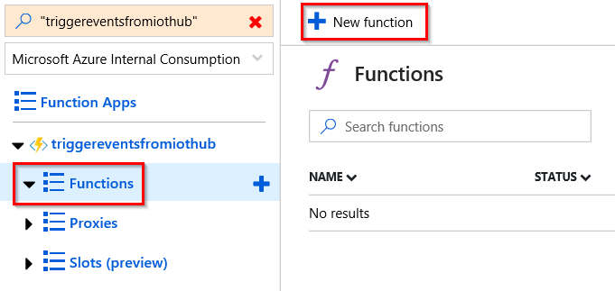
2. Scroll until you find the **Event Grid trigger** and select it.

   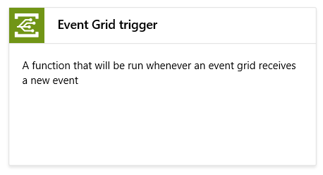
3. When asked, **Install** the Event Grid extensions and once the installation is successful select **Continue**.

   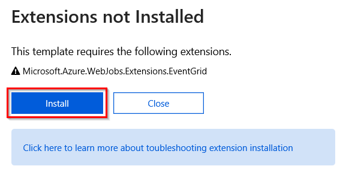
4. Provide a name for your trigger function and select **Create**.

   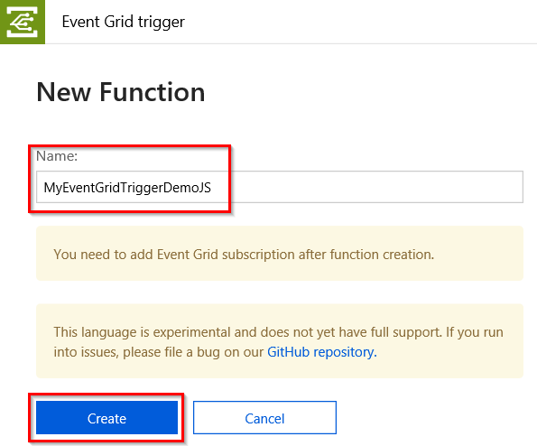
5. Select **Add Event Grid subscription**.

   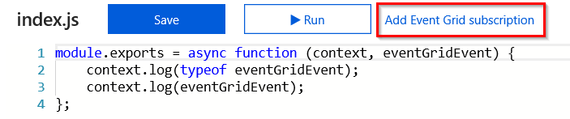
6. When you select this link, the portal opens the **Create Event Subscription** page with the **Subscriber Endpoint** URL prefilled. Copy this URL to your clipboard. Create the event subscription with the following values:
   * **Name**: Provide a descriptive name
   * **Topic Type**: Select **Event Grid Topics**
   * **Instance**: select the Event Grid Topic instance you created earlier and select **Subscribe to all event types**
   * **Subscriber Type**: Select **Web Hook**
   You could save the event subscription here, and receive notifications for every device that is created in your IoT hub. For this tutorial though, let's use the optional fields to filter for specific devices:
   * **Prefix filter**: Enter `devices/Building1_` to filter for device events in building 1.
   * **Suffix filter**: Enter `_Temperature` to filter for device events related to temperature.
   When you're done, the form should look like the following example:

   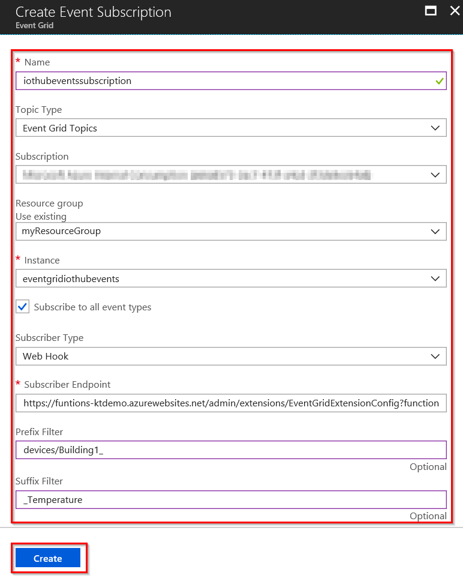
7. Now select **Run** for your Function App to start tracing IoT Hub events.

   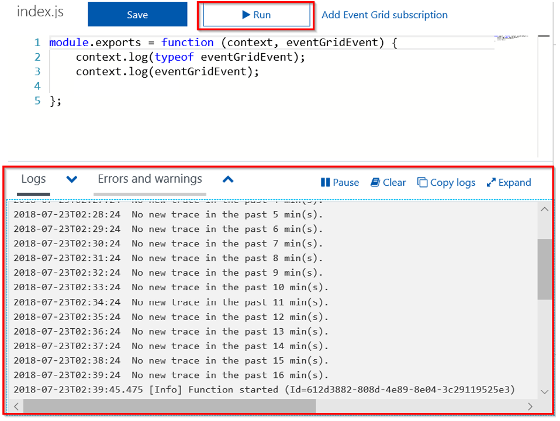

## Create an Event Subscription in IoT Hub

1. From your IoT Hub, select **Events** and create an **Event Subscription**.

   
2. Create the subscription with the following values:
   * **Event Types**: Select Subscribe to all event types
   * **Endpoint Type**: Select **Web Hook**
   * **Endpoint**: Click on **Select an endpoint** and paste the subscription endpoint URL that was prefilled when you created the Function App trigger (alternatively you can navigate to your Event Grid Topic instance and seek for the full endpoint URL), and click **Confirm Selection** when done
   * **Name**: Provide a descriptive name
   * **Event Schema**: Select **Event Grid Schema**
   When you're done, the form should look like the following example:

   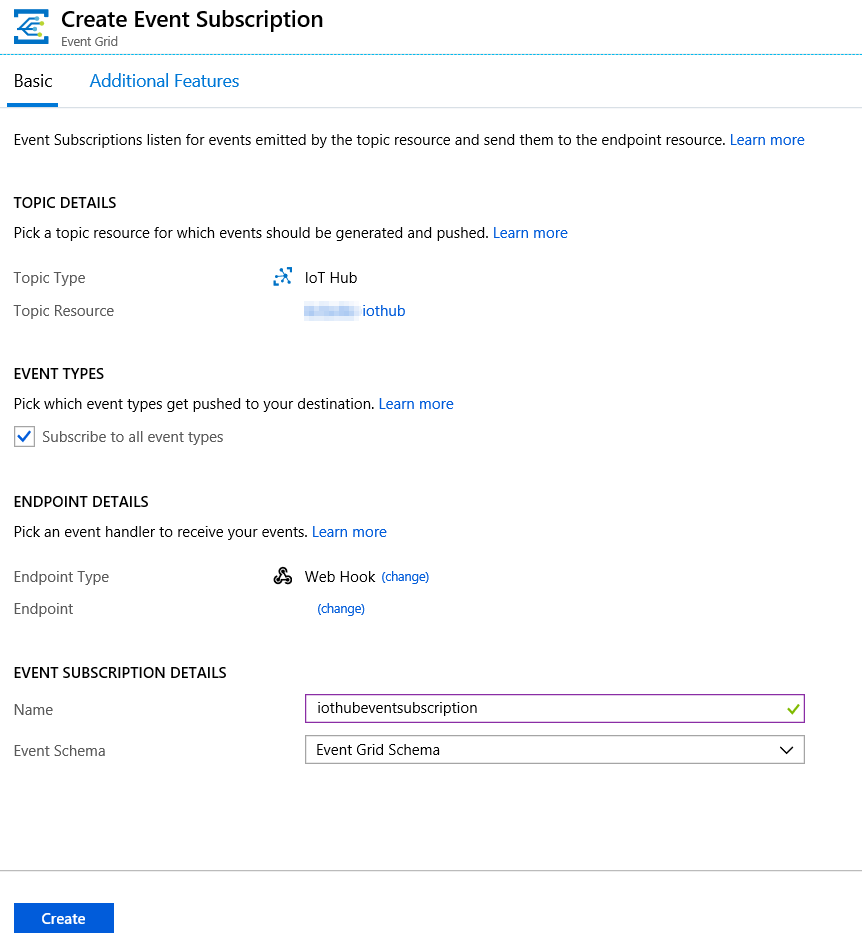
3. Select **Create**.

## Create a new device

Test your Function App by creating a new device to trigger an event trace.

1. From your IoT Hub, select **IoT Devices**.
2. Select **Add**.
3. For Device ID, enter `Building1_Floor1_Room1_Temperature`.
4. Select **Save**.
5. You can add multiple devices with different device IDs to test the event subscription filters. Try these examples:
   * Building1_Floor1_Room1_Light
   * Building1_Floor2_Room2_Temperature
   * Building2_Floor1_Room1_Temperature
   * Building2_Floor1_Room1_Light
   Once you've added a few devices to your IoT hub, check the logs area of your Function App to see which ones were traced, as the following example:

   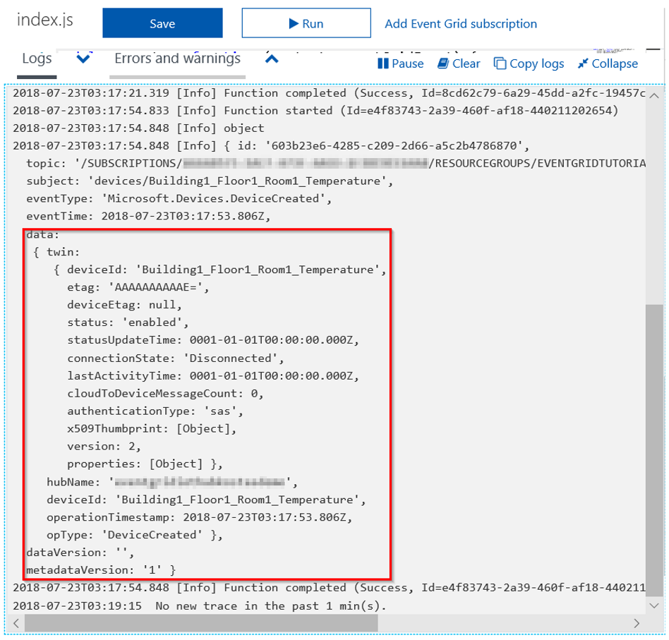

## Clean up resources

This tutorial used resources that incur charges on your Azure subscription. When you're done trying out the tutorial and testing your results, disable or delete resources that you don't want to keep.

If you don't want to lose the work on your Function App, stop it instead of deleting it.

1. Navigate to your Function App.
2. On the **Overview** blade select **Stop** or **Disable**.

Each subscription can have one free IoT Hub. If you created a free hub for this tutorial, then you don't need to delete it to prevent charges.

1. Navigate to your IoT hub.
2. On the **Overview** blade select **Delete**.

Even if you keep your IoT hub, you may want to delete the event subscription that you created. 

1. In your IoT hub, select **Event Grid**.
2. Select the event subscription that you want to remove.
3. Select **Delete**.