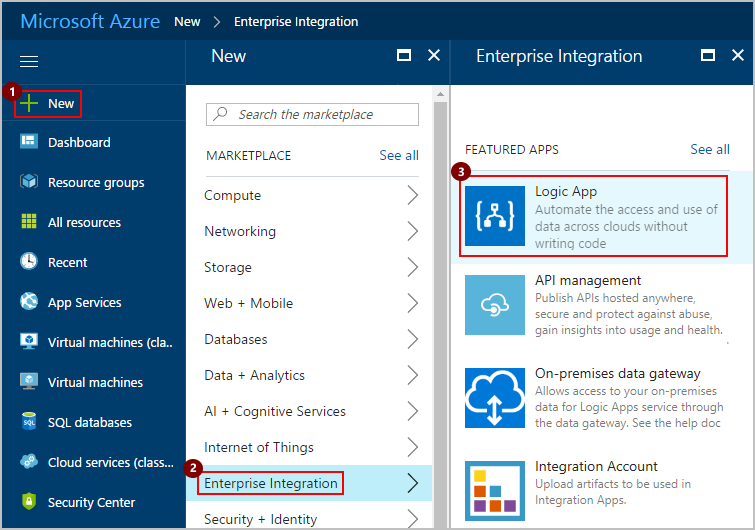
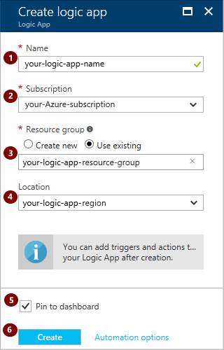
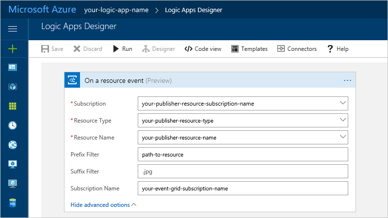
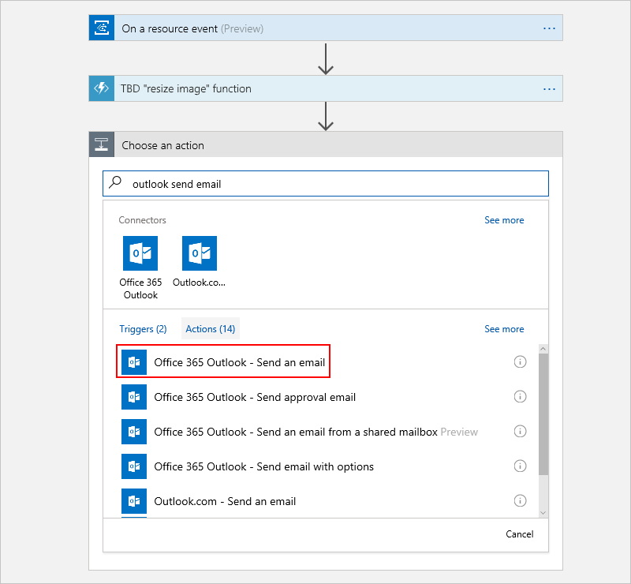
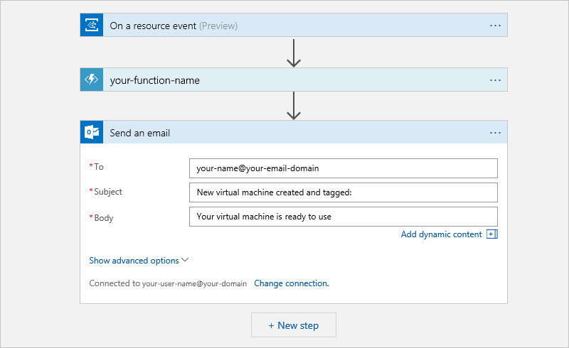

# Tag virtual machines by triggering logic app workflows with events from event grids

You can start a [logic app automated workflow](../logic-apps/logic-apps-what-are-logic-apps.md) 
when specific events happen in Azure resources or third-party resources. 
These resources can publish these events to an [Azure event grid](../event-grid/overview.md). 
And in turn, the event grid pushes those events to subscribers that have queues, 
webhooks, or [event hubs](../event-hubs/event-hubs-what-is-event-hubs.md) as endpoints. 
As a subscriber, your logic app can wait for those events from an event grid 
before starting automated workflows to perform tasks.

For example, here are some events that an event grid can send 
from publisher to subscriber:

* Create, read, update, or delete a resource
* New message in a queue
* New tweet

This tutorial shows how to create a logic app that 
fires when you create a virtual machine in Azure. 
When created, the virtual machine publishes an event to an event grid, 
which pushes the event to your logic app and passes the URL. 
Your logic app passes this URL to an Azure function that tags 
the virtual machine with a specified label. 

## Requirements

To follow along, complete these tutorials first: 

* [Create an Azure Blob Storage account and container with an event grid]()

  This tutorial shows how to create a storage container for saving image files 
  as blobs when you upload images through the provided a sample Web API app. 
  For the upload action, the container publishes an event to the event grid. 
  The event grid then pushes that event to subscribers, like your logic app.

* [Create a virtual machine with an event grid]()

* [Create an Azure Functions app and function]() 

  This tutorial shows how to create an Azure function that 
  tags a virtual machine. Your logic app 
  calls this function as a step in its workflow. 

## Create a logic app that responds to events from an event grid

1. In the [Azure portal](https://portal.azure.com), from the main Azure menu, 
choose **New** > **Enterprise Integration** > **Logic App** as shown:

   

2. Create your logic app as shown:

   1. Provide a name for your logic app.

   2. Select the Azure subscription, resource group, 
   and location that you want to use for your logic app. 

   3. When you're ready, select **Pin to dashboard**, and choose **Create**.

      

3. Wait until Azure finishes deploying your logic app. 

   If you selected **Pin to dashboard**, 
   your logic app automatically opens in Logic Apps Designer. 
   Otherwise, manually find and open your logic app.

4. Under **Templates**, choose **Blank Logic App**.

5. In the search box, enter "event grid" as your filter. 
Select this trigger: **Azure Event Grid - On a resource event**

   

6. Now create an event subscription for your logic app 
to get events pushed by the publisher resource. 
Provide these event subscription details:

   * **Subscription**: Select the publisher resource's Azure subscription.
   * **Resource Type**: Select the publisher's resource type, 
   which is **Microsoft.Storage.storageaccounts** in this tutorial.
   * **Resource Name**: Select the publisher resource's name, 
   which is your storage account name in this tutorial.
   * For more options, choose **Show advanced options**.

      * **Subscription Name**: Provide a name for your event subscription.
      * **Prefix Filter**: Specify a prefix string as a filter, for example, 
      provide a path with a parameter for the image file.
      that you want to process. The default or empty string matches all values.
      * **Suffix Filter**: Specify a suffix string as a filter, for example, 
      provide a file name extension for specific image file types. 
      The default or an empty string matches all values.

      

7. Save your logic app. On the designer toolbar, choose **Save**. 
   
When you save your logic app, the Event Grid trigger 
creates an event subscription between your logic app 
and the publisher resource. When the publisher pushes 
an event to the event grid, that event grid pushes 
the event to your logic app. After getting this event, 
your logic app starts running.

## Call an Azure function from your logic app

Now add the Azure function that you created 
in [this tutorial]() for resizing an image.

1. In your logic app, under your Event Grid trigger, 
choose **New step** > **Add an action**.

   

2. In the search box, enter "azure functions" as your filter. 
Select this action: **Azure Functions - Choose an Azure function**

   

   Azure shows all the existing Azure function apps that 
   were created and associated with your Azure subscription.

3. In the search box, find the Azure function that you previously created. 
Select your Azure function app: **Azure Functions - your-function-app-name**

   

   Azure now shows all the functions that are 
   associated with your selected function app.

4. Select the function that you previously created: **Azure Functions - your-function-name**

   

5. In **Request Body**, specify the URL for the blob 
that you want your function to process.

   For example:

   **https://yourStorageAccountName.blob.core.windows.net/yourBlobContainerName/imageFilename.jpg**

6. Save your logic app.

## Send email from your logic app

Now add an action that sends email to reviewers 
so they can check the resized image.

1. In your logic app, under your Azure function, 
choose **New step** > **Add an action**. 

2. In the search box, enter "send email" as your filter. 
Select the action that sends email for your Outlook or Gmail account, 
for example:

   

   > [!TIP]
   > For personal Microsoft accounts, choose **Outlook.com**. 
   > For Azure work or school accounts, choose **Office 365 Outlook**.

3. When you're prompted for credentials, 
sign in with the username and password for your email account.

4. Provide the details for the email action, 
like the recipient's email address, subject, and body. 

   For example, if you chose Outlook 365, 
   here's what your email action might look like:

   

   When you're done, your logic app looks like this example: 

   

5. Save and run your logic app.

   

## FAQ

**Q**: How do I set up publishing to an event grid for a third-party resource, 
like custom APIs?  
**A**: Here are more details for third-party resources that might need 
configuration for publishing to event grids: 

* [Event Grid publisher schema](../event-grid/publisher-registration-schema.md)
* [Event Grid event schema](../event-grid/event-schema.md)
* [Event Grid security and authentication](../event-grid/security-authentication.md)
* [Event Grid subscription schema](../event-grid/subscription-creation-schema.md)

## Next steps

