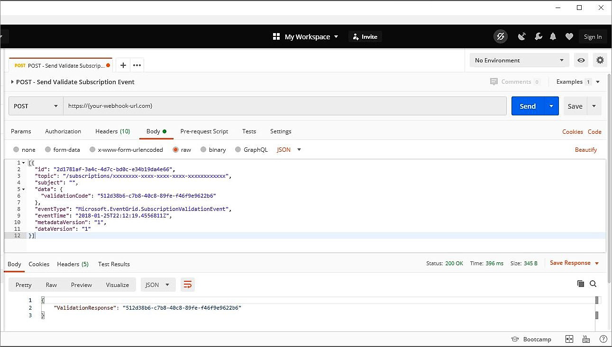
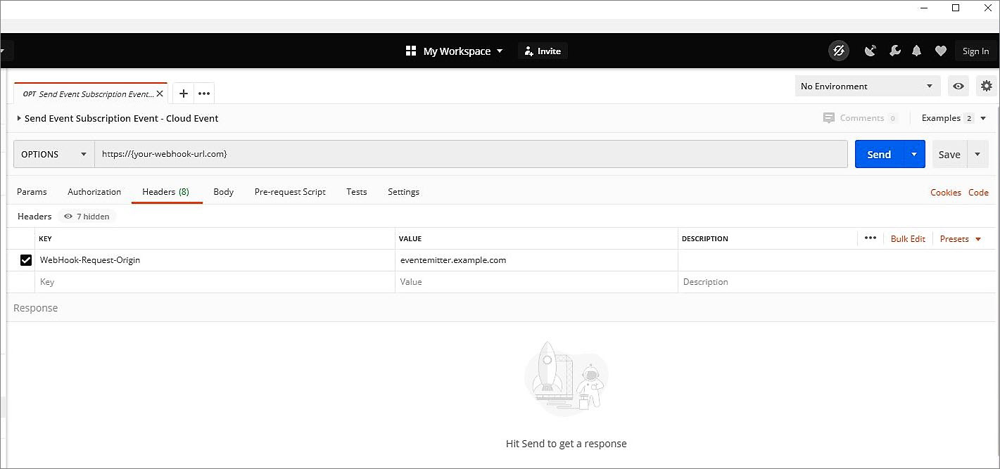

# Troubleshoot Azure Event Grid subscription validations
During event subscription creation, if you're seeing an error message such as `The attempt to validate the provided endpoint https://your-endpoint-here failed. For more details, visit https://aka.ms/esvalidation`, it indicates that there's a failure in the validation handshake. To resolve this error, verify the following aspects:

- Do an HTTP POST to your webhook url with a [sample SubscriptionValidationEvent](webhook-event-delivery.md#validation-details) request body using Postman or curl or similar tool.
- If your webhook is implementing synchronous validation handshake mechanism, verify that the ValidationCode is returned as part of the response.
- If your webhook is implementing asynchronous validation handshake mechanism, verify that you're the HTTP POST is returning 200 OK.
- If your webhook is returning `403 (Forbidden)` in the response, check if your webhook is behind an Azure Application Gateway or Web Application Firewall. If it is, then your need to disable these firewall rules and do an HTTP POST again:
    - 920300 (Request missing an accept header)
    - 942430 (Restricted SQL character anomaly detection (args): # of special characters exceeded (12))
    - 920230 (Multiple URL encoding detected)
    - 942130 (SQL injection attack: SQL tautology detected.)
    - 931130 (Possible remote file inclusion (RFI) attack = Off-domain reference/link)

> [!IMPORTANT]
> For detailed information on endpoint validation for webhooks, see [Webhook event delivery](webhook-event-delivery.md).

The following sections show you how to validate an event subscriptions using Postman and Curl.  

## Validate Event Grid event subscription using Postman
Here's an example of using Postman for validating a webhook subscription of an Event Grid event: 



Here is a sample **SubscriptionValidationEvent** JSON:

```json
[
  {
    "id": "2d1781af-3a4c-4d7c-bd0c-e34b19da4e66",
    "topic": "/subscriptions/xxxxxxxx-xxxx-xxxx-xxxx-xxxxxxxxxxxx",
    "subject": "",
    "data": {
      "validationCode": "512d38b6-c7b8-40c8-89fe-f46f9e9622b6",
    },
    "eventType": "Microsoft.EventGrid.SubscriptionValidationEvent",
    "eventTime": "2018-01-25T22:12:19.4556811Z",
    "metadataVersion": "1",
    "dataVersion": "1"
  }
]
```

Here is the sample successful response:

```json
{
  "validationResponse": "512d38b6-c7b8-40c8-89fe-f46f9e9622b6"
}
```

To learn more about Event Grid event validation for webhooks, see [Endpoint validation with event grid events](webhook-event-delivery.md#endpoint-validation-with-event-grid-events).


## Validate Event Grid event subscription using Curl 
Here's the sample Curl command for validating a webhook subscription of an Event Grid event: 

```bash
curl -X POST -d '[{"id": "2d1781af-3a4c-4d7c-bd0c-e34b19da4e66","topic": "/subscriptions/xxxxxxxx-xxxx-xxxx-xxxx-xxxxxxxxxxxx","subject": "","data": {"validationCode": "512d38b6-c7b8-40c8-89fe-f46f9e9622b6"},"eventType": "Microsoft.EventGrid.SubscriptionValidationEvent","eventTime": "2018-01-25T22:12:19.4556811Z", "metadataVersion": "1","dataVersion": "1"}]' -H 'Content-Type: application/json' https://{your-webhook-url.com}
```

## Validate cloud event subscription using Postman
Here's an example of using Postman for validating a webhook subscription of a cloud event: 



Use the **HTTP OPTIONS** method for validation with cloud events. To learn more about cloud event validation for webhooks, see [Endpoint validation with cloud events](webhook-event-delivery.md#endpoint-validation-with-event-grid-events).

## Troubleshoot event subscription validation

## Next steps
If you need more help, post your issue in the [Stack Overflow forum](https://stackoverflow.com/questions/tagged/azure-eventgrid) or open a [support ticket](https://azure.microsoft.com/support/options/). 
